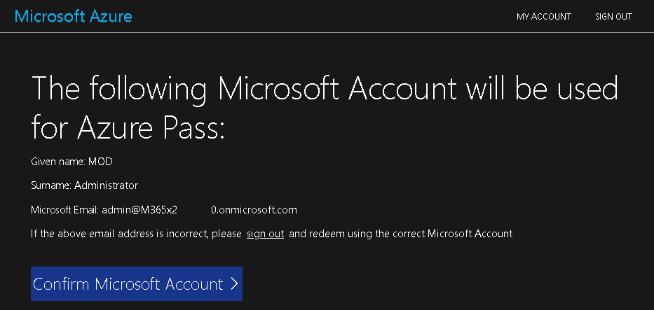
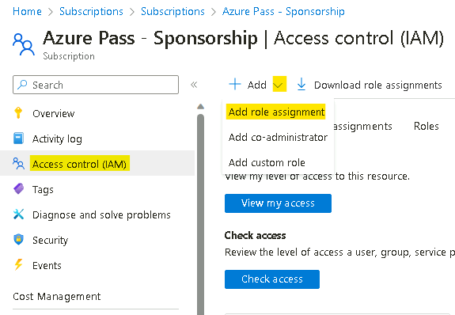
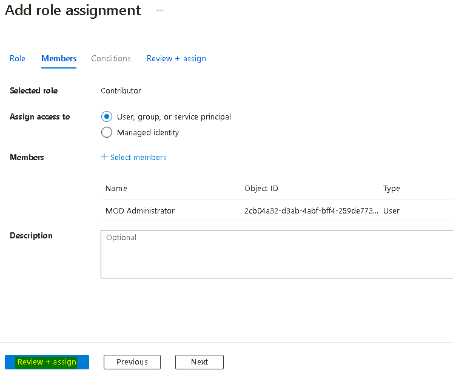
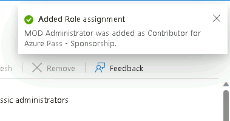
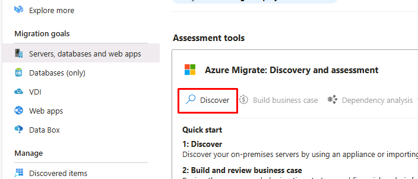
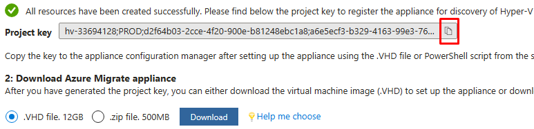

# Lab 1 - Vorbereiten Ihrer Lab umgebung

## Übung 1: Vorbereiten der Lab umgebung

### Aufgabe 0 - Einrichtung von Azure Subscription

1.  Melden Sie sich bei der bereitgestellten VM mit den Zugangsdaten an,
    die Sie auf der Registerkarte **Resources** der Lab oberfläche
    finden.

    

2.  Öffnen Sie den Edge-Browser und navigieren Sie zu
    `www.microsoftazurepass.com`

3.  Klicken Sie auf die Schaltfläche **Start**, um zu beginnen.

    

    >  **Hinweis**: Melden Sie sich nicht mit Ihrem **Company/Work Account**
    an, um den Azure-Pass einzulösen, ein weiterer Azure-Pass wird nicht
    ausgestellt.

4.  Geben Sie die **Office 365 Tenant credentials** ein, die auf der
    Registerkarte **Resources/Home** der Lab oberfläche angegeben sind,
    um den Anmeldevorgang abzuschließen.

5.  Sobald der Anmeldevorgang abgeschlossen ist, klicken Sie auf
    "**Confirm Microsoft Account**", wenn die richtige E-Mail-Adresse
    aufgeführt ist.

    

6.  Geben Sie im Abschnitt **Azure Promo Code** auf der Registerkarte
    **Resources** der Lab oberfläche den **Promocode** in das Feld Promo
    Code ein und klicken Sie auf " **Claim Promo Code**".

    

7.  Es kann einige Sekunden dauern, bis die Einlösung bearbeitet ist.

    

8.  Geben Sie die obligatorischen Profildaten ein, aktivieren Sie die
    Kontrollkästchen und klicken Sie dann auf "**Sign up**".

    

9.  Möglicherweise werden Sie aufgefordert, die MFA-Authentifizierung zu
    registrieren und abzuschließen. Fahren Sie mit der MFA-Registrierung
    über die **Microsoft Authenticator App** oder die **Phone method**
    fort.

    

10. Sobald die Authentifizierung abgeschlossen ist, klicken Sie auf die
    Schaltfläche "**Done"**.

    

11. Geben Sie auf der Feedback-Seite Ihr Feedback ein und klicken Sie
    auf **Submit**. 
    

12. Sie werden automatisch zum Azure Portal weitergeleitet und können
    Sie nun die Azure-Dienste nutzen.     

13. Geben Sie im **Azure Portal**  `https://portal.azure.com` in das
    Suchfeld subscription ein und klicken Sie dann auf
    **Subscriptions**      

14. Wählen Sie aus der Liste der Subscriptions die **Azure** **Pass
    –Sponsorship**.     

15. Klicken Sie auf der Seite Azure Pass – Sponsorship auf **Access
    control (IAM)**, dann auf das Dropdown-Menü **+Add** und wählen Sie
    **Add role assignment**. 

    

16. Wählen Sie auf der Seite Add role assignment unter der Registerkarte
    **Privileged administrator roles** die Option **Contributor** und
    klicken Sie auf **Next**. 

    

17. Klicken Sie auf der Registerkarte **Members** auf **+ Select
    members**, wählen Sie dann **MOD-Administrator** und klicken Sie
    anschließend auf die Schaltfläche **Select**. 
    
    

18. Klicken Sie auf die Schaltfläche **Review + assign**.
    

19. Klicken Sie erneut auf die Schaltfläche **Review + assign**

    

20. Sie sollten eine Benachrichtigung wie in der folgenden Abbildung
    erhalten

    

21. Klicken Sie auf die Registerkarte **Role assignments**, um die im
    vorherigen Schritt zugewiesene Rolle anzuzeigen. Wir können die
    aufgelisteten Benutzer sehen, denen die Rolle Mitwirkender
    zugewiesen wurde.

    

### Aufgabe 1: Sicherstellen, dass die VMs bereit sind

Die Hyper-V-Integrationsdienste müssen auf den Gast-VMs installiert sein
und laufen, damit die Erkennung die darauf installierten Anwendungen
identifizieren kann.

1.  Öffnen Sie **Microsoft Edge** auf dem Desktop und gehen Sie dann zur
    IP-Adresse von **RHEL-WEB-01**: `192.168.1.24`

    

2.  **RHEL-WEB-01** bedient eine Drupal-Website, die so konfiguriert
    ist, dass sie auf eine Datenbank zugreift, die auf **RHEL-DB-01**
    gehostet wird. Das erfolgreiche Laden der Website bestätigt, dass
    beide VMs korrekt funktionieren.

### Aufgabe 2: Erstellen eines Azure Migrate-Projekts

1.  Navigieren Sie in einer neuen Edge-Registerkarte zum Azure Portal
    `https://portal.azure.com` , und melden Sie sich mit den in den
    Lab ressourcen angegebenen Anmeldeinformationen an.

2.  Geben Sie im Azure Portal in das **Search** Feld `Azure Migrate`
    ein und wählen Sie dann **Azure Migrate**, um die Seite Azure
    Migrate aufzurufen.

3.  Wählen Sie in der linken Navigation unter **Migration goals** die
    Option **Servers, databases and web apps**.

    

4.  Wählen Sie auf der Blade **Servers, databases and web apps** in der
    Mitte der Seite die Option **Create project**.

5.  Verwenden Sie auf der Blade **Create project** die folgenden
    Einstellungen, um ein neues Projekt zu erstellen.

    - Verwenden Sie die Standardwerte für alle Einstellungen, die nicht in
    der Tabelle aufgeführt sind.

    - Resource group- klicken Sie auf **Create new** ` AZMigrateRG `

    - Project - ` az-migrate-XXXXXX ` \[ersetzen Sie XXXXXX durch eine
    Zufallszahl\]

    - Geography - **United States**

6.  Wählen Sie **Create**.

7.  Warten Sie den Abschluss des Bereitstellung ab, bevor Sie mit der
    nächsten Aufgabe fortfahren.

### Aufgabe 3: Bereitstellung und Konfiguration der Azure Migrate-Appliance

1.  Wählen Sie auf der Blade **Servers, databases and web apps** im
    Abschnitt **Assessment Tools** unter **Azure Migrate: Discovery and
    assessment**, wählen Sie **Discover** und wählen Sie **Using
    appliance**

    

2.  Wählen Sie auf dem **Discover**-Blade im Menü **Are your Machines
    virtualized?** die Option **Yes, with Hyper-V**.

3.  Unter **1. General product key** geben Sie in das Feld **Name your
    appliance**, HV-XXXXXX ein, wobei Sie **XXXXX** durch die zuvor
    verwendete Nummer ersetzen, und wählen Sie dann **Generate Key**.

    > **Hinweis**: Die Schlüsselgenerierung prozess kann bis zu 2 Minuten
    dauern.

4.  Sobald der Schlüssel generiert ist, klicken Sie auf das **copy
    icon** im Feld **Project key**.

     

5.  Unter **2. Download Azure Migrate Appliance**, wählen Sie eine
    **.zip-Datei. 500MB**, und *beachten Sie* die Schaltfläche
    Download\*.

 **Dadurch wird das PowerShell-Script heruntergeladen, das die
 Appliance auf einem Windows Server-Computer installiert.**

 Für dieses Lab wurde das Script **bereits** auf das Laufwerk E:
 **heruntergeladen** und **ausgeführt**. Sie werden **nach diesem
 Schritt fortfahren**.

6.  Unter **3. Set up the appliance**

7.  Minimieren Sie das Edge-Fenster und wählen Sie dann die Verknüpfung
    **Azure Migrate Appliance Configuration Manager** auf dem Desktop.

8.  Sobald die Seite **Azure Migrate Appliance Configuration
    Manager** geladen ist, müssen Sie möglicherweise die EULA
    akzeptieren. Wählen Sie **Accept**, wenn Sie dazu aufgefordert
    werden.

9.  Fügen Sie auf der Seite **Azure Migrate Appliance Configuration
    Manager** im Feld **Register Hyper-V appliance by pasting the key
    here** den Schlüssel ein, den Sie zuvor kopiert haben.

10. Wählen Sie **Verify**.

11. Wählen Sie **Login**. Es wird ein Modal angezeigt, in dem Sie
    aufgefordert werden, **Continue with Azure Login**

12. Wählen Sie **Copy code & Login** und melden Sie sich bei Ihrem
    subscription an, indem Sie den Gerätecode einfügen und dann Ihren
    Benutzernamen auswählen.

13. Wählen Sie bei der Aufforderung **Are you trying to sign in to
    Microsoft Azure PowerShell?** die Option **Continue** und schließen
    Sie die neu geöffnete Browser-Registerkarte.

14. Warten Sie auf der Seite **Azure Migrate Appliance Configuration
    Manager**, bis die Registrierung abgeschlossen ist.

     

    > **Es kann bis zu 10 Minuten dauern, bis die Registrierung
    abgeschlossen ist.**

15. Wählen Sie im Abschnitt **Provide Hyper-V host credentials** die
    Option **Add credentials** und fügen Sie Anmeldeinformationen mit
    den folgenden Einstellungen hinzu:

    - Friendly Name - `Hypervisor`

    - User Name - `Administrator`

    - Password -`Passw0rd!`

16. Wählen Sie im Abschnitt **Provide Hyper-V host/cluster details** die
    Option **add a discovery source**, wählen Sie dann **Add single
    item** und verwenden Sie die folgenden Einstellungen:

    - Discovery source - **Hyper-V Host/Cluster**

    - IP-Address FQDN - `win-msite54sfl9`

    - Map credentials – **Hypervisor**

17. Vergewissern Sie sich, dass der Schieberegler im Abschnitt **Provide
    server credentials to perform software inventory** **aktiviert**
    ist, und fügen Sie dann Anmeldeinformationen mit den folgenden
    Einstellungen hinzu:

    - Credentials type - **Linux (Non-domain)**

    - Friendly Name - `RHELUser`

    - User Name - `fetch6474`

    - Password - `RHELWorkshop `

18. Wählen Sie **Start discovery**.

19. Lassen Sie Edge für die nächste Übung offen. Discovery setzt die
    Verarbeitung fort.

## Übung 2: Aktivieren von Microsoft Defender for Cloud

### Aufgabe 1: Aktivieren von Microsoft Defender for Cloud**

1.  Klicken Sie im Azure Portal auf das Menü Portal oder wählen Sie auf
    der Startseite Microsoft Defender for Cloud

    

2.  Über die Benachrichtigung - **You may be viewing limited
    information. To get tenant-wide visibility, click here** klicken Sie darauf.

    

3.  Wählen Sie auf der Seite **Get permissions** den **Security Admin**
    und klicken Sie dann auf die Schaltfläche **Get access**.

    

4.  Sie sollten eine Benachrichtigung erhalten, wie in den folgenden
    Bildern gezeigt

    

    

5.  Aktualisieren Sie den Browser und klicken Sie dann auf der Seite
    **Microsoft Defender for Cloud** unter dem Abschnitt **General** auf
    **Getting started**. Navigieren Sie auf der Registerkarte
    **Upgrade** und klicken Sie auf die Schaltfläche **Upgrade**.

    > **Hinweis**: Möglicherweise müssen Sie einige Minuten warten, bis die
    Aktualisierung abgeschlossen ist.

    

### Aufgabe 2: Aktivieren Sie zusätzliche Datenerfassung einstellungen für Defender for Cloud

1.  Navigieren Sie auf der Seite **Microsoft Defender for Cloud** zum
    Abschnitt **Management** und klicken Sie auf **Environment
    settings.**

    

2.  Scrollen Sie nach unten, erweitern Sie die **Tenant Root Group** und
    klicken Sie dann auf das **Azure Pass - Sponsorship** Subscription.

    

3.  Beachten Sie, dass die Defender-Abdeckung **11/12 plans** für das
    Subscription umfasst.

4.  Klicken Sie auf der Seite **Settings | Defender plans,** auf
    **Enable all plans.**

    

5.  Wählen Sie **Microsoft Defender for APIs Plan 1** und klicken Sie
    dann auf die Schaltfläche **Save**.

    

6.  Klicken Sie auf die Schaltfläche **Save**.

    

7.  Sie sollten die in der folgenden Abbildung gezeigten
    Benachrichtigungen erhalten.

    

## Übung 3: Erstellen Sie einen Business Case und führen Sie eine Bewertung durch**

### Aufgabe 1: Erstellen und Überprüfen eines Business Case**

1.  Gehen Sie im Azure Portal zurück zur Seite **Azure Migrate Servers,
    databases and web apps**. Wählen Sie **Refresh**, um zu überprüfen,
    ob Ihre Server erkannt wurden.

    

2.  Wählen Sie im Abschnitt **Azure Migrate: Discovery and
    assessment** wählen Sie **Build business case**.

    

3.  Verwenden Sie in der Schaufel **Build business case** die folgenden
    Werte, um den business case zu erstellen.

    - Business case name - `bc-43240741`

    - Target location - **eastus**

    - Migration strategy - **Azure recommended approach to minimize
      cost**

    - Savings options - **Reserved Instance + Azure Savings Plan**

    - Discount (%) on Pay as you go - **0**

    - Wählen Sie **Build business case**.

     

    > Die Erstellung des business case kann bis zu 5 Minuten dauern. Wenn es
    mehr als 5 Minuten gedauert hat, wählen Sie **Refresh**.

4.  Überprüfen Sie auf der Seite **bc-43240741** die Informationen über
    die Azure readiness und die monatlichen Kostenschätzungen für
    Compute und Storage.

### Aufgabe 2: Konfigurieren, Ausführen und Anzeigen einer Bewertung**

1.  Navigieren Sie in einer neuen Registerkarte zur Seite **Resource
    groups**  `
    https://portal.azure.com/#view/HubsExtension/BrowseResourceGroups.ReactView
    `, wählen Sie die resource group **AZMigrateRG** aus und notieren
    Sie den Speicherort des **Key Vault**, wie unten gezeigt ist es
    **West US 2**.     

    >  **Hinweis** - Dieser Standort muss für andere Ressourcen angegeben
 werden, die später im Lab erstellt werden, auch um sicherzustellen,
 dass die **Azure resources are created in the same region**, damit die
 Migration reibungslos verläuft.

1.  Wechseln Sie zurück zur **Azure Migrate**-Seite und wählen Sie unter
    **Azure Migrate: Discovery and assessment** die Option **Assess**
    und dann im Dropdown-Menü die Option **Azure VM**.

     

2.  Lassen Sie auf der Seite **Create assessment** die Dropdown-Menüs
    auf den Standardwerten.

3.  Wählen Sie den Link **Edit** neben den **Assessment settings**,

     

4.  Verwenden Sie auf der Seite Assessment Settings die folgenden
    Einstellungen, um die Bewertung zu erstellen.

    >  **Übernehmen Sie die Standardeinstellungen für alles, was nicht in der
    Tabelle angegeben ist.**

    - Target location - **West US 2**

    - Storage type - **Premium managed disks**

    - Savings options - **None**

    - Sizing criteria - **As on premises**

    - VM-series - **Dsv3_series**

    - Comfort factor - **1**

    - Offer - **Pay-As-You-Go**

    - Currency - **US Dollar ($)**

    - Discount - **0**

    - VM uptime - **31 Day(s) per month and 24 Hour(s) per day**

    - Already have a Windows Server license? - **No**

    - Security - **No**

5.  Wählen Sie **Save** , um zu Create Assessment zurückzukehren, und
    wählen Sie dann **Next: Select servers to assess \\**

6.  Verwenden Sie die folgenden Einstellungen, um die Servergruppe zu
    erstellen und die zu bewertenden Server auszuwählen.

    - Übernehmen Sie die Standardeinstellungen für alles, was nicht in der
    Tabelle angegeben ist.

    - Assessment name - `as-43240741`

    - Select or create a group - **Create new**

    - Group name - `RHEL-Servers`

    - List of machines to be added to the group - **RHEL-DB-01** und
    **RHEL-WEB-01**

7.  Wählen Sie **Create assessment**. Sie werden auf die Seite **Azure
    Migrate | Servers, databases and web apps**  weitergeleitet.

8.  **Refresh** Sie die Seite.

9.  Im Abschnitt **Azure Migrate: Discovery and Assessment** überprüfen
    Sie, ob die **Assessments Total** gleich **1** ist, und wählen Sie
    dann **1**.

     

10. Wählen Sie auf der Seite **Azure Migrate: Discovery and Assessment |
    Assessments**  wählen Sie die neu erstellte Bewertung
    **as-43240741.**

    

11. Überprüfen Sie auf der Seite **as-43240741** die Informationen über
    die Azure readiness und die monatlichen Kostenschätzungen für
    Compute und Storage.

**In realen Szenarien sollten Sie die Installation des Dependency Agent
in Betracht ziehen, um in der Bewertungsphase mehr Einblicke in die
Serverabhängigkeiten zu erhalten.**
