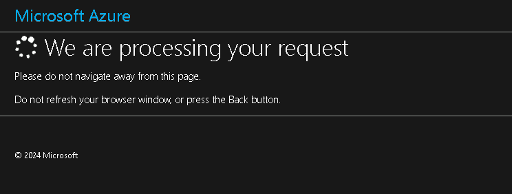
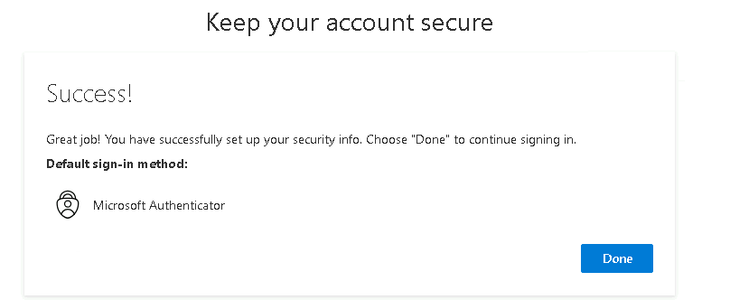
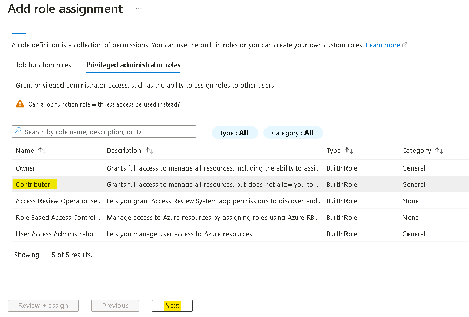
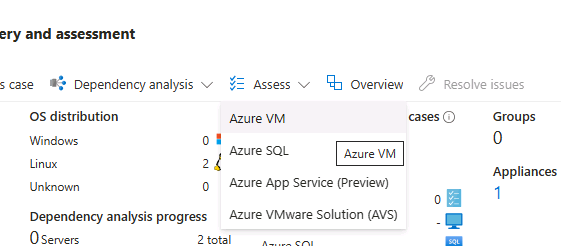
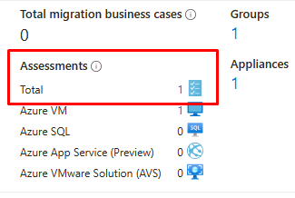

# 실습 1 - 실습 환경 준비

**연습 1: 실습 환경 준비**

**작업 0 - Azure 구독 설정**

1.  Lab 인터페이스의 **Resources** 탭에 있는 자격 증명을 사용하여 제공된
    VM에 로그인하세요.

    

2.  Edge 브라우저를 열고 ```www.microsoftazurepass.com```로 이동하세요.

3.  **Start** 버튼을 클릭하여 시작하세요.

    

    > **참고**: Azure Pass를 사용하려면 **Company/Work Account**으로
    로그인하지 마세요. 추가Azure Pass가 발급되지 않습니다.

4.  Lab 인터페이스의 **Resources/Home** 탭에 제공된 **Office 365 Tenant
    Credentials**을 입력하여 로그인 절차를 완료하세요.

5.  로그인 절차가 완료되면, 올바른 이메일 주소가 나열되었는지 확인 후 '
    **Confirm Microsoft Account** '을 클릭하세요.

    

6.  Lab 인터페이스의 **Resources** 탭에 있는 **Azure Promo
    Code**섹션에서 프로모션 코드 상자에 **Promocode**를 입력하고 "
    **Claim Promo Code** "를 클릭하세요.

    

7.  환급이 처리되는 데 몇 초 정도 소요될 수 있습니다.

    

8.  필수 프로필 정보를 입력하고 체크박스를 선택한 후, '**Sign up**'을
    클릭하세요.

    

9.  MFA 인증을 등록하고 완료하라는 메시지가 표시될 수 있습니다.
    **Microsoft Authenticator App** 또는 **Phone method**을 사용하여 MFA
    등록을 계속 진행하세요.

    

10. 인증이 완료되면 **Done** 버튼을 클릭하세요.

    

11. 피드백 페이지에서 피드백을 입력하고 **Submit**을 클릭하세요.
        

12. 자동으로 Azure Portal로 이동하며, 이제 Azure 서비스를 사용할 준비가
    되었습니다.     

13. **Azure Portal** ```https://portal.azure.com``` 검색창에 subscriptions을
    입력한 다음, **Subscriptions** 을 클릭하세요.
    

14. 구독 목록에서**Azure Pass –Sponsorship**을 선택하세요.     

15. Azure Pass - Sponsorship페이지에서 **Access Control(IAM)** 를 클릭한
    다음, **+Add** 드롭다운을 클릭하고 **Add role assignment**를
    선택하세요.     

16. Add role assignment 페이지의**Privileged administrator roles**
    탭에서 **Contributor**를 선택한 후**Next**를 클릭하세요.
        

17. **Members** 탭에서 **+ Select members**를 클릭한 다음, **MOD
    Administrator**를 선택하고 **Select**버튼을 클릭하세요.     

18. **Review + assign** 버튼을 클릭하세요.     

19. **Review + assign** 버튼을 다시 클릭하세요.

    

20. 아래 이미지와 같은 알림이 표시됩니다.

    

21. **Role assignments** 탭을 클릭하여 이전 단계에서 지정된 역할을
    확인하세요. Contributor 역할이 지정된 사용자 목록이 표시됩니다.

    

**작업 1: VM이 준비되었는지 확인**

Discovery가 guest VM에 설치된 앱을 식별하려면, guest VM에 Hyper-V 통합
서비스가 설치되어 실행 중이어야 합니다.

1.  바탕 화면에서 **Microsoft Edge**를 열고, **RHEL-WEB-01**의 IP 주소로
    이동하세요: ```192.168.1.24```

    

2.  **RHEL-WEB-01**은 **RHEL-DB-01**에서 호스팅된 database를 호출하도록
    구성된 Drupal 웹 사이트를 제공합니다. 웹사이트가 성공적으로 로드되면
    두 VM이 모두 정상적으로 작동하고 있음을 확인할 수 있습니다.

**작업 2: Azure Migrate 프로젝트를 생성**

1.  새 Edge 탭에서 Azure Portal ```https://portal.azure.com``` 로
    이동하고, Lab 리소스에 제공된 자격 증명을 사용하여 로그인하세요.

2.  Azure portal의 **Search**상자에 ```Azure Migrate```를 입력한 후,
    **Azure Migrate**를 선택하여 Azure Migrate 페이지로 이동하세요.

3.  왼쪽 탐색창의 **Migration goals**에서 **Servers, databases and web
    apps**을 선택하세요.

    

4.  **Servers, databases and web apps** 블레이드에서 페이지 중앙에 있는
    **Create project**를 선택하세요.

5.  **Create project**블레이드에서 다음 설정을 사용하여 새 프로젝트를
    생성하세요.

- 표에 지정되지 않은 설정은 기본값을 사용하세요.

    - Resource group – **Create new** ```AZMigrateRG```를 클릭하세요.

    - Project - ```az-migrate-XXXXXX``` \[XXXXXX를 임의의 숫자로 대체\]

    - Geography – **United States**

6.  **Create**를 선택하세요.

7.  배포가 완료될 때까지 기다린 후, 다음 작업을 진행하세요.

**작업 3: Azure Migrate appliance배포 및 구성**

1.  **Servers, databases and web apps** 에서 **Assessment Tools** 섹션의
    under **Azure Migrate: Discovery and assessment** 에서
    **Discover**를 선택하고 **Using appliance**를 선택하세요.

     

2.  **Discover** 블레이드의 **Are your Machines virtualized?**  메뉴에서
    **Yes, with Hyper-V**를 선택하세요.

3.  **1. General Product key** 의 **Name your appliance**
    상자에HV-XXXXXX를 입력하세요. **XXXXX**는 이전에 사용한
    숫자로 대체합니다. 그런 다음, **Generate key**를 선택하세요.

    > **참고** - 키 생성 과정은 최대 2분까지 소요될 수 있습니다.

4.  키가 생성되면 **Project key** 필드에서 **copy icon**을 선택하세요.

     

5.  **2. Download Azure Migrate appliance**에서 **.zip file. 500MB**를
    선택하고 다운로드 버튼\*을 *확인*하세요.

    > 이 작업을 통해Windows Server machine에 appliance를 설치하는
    PowerShell 스크립트가 다운로드됩니다.

    > 이 실습에서는 스크립트가E: 드라이브에 **already been downloaded**
    되어**run**이 실행되었습니다. **Continue past this step**.

6.  **3. Set up the appliance**에서

7.  Edge 창을 최소화한 후, 바탕 화면의 **Azure Migrate Appliance
    Configuration Manager** 바로 가기를 선택하세요.

8.  **Azure Migrate Appliance Configuration Manager** 페이지가 로드되면
    EULA를 수락해야 할 수 있습니다. 해당 메시지가 표시되면 **Accept**을
    선택하세요.

9.  **Azure Migrate Appliance Configuration Manager** 페이지의**Register
    Hyper-V appliance by pasting the key here** 상자에 앞서 복사한 키를
    붙여넣으세요.

10. **Verify**를 선택하세요.

11. **Login**을 선택하세요. **Continue with Azure Login**을 확인하는
    모달이 표시됩니다.

12. **Copy code & Login**을 선택하고 장치 코드를 붙여넣은 후, 사용자
    아이디를 선택하여 구독에 접속하세요.

13. **Are you trying to sign in to Microsoft Azure PowerShell?** 라는
    메시지가 표시되면 **Continue**를 선택하고 새로 열린 브라우저 탭을
    닫으세요.

14. **Azure Migrate Appliance Configuration Manager** 페이지에서 등록이
    완료될 때까지 대기해 주세요.

    

    > **등록 완료까지 최대 10분이 소요될 수 있습니다.**

15. **Provide Hyper-V host credentials** 섹션에서 **Add credentials**를
    선택하고 다음과 같은 설정으로 자격 증명을 추가하세요:

    - Friendly Name - ```Hypervisor```

    - User Name - ```Administrator```

    - Password - ```Passw0rd! ```

16. **Provide Hyper-V host/cluster details** 섹션에서 **add a discovery
    source**를 선택한 후, **Add single item**를 선택하고 다음과 같은
    설정을 입력하세요:

    - Discovery source - **Hyper-V Host/Cluster**

    - IP address FQDN - ```win-msite54sfl9```

    - Map credentials - **Hypervisor**

17. **Provide server credentials to perform software
    inventory** 섹션에서 슬라이더가 **enabled**로 되어있는지 확인한 후,
    다음과 같은 설정으로 자격 증명을 추가하세요:

    - Credentials type - **Linux (Non-domain)**

    - Friendly Name - ```RHELUser```

    - User Name - ```fetch6474```

    - Password - ```RHELWorkshop```

18. **Start discovery**를 선택하세요.

19. 다음 연습을 위해 Edge를 열어 두세요. Discovery가 계속 진행됩니다.

**연습 2: Microsoft Defender for Cloud 활성화하기**

**작업 1: Microsoft Defender for Cloud 활성화**

1.  Azure Portal에서 Portal 메뉴를 클릭하거나 홈 페이지에서 Microsoft
    Defender for Cloud를 선택하세요.

    

2.  알림에서 - **You may be viewing limited information. To
    gettenant-wide visibility, click here --\>** 클릭하세요.

    

3.  **Get permissions** 페이지에서 **Security admin**을 선택한 다음,
    **Get access** 버튼을 클릭하세요.

    

4.  아래 이미지와 같은 알림이 표시됩니다.

    

    

5.  브라우저를 새로 고친 후, **General** 섹션의 **Microsoft Defender for
    Cloud** 페이지에서 **Getting started**를 클릭하세요. **Upgrade**
    탭으로 이동하여 **Upgrade** 버튼을 클릭하세요.

    > **참고**: 업그레이드 완료까지 몇 분 정도 소요됩니다.

    

**작업 2: Defender for Cloud에 대한 추가 데이터 수집 설정 사용**

1.  **Microsoft Defender for Cloud** 페이지에서 **Management** 섹션으로
    이동하여 **Environment settings**을 클릭하세요.

    

2.  아래로 스크롤하여 **Tenant Root Group**을 확장한 후, 표시된 **Azure
    Pass - Sponsorship**구독을 클릭하세요.

    

3.  Defender 서비스가**11/12 plans**에 적용된다는 점을 확인하세요.

4.  **Settings | Defender plans** 페이지에서 **Enable all plans** 을
    클릭하세요.

    

5.  **Microsoft Defender for APIs Plan 1**을 선택한 후, **Save** 버튼을
    클릭하세요.

    

6.  **Save** 버튼을 클릭하세요.

    

7.  아래 이미지와 같은 알림이 표시됩니다.

    

**연습 3: 비즈니스 사례 작성 및 평가 실행**

**작업 1: 비즈니스 사례 작성 및 검토**

1.  Azure Portal에서 **Azure Migrate Servers, databases and web apps**
    페이지로 다시 이동하세요. **Refresh**을 선택하여 서버가 검색되었는지
    확인하세요.

    

2.  **Azure Migrate: Discovery and assessment** 섹션에서 **Build
    business case**를 선택하세요.

    

3.  **Build business case** 블레이드에서 다음 값을 사용하여 비즈니스
    사례를 작성하세요.

    - 비즈니스 사례 이름 - ```bc-43240741```

    - 타켓 위치 - **eastus**

    - Migration strategy - **Azure recommended approach to minimize
      cost**

    - 저축 옵션 - **Reserved Instance + Azure Savings Plan**

    - Pay as you go 할인(%) - **0**

    - **Build business case**선택하세요.

    

    > 비즈니스 사례를 생성에는 최대 5분이 걸릴 수 있습니다. 5분이 지났다면 **Refresh**를 선택하세요.

4.  **bc-43240741** 페이지에서 Azure 준비 상태와 컴퓨팅 및 스토리지에
    대한 월별 비용 견적 정보를 검토하세요.

**작업 2: 평가 구성, 실행 및 결과 확인**

1.  새 탭에서 **Resource groups** 페이지
    ```https://portal.azure.com/#view/HubsExtension/BrowseResourceGroups.ReactView```로
    이동하여 **AZMigrateRG** 리소스 그룹을 선택한 다음, 아래에 표시된
    대로 **Key Vault**의 위치를 확인하여 기록하세요. 위치는 **West US
    2**입니다.     

    > **참고** - 이 위치는 이후Lab에서 다른 리소스를 생성할 때 지정해야
    하며, **Azure resource가 동일한 region에 생성되어** 원활한 Migration이이루어지도록 해야 합니다.

2.  **Azure Migrate** 페이지로 돌아와서 **Azure Migrate: Discovery and
    assessment**섹션에서 **Assess**를 선택한 다음, 드롭다운 메뉴에서
    **Azure VM**을 선택하세요.

    

3.  **Create assessment**페이지에서 드롭다운 메뉴를 기본 설정으로
    유지하세요.

4.  **Assessment settings**옆의 **Edit** 링크를 선택하세요,

    

5.  Assessment Settings에서 다음 설정을 사용하여 Assessment를
    생성하세요.

    > **표에 지정되지 않은 항목은 기본 설정으로 두세요.**

    - Target location - **West US 2**

    - Storage type - **Premium managed disks**

    - Savings options - **None**

    - Sizing criteria - **As on premises**

    - VM series - **Dsv3_series**

    - Comfort factor - **1**

    - Offer - **Pay-As-You-Go**

    - Currency - **US Dollar ($)**

    - Discount - **0**

    - VM uptime - **31 Day(s) per month and 24 Hour(s) per day**

    - Already have a Windows Server license? - **No**

    - Security - **No**

6.  **Save** 을 선택하여 Assessment생성으로 돌아가서 **Next: Select
    servers to assess \>** 선택하세요.

7.  다음 설정을 사용하여 서버 그룹을 만들고 평가할 서버를 선택하세요.

    - 표에 지정되지 않은 항목은 기본 설정으로 두세요.

    - Assessment name - ```as-43240741```

    - Select or create a group - **Create new**

    - Group name - ```RHEL-Servers```

    - List of machines to be added to the group
    - **RHEL-DB-01** and **RHEL-WEB-01**

8.  **Create assessement**를 선택하세요. **Azure Migrate | Servers,
    databases and web apps**  페이지로 이동합니다.

9.  페이지를 **Refresh** 하세요.

10. **Azure Migrate: Discovery and Assessment**섹션에서 **Assessments
    Total**이 **1**인지 확인한 다음, **1**을 선택하세요.

    

11. **Azure Migrate: Discovery and Assessment | Assessments** 페이지에서
    새로 만든 평가(**43240741)** 를 선택하세요.

    

12. **as-43240741**페이지에서 Azure 준비 상태와 컴퓨팅 및 스토리지에
    대한 월별 비용 견적 정보를 검토하세요.

**실제 시나리오에서는 평가 단계에서 서버 종속성에 대한 더 많은
인사이트를 제공하기 위해 Dependency agent를 설치하는 것을 고려해야
합니다.**
