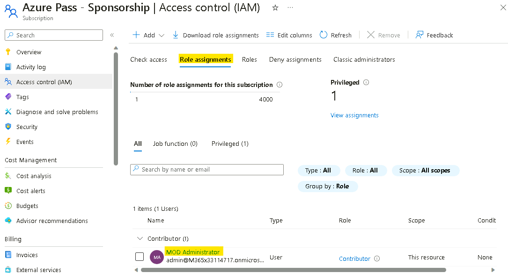
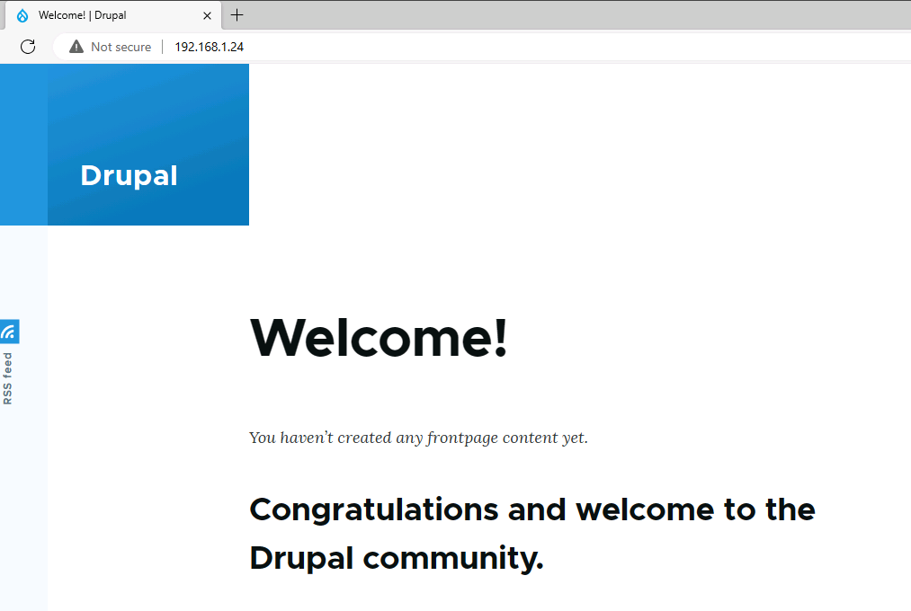
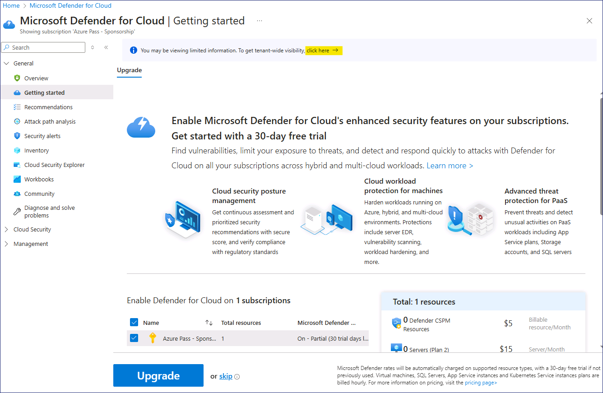
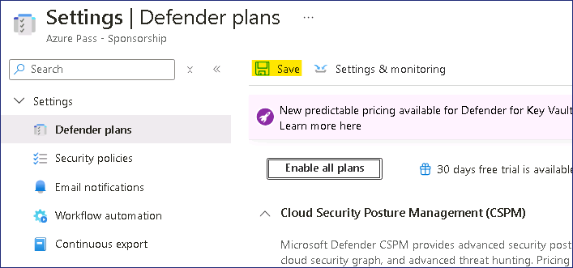
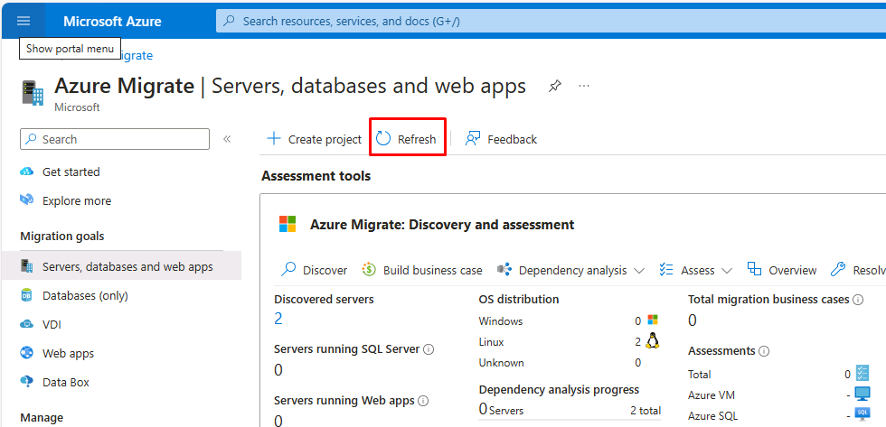
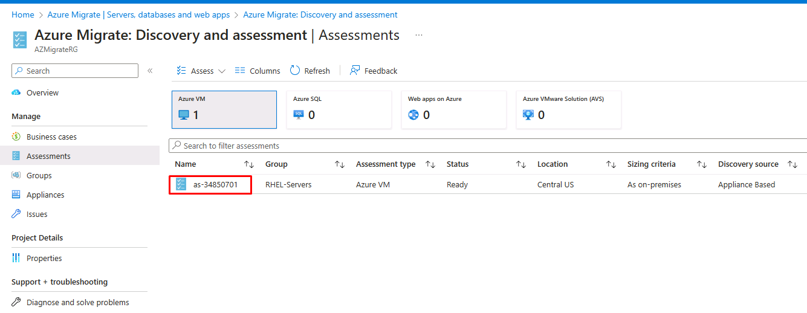

# 實驗室 1 - 準備實驗室環境

**練習 1： Preparing the lab environment**

**任務 0 - 設置 Azure 訂閱**

1.  使用實驗室介面 "**資源** "選項卡上提供的 **Resources** 登錄所提供的
    VM。

    

2.  打開邊緣流覽器，導航至 `www.microsoftazurepass.com`

3.  按一下 **Start**  按鈕開始操作。

    

    > **注意**：請勿使用 **Company/Work Account** 登錄以兌換 Azure
通行證，否則不會再發放一張 Azure 通行證。

4.  輸入實驗室介面 **Resources/Home** 選項卡上提供的 **Office 365 Tenant
    credentials** 以完成登錄過程

5.  登錄過程完成後，如果列出的電子郵寄位址正確，請按一下 " **Confirm
    Microsoft Account** "。

    

6.  在實驗室介面 "**資源** "選項卡上的 "**Azure Promo Code** "部分，在 "
    **Promocode**  "框中輸入**促銷代碼**，然後按一下 " **Claim Promo
    Code** "。

    

7.  處理兌換可能需要幾秒鐘。

    

8.  輸入必填的個人資料資訊，選擇核取方塊，然後點擊 " **Sign up** "。

    

9.  系統可能會提示您註冊並完成 MFA 身份驗證，請使用 **Microsoft
    Authenticator App 或者 Phone method** 進行 MFA 註冊。

    

10. 驗證完成後，按一下 " **Done** "按鈕。

    

11. 在回饋頁面，輸入您的回饋並點擊 **Submit**。
    

12. 它會自動將你重定向到 Azure Portal，現在你就可以使用 Azure 服務了。
    

13. 在 **Azure Portal** https://portal.azure.com
    搜索框中鍵入訂閱，然後按一下 **Subscriptions**  

14. 從 "訂閱 "列表中選擇 " **Azure Pass –Sponsorship** "。 

15. 在 Azure 通行證-贊助頁面點擊 **Access control （IAM）**，然後點擊**+
    Add** 下拉式功能表並選擇 **Add role assignment 分配**。
    

16. 在 "添加角色分配 "頁面，在 **Privileged administrator roles**
    選項卡下選擇 **Contributor** ，然後按一下 **Next** 。
    

17. 在 **Members** 選項卡上，按一下 **+ + Select members** ，然後選擇
    **MOD Administrator** ，再按一下 **Select** 按鈕。 

18. 點擊 **Review + assign** 按鈕。
    

19. 再次點擊 **Review + assign** 按鈕

    

20. 您應該會收到下圖所示的通知

    

21. 按一下 **Role assignments**
    選項卡，查看上一步中分配的角色。我們可以看到 "貢獻者
    "角色已分配給哪些用戶。

    

**任務 1：確保虛擬機器準備就緒**

必須在客戶虛擬機器上安裝並運行 Hyper-V
集成服務，發現功能才能識別虛擬機器上安裝的 App。

1.  從桌面打開 **Microsoft Edge**，然後轉到 **RHEL-WEB-01** 的 IP
    位址：`192.168.1.24`

    

2.  **RHEL-WEB-01** 服務於一個 Drupal 網站，該網站被配置為調用託管在
    **RHEL-DB-01** 上的資料庫。成功載入網站證明兩個虛擬機器都運行正常。

**任務 2：創建 Azure Migrate 項目**

1.  在新的 Edge 標籤頁中，導航到 Azure Portal
    `https://portal.azure.com` ，然後使用實驗室資源中提供的憑據登錄

2.  在 Azure 門戶中，在 **Search** 框中輸入 `Azure
    Migrate`，然後選擇 Azure **Migrate**，轉到 Azure Migrate 頁面。

3.  在左側巡覽列的 **Migration goals** 下，選擇 **Servers 、 databases
    and web apps 程式**。

    

4.  在 **Servers 、 databases and web apps**
    刀片上，選擇頁面中間的**創建專案**。

5.  在**創建項目**刀片上，使用以下設置創建新項目。

    - 表中未指定的任何設置均使用預設值。

    - 資源組 - 按一下**創建新** `AZMigrateRG`

    - 項目 - `az-migrate-XXXXXX` \[用亂數代替 XXXXXX］

    - 地理 - **美國**

    6.  選擇**創建**。

    7.  等待部署完成後再繼續下一項任務。

**任務 3：部署和配置 Azure Migrate 設備**

1.  在 "**伺服器、資料庫和網路應用程式** "刀片的 "**評估工具 "**部分，在
    "**Azure Migrate：發現和評估** "部分，選擇 **"發現 "**並選擇
    **"使用設備**

     

2.  在 **"發現 "**刀片上的 "**您的機器是否虛擬化？**
    功能表中選擇**是，使用 Hyper-V**。

3.  在 **1.一般產品金鑰**下，在 "**設備名稱 "**框中輸入 HV-XXXXXX
    用之前使用的數位代替 **XXXXX**，然後選擇 "**生成金鑰**"。

    > **注意** - 金鑰生成過程可能需要 2 分鐘才能完成。

4.  金鑰生成後，選擇**項目金鑰**欄位上的**複製圖示**。

    

5.  在 **2** 下**。下載 Azure Migrate 設備**，選擇 **.zip
    文件。500MB**，然後點擊下載按鈕\*。

     **這將下載 PowerShell 腳本，將設備安裝到 Windows Server 機器上。**

     在本實驗室中，腳本**已下載**到 E:
    驅動器並已**運行**。您將**繼續執行此步驟**。

6.  **第 3 步。設置設備**

7.  最小化 Edge 視窗，然後選擇桌面上的 **Azure Migrate Appliance
    配置管理器**快捷方式。

8.  載入 **Azure Migrate 設備配置管理器**頁面後，您可能需要接受
    EULA。如果出現提示，請選擇 "**接受**"。

9.  在 **Azure Migrate Appliance Configuration Manager** 頁面上，在
    "**通過在此粘貼金鑰註冊 Hyper-V 設備** "框中，粘貼之前複製的金鑰。

10. 選擇**驗證**。

11. 選擇**登錄**。此時會出現一個模式，要求您**繼續進行 Azure 登錄**。

12. 選擇 **"複製代碼並登錄**"，然後粘貼設備代碼，選擇用戶名，登錄訂閱。

13. 當提示 "**您是否正在嘗試登錄 Microsoft Azure PowerShell？**"時，選擇
    "**繼續** "並關閉新打開的流覽器選項卡。

14. 在 **Azure Migrate Appliance 配置管理器**頁面，等待註冊完成。

    

     **註冊完成可能需要 10 分鐘。**

15. 在 "**提供 Hyper-V 主機憑據** "部分，選擇
    "**添加憑據"**，然後按以下設置添加憑據：

    - 友好名稱 - `Hypervisor`

    - 用戶名 - `Administrator`

    - 密碼 -`Passw0rd ！`

16. 在 "**提供 Hyper-V 主機/群集詳細資訊**
    "部分，選擇**添加一個發現源**，然後選擇**添加單個項目**並使用以下設置：

    - 發現源 - **Hyper-V 主機/群集**

    - IP 地址 FQDN - `win-msite54sfl9`

    - 地圖憑據 - **虛擬機器管理程式**

17. 在 "**提供伺服器憑據以執行軟體清單**
    "部分，確保**啟用**滑塊，然後添加具有以下設置的憑據：

    - 憑證類型 - **Linux（非域）**

    - 友好名稱 - `RHELUser`

    - 用戶名 - `fetch6474`

    - 密碼 - `RHELWorkshop`

18. 選擇 "**開始發現**"。

19. 讓 Edge 打開，以便進行下一步操作。Discovery 將繼續處理。

**練習 2：為雲啟用 Microsoft Defender**

**任務 1：啟用 Microsoft Defender for Cloud**

1.  在 Azure Portal 中，按一下 Portal 功能表或從主頁選擇 Microsoft
    Defender for Cloud。

    

2.  關於通知 -
    **您查看的資訊可能有限。要獲得整個租戶的可見性，請按一下此處--**\按一下它。

    

3.  在**獲取許可權**頁面，選擇**安全管理員**，然後點擊**獲取存取權限**按鈕。

    

4.  您應該會收到下圖所示的通知

    

    

5.  刷新流覽器，然後在 **Microsoft Defender for Cloud** 頁面的 "**常規**
    "部分下，導航並按一下 "**開始"**。在 "**升級**
    "選項卡中，導航並按一下 "**升級** "按鈕。

    > **注意**：您可能需要等待幾分鐘才能完成升級。

    

**任務 2：為雲端衛士啟用附加資料收集設置**

1.  在 **Microsoft Defender for Cloud** 頁面上，導航至
    **Management** 部分並按一下 **Environment settings 設置。**

    

2.  向下滾動，然後展開 **Tenant Root Group** ，然後按一下列出的 **Azure
    Pass – Sponsorship 通行證 - 贊助**訂閱。

    

3.  請注意，"衛士 "的覆蓋範圍是訂閱**計畫的 11/12 個計畫**。

4.  在**設置 | 衛士計畫**頁面，按一下**啟用所有計劃。**

    

5.  選擇 **Microsoft Defender for APIs Plan
    1**，然後按一下**保存**按鈕。

    

6.  點擊**保存**按鈕。

    

7.  您應該會收到下圖所示的通知。

    

**練習 3：創建業務案例並進行評估**

**任務 1：創建和審查業務案例**

1.  在 Azure 門戶中，返回 "**Azure 遷移伺服器、資料庫和 Web 應用程式**
    "頁面。選擇 "**刷新 "**驗證伺服器是否已被發現。

    

2.  在 **Azure Migrate：在 "發現和評估** "部分，選擇
    "**構建業務案例**"。

    

3.  在 "**創建業務案例** "刀片中，使用以下值創建業務案例。

    - 業務案例名稱 - `bc-43240741`

    - 目標位置 - **Eastus**

    - 遷移戰略--**Azure 推薦的儘量降低成本的方法**

    - 節省選項 - **Reserved Instance + Azure 節省計畫**

    - 即用即付折扣 (%) - **0**

    - 選擇 "**建立業務案例**"。

    

    > 生成業務案例最長需要 5 分鐘。如果超過 5 分鐘，請選擇 "**刷新**"。

4.  在 **bc-43240741** 頁，查看顯示 Azure
    就緒狀態以及計算和存儲每月成本估算的資訊。

**任務 2：配置、運行和查看評估**

1.  在新標籤頁導航 "**資源組** "頁面
    `https://portal.azure.com/#view/HubsExtension/BrowseResourceGroups.ReactView`
    選擇 "**AzureMigrateRG**
    資源組"，然後記下**金鑰庫**的位置，如下圖所示，它位於 **West US
    2**。     
    
    

    > **注意**--需要為實驗室稍後創建的其他資源指定此位置，同時確保**在同一區域創建
 Azure 資源**，以確保遷移順利完成。

2.  切換回 **Azure 遷移**頁面，在 **Azure 遷移**下**：發現和評估**
    "部分，選擇 "**評估"**，然後在下拉式功能表中選擇 "**Azure VM**"。

    

3.  在**創建評估**頁面，下拉式功能表保持預設值。

4.  選擇**評估設置**旁邊的**編輯**連結、

    

5.  在 "評估設置 "頁面，使用以下設置創建評估。

    > **對於表中未指定的內容，接受預設設置。**

    - 目標位置 - **West US 2**

    - 存儲類型 - **高級託管磁片**

    - 儲蓄方案 - **無**

    - 尺寸標準 - **按場所**

    - VM 系列 - **Dsv3_series**

    - 舒適係數 - **1**

    - 優惠 - **現收現付**

    - 貨幣 - **美元 ($)**

    - 折扣 - **0**

    - 虛擬機器正常執行時間 - **每月 31 天，每天 24 小時**

    - 已有 Windows Server 許可證？**- 沒有**

    - 安全 - **無**

6.  選擇**保存**返回創建評估，然後選擇**下一步：選擇要評估的伺服器 \**

7.  使用以下設置創建伺服器組並選擇要評估的伺服器。

    - 對於表中未指定的內容，接受預設設置。

    - 評估名稱 - `as-43240741`

    - 選擇或創建組 - **創建新組**

    - 組名稱 - `RHEL-Servers`+

    - 要添加到組中的機器列表 - **RHEL-DB-01** 和 **RHEL-WEB-01**

8.  選擇 "**創建評估**"。您將被重定向到 **Azure Migrate |
    伺服器、資料庫和網路應用程式**頁面。

9.  **刷新**頁面。

10. 在 **Azure Migrate：在 "發現和評估** "部分，驗證 "**評估總數**
    "是否等於 **1**，然後選擇 **1**。

     

11. 在 **Azure Migrate：在 "Azure 遷移：發現和評估"|"評估
    "**頁面，選擇新創建的評估 **as-43240741**。

    

12. 在 **as-43240741** 頁，查看顯示 Azure
    就緒狀態以及計算和存儲每月成本估算的資訊。

**在現實世界中，你應該考慮安裝依賴性代理，以便在評估階段提供更多有關伺服器依賴性的資訊。**
