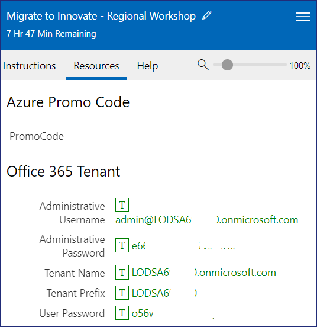
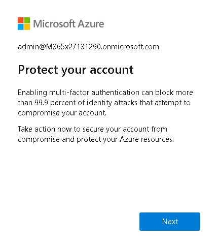
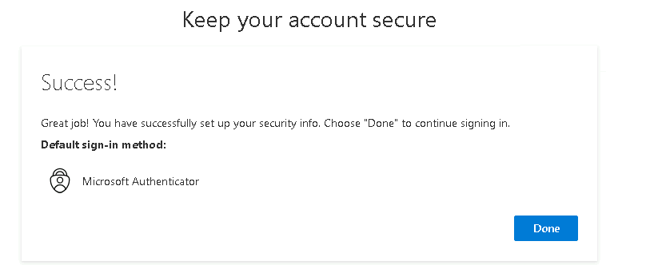
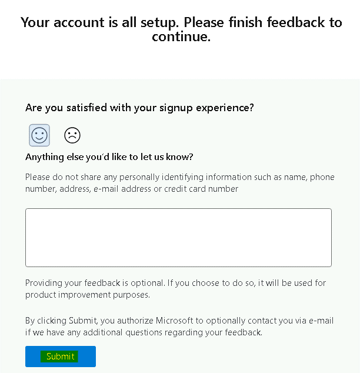
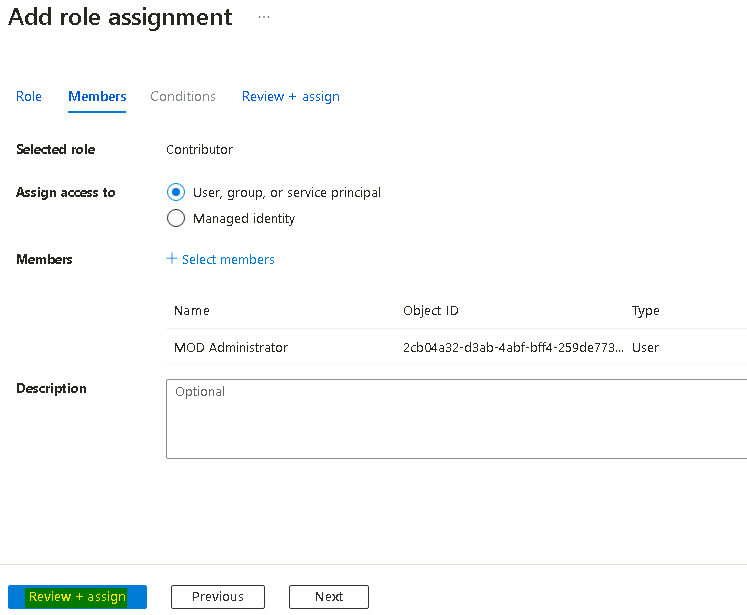
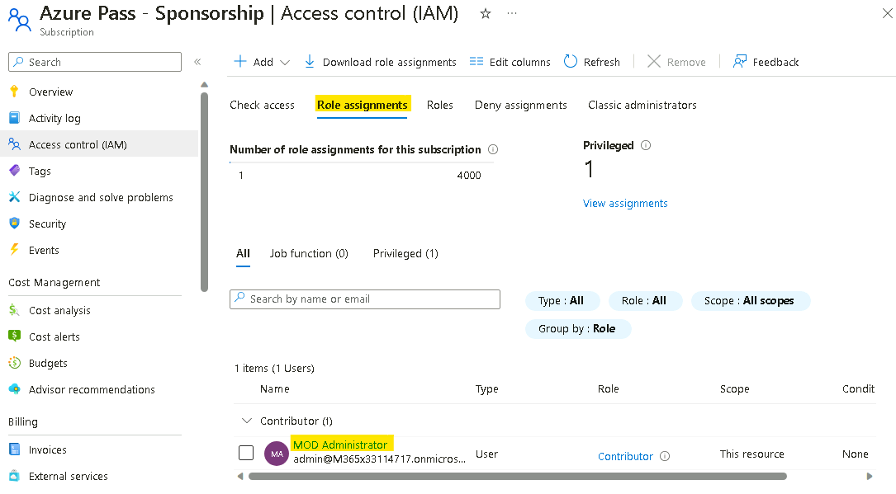
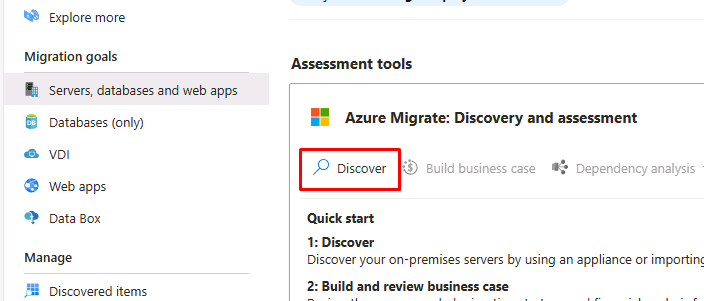
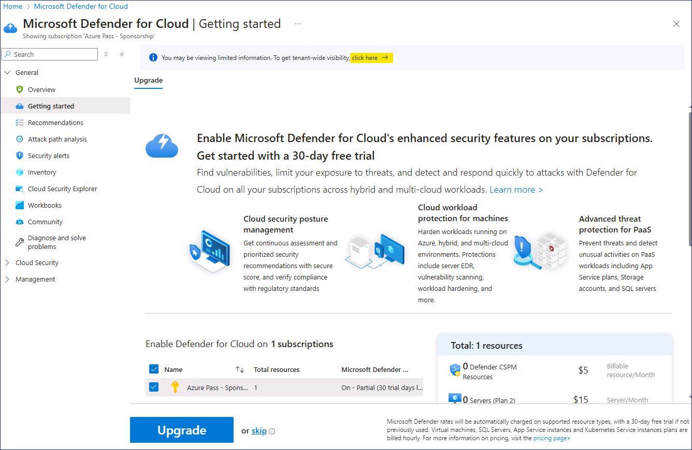
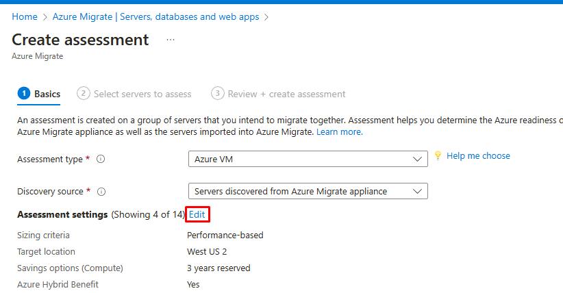
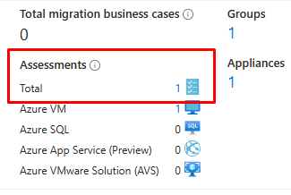

# Laboratorio 1 - Preparación del entorno de laboratorio

## Ejercicio 1: Preparación del entorno de laboratorio

### Tarea 0 - Configure la suscripción a Azure

1.  Inicie sesión en la VM proporcionada utilizando la credencial
    proporcionada en la pestaña **Resources** de la interfaz de
    Laboratorio.

    

2.  Abra el navegador Edge y vaya a `www.microsoftazurepass.com`

3.  Haga clic en el botón **Start** para empezar.

    

    > **Nota**: No utilice su **cuenta de empresa/trabajo** para iniciar
    sesión y canjear el pase Azure, ya que no se emitirá otro pase Azure.

4.  Ingrese las **Office 365 Tenant credentials** proporcionadas en la
    pestaña **Resources/Home** de la interfaz del Laboratorio para
    completar el proceso de inicio de sesión.

5.  Una vez finalizado el proceso de inicio de sesión, haga clic en
    "**Confirm Microsoft Account**" si aparece la dirección de correo
    electrónico correcta.

    

6.  En la sección **Azure Promo Code** de la pestaña **Resources** de la
    interfaz Lab, ingrese el **Promocode** en la casilla Promo code y
    haga clic en "**Claim Promo Code**".

    

7.  El canje puede tardar unos segundos en procesarse.

    

8.  Ingrese la información obligatoria del perfil y seleccione las
    casillas de verificación y, a continuación, haga clic en "**Sign
    up**".

    

9.  Es posible que se le pida que se registre y complete la
    autenticación MFA; siga adelante con el registro MFA utilizando
    **Microsoft Authenticator App** o **Phone method**.

    

10. Una vez completada la autenticación, haga clic en el botón **Done**.

    

11. En la página de comentarios, ingrese sus comentarios y haga clic en
    **Submit**.     

12. Le redirigirá automáticamente al Azure Portal y ya podrá utilizar
    los servicios de Azure.     

13. En el cuadro de búsqueda del **Azure Portal**
    `https://portal.azure.com`, escriba `subscriptions` y, a continuación,
    haga clic en **Subscriptions.**     

14. En la lista de suscripciones, seleccione **Azure Pass
    -Sponsorship**.     

15. En la página Azure Pass - Sponsorship, haga clic en **Access control
    (IAM)** y, a continuación, haga clic en el menú desplegable **+Add**
    y seleccione **Add role assignment**.     
    

16. En la página Añadir asignación de funciones, en la pestaña
    **Privileged administrator roles**, seleccione **Contributor** y, a
    continuación, haga clic en **Next**.     
    

17. En la pestaña **Members**, haga clic en **+ Select members**, elija
    **MOD Administrator** y, a continuación, haga clic en el botón
    **Select**.     

18. Haga clic en el botón **Review + assign**.     

    

19. Vuelva a hacer clic en el botón **Review + assign**

    

20. Debería recibir la notificación que se muestra en la siguiente
    imagen

    

21. Haga clic en la pestaña **Role assignments** para ver el rol
    asignado en el paso anterior. Podemos ver los Usuarios listados a
    los que se asignó el rol de Colaborador.

    

**Tarea 1: Asegúrese de que las VM están listas**

Hyper-V Integration Services debe estar instalado y ejecutándose en las
MV invitadas para que la detección identifique las aplicaciones
instaladas en ellas.

1.  Abra **Microsoft Edge** desde el escritorio y, a continuación, vaya
    a la dirección IP de **RHEL-WEB-01**: `192.168.1.24`

    

2.  **RHEL-WEB-01** sirve un sitio web de Drupal que está configurado
    para realizar llamadas a una base de datos alojada en
    **RHEL-DB-01**. La carga correcta del sitio web confirma que ambas
    VMs funcionan correctamente.

**Tarea 2: Cree un proyecto Azure Migrate**

1.  En una nueva pestaña de Edge, vaya a Azure Portal
    `https://portal.azure.com` , e inicie sesión con las
    credenciales proporcionadas en los recursos del Laboratorio

2.  En el portal Azure, en el cuadro **Search**, ingrese `Azure
    Migrate` y, a continuación, seleccione **Azure Migrate** para ir a
    la página Azure Migrate.

3.  En el menú de navegación de la izquierda, en **Migration goals**,
    seleccione **Servers, databases and web apps**     

4.  En la hoja **Servers, databases and web apps**, seleccione **Create
    project** en el centro de la página.

5.  En la hoja **Create project**, utilice la siguiente configuración
    para crear un nuevo proyecto.

    - Utilice los valores por defecto para cualquier ajuste no especificado
    en la tabla.

    - Resource group - haga clic en **Create new**  `AZMigrateRG`

    - Project - `az-migrate-XXXXXX` \[sustituya XXXXXX por un número
    aleatorio\].

    - Geography - **United States**

6.  Seleccione **Create**.

7.  Espere a que se complete la implementación antes de pasar a la
    siguiente tarea.

### Tarea 3: Implemente y configure el dispositivo Azure Migrate

1.  En el hoja **Servers, databases and web apps**, en la sección
    **Assessment Tools**, en **Azure Migrate: Discovery and
    assessment**, seleccione **Discover** y elija **Using appliance**

    

2.  En la hoja **Discover**, en el menú **Are your Machines
    virtualized?**, seleccione **Yes, with Hyper-V**.

3.  En **1. General product key**, en la casilla **Name your
    appliance**, ingrese HV-XXXXXX sustituyendo **XXXXX** por el número
    utilizado anteriormente y, a continuación, seleccione **Generate
    key.**

    > **Nota** - El proceso de key-generation puede tardar hasta 2 minutos
    en completarse.

4.  Una vez generada la clave, seleccione el **copy icon** en el campo
    **Project key**.

    

5.  En **2. Download Azure Migrate appliance**, seleccione **.zip file.
    500MB**, y haga clic en el botón Download.

    

    > **Esto descargaría el PowerShell script que instala el dispositivo en
    Windows Server machine.**

    > Para este Laboratorio, el script **ya ha sido descargado** y
    > **ejecutado** a la unidad E: **Continúe después de este paso**.

    

6.  En **3. Set up the appliance**

7.  Minimice la ventana Edge y, a continuación, seleccione el acceso
    directo **Azure Migrate Appliance Configuration Manager** en el
    escritorio.

8.  Una vez que se cargue la página **Azure Migrate Appliance
    Configuration Manager**, es posible que tenga que aceptar el EULA.
    Seleccione **Accept** si se le solicita.

9.  En la página **Azure Migrate Appliance Configuration Manager**, en
    el cuadro **Register Hyper-V appliance by pasting the key here**,
    pegue la clave que copió anteriormente.

10. Seleccione **Verify.**

11. Seleccione **Login**. Aparecerá un modal pidiéndole que **Continue
    with Azure Login**.

12. Seleccione **Copy code & Login** e inicie sesión en su suscripción
    pegando el código del dispositivo y, a continuación, seleccionando
    su nombre de usuario.

13. Cuando se le pregunte **Are you trying to sign in to Microsoft Azure
    PowerShell?**, seleccione **Continue** y cierre la pestaña recién
    abierta del navegador.

14. En la página **Azure Migrate Appliance Configuration Manager**,
    espere a que se complete el registro.

    

    > **El registro puede tardar hasta 10 minutos en completarse.**

15. En la sección **Provide Hyper-V host credentials**, seleccione **Add
    credentials**  e ingrese las credenciales con la siguiente
    configuración:

    - Friendly Name - `Hypervisor`

    - User Name - `Administrator`

    - Password - `Passw0rd!`

16. En la sección **Provide Hyper-V host/cluster details**, seleccione
    **add a discovery source**, a continuación, haga clic en **Add
    single item** y utilice la siguiente configuración:

    - Discovery source - **Hyper-V Host/Cluster**

    - IP address FQDN - `win-msite54sfl9`

    - Map credentials - **Hypervisor**

17. En la sección **Provide server credentials to perform software
    inventory**, asegúrese de que el control deslizante está **enabled**
    y, a continuación, ingrese las credenciales con la siguiente
    configuración:

    - Credentials type - **Linux (Non-domain)**

    - Friendly Name - `RHELUser`

    - User Name - `fetch6474`

    - Password - `RHELWorkshop`

18. Seleccione **Start discovery**.

19. Deje Edge abierto para el siguiente ejercicio. Discovery seguirá
    procesando.

## Ejercicio 2: Activación de Microsoft Defender for Cloud

### Tarea 1: Active Microsoft Defender for Cloud

1.  En el Azure Portal, haga clic en el menú Portal o, desde la página
    de inicio, elija Microsoft Defender for Cloud.

    

2.  Sobre la notificación - **You may be viewing limited information. To
    gettenant-wide visibility, click here --\>** haga clic aquí.

    

3.  En la página **Get permissions**, seleccione **Security Admin** y, a
    continuación, haga clic en el botón **Get access**.

    

4.  Debería recibir la notificación como se muestra en las siguientes
    imágenes

    

    

5.  Actualice el navegador y, a continuación, en la página de
    **Microsoft Defender for Cloud**, en la sección **General**, navegue
    y haga clic en **Getting started**. En la pestaña **Upgrade**,
    navegue y haga clic en el botón **Upgrade**.

    > **Nota**: Es posible que tenga que esperar unos minutos hasta que se
    complete la actualización.

    

### Tarea 2: Habilite la configuración de recopilación de datos adicionales para Defender for Cloud

1.  En la página de **Microsoft Defender for Cloud**, vaya a la sección
    **Management** y haga clic en **Environment settings.**

    

2.  Desplácese hacia abajo, expanda **Tenant Root Group** y haga clic en
    la suscripción **Azure Pass – Sponsorship.**

    

3.  Observe que la cobertura del Defender es de **11/12 plans** para la
    suscripción.

4.  En la página **Settings | Defender plans**, haga clic en **Enable
    all plans.**

    

5.  Seleccione **Microsoft Defender for APIs Plan 1** y, a continuación,
    haga clic en el botón **Save**.

    

6.  Haga clic en el botón **Save**.

    

7.  Debería recibir las notificaciones como se muestra en la siguiente
    imagen.

    

## Ejercicio 3: Crear un caso empresarial y realizar una evaluación

### Tarea 1: Cree y revise un caso de negocio

1.  En Azure Portal, vuelva a la página **Azure Migrate Servers,
    databases and web apps**. Seleccione **Refresh** para comprobar que
    se han detectado sus servidores.

    

2.  En la sección **Azure Migrate: Discovery and assessment**,
    seleccione **Build business case**.

    

3.  En la hoja **Build business case**, utilice los siguientes valores
    para crear el caso de negocio.

    - Business case name - `bc-43240741`

    - Target location - **eastus**

    - Migration strategy - **Azure recommended approach to minimize
      cost**

    - Savings options - **Reserved Instance + Azure Savings Plan**

    - Discount (%) on Pay as you go - **0**

    - Seleccione **Build business case**.

    

    > El caso de negocio puede tardar hasta 5 minutos en generarse. Si han
    pasado más de 5 minutos, seleccione **Refresh**.

4.  En la página **bc-43240741**, revise la información que indica la
    preparación para Azure y la estimación del coste mensual tanto para
    computación como para almacenamiento.

### Tarea 2: Configure, ejecute y visualice una evaluación

1.  En una nueva pestaña, navegue por la página de **Resource groups**
    `https://portal.azure.com/#view/HubsExtension/BrowseResourceGroups.ReactView`,
    seleccione el grupo de recursos **AZMigrateRG** y anote la ubicación
    de **Key Vault**, como se muestra a continuación: **West US 2**.
        

    > **Nota** - Esta ubicación deberá especificarse para otros recursos que
    > se creen más adelante en el Laboratorio, también para garantizar que
    > los **recursos Azure se crean en la misma región** y que la Migración
    > se realiza sin problemas.

2.  Vuelva a la página **Azure Migrate** y en la sección under **Azure
    Migrate: Discovery and assessment**, seleccione **Assess** y, a
    continuación, en el menú desplegable, seleccione **Azure VM**.

    

3.  En la página **Create assessment**, deje los menús desplegables en
    sus valores predeterminados.

4.  Seleccione el enlace **Edit** situado junto a **Assessment
    settings**.

     

5.  En la página Configuración de la evaluación, utilice la siguiente
    configuración para crear la evaluación.

    > **Acepte la configuración predeterminada para todo lo que no se
    > especifique en la tabla.**

    - Target location - **West US 2**

    - Storage type - **Discos administrados premium**

    - Savings options - **Ninguno**

    - Sizing criteria - **Como en las instalaciones**

    - VM series - **Dsv3_series**

    - Comfort factor - **1**

    - Offer - **Pago por uso**

    - Currency - **US Dollar ($)**

    - Discount - **0**

    - VM uptime - **31 días por mes y 24 horas por día**

    - Already have a Windows Server license? - **No**

    - Security - **No**

6.  Seleccione **Save** para volver a Crear evaluación y, a
    continuación, seleccione **Next: Select servers to assess \>**

7.  Utilice la siguiente configuración para crear el grupo de servidores
    y seleccionar los servidores que deben evaluarse.

    - Acepte la configuración predeterminada para todo lo que no se
    especifique en la tabla.

    - Assessment name - `as-43240741`

    - Select or create a group - **Create new**

    - Group name - `RHEL-Servers`

    - Lista de máquinas que se añadirán al
    grupo- **RHEL-DB-01** y **RHEL-WEB-01**

8.  Seleccione **Create assessment**. Se le redirigirá a la página
    **Azure Migrate | Azure Migrate | Servers, databases and web apps.**

9.  **Actualice** la página.

10. En la sección **Azure Migrate: Discovery and Assessment**, compruebe
    que el **Assessments Total** es igual a **1** y, a continuación,
    seleccione **1**.

    

11. En la página **Azure Migrate: Discovery and Assessment |
    Assessments**, seleccione la evaluación recién creada
    **as-43240741**.

    

12. En la página **as-4324074**, revise la información que indica la
    preparación para Azure y la estimación del coste mensual tanto para
    computación como para almacenamiento.

**En situaciones reales, debería considerar la instalación del Agente de
dependencias para obtener más información sobre las dependencias del
servidor durante la fase de evaluación.**
