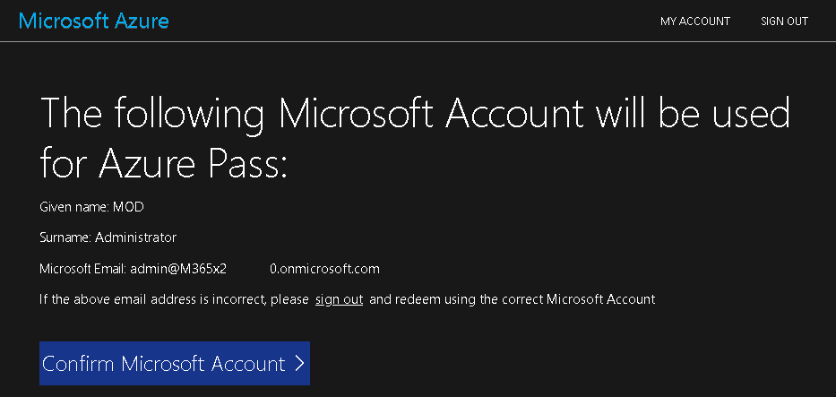
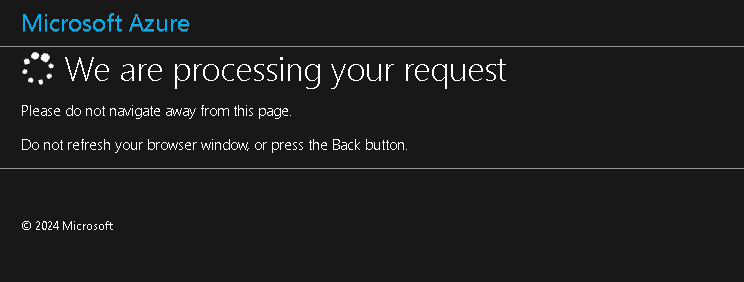
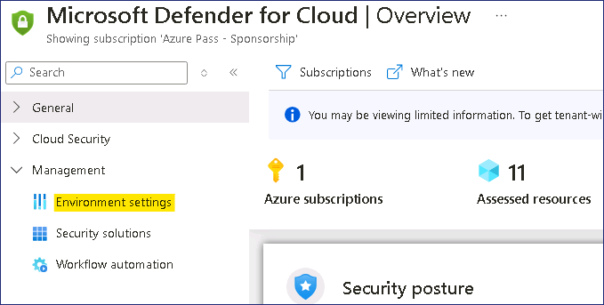
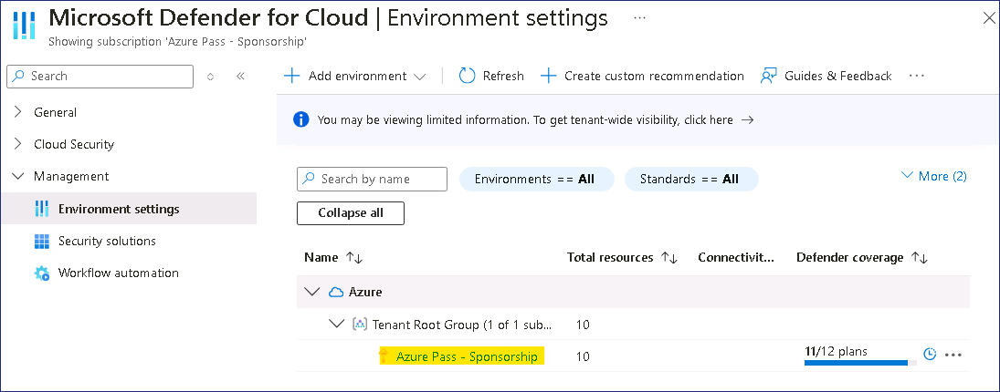
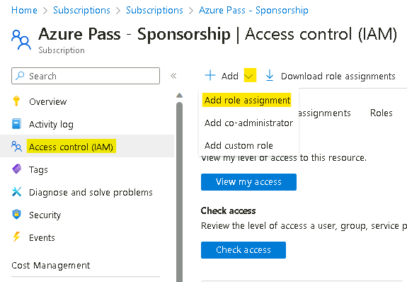
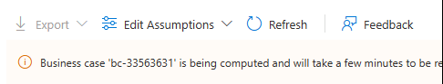
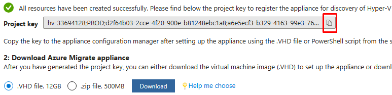

# Lab 1 - Preparing your lab environment

## Exercise 1: Preparing the lab environment

## Task 0 – Setup the Azure Subscription

1.  Login to the provided VM using the credential provided on the **Resources** tab of the Lab interface.

    

2.  Open the edge browser and navigate to ```http://www.microsoftazurepass.com```

3.  Click the **Start** button to get started.

    

    > **Note**: Do not use your Company/Work Account to login to redeem the Azure Pass, another Azure Pass will not be issued.

4.  Enter the **Office 365 Tenant credentials** to complete the sign in
    process

5.  Once the sign in process is completed, click on "**Confirm Microsoft Account**" if the correct email address is listed.

    

6.  From the **Azure Promo Code** section on the **Resources** tab of the Lab interface, enter the **Promocode** in the Promo code box and click "**Claim Promo Code**".

    

7.  It may take few seconds to process the redemption.

    

8.  Enter the mandatory Profile information and select the check boxes and then click on "**Sign up**".

    

9. You may be prompted to register and complete MFA authentication, proceed ahead with the MFA registration using **Microsoft Authenticator App** or **Phone method**.

    

10. Once the Authentication is completed, click on the **Done** button.

    

11.  On the feedback page, enter your feedback and click on **Submit**.

    

12. It would automatically redirect you to the Azure Portal and now you are ready to use Azure services.

    


## Task 1: Ensure the VMs are ready

Hyper-V Integration Services must be installed and running on guest VMs
in order for discovery to identify the apps installed on them.

1.  Open the **Microsoft Edge** from the desktop, then go to the IP
    address of **RHEL-WEB-01**: ```192.168.1.24```

    

2.  **RHEL-WEB-01** serves a Drupal website that is configured to make
    calls to a database that is hosted on **RHEL-DB-01**. Successfully
    loading the website confirms that both VMs are functioning
    correctly.

## Task 2: Create an Azure Migrate project

1.  In a new Edge tab, navigate to Azure Portal ```https://portal.azure.com``` , and sign in
    using the credentials provided in the Lab resources

2.  In the Azure portal, in the **Search** box, enter Azure Migrate,
    then select **Azure Migrate** to go to the Azure Migrate page.

3.  In the left navigation, under **Migration goals**, select **Servers,
    databases and web apps**.

    

4.  On the **Servers, databases and web apps** blade, select **Create
    project** in the middle of the page.

5.  On the **Create project** blade, use the following settings to
    create a new project.

    Use the default values for any setting not specified in the table.

    Resource group – click on **Create new** ```AZMigrateRG```

    Project - ```az-migrate-XXXXXX``` \[substitute XXXXXX with random
    number\]

    Geography - **United States**

6.  Select **Create**.

7.  Wait for the deployment to complete before proceeding to the next
    task.

## Task 3: Deploy and configure the Azure Migrate appliance

1.  On the **Servers, databases and web apps** blade, in
    the **Assessment Tools** section, under **Azure Migrate: Discovery
    and assessment**, select **Discover**.

    

2.  On the **Discover** blade, on the **Are your Machines
    virtualized?** menu, select **Yes, with Hyper-V**.

3.  Under **1. General product key**, in the **Name your
    appliance** box, enter ```HV-XXXXXX``` substitute **XXXXX** with
    the number used previously., then select **Generate key**.

    >**Note** - The key-generation process can take up to 2 minutes to complete.

4.  Once the key is generated, select the **copy icon** on the **Project
    key** field.

    

5.  Under **2. Download Azure Migrate appliance**, select **.zip file.
    500MB**, and *note* the Download button\*.

    >This would download the PowerShell script that installs the appliance to a Windows Server machine. For this workshop, the script has **already been downloaded** to the E: drive and **run**. You will **continue past this step**.

6.  Under **3. Set up the appliance**

7.  Minimize the Edge window, then select the **Azure Migrate Appliance
    Configuration Manager** shortcut on the desktop.

8.  Once the **Azure Migrate Appliance Configuration Manager** page
    loads, you may need to accept the EULA. Select **Accept** if
    prompted.

9.  On the **Azure Migrate Appliance Configuration Manager** page, in
    the **Register Hyper-V appliance by pasting the key here** box,
    paste the key you copied earlier.

10. Select **Verify**.

11. Select **Login**. A modal will appear asking you to **Continue with
    Azure Login**.

12. Select **Copy code & Login** and sign in to your subscription by
    pasting the device code, then selecting your username.

13. When prompted **Are you trying to sign in to Microsoft Azure
    PowerShell?**, select **Continue** and close the newly opened
    browser tab.

14. On the **Azure Migrate Appliance Configuration Manager** page, wait
    for registration to complete.

    

    >It can take up to 10 minutes for registration to complete.

15. In the **Provide Hyper-V host credentials** section, select **Add
    credentials** and add credentials with the following settings:

    - Friendly Name - ```Hypervisor```

    - User Name - ```Administrator```

    - Password - ```Passw0rd! ```

16. In the **Provide Hyper-V host/cluster details** section,
    select **add a discovery source**, then select **Add single
    item** and use the following settings:

    - Discovery source - **Hyper-V Host/Cluster**

    - IP address FQDN - ```win-msite54sfl9```

    - Map credentials - **Hypervisor**

17. In the **Provide server credentials to perform software
    inventory** section, ensure that the slider is **enabled**, then add
    credentials with the following settings:

    - Credentials type - **Linux (Non-domain)**

    - Friendly Name - ```RHELUser```

    - User Name - ```fetch6474```

    - Password - ```RHELWorkshop```

18. Select **Start discovery**.

19. Leave Edge open for the next exercise. Discovery will continue
    processing.

# Exercise 2: Enabling Microsoft Defender for Cloud

## Task 1: Enable Microsoft Defender for Cloud

1.  While in the Azure Portal, click on the Portal menu or from the home
    page choose the Microsoft Defender for Cloud

    

2.  On Microsoft Defender for Cloud page, under the **General** section,
    navigate and click on **Getting started**. In the **Upgrade** tab,
    navigate and click on the **Upgrade** button.

    > **Note**: You may need to wait for a few minutes for the upgrade to complete.

    

3.  You’ll receive a notification stating **Trial started**.

    

4.  In **Microsoft Defender for Cloud | Getting started** page, click on
    the **Install agents** tab, select your active **Azure
    Subscription** as shown in the below image, then click on the
    **Install agents button.**

    

5.  **You’ll receive a notification Agents installation initiated.**

    

## Task 2: Enable additional data collection setting for Defender for Cloud

1.  On Microsoft Defender for Cloud page, navigate to **Management**
    section and click on **Environment settings.**

    > 

2.  Click on the **Azure Pass – Sponsorship** Subscription listed.

    

3.  Notice the Defender coverage is **11/12 plans** for the Subscription.

4.  On **Settings | Defender plans** page, click on **Enable all plans.**

    

5.  Select **Microsoft Defender for APIs Plan 1** and then click on
    **Save** button.

    

6.  Click on the **Save** button.

    

7.  You should get the notifications as shown in below image.

    

# Exercise 3: Create a Business case and run an assessment

## Task 1: Create and review a business case

1.  In Azure portal, go back to the **Azure Migrate Servers, databases
    and web apps** page. Select **Refresh** to verify that your servers
    have been discovered.

    

2.  In the **Azure Migrate: Discovery and assessment** section,
    select **Build business case**.

    

3.  In the **Build business case** blade, use the following values to
    create the business case.

    - Business case name - ```bc-43240741```

    - Target location - **eastus**

    - Migration strategy - **Azure recommended approach to minimize cost**

    - Savings options - **Reserved Instance + Azure Savings Plan**

    - Discount (%) on Pay as you go - **0**

    - Select **Build business case**.

    

    > The business case can take up to 5 minutes to generate. If it has been more than 5 minutes, select **Refresh**.

4.  On the **bc-43240741** page, review the information indicating Azure readiness and monthly cost estimate for both compute and storage.

## Task 2: Configure, run, and view an assessment

1.  Switch back to the **Discover - Microsoft Azure** tab in Edge, then
    go back to the **Azure Migrate Servers, databases and web
    apps** page and select **Refresh**.

2.  In the **Azure Migrate: Discovery and assessment** section,
    select **Assess** and then, in the drop-down menu, select **Azure
    VM**.

    

3.  On the **Create assessment** page, leave the dropdowns menus on
    their defaults.

4.  Select the **Edit** link next to **Assessment settings**,

    

5.  On the Assessment Settings page, use the following settings to
    create the assessment.

    > Accept the default settings for anything not specified in the table.

    - Target location - **eastus**

    - Storage type - **Premium managed disks**

    - Savings options - **None**

    - Sizing criteria - **As on premises**

    - VM series - **Dsv3_series**

    - Comfort factor - **1**

    - Offer - **Pay-As-You-Go**

    - Currency - **US Dollar ($)**

    - Discount - **0**

    - VM uptime - **31 Day(s) per month and 24 Hour(s) per day**

    - Already have a Windows Server license? - **No**

    - Security - **No**

6.  Select **Save** to return to Create Assessment, then select **Next:
    Select servers to assess \>**

7.  Use the following settings to create the server group and select the
    servers to be assessed.

    > Accept the default settings for anything not specified in the table.

    Assessment name - ```as-43240741```

    Select or create a group - **Create new**

    Group name - ```RHEL-Servers```

    List of machines to be added to the group - **RHEL-DB-01** and **RHEL-WEB-01**

8.  Select **Create assessment**. You will be redirected to the **Azure Migrate | Servers, databases and web apps** page.

9.  **Refresh** the page.

10. In the **Azure Migrate: Discovery and Assessment** section, verify that the **Assessments Total** equals **1**, then select **1**.

    

11. On the **Azure Migrate: Discovery and Assessment |
    Assessments** page, select the newly created
    assessment **as-43240741**.

    

12. On the **as-43240741** page, review the information indicating Azure
    readiness and monthly cost estimate for both compute and storage.

> In real-world scenarios, you should consider installing the Dependency Agent to provide more insights into server dependencies during the
assessment stage.
