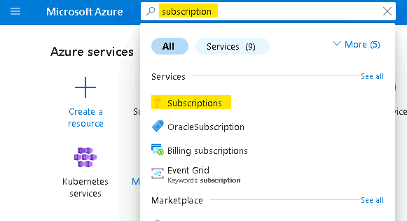
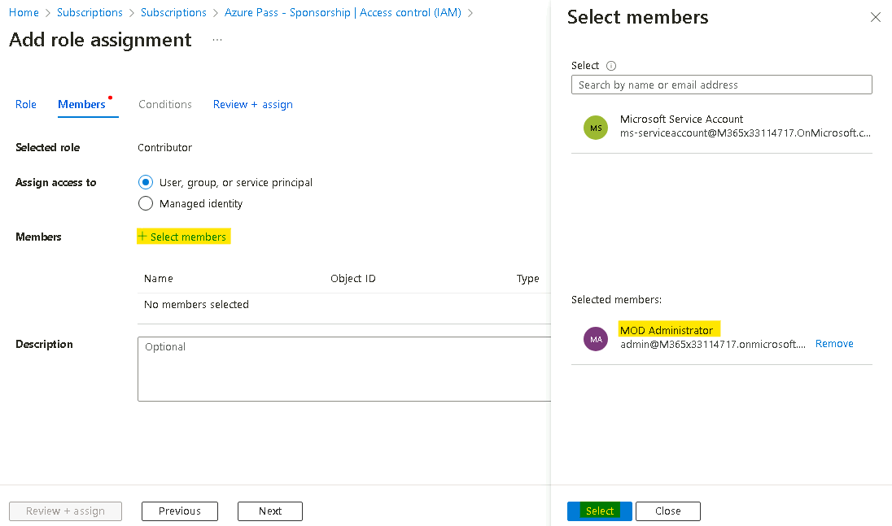
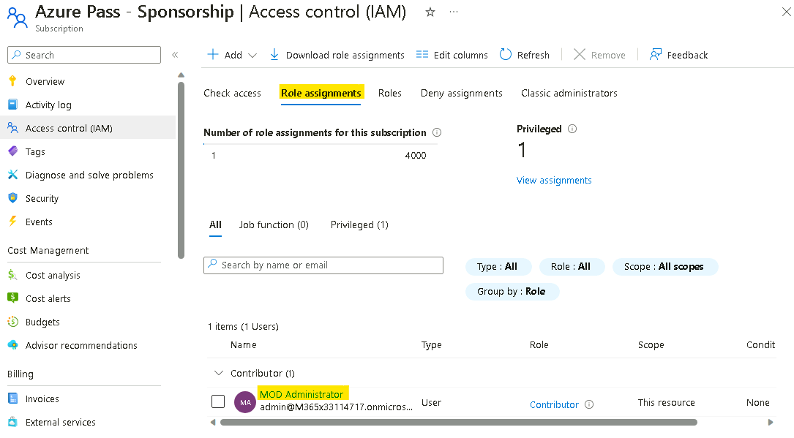

# ラボ 1 - ラボ環境の準備

## 演習 1: ラボ環境の準備

## タスク 0 - Azure サブスクリプションのセットアップ

1. ラボ インターフェイスの [**リソース**] タブで提供される資格情報を使用して、提供された VM にログインします。


2. エッジ ブラウザーを開き、```http://www.microsoftazurepass.com``` に移動します。

3. [**開始**] ボタンをクリックして開始します。


> <font color=Oranged> **注意**: Azure Pass を利用するためにログインする際に、**会社/職場アカウント** を使用しないでください。別の Azure Pass は発行されません。</font>

4. ラボ インターフェイスの **リソース/ホーム** タブで提供される **Office 365 テナント資格情報** を入力して、サインイン プロセスを完了します

5. サインイン プロセスが完了したら、正しいメール アドレスが表示されている場合は [**Microsoft アカウントの確認**] をクリックします。


6. ラボ インターフェイスの **リソース** タブの **Azure プロモーション コード** セクションで、プロモーション コード ボックスに **プロモーション コード** を入力し、[**プロモーション コードの取得**] をクリックします。


7. 引き換えの処理には数秒かかる場合があります。


8. 必須のプロファイル情報を入力し、チェックボックスをオンにして、「**サインアップ**」をクリックします。


9. 登録して MFA 認証を完了するように求められる場合があります。**Microsoft Authenticator アプリ** または **電話による方法** を使用して MFA 登録を進めます。


10. 認証が完了したら、「**完了**」ボタンをクリックします。


11. フィードバック ページでフィードバックを入力し、「**送信**」をクリックします。


12. Azure ポータルに自動的にリダイレクトされ、Azure サービスを使用する準備が整います。


13. **Azure Portal** ```https://portal.azure.com``` 検索ボックスに「```subscriptions```」と入力し、[**サブスクリプション**] をクリックします。


14. サブスクリプションの一覧から、[**Azure Pass – スポンサーシップ**] を選択します。


15. [Azure Pass – スポンサーシップ] ページで、[**アクセス制御 (IAM)] をクリックし、[**+ 追加**] ドロップダウンをクリックして、[**ロールの割り当ての追加**] を選択します。


16. [ロールの割り当ての追加] ページの [**特権管理者ロール**] タブで [**共同作成者**] を選択し、[**次へ**] をクリックします。


17. [メンバー] タブで [+ メンバーを選択] をクリックし、[MOD 管理者] を選択して [選択] ボタンをクリックします。


18. [確認 + 割り当て] ボタンをクリックします。


19. [確認 + 割り当て] ボタンをクリックします


20. 以下の画像のように通知が表示されます


21. [ロールの割り当て] タブをクリックして、前の手順で割り当てられたロールを表示します。Contributor ロールが割り当てられたユーザーが一覧表示されます。



## タスク 1: VM の準備ができていることを確認する

ゲスト VM にインストールされているアプリを検出で識別するには、Hyper-V 統合サービスがゲスト VM にインストールされ、実行されている必要があります。

1. デスクトップから **Microsoft Edge** を開き、**RHEL-WEB-01** の IP アドレス: ```192.168.1.24``` に移動します。


2. **RHEL-WEB-01** は、**RHEL-DB-01** でホストされているデータベースを呼び出すように構成された Drupal Web サイトを提供します。Web サイトが正常に読み込まれると、両方の VM が正しく機能していることが確認できます。

## タスク 2: Azure Migrate プロジェクトを作成する

1. 新しい Edge タブで、Azure Portal ```https://portal.azure.com``` に移動し、ラボ リソースで提供される資格情報を使用してサインインします

2. Azure Portal の [**検索**] ボックスに「```Azure Migrate```」と入力し、[**Azure Migrate**] を選択して Azure Migrate ページに移動します。

3. 左側のナビゲーションの [**移行の目標**] で、[**サーバー、データベース、Web アプリ**] を選択します。


4. [**サーバー、データベース、Web アプリ**] ブレードで、ページの中央にある [**プロジェクトの作成**] を選択します。

5. [**プロジェクトの作成**] ブレードで、次の設定を使用して新しいプロジェクトを作成します。

表に指定されていない設定には、既定値を使用します。

リソース グループ - [**新規作成** ```AZMigrateRG```] をクリックします

プロジェクト - ```az-migrate-XXXXXX``` [XXXXXX をランダムな数字に置き換えます]

地域 - **米国**

6. [**作成**] を選択します。

7. デプロイが完了するまで待ってから、次のタスクに進みます。

## タスク 3: Azure Migrate アプライアンスをデプロイして構成する

1. [**サーバー、データベース、Web アプリ**] ブレードの [**評価ツール**] セクションの [**Azure Migrate: 検出と評価**] で、[**検出**] を選択し、[**アプライアンスの使用**] を選択します


2. [**検出**] ブレードの [**マシンは仮想化されていますか?**] メニューで、[**はい (Hyper-V を使用)] を選択します。

3. [**1. 一般的なプロダクト キー**] の [**アプライアンスに名前を付ける**] ボックスに「```HV-XXXXXX```」と入力し、[**XXXXX**] を以前に使用した番号に置き換えてから、[**キーの生成**] を選択します。

>**注** - キー生成プロセスは完了するまでに最大 2 分かかる場合があります。

4. キーが生成されたら、**プロジェクト キー** フィールドの **コピー アイコン** を選択します。


5. **2. Azure Migrate アプライアンスをダウンロード** で、**.zip ファイル (500 MB)** を選択し、ダウンロード ボタンに注意してください。

<font color=Green>

> **これにより、アプライアンスを Windows Server マシンにインストールする PowerShell スクリプトがダウンロードされます。**

>このラボでは、スクリプトは **既に E: ドライブにダウンロードされ、**実行** されています。**この手順を続行します**。

</font>

6. **3. アプライアンスをセットアップ** で

7. Edge ウィンドウを最小化し、デスクトップで **Azure Migrate Appliance Configuration Manager** ショートカットを選択します。

8. **Azure Migrate Appliance Configuration Manager** ページが読み込まれたら、EULA に同意する必要がある場合があります。プロンプトが表示されたら、**同意する** を選択します。

9. **Azure Migrate Appliance Configuration Manager** ページの **Hyper-V アプライアンスを登録するには、ここにキーを貼り付けます** ボックスに、先ほどコピーしたキーを貼り付けます。

10. **確認** を選択します。

11. **ログイン** を選択します。**Azure ログインを続行** するように求めるモーダルが表示されます。

12. **コードをコピーしてログイン** を選択し、デバイス コードを貼り付けてからユーザー名を選択して、サブスクリプションにサインインします。

13. **Microsoft Azure PowerShell にサインインしようとしていますか?** というプロンプトが表示されたら、**続行** を選択し、新しく開いたブラウザー タブを閉じます。

14. **Azure Migrate Appliance Configuration Manager** ページで、登録が完了するまで待ちます。


<font color=Green>

> **登録が完了するまでに最大 10 分かかる場合があります。** </font>

15. [**Hyper-V ホストの資格情報を提供する**] セクションで、[**資格情報の追加**] を選択し、次の設定で資格情報を追加します。

- フレンドリ名 - ```Hypervisor```

- ユーザー名 - ```Administrator```

- パスワード - ```Passw0rd! ```

16. **Hyper-V ホスト/クラスターの詳細を指定** セクションで、**検出ソースを追加** を選択し、**単一項目を追加** を選択して、次の設定を使用します:

- 検出ソース - **Hyper-V ホスト/クラスター**

- IP アドレス FQDN - ```win-msite54sfl9```

- 資格情報のマップ - **ハイパーバイザー**

17. **ソフトウェア インベントリを実行するためのサーバー資格情報を指定** セクションで、スライダーが **有効** になっていることを確認してから、次の設定で資格情報を追加します:

- 資格情報の種類 - **Linux (非ドメイン)**

- フレンドリ名 - ```RHELUser```

- ユーザー名 - ```fetch6474```

- パスワード - ```RHELWorkshop```

18. **検出を開始** を選択します。

19. 次の演習のために Edge を開いたままにしておきます。検出処理は続行されます。

# 演習 2: Microsoft Defender for Cloud の有効化

## タスク 1: Microsoft Defender for Cloud の有効化

1. Azure ポータルで、ポータル メニューをクリックするか、ホーム ページから Microsoft Defender for Cloud を選択します。


2. 通知で、**表示している情報が限定されている可能性があります。テナント全体の可視性を取得するには、ここをクリックしてください -->** をクリックします。


3. **アクセス許可の取得** ページで、**セキュリティ管理者** を選択し、**アクセスの取得** ボタンをクリックします。


4. 以下の画像のような通知が表示されます


5. ブラウザーを更新し、**Microsoft Defender for Cloud** ページの **全般** セクションで、
**開始** に移動してクリックします。

**アップグレード** タブで、
**アップグレード** ボタンをクリックして移動します。

> <font color=Oranged> **注**: アップグレードが完了するまで数分かかる場合があります。</font>


## Task 2: Enable additional data collection setting for Defender for Cloud

1.  On **Microsoft Defender for Cloud** page, navigate to **Management**
    section and click on **Environment settings.**

    > 

2.  Scroll down and then expand **Tenant Root Group** and then click on the **Azure Pass – Sponsorship** Subscription listed.

    

3.  Notice the Defender coverage is **11/12 plans** for the Subscription.

4.  On **Settings | Defender plans** page, click on **Enable all plans.**

    

5.  Select **Microsoft Defender for APIs Plan 1** and then click on
    **Save** button.

    

6.  Click on the **Save** button.

    

7.  You should get the notifications as shown in below image.

    

# Exercise 3: Create a Business case and run an assessment

## Task 1: Create and review a business case

1.  In Azure portal, go back to the **Azure Migrate Servers, databases
    and web apps** page. Select **Refresh** to verify that your servers
    have been discovered.

    

2.  In the **Azure Migrate: Discovery and assessment** section,
    select **Build business case**.

    

3.  In the **Build business case** blade, use the following values to
    create the business case.

    - Business case name - ```bc-43240741```

    - Target location - **eastus**

    - Migration strategy - **Azure recommended approach to minimize cost**

    - Savings options - **Reserved Instance + Azure Savings Plan**

    - Discount (%) on Pay as you go - **0**

    - Select **Build business case**.

    

    > The business case can take up to 5 minutes to generate. If it has been more than 5 minutes, select **Refresh**.

4.  On the **bc-43240741** page, review the information indicating Azure readiness and monthly cost estimate for both compute and storage.

## Task 2: Configure, run, and view an assessment

1.  In a new tab navigate **Resource groups** page ```https://portal.azure.com/#view/HubsExtension/BrowseResourceGroups.ReactView``` select the **AZMigrateRG** resource group and then note down the location of the **Key Vault**, as shown below it is **West US 2**.
   

    <font color=Orangered>

    > **Note** - This location would be required to be specified for other resources to be created later in the Lab, also to ensure the **Azure resources are created in the same region** to ensure the Migration is done smoothly.

    </font>

2.  Switch back to the **Azure Migrate** page and under **Azure Migrate: Discovery and assessment** section, select **Assess** and then, in the drop-down menu, select **Azure VM**.

    

3.  On the **Create assessment** page, leave the dropdowns menus on
    their defaults.

4.  Select the **Edit** link next to **Assessment settings**,

    

5.  On the Assessment Settings page, use the following settings to
    create the assessment.
    <font color=Green>
    > **Accept the default settings for anything not specified in the table.** </font>

    - Target location - **West US 2**

    - Storage type - **Premium managed disks**

    - Savings options - **None**

    - Sizing criteria - **As on premises**

    - VM series - **Dsv3_series**

    - Comfort factor - **1**

    - Offer - **Pay-As-You-Go**

    - Currency - **US Dollar ($)**

    - Discount - **0**

    - VM uptime - **31 Day(s) per month and 24 Hour(s) per day**

    - Already have a Windows Server license? - **No**

    - Security - **No**

6.  Select **Save** to return to Create Assessment, then select **Next:
    Select servers to assess \>**

7.  Use the following settings to create the server group and select the
    servers to be assessed.

    > Accept the default settings for anything not specified in the table.

    Assessment name - ```as-43240741```

    Select or create a group - **Create new**

    Group name - ```RHEL-Servers```

    List of machines to be added to the group - **RHEL-DB-01** and **RHEL-WEB-01**

8.  Select **Create assessment**. You will be redirected to the **Azure Migrate | Servers, databases and web apps** page.

9.  **Refresh** the page.

10. In the **Azure Migrate: Discovery and Assessment** section, verify that the **Assessments Total** equals **1**, then select **1**.

    

11. On the **Azure Migrate: Discovery and Assessment |
    Assessments** page, select the newly created
    assessment **as-43240741**.

    

12. On the **as-43240741** page, review the information indicating Azure
    readiness and monthly cost estimate for both compute and storage.

<font color=Green>

> **In real-world scenarios, you should consider installing the Dependency Agent to provide more insights into server dependencies during the
assessment stage.** </font>
