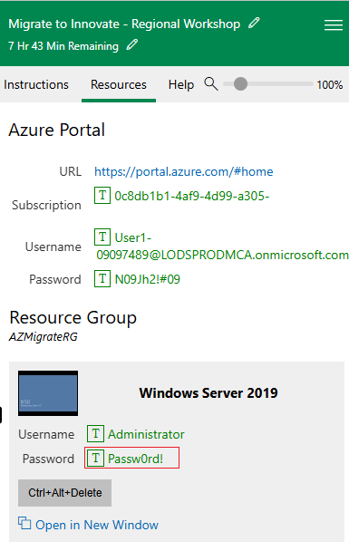

# ラボ 1 - ラボ環境の準備

## 演習 1: ラボ環境の準備

## タスク 0 - Azure サブスクリプションのセットアップ

1. ラボ インターフェイスの [**リソース**] タブで提供される資格情報を使用して、提供された VM にログインします。



2. エッジ ブラウザーを開き、```http://www.microsoftazurepass.com``` に移動します。

3. [**開始**] ボタンをクリックして開始します。


> <font color=Oranged> **注意**: Azure Pass を利用するためにログインする際に、**会社/職場アカウント** を使用しないでください。別の Azure Pass は発行されません。</font>

4. ラボ インターフェイスの **リソース/ホーム** タブで提供される **Office 365 テナント資格情報** を入力して、サインイン プロセスを完了します

5. サインイン プロセスが完了したら、正しいメール アドレスが表示されている場合は [**Microsoft アカウントの確認**] をクリックします。


6. ラボ インターフェイスの **リソース** タブの **Azure プロモーション コード** セクションで、プロモーション コード ボックスに **プロモーション コード** を入力し、[**プロモーション コードの取得**] をクリックします。


7. 引き換えの処理には数秒かかる場合があります。


8. 必須のプロファイル情報を入力し、チェックボックスをオンにして、「**サインアップ**」をクリックします。


9. 登録して MFA 認証を完了するように求められる場合があります。**Microsoft Authenticator アプリ** または **電話による方法** を使用して MFA 登録を進めます。


10. 認証が完了したら、「**完了**」ボタンをクリックします。


11. フィードバック ページでフィードバックを入力し、「**送信**」をクリックします。


12. Azure ポータルに自動的にリダイレクトされ、Azure サービスを使用する準備が整います。


13. **Azure Portal** ```https://portal.azure.com``` 検索ボックスに「```subscriptions```」と入力し、[**サブスクリプション**] をクリックします。


14. サブスクリプションの一覧から、[**Azure Pass – スポンサーシップ**] を選択します。


15. [Azure Pass – スポンサーシップ] ページで、[**アクセス制御 (IAM)] をクリックし、[**+ 追加**] ドロップダウンをクリックして、[**ロールの割り当ての追加**] を選択します。


16. [ロールの割り当ての追加] ページの [**特権管理者ロール**] タブで [**共同作成者**] を選択し、[**次へ**] をクリックします。


17. [メンバー] タブで [+ メンバーを選択] をクリックし、[MOD 管理者] を選択して [選択] ボタンをクリックします。


18. [確認 + 割り当て] ボタンをクリックします。


19. [確認 + 割り当て] ボタンをクリックします


20. 以下の画像のように通知が表示されます


21. [ロールの割り当て] タブをクリックして、前の手順で割り当てられたロールを表示します。Contributor ロールが割り当てられたユーザーが一覧表示されます。


## タスク 1: VM の準備ができていることを確認する

ゲスト VM にインストールされているアプリを検出で識別するには、Hyper-V 統合サービスがゲスト VM にインストールされ、実行されている必要があります。

1. デスクトップから **Microsoft Edge** を開き、**RHEL-WEB-01** の IP アドレス: ```192.168.1.24``` に移動します。


2. **RHEL-WEB-01** は、**RHEL-DB-01** でホストされているデータベースを呼び出すように構成された Drupal Web サイトを提供します。Web サイトが正常に読み込まれると、両方の VM が正しく機能していることが確認できます。

## タスク 2: Azure Migrate プロジェクトを作成する

1. 新しい Edge タブで、Azure Portal ```https://portal.azure.com``` に移動し、ラボ リソースで提供される資格情報を使用してサインインします

2. Azure Portal の [**検索**] ボックスに「```Azure Migrate```」と入力し、[**Azure Migrate**] を選択して Azure Migrate ページに移動します。

3. 左側のナビゲーションの [**移行の目標**] で、[**サーバー、データベース、Web アプリ**] を選択します。


4. [**サーバー、データベース、Web アプリ**] ブレードで、ページの中央にある [**プロジェクトの作成**] を選択します。

5. [**プロジェクトの作成**] ブレードで、次の設定を使用して新しいプロジェクトを作成します。

表に指定されていない設定には、既定値を使用します。

リソース グループ - [**新規作成** ```AZMigrateRG```] をクリックします

プロジェクト - ```az-migrate-XXXXXX``` [XXXXXX をランダムな数字に置き換えます]

地域 - **米国**

6. [**作成**] を選択します。

7. デプロイが完了するまで待ってから、次のタスクに進みます。

## タスク 3: Azure Migrate アプライアンスをデプロイして構成する

1. [**サーバー、データベース、Web アプリ**] ブレードの [**評価ツール**] セクションの [**Azure Migrate: 検出と評価**] で、[**検出**] を選択し、[**アプライアンスの使用**] を選択します


2. [**検出**] ブレードの [**マシンは仮想化されていますか?**] メニューで、[**はい (Hyper-V を使用)] を選択します。

3. [**1. 一般的なプロダクト キー**] の [**アプライアンスに名前を付ける**] ボックスに「```HV-XXXXXX```」と入力し、[**XXXXX**] を以前に使用した番号に置き換えてから、[**キーの生成**] を選択します。

>**注** - キー生成プロセスは完了するまでに最大 2 分かかる場合があります。

4. キーが生成されたら、**プロジェクト キー** フィールドの **コピー アイコン** を選択します。


5. **2. Azure Migrate アプライアンスをダウンロード** で、**.zip ファイル (500 MB)** を選択し、ダウンロード ボタンに注意してください。

<font color=Green>

> **これにより、アプライアンスを Windows Server マシンにインストールする PowerShell スクリプトがダウンロードされます。**

>このラボでは、スクリプトは **既に E: ドライブにダウンロードされ、**実行** されています。**この手順を続行します**。

</font>

6. **3. アプライアンスをセットアップ** で

7. Edge ウィンドウを最小化し、デスクトップで **Azure Migrate Appliance Configuration Manager** ショートカットを選択します。

8. **Azure Migrate Appliance Configuration Manager** ページが読み込まれたら、EULA に同意する必要がある場合があります。プロンプトが表示されたら、**同意する** を選択します。

9. **Azure Migrate Appliance Configuration Manager** ページの **Hyper-V アプライアンスを登録するには、ここにキーを貼り付けます** ボックスに、先ほどコピーしたキーを貼り付けます。

10. **確認** を選択します。

11. **ログイン** を選択します。**Azure ログインを続行** するように求めるモーダルが表示されます。

12. **コードをコピーしてログイン** を選択し、デバイス コードを貼り付けてからユーザー名を選択して、サブスクリプションにサインインします。

13. **Microsoft Azure PowerShell にサインインしようとしていますか?** というプロンプトが表示されたら、**続行** を選択し、新しく開いたブラウザー タブを閉じます。

14. **Azure Migrate Appliance Configuration Manager** ページで、登録が完了するまで待ちます。


<font color=Green>

> **登録が完了するまでに最大 10 分かかる場合があります。** </font>

15. [**Hyper-V ホストの資格情報を提供する**] セクションで、[**資格情報の追加**] を選択し、次の設定で資格情報を追加します。

- フレンドリ名 - ```Hypervisor```

- ユーザー名 - ```Administrator```

- パスワード - ```Passw0rd! ```

16. **Hyper-V ホスト/クラスターの詳細を指定** セクションで、**検出ソースを追加** を選択し、**単一項目を追加** を選択して、次の設定を使用します:

- 検出ソース - **Hyper-V ホスト/クラスター**

- IP アドレス FQDN - ```win-msite54sfl9```

- 資格情報のマップ - **ハイパーバイザー**

17. **ソフトウェア インベントリを実行するためのサーバー資格情報を指定** セクションで、スライダーが **有効** になっていることを確認してから、次の設定で資格情報を追加します:

- 資格情報の種類 - **Linux (非ドメイン)**

- フレンドリ名 - ```RHELUser```

- ユーザー名 - ```fetch6474```

- パスワード - ```RHELWorkshop```

18. **検出を開始** を選択します。

19. 次の演習のために Edge を開いたままにしておきます。検出処理は続行されます。

# 演習 2: Microsoft Defender for Cloud の有効化

## タスク 1: Microsoft Defender for Cloud の有効化

1. Azure ポータルで、ポータル メニューをクリックするか、ホーム ページから Microsoft Defender for Cloud を選択します。


2. 通知で、**表示している情報が限定されている可能性があります。テナント全体の可視性を取得するには、ここをクリックしてください -->** をクリックします。


3. **アクセス許可の取得** ページで、**セキュリティ管理者** を選択し、**アクセスの取得** ボタンをクリックします。


4. 以下の画像のような通知が表示されます


5. ブラウザーを更新し、**Microsoft Defender for Cloud** ページの **全般** セクションで、
**開始** に移動してクリックします。

**アップグレード** タブで、
**アップグレード** ボタンをクリックして移動します。

> <font color=Oranged> **注**: アップグレードが完了するまで数分かかる場合があります。</font>


## タスク 2: Defender for Cloud の追加データ収集設定を有効にする

1. **Microsoft Defender for Cloud** ページで、**管理** セクションに移動し、**環境設定** をクリックします。

> 

2. 下にスクロールして **テナント ルート グループ** を展開し、リストされている **Azure Pass – スポンサーシップ** サブスクリプションをクリックします。


3. サブスクリプションの Defender カバレッジが **11/12 プラン** であることを確認します。

4. **設定 | Defender プラン** ページで、[すべてのプランを有効にする] をクリックします。


5. [Microsoft Defender for APIs プラン 1] を選択し、[保存] ボタンをクリックします。


6. [保存] ボタンをクリックします。


7. 以下の画像に示すように、通知が表示されます。


# 演習 3: ビジネス ケースを作成し、評価を実行する

## タスク 1: ビジネス ケースを作成して確認する

1. Azure ポータルで、[Azure Migrate サーバー、データベース、Web アプリ] ページに戻ります。 **更新** を選択して、サーバーが検出されたことを確認します。


2. **Azure Migrate: 検出と評価** セクションで、**ビジネス ケースの作成** を選択します。


3. **ビジネス ケースの作成** ブレードで、次の値を使用してビジネス ケースを作成します。

- ビジネス ケース名 - ```bc-43240741```

- ターゲットの場所 - **eastus**

- 移行戦略 - **コストを最小限に抑えるための Azure 推奨アプローチ**

- 節約オプション - **予約インスタンス + Azure 節約プラン**

- 従量課金制の割引 (%) - **0**

- **ビジネス ケースの作成** を選択します。


> ビジネス ケースの生成には最大 5 分かかる場合があります。5 分以上経過している場合は、[**更新**] を選択します。

4. [**bc-43240741**] ページで、Azure の準備状況とコンピューティングとストレージの両方の月間コスト見積もりを示す情報を確認します。

## タスク 2: 評価を構成、実行、表示する

1. 新しいタブで [**リソース グループ**] ページに移動し、``https://portal.azure.com/#view/HubsExtension/BrowseResourceGroups.ReactView``` **AZMigrateRG** リソース グループを選択してから、**Key Vault** の場所を書き留めます。以下に示すように、**West US 2** です。


<font color=Oranged>

> **注** - この場所は、ラボで後で作成される他のリソース用に指定する必要があります。また、移行がスムーズに行われるように、**Azure リソースが同じリージョンに作成されるようにするためにも指定する必要があります。

</font>

2. **Azure Migrate** ページに戻り、**Azure Migrate: 検出と評価** セクションで **評価** を選択し、ドロップダウン メニューで **Azure VM** を選択します。


3. **評価の作成** ページで、ドロップダウン メニューをデフォルトのままにします。

4. **評価設定** の横にある **編集** リンクを選択します。


5. 評価設定ページで、次の設定を使用して評価を作成します。

<font color=Green>
> **表に指定されていないものについては、デフォルト設定を受け入れます。** </font>

- ターゲットの場所 - **米国西部 2**

- ストレージの種類 - **Premium マネージド ディスク**

- 節約オプション - **なし**

- サイズ設定基準 - **オンプレミスと同じ**

- VM シリーズ - **Dsv3_series**

- 快適性係数 - **1**

- オファー - **従量課金制**

- 通貨 - **米ドル ($)**

- 割引 - **0**

- VM の稼働時間 - **1 か月あたり 31 日、1 日あたり 24 時間**

- Windows Server ライセンスを既にお持ちですか? - **いいえ**

- セキュリティ - **いいえ**

6. **保存** を選択して評価の作成に戻り、**次へ:
評価するサーバーの選択 \>** を選択します

7. 次の設定を使用してサーバー グループを作成し、評価するサーバーを選択します。

> 表に指定されていないものについては、既定の設定を受け入れます。

評価名 - ```as-43240741```

グループを選択または作成 - **新規作成**

グループ名 - ```RHEL-Servers```

グループに追加するマシンのリスト - **RHEL-DB-01** および **RHEL-WEB-01**

8. **評価の作成** を選択します。**Azure Migrate | サーバー、データベース、および Web アプリ** ページにリダイレクトされます。

9. ページを**更新** します。

10. **Azure Migrate: 検出と評価** セクションで、**評価の合計** が **1** に等しいことを確認してから、**1** を選択します。


11. **Azure Migrate: 検出と評価 | 評価** ページで、新しく作成された評価 **as-43240741** を選択します。


12. **as-43240741** ページで、コンピューティングとストレージの両方の Azure 対応状況と月間コスト見積もりを示す情報を確認します。

<font color=Green>
