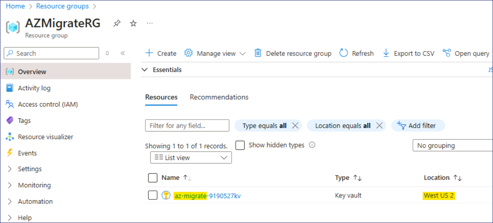

# ラボ1 - ラボ環境の準備

**実習1：ラボ環境の準備**

**タスク 0 - Azure サブスクリプションのセットアップ**

1.  ラ ボ イ ン イ ン タ ーフ ェ イ ス の **Resources** タ ブで提供 さ
    れ る 証明書を使用 し て、 提供 さ れ る VM に ロ グ イ ン し ます。

    

2.  エッジ・ブラウザを開き、```http://www.microsoftazurepass.com``` に移動する。

3.  **Start** ボタンをクリックして開始します。

    

    <font color=Orangered>

    > **注意：Azure
    Passを交換するために、会社/職場アカウントを使ってログインしないでください。**

    </font>


4.  Lab インターフェイスの **Resources/Home** タブで提供される **Office
    365 テナント資格情報を**入力し、サインイン プロセスを完了する。

5.  サインインが完了したら、正しいメールアドレスが表示されていれば「**Confirm
    Microsoft Account**」をクリックします。

    

6.  ラボ インターフェイスの \[**Resources**\] タブの \[**Azure Promo
    Code**\] セクションで、\[Promo code box\]
    ボックスに**Promocode** を入力し、\[**Claim Promo Code**\]
    をクリックします。

    

7.  換金処理に数秒かかる場合があります。

    

8.  必須のプロフィール情報を入力し、チェックボックスを選択した後、"
    **Sign up** "をクリックしてください。

    

9.  MFA
    認証の登録と完了を求めるプロンプトが表示される場合がありますが、**Microsoft
    Authenticator アプリ**または**Phone method**で MFA
    登録を進めてください。

    

10. 認証が完了したら、「**Done」** ボタンをクリックします。

    

11. フィードバックのページで、フィードバックを入力し、**Submitを**クリックします。
        

12. 自動的にAzure
    Portalにリダイレクトされ、これでAzureサービスを利用する準備が整った。
        

13. **Azure Portal** ```https://portal.azure.com```
    の検索ボックスに```Subscriptions```と入力し、「**Subscriptions**」をクリックします。
        

14. サブスクリプションのリストから **Azure Pass -Sponsorship**
    を選択します。     

15. Azure Pass - Sponsorship ページで \[**Access control (IAM)**\]
    をクリックし、**\[+Add\]** ドロップダウンをクリックして \[**Add role
    assignment**\] を選択します。     

16. Add role assignment page ページで、**Privileged administrator
    roles** tab (**特権管理者の**ロール)タブの下で
    **Contributor** **を**選択し、**Nextへ** をクリックします。
        

17. **\[Members\]** タブで、「**＋Select members**」をクリックし、「**MOD
    Administrator**」を選択して **「Select」** ボタンをクリックします。
        

18. **Review + assign**ボタンをクリックする。     

19. on **Review + assign** ボタンをもう一度クリックする.

    

20. 以下の画像のような通知が届くはずです。

    

21. **Role assignments**
    タブをクリックして、前のステップで割り当てられたロールを表示します。Contributor
    ロールが割り当てられたユーザが表示されます。

    

**タスク1：VMが準備できていることを確認する。**

ゲストVMにインストールされたアプリケーションを検出するためには、ゲストVMにHyper-V
Integration Servicesがインストールされ、実行されている必要がある。

1.  デスクトップから**Microsoft
    Edgeを**開き、**RHEL-WEB-01:**```192.168.1.24```**の**IPアドレスにアクセスします.

    

2.  **RHEL-WEB-01** は、**RHEL-DB-01で** ホストされているデータベースを呼び出すように設定されたDrupalウェブサイトを提供しています。ウェブサイトのロードに成功すると、両方の
    VM が正しく機能していることが確認できる。

**タスク 2: Azure Migrate プロジェクトの作成**

1.  新しい Edge タブで Azure Portal ```https://portal.azure.com```
    に移動し、ラボのリソースで提供された認証情報を使用してサインインします。

2.  Azure Portal の **Search** ボックスで ```Azure Migrate```
    と入力し、**Azure Migrate を**選択して Azure Migrate
    ページに移動します。

3.  左のナビゲーションの「**Migration goals**」で、 「**Servers,
    databases and web apps**」を選択します。

    

4.  **Servers, databases and web apps**ブレードで、ページ中央の**Create
    projectを**選択します。

5.  **Create project**
    ブレードで、以下の設定を使用して新しいプロジェクトを作成します。

    - 表で指定されていない設定は、デフォルト値を使用する。

    - リソースグループ – **Create new** ```AZMigrateRG```をクリックします。

    - プロジェクト **-** ```az-migrate-XXXXXX``` \[XXXXXX はランダムな数字で置き換えてください。］

    - 地理 - **アメリカ**

6.  **Create**を選択する。

7.  次のタスクに進む前に、配備が完了するのを待ちます。

**タスク 3: Azure Migrateアプライアンスの展開と構成**

1.  **サーバー、データベース、および Web アプリ** ブレードの
    **\[Assessment Tools** \] セクションで、**\[Azure Migrate: Discovery
    and assessment**］の下で、**［Discover］を**選択し、［**Using
    appliance**］を選択します。　

    

2.  **Discover**ブレードの **［Are your Machines
    virtualized（マシンは仮想化されていますか）］** メニューで、**［Yes,
    with Hyper-V］を**選択します。

3.  **1.General product key」の**「**Name your
    appliance**」ボックスに「HV-XXXXXX」と入力し、「**Generate
    key**」を選択します。

    > **注** - キーの生成には最大2分かかることがあります。

4.  キーが生成されたら、**Project key** フィールドの**copy
    icon** **を**選択する。　

    

5.  **2. Download Azure Migrate applianceの下**で、**.zip file.
    500MBを**選択し、**Download button** をチェックします。

    <font color=Green>

    > **これにより、アプライアンスをWindows
    ServerマシンにインストールするPowerShellスクリプトがダウンロードされる。**

    > このラボでは、スクリプトはすでにE:ドライブにダウンロー3ドされ、実行済みです。このステップ飛ばし、作業を継続してください。。

    </font>

6.  **3. Set up the applianceのしたで**

7.  Edgeウィンドウを最小化し、デスクトップ上の**Azure Migrate Appliance
    Configuration Manager**ショートカットを選択します。

8.  **Azure Migrate Appliance Configuration Manager**
    ページがロードされたら、EULA
    に同意する必要がある場合があります。プロンプトが表示されたら、**[Accept**]
    を選択します。

9.  **Azure Migrate Appliance Configuration Manager**
    ページで、**Register Hyper-V appliance by pasting the key here**
    ボックスに、先ほどコピーしたキーを貼り付けます。

10. **Verifyを**選択する。

11. **Login** を選択します。**Continue with Azure
    Login**するよう求めるモーダルが表示されます。

12. **Copy code & Login** を選択し、デバイスコードを貼り付け、ユーザー名を選択しサインインします。

13. **「Are you trying to sign in to Microsoft Azure
    PowerShell?」という**プロンプトが表示されたら、「**Continue**」を選択し、新しく開いたブラウザ・タブを閉じます。

14. **Azure Migrate Appliance Configuration Manager**
    ページで、登録が完了するまで待ちます。

    


    <font color=Green>

    > **登録完了まで10分ほどかかる場合があります。**

    </font>

15. **Provide Hyper-V host credentials** セクションで、**Add credentials
    を**選択し、以下の設定で認証情報を追加します：

    - Friendly Name - ```Hypervisor```

    - ユーザー名 - ```Administrator```

    - パスワード - ```Passw0rd! ```

16. **Provide Hyper-V host/cluster details**セクションで、**add a
    discovery sourceを**選択し、**Add single
    itemを**選択して以下の設定を使用します：

    - 検出ソース - **Hyper-V Host/Cluster**

    - IPアドレス FQDN - ```win-msite54sfl9```

    - マップ認証 - **Hypervisor**

17. **Provide server credentials to perform software
    inventory**セクションで、スライダーが**有効になって**いることを確認し、以下の設定で認証情報を追加します：

    - クレデンシャルタイプ - **Linux（Non-domain）**

    - Friendly Name - ```RHELUser```

    - ユーザー名 - ```fetch6474```

    - パスワード - ```RHELWorkshop```

18. **Start discoveryを**選択する。

19. 次の練習のためにエッジをオープンにしておきます。ディスカバリーは処理を続行する。

**演習2：Microsoft Defender for Cloudを有効にする**

**タスク 1：Microsoft Defender for Cloudを有効にする**

1.  Azure Portal で、Portal メニューをクリックするか、ホームページから
    Microsoft Defender for Cloud を選択します。

    

2.  お知らせについて - **You may be viewing limited information. To
    gettenant-wide visibility, click here
    --\>** をクリックしてください。

    

3.  **Get permissions**ページで、**Security Adminを**選択し、**Get
    access**ボタンをクリックする。

    

4.  以下の画像のような通知が届くはずです。

    

    

5.  ブラウザを更新し、**Microsoft Defender for
    Cloud**ページの**General**セクションで、**Getting
    startedを**クリックします。**Upgrade** タブで\[Upgrade\]ボタンをクリックします。

    <font color=Orangered>

    > **注意**：アップグレードが完了するまで、数分間待つ必要があるかもしれません。

    </font>

    


**タスク2：Defender for Cloudの追加データ収集設定を有効にする**

1.  **Microsoft Defender for
    Cloud**ページで、**管理**セクションに移動し、**Environment
    settingsを**クリック**します。**

    

2.  下にスクロールし、**Tenant Root Group を**展開し、表示されている
    **Azure Pass - Sponsorship** Subscription をクリックします。

    

3.	**Defender Coverage** は11/12plansとなっています。

4.  **Settings | Defender plans** ページで、\[**Enable all
    plans\]**をクリック**します。**

    

5.  **「Microsoft Defender for APIs Plan
    1」** を選択し、**「Save」** ボタンをクリックします。

    

6.  **Save**ボタンをクリックします。

    

7.  下の画像のような通知が届くはずです。

    

**エクササイズ3：ビジネスケースの作成とアセスメントの実施**

**タスク 1：ビジネスケースの作成とレビュー**

1.  Azure Portal で、**Azure Migrate Servers, databases and web apps**
    ページに戻る。**Refresh**
    を選択して、サーバーが検出されたことを確認します。

    

2.  **Azure Migrate：Discovery and assessment**セクションで、**Build
    business caseを**選択します。

    

3.  **Build business
    case** ブレードでは、以下の値を使用してビジネス・ケースを作成します。

    - Business case name - ```bc-43240741```

    - Target location - **eastus**

    - Migration strategy - **Azure recommended approach to minimize cost**

    - Savings options - **Reserved Instance + Azure Savings Plan**

    - Discount (%) on Pay as you go - **0**

    - Select **Build business case**.

    

    > ビジネス・ケースの生成には最大5分かかります。5分以上経過した場合は、「**Referesh**」を選択してください。

4.  **bc-43240741**ページで、Azure
    readinessを示す情報と、コンピュートとストレージの両方の月額コストの見積もりを確認します。

**タスク 2: 評価を構成、実行、表示する**

1.  新しいタブで**Resource groups** page
    ```https://portal.azure.com/#view/HubsExtension/BrowseResourceGroups.ReactView```を開き、**AzMigrateRG**リソースグループを選択し、下図の通り、米国西部で、**Key
    Vaultの**場所をメモする。     
    
    

    > **注** -
    > この場所は、ラボの後半で作成する他のリソースにも指定する必要があります。また、**Azure
    > リソースが同じリージョンに作成されていることを**確認し、Migrate
    > がスムーズに行われるようにします。

2.  **Azure Migrate** ページに戻り、**Azure Migrate：Discovery and
    assessment**セクションで**Assessを**選択し、ドロップダウンメニューで**Azure
    VMを**選択します。

    

3.  **Create
    assessment** ページでは、ドロップダウンメニューはデフォルトのままにしておきます。　

4.  **Assessment settingsの**横にある**Edit**リンクを選択します。

    

5.  評価の設定ページで、以下の設定を使用して評価を作成します。

    <font color=Green>

    > **表で指定されていないものは、デフォルト設定を受け入れる。**
    
    </font>

    - Target location - **West US 2**

    - Storage type - **Premium managed disks**

    - Savings options - **None**

    - Sizing criteria - **As on premises**

    - VM series - **Dsv3_series**

    - Comfort factor - **1**

    - Offer - **Pay-As-You-Go**

    - Currency - **US Dollar ($)**

    - Discount - **0**

    - VM uptime - **31 Day(s) per month and 24 Hour(s) per day**

    - Already have a Windows Server license? - **No**

    - Security - **No**

6.  **Save** を選択して \[Create Assessment\] に戻り、**\[Next: Select
    servers to assess \>を選択します。**

7.  以下の設定を使用して、サーバーグループを作成し、評価対象のサーバーを選択します。

    Assessment name - ```as-43240741```

    Select or create a group - **Create new**

    Group name - ```RHEL-Servers```

    List of machines to be added to the group - **RHEL-DB-01** and **RHEL-WEB-01**

8.  **Create assessment** を選択します。**Azure Migrate | Servers,
    databases and web apps** のページにリダイレクトされます。

9.  ページを**更新する**。

10. **Azure Migrate：Discovery and Assessment\]**
    セクションで、\[**Assessments Total**\] が **1**
    であることを確認し、\[**1\] を**選択します。
    
     

11. **Azure Migrate：Discovery and Assessment | Assessments\]**
    ページで、新しく作成したアセスメント **as-43240741** を選択します。

    

12. **as-43240741の**ページで、Azureの準備状況を示す情報と、コンピュートとストレージの両方の月額コストの見積もりを確認する。

**実際のシナリオでは、Dependency Agent
のインストールを検討して、評価段階でサーバーの依存関係をより詳しく把握できるようにする必要があります。**
