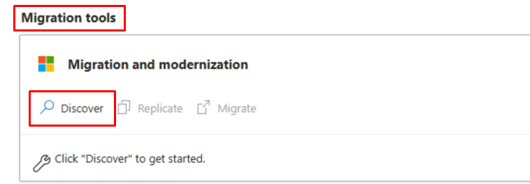
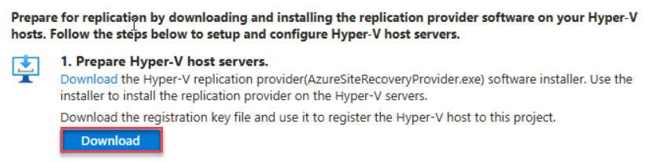
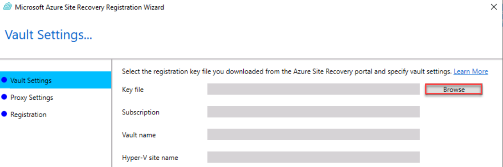
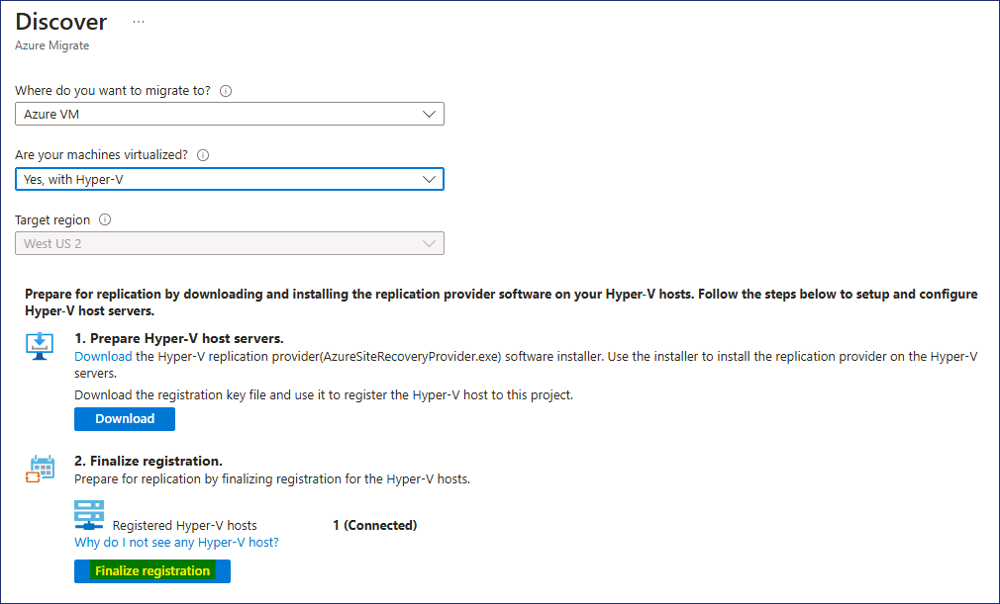
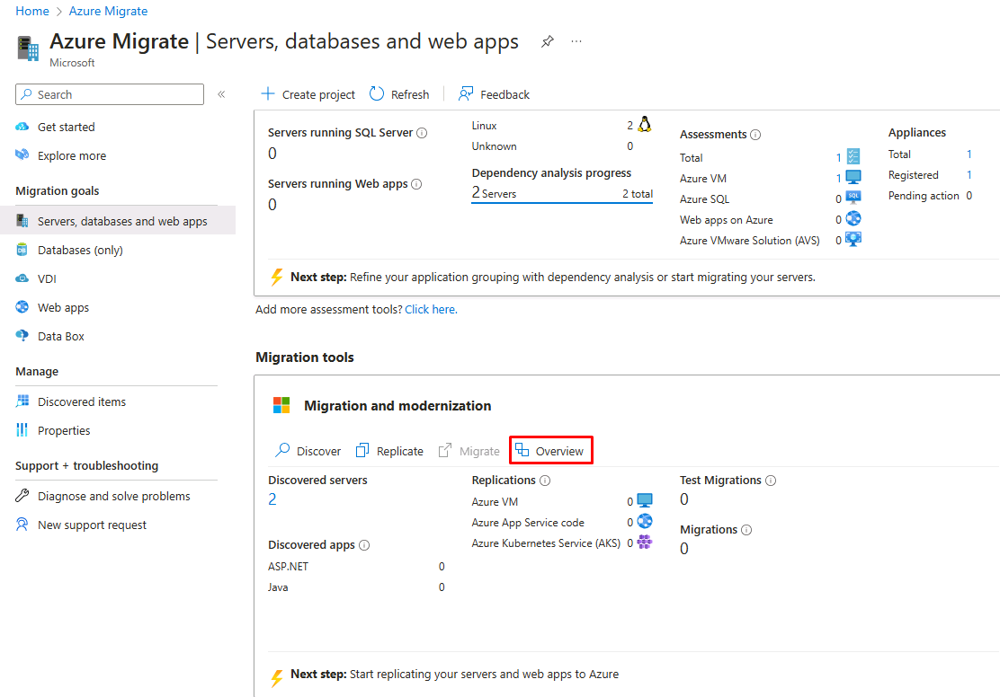
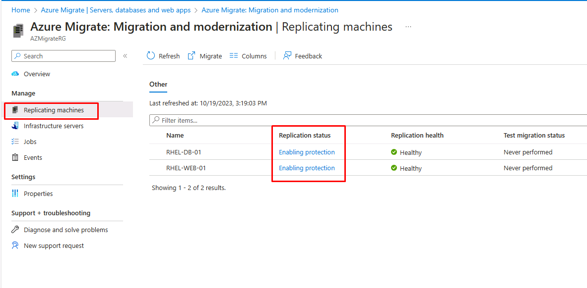
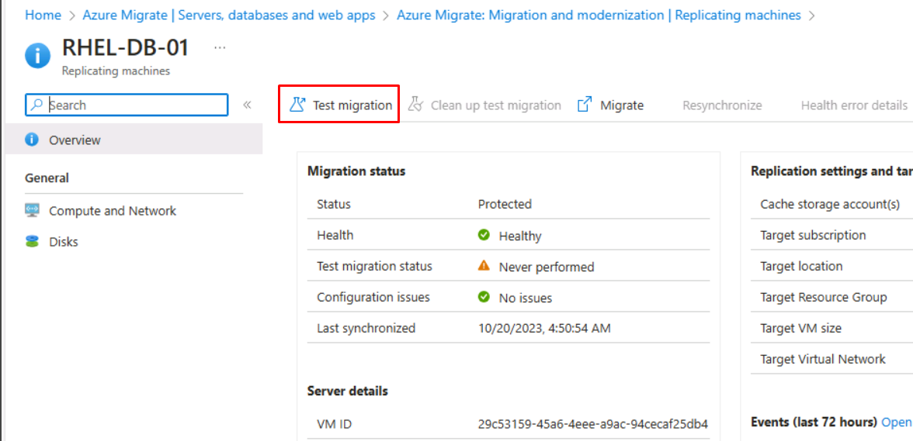
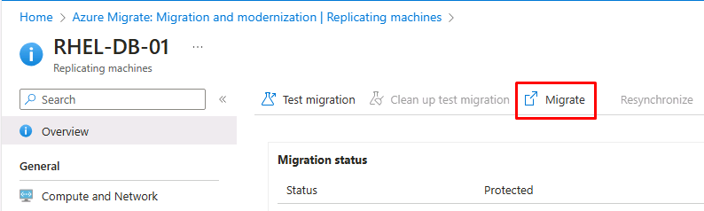

# Lab 2 - Migrieren von Linux-VMs auf Azure mit Azure Migrate

## Zielsetzung

In diesem Lab werden wir die Linux-VM-Workloads von unserem
On-Premise-System mithilfe des Azure Migrate - Server Migration Tools
migrieren. Wir werden die erforderlichen Azure-Ressourcen vorbereiten
und die VMs vor der Migration replizieren.

## Übung 1: Migrieren von Workloads

### Aufgabe 1: Vorbereiten der Migration von Hyper-V VMs

1.  Navigieren Sie auf der Blade **Servers, databases and web apps** zum
    Abschnitt **Migration Tools** und wählen Sie unter **Migration and
    modernization** die Option **Discover**.

    

1.  Wählen Sie auf der **Discover**-Blade im Dropdown-Menü **Where do
    you want to migrate to?** **Hyper-V**, die Option **Azure VM** und
    **im Menü Are your Machines virtualized?** die Option **Yes, with
    Hyper-V.**

2.  Wählen Sie im Menü **Target region** die Option **West US 2**.

     

    > **Hinweis** - Vergewissern Sie sich, dass die Zielregion mit dem
    Standort / der Region übereinstimmt, der/die zuvor in Labor 1 für die
    Ressourcengruppe **AZMigrateRG** angegeben wurde.

3.  Aktivieren Sie das Kontrollkästchen **Confirm that the target region
    for migration is eastus**, und wählen Sie dann **Create resources**.

4.  Warten Sie, bis die Ressourcen " Migrate Project " und "Vault" die
    Bereitstellung abgeschlossen haben.

5.  Wählen Sie im **Discover**-Blade unter **Prepare Hyper-V host
    servers** das Wort **Download** aus, *nicht die Schaltfläche*
    **Download** *dahinter.*

     

    > Das Installationsprogramm, das den Replikationsanbieter auf dem
    Hyper-V-Server installiert, wird heruntergeladen.

6.  Wählen Sie auf dem **Discover**-Blade unter **1. Prepare Hyper-V
    host servers** die Schaltfläche **Download**  an.

     

    > Der Registrierungsschlüssel, der für die Registrierung des
    Hyper-V-Hosts mit dem Projekt verwendet wird, wird heruntergeladen.

7.  Gehen Sie in den Ordner **Downloads** und wählen Sie die Datei
    **AzureSiteRecoveryProvider**, um das Installationsprogramm zu
    starten.

8.  Wählen Sie im Fenster Azure Site Recovery Provider-setup
    (Hyper-V-Server) auf der Registerkarte **Microsoft Update** die
    Option **On (reco/ mmended)**, und dann **Next**.

9.  Akzeptieren Sie auf der Registerkarte **Installation** den
    Standard-Installationsort und wählen Sie dann **Install**.

10. Sobald die Installation abgeschlossen ist, wählen Sie **Register**.

    > Wenn Sie eine Meldung erhalten, dass der Server bereits registriert
    ist, wählen Sie **Reregister**.

11. Wählen Sie im Microsoft Azure Site Recovery-Wizard auf der
    Registerkarte **Vault Settings**  rechts neben dem Feld **Key file**
    die Option **Browse**.

    

12. Gehen Sie zum Ordner "**Downloads"**, wählen Sie die Datei
    "**az-migrate-project"** und wählen Sie dann **"Open"**.

    

    >  Die Key file, Subscription, Vault name, and Hyper-V site name values
    werden beim Key file ausgefüllt.

13. Wählen Sie **Next**.

14. Akzeptieren Sie auf der Registerkarte **Proxy Settings** die
    Standardeinstellung und wählen Sie dann **Next**.

    >  Die Registrierung kann bis zu 5 Minuten in Anspruch nehmen.

15. Wenn die Registrierung abgeschlossen ist, wählen Sie **Finish**.

16. Zurück im Browser, wählen Sie auf der Registerkarte **Discover**
    unter **2. Finalize registration** das Wort **Finalize
    registration** aus.

     

    > Möglicherweise müssen Sie **refresh the page**  machen und die
    Optionen vom Anfang dieser Aufgabe erneut auswählen, um die
    Schaltfläche Finalize registration zu aktivieren.

17. Sobald die Registrierung abgeschlossen ist, wird die folgende
    Meldung angezeigt.

     

> Es kann bis zu 15 Minuten dauern, bis die Erkennung virtueller
 Maschinen abgeschlossen ist, und Sie müssen möglicherweise die Seite
 aktualisieren, um die Meldung zu sehen. Fahren Sie mit der nächsten
 Aufgabe fort, auch wenn diese noch nicht abgeschlossen ist.

### Aufgabe 2: Azure- resources einrichten

Nachdem Sie nun ein Azure Migrate- project erstellt haben, müssen Sie
die Azure-Zielumgebung implementieren.

**Ein virtuelles Netzwerk erstellen**

1.  Geben Sie im Azure-Portal in das Suchfeld Virtual Networks ein und
    wählen Sie dann **Virtual networks**.

2.  Wählen Sie auf der Schaufel **Virtual networks**  die Option
    **Create**.

3.  Verwenden Sie die folgenden Einstellungen, um ein virtuelles
    Netzwerk zu erstellen.

    - Resource group- **AZMigrateRG**

    - Virtual network name - `migration-vnet-XXXXXX`  \[ersetzen
      Sie XXXXXX durch eine beliebige Zahl\]

    - Region **West US 2**

    > **Hinweis** - Stellen Sie sicher, dass die Region mit dem Standort /
    der Region übereinstimmt, der/die zuvor in Lab 1 für die
    **AZMigrateRG** resource group angegeben wurde.

**Ein Speicherkonto erstellen**

1.  Geben Sie im Azure-Portal in das **Search** feld Storage ein und
    wählen Sie dann **Storage Accounts**.

2.  Wählen Sie im Blade **Storage accounts** die Option **Create**.

3.  Verwenden Sie die folgenden Einstellungen, um ein storage account zu
    erstellen. Belassen Sie alle anderen Einstellungen auf ihren
    Standardwerten.

    - Resource group - AZMigrateRG

    - Storage account name - `saXXXXXX`  \[ersetzen Sie XXXXXX durch
      eine beliebige Zahl\]

    - Region - **West US 2**

    > **Hinweis** - Stellen Sie sicher, dass die Region mit dem Standort /
    der Region übereinstimmt, der/die zuvor in Lab 1 für die
    **AZMigrateRG** resource group angegeben wurde.

    - Performance - **Standard**

    - Redundancy - **Locally-redundant storage (LRS)**

4.  Legen Sie auf der Registerkarte **Networking** der Seite **Create a
    storage account**  die folgenden Einstellungen fest und belassen Sie
    alle anderen Einstellungen auf ihren Standardwerten:

    - Network Access - **Enable public access from selected virtual
    networks and IP addresses**

    - Virtual network - `migration-vnet-XXXXXX`

    - Subnets - **default (10.0.0.0/24)**

    

5.  Deaktivieren Sie auf der Registerkarte **Data protection** das
    Kontrollkästchen **Enable soft delete for blobs**. Belassen Sie alle
    anderen Einstellungen auf ihren Standardwerten.

6.  Wählen Sie **Review** und dann **Create**.

7.  Sobald das storage account erstellt ist, klicken Sie auf **Go to
    Resource**

8.  Erweitern Sie die Data management und wählen Sie **Data
    protection**, deaktivieren Sie dann das Kontrollkästchen **Enable
    soft delete for blobs** und klicken Sie auf die Schaltfläche
    **Save**.

     

**Erstellen einer Public IP address**

1.  Geben Sie im Azure-Portal in das **Search** feld Public IP ein und
    wählen Sie dann **Public IP addresses.**

2.  Wählen Sie im Bereich **Public IP address**  die Option **Create**.

3.  Verwenden Sie die folgenden Einstellungen, um eine public IP zu
    erstellen.

    - Resource group - **AZMigrateRG**

    - Region - **West US 2**

    > **Hinweis** - Stellen Sie sicher, dass die Region mit dem Standort /
    der Region übereinstimmt, der/die zuvor in Lab 1 für die
    **AZMigrateRG** resource group angegeben wurde.

    - Name - `ipXXXXXX` \[ersetzen Sie XXXXXX durch eine beliebige
    Zahl\]

    - IP-Version - **IPv4**

    - SKU - **Basic**

    - IP address assignment - **Static**

    - Idle timeout (minutes) - **4**

    - DNS name label - `rhel-web-XXXXXX`  \[ersetzen Sie XXXXXX durch
    eine beliebige Zahl\]

4.  Wählen Sie **Review + create**, dann **create**

### Aufgabe 3: Konfigurieren der Replikation von Hyper-V VMs

1.  Öffnen Sie im Edge-Browser eine neue Registerkarte und navigieren
    Sie zu der
    URL-`https://portal.azure.com/?feature.customportal=false&feature.canmodifystamps=true&microsoft_azure_migrate=migratecanary#view/Microsoft_Azure_Migrate/AmhResourceMenuBlade/~/getStarted`.

2.  Klicken Sie auf die Schaltfläche **Discover, assess and migrate**.

    

3.  Wählen Sie im Abschnitt **Migration and modernization** die Option
    **Replicate**.

    

4.  Möglicherweise müssen Sie die Browserseite, die die Seite **Azure
    Migrate Servers, databases and web apps** anzeigt, aktualisieren.

5.  Wählen Sie auf der Seite **Specify intent** unter **What do you want
    to migrate?** die Option **Servers or virtual machines (VM)** und
    unter **Where do you want to migrate to?** die Option **Azure VM**

6.  Wählen Sie in der Dropdown-Liste **Are your machines
    virtualized?** die Option **Yes, with Hyper-V** und klicken Sie dann
    auf die Schaltfläche **Next**.

7.  Verwenden Sie auf der Registerkarte **Virtual machines** auf der
    Seite Replicate die folgenden Einstellungen, um die
    Replikationskriterien zu vervollständigen.

    - Import migration settings from an Azure Migrate assessment -
      **Yes, apply migration settings from an Azure Migrate assessment**

    - Select group - **RHEL-Servers**

    - Select assessment - **as-43240741**

    - Virtual machines **RHEL-DB-01** und **RHEL-WEB-01**

8.  Verwenden Sie auf der Registerkarte **Target settings** der Seite
    Replicate die folgenden Einstellungen, um die Zieldetails anzugeben.

    - Resource group - **AZMigrateRG**

    - Cache storage account - **saXXXXXX**

    - Virtual Network - **migration-vnet-XXXXXX**

    - Subnet - **Default**

9.  Verwenden Sie auf der Registerkarte "**Compute"** der Seite
    "Replicate" die folgenden Einstellungen für beide VMs:

    - Azure VM Size - **Standard_D2s_v3**

    - OS Type - **Linux**

10. Belassen Sie die Einstellungen auf den übrigen Registerkarten auf
    ihren Standardwerten und wählen Sie **Replicate**.

11. Kehren Sie zur Seite **Azure Migrate Servers, databases and web
    apps** zurück, wählen Sie **Refresh** und dann im Abschnitt
    **Migration and modernization** die Option **Overview.**

    

12. Untersuchen Sie auf der Seite Migration and modernization im
    Abschnitt **Replications** die Spalte **Status** in der Liste der
    replizierenden Rechner.

    

    > Warten Sie, bis der Status in "**Protected**" geändert wird. Dies kann
    weitere 15 Minuten dauern.

Sie müssen die **Migration and modernization Replicating
machines** aktualisieren, um die Statusinformationen zu aktualisieren.

### Aufgabe 4: Testmigrationen durchführen

1.  Wählen Sie im Azure-Portal auf der Seite **Migration and
    modernization | Replications** die virtuelle Maschine **RHEL-DB-01**
    aus.

    

2.  Wählen Sie auf der Seite **RHEL-DB-01** die Option **Test
    migration**.

    

3.  Wählen Sie das virtuelle Netzwerk **migration-vnet-XXXXXX**  und
    anschließend die Option **Test migration**.

4.  Gehen Sie zurück zur Seite **Migration and modernization Replicating
    machines** und wählen Sie dann die virtuelle Maschine
    **RHEL-WEB-01** aus.

5.  Starten Sie auf der Seite **RHEL-WEB-01** eine **Test migration**
    unter Verwendung des virtuellen Netzwerks **migration-vnet-XXXXXX**.

6.  Gehen Sie zurück zur Seite **Migration and modernization Replicating
    machines**. Der **Replication status** sollte **Initiating test
    failover** lauten

    

    > Warten Sie, bis der **Test failover**  abgeschlossen ist. Dies kann etwa
    5-7 Minuten dauern.

7.  Gehen Sie zurück zur Seite **Migration and modernization
    Replications**, wählen Sie **Refresh** und überprüfen Sie, ob die
    beiden virtuellen Maschinen mit dem Status **Cleanup test failover
    pending** aufgeführt sind.

**Test migrations validieren**

8.  Geben Sie im Azure-Portal in das **Search** feld Virtual machines
    ein und wählen Sie dann **Virtual machines**.

9.  Beachten Sie die Einträge für die neu replizierten virtuellen
    Maschinen.

    > Hinweis - Zu Beginn haben die virtuellen Maschinen Namen, die aus einem
    Präfix **asr-temp** und einem zufällig generierten Suffix bestehen,
    werden aber automatisch in **RHEL-DB-01-test** und **RHEL-WEB-01-test**
    umbenannt.

10. Wählen Sie auf der Seite **Virtual machines** die VM
    **RHEL-WEB-01-test** aus.

    

11. Wählen Sie auf der Seite **RHEL-WEB-01-test** unter **Settings** die
    Option **Networking**.

12. Wählen Sie auf dem **Networking**  -Blade die Netzwerkschnittstelle
    **nic-RHEL-WEB-01-00-test**

    

13. Auf der Seite **nic-RHEL-WEB-01-00-test** wählen Sie unter
    **Settings** die Option **IP-Konfigurationen**.

14. Wählen Sie **nic-RHEL-WEB-01-00-test-ipConfig**, um die
    IP-Konfiguration zu bearbeiten.

    

15. Aktivieren Sie im Blade " **Edit IP configuration**  **"** das
    Kontrollkästchen " **Associate public IP address "** und wählen Sie
    dann **ip43240741** als **Public IP address**.

16. Wählen Sie **Save** und warten Sie, bis die Zuordnung abgeschlossen
    ist.

17. Öffnen Sie eine neue Edge-Registerkarte und gehen Sie zu dem **DNS-
    name**, den Sie der öffentlichen IP zugewiesen haben:

    `rhel-web-XXXXXX.westus2.cloudapp.azure.com`

18. Überprüfen Sie, ob die auf RHEL-WEB-01-test gehostete Drupal-Website
    geladen wird.

19. Wenn die Website nicht geöffnet wird, erstellen Sie in den
    **Networking settings**  der virtuellen Maschine eine **Network
    Security Group** und aktivieren Sie **Port 80**, wie in der
    folgenden Abbildung gezeigt.

    

    

**Bereinigung von test migrations**

19. Gehen Sie zurück zur Seite **Migration and modernization |
    Replications** und wählen Sie **RHEL-DB-01**.

20. Wählen Sie die Aktion **Clean up test migration**.

    

21. Lassen Sie das Feld **Notes** leer und markieren Sie das
    Kontrollkästchen für **Testing is complete. Delete test virtual
    machine** und wählen Sie dann **Cleanup Test**

22. Gehen Sie zurück zur Seite **Migration and modernization |
    Replications** und wählen Sie **RHEL-WEB-01**.

23. Wählen Sie die Aktion **Clean up test migration** mit der Angabe
    **Testing is complete. Delete test virtual machine**.

24. Zurück zur Seite **Migration and modernization | Replications**.

25. Warten Sie, bis der **Replication status** **Protected** lautet,
    bevor Sie fortfahren.

Möglicherweise müssen Sie nach ein oder zwei Minuten auf **Refresh** 
klicken, um diese Aktualisierung zu sehen.

### Aufgabe 5: Migrations durchführen

1.  Wählen Sie **RHEL-DB-01** und lösen Sie die Aktion **Migrate**  aus.

    

2.  Vergewissern Sie sich auf der Seite **Migrate**, dass die Option
    **Shutdown machines before migration to minimize data loss?** auf
    **Yes** gesetzt ist, und wählen Sie **Migrate**.

3.  Gehen Sie zurück zur Seite **Migration and modernization |
    Replications** und wählen Sie **RHEL-WEB-01**.

4.  Wählen Sie **Migrate** und starten Sie die Migration, indem Sie auf
    der Seite **Migrate** erneut **yes** angeben.

5.  Gehen Sie zurück zur Seite **Migration and modernization |
    Replications** und wählen Sie **Refresh**, um den Status der
    Migration zu überwachen.

    

6.  Lassen Sie Edge für die nächste Übung offen. Die Migrationen werden
    weiterhin verarbeitet.

## Übung 2: Aufgaben nach der Migration

### Aufgabe 1: Abschluss der Aufgaben nach der Migration

In dieser Übung weisen Sie die public IP, die Sie zuvor erstellt haben,
der neu migrierten RHEL-WEB-01-VM zu.

1.  Überprüfen Sie auf der Seite **Migration and modernization |
    Replications**, ob in der Spalte **Status** für beide virtuelle
    Maschinen **Planned failover finished** angezeigt wird.

    > Möglicherweise müssen Sie **Refresh** wählen, um diese Aktualisierung zu
    sehen.

2.  Geben Sie im Azure-Portal in das **Search** feld Virtual machines
    ein und wählen Sie dann **Virtual machines.**

3.  Wählen Sie auf der Seite **Virtual machines** die VM **RHEL-WEB-01**
    aus.

4.  Wählen Sie auf der Seite **RHEL-WEB-01** unter **Settings** die
    Option **Networking**.

5.  Wählen Sie auf dem **Networking** -Blade die Netzwerkschnittstelle
    **nic-RHEL-WEB-01-00**

    

6.  Auf der Seite **nic-RHEL-WEB-01-00** wählen Sie unter
    **Settings** die Option **IP-configurations**.

7.  Wählen Sie **nic-RHEL-WEB-01-00-ipConfig**, um die IP-Konfiguration
    zu bearbeiten.

    

8.  Aktivieren Sie im Blade " **Edit IP configuration** **"** das
    Kontrollkästchen " **Associate public IP address "** und wählen Sie
    dann **ip43240741** als **Public IP address**.

9.  Wählen Sie **Save** und warten Sie, bis die Zuordnung abgeschlossen
    ist.

10. Öffnen Sie eine neue Edge-Registerkarte und gehen Sie zu dem
    **DNS-Name**, den Sie der public IP zugewiesen haben:

    `rhel-web-XXXXXX.westus2.cloudapp.azure.com`

11. Wenn die Website nicht geöffnet werden kann, erstellen Sie in den
    **Networking settings**  der virtuellen Maschine eine **Network
    Security Group** und aktivieren Sie **Port 80**

12. Überprüfen Sie, ob die auf RHEL-WEB-01 gehostete Drupal-Website
    geladen wird.

13. Öffnen Sie den **Hyper-V Manager** und stellen Sie fest, dass beide
    VMs **Off** sind. Diese Maschinen sind erfolgreich migriert worden.

    
