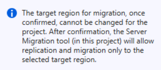
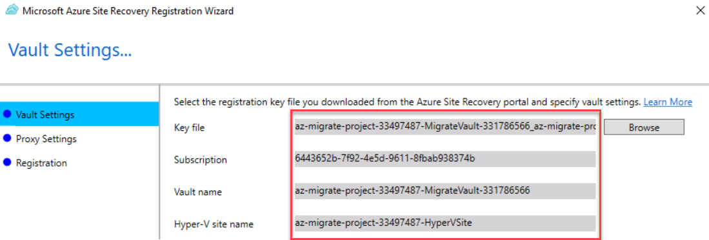
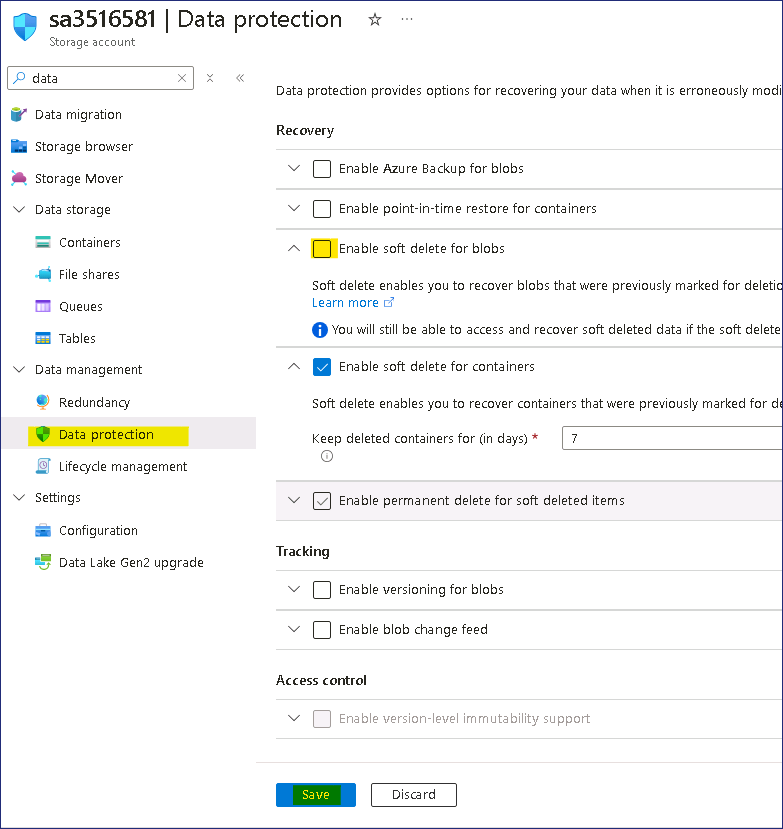
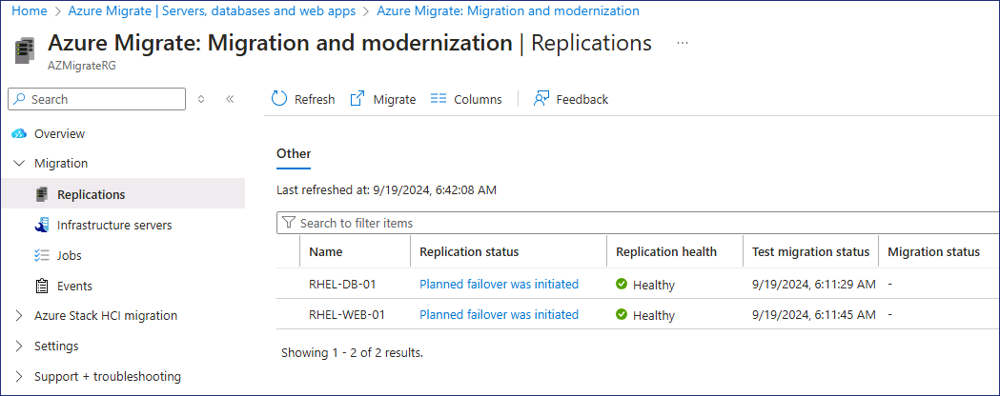

# 실습 2 - Azure Migrate를 사용한 Linux VM의 Azure로 마이그레이션

**목표**

이 실습에서는 Azure Migrate – Server Migration도구를 사용하여
온프레미스에서 Linux VM 워크로드를 마이그레이션합니다. 마이그레이션하기
전에 필요한 Azure 리소스를 준비하고, 그 후 VM을 복제합니다.

**연습 1: 워크로드 마이그레이션**

**작업 1: Hyper-V VM 마이그레이션 준비**

1.  **Servers, databases and web apps** 블레이드에서 페이지를
    **Migration Tools** 섹션으로 이동하여 **Migration and
    modernization** 항목 아래에서 **Discover**를 선택하세요.

    

2.  **Discover** 블레이드의 **Where do you want to migrate
    to?** 드롭다운 메뉴에서 **Azure VM** 옵션을 선택하고, **Are your
    Machines virtualized?** 메뉴에서 **Yes, with Hyper-V**를 선택하세요.

3.  **Target region**메뉴에서 **West US 2**를 선택하세요.

    
    >
    > **참고** – Target region이 실습 1에서 **AZMigrateRG** 리소스 그룹에
    > 기록한 Location/region과 **동일**한지 확인하세요.

4.  **Confirm that the target region for migration is eastus**  체크박를
    클릭한 다음, **Create resources**를 선택하세요.

5.  마이그레이션 프로젝트 및 Vault 리소스 배포가 완료될 때까지 대기해
    주세요.

6.  **Discover** 블레이드의 **Prepare Hyper-V host servers**에서
    ***Download**버튼이 아닌* **Download** 라는 단어를 선택하세요.

    
    >
    > Hyper-V 서버에 복제 제공자를 설치할 설치 프로그램이 다운로드됩니다.

7.  **Discover** 블레이드의 **1. Prepare Hyper-V host servers**를
    준비하고 **Download**버튼을 선택하세요.

    
    >
    > 프로젝트에 Hyper-V 호스트를 등록하는 데 사용할 등록 키가
    > 다운로드됩니다.

8.  **Downloads** 폴더로 이동한 다음, **AzureSiteRecoveryProvider**
    파일을 선택하여 설치 프로그램을 실행하세요.

9.  Azure Site Recovery Provider설정(Hyper-V 서버) 창의 **Microsoft
    Update** 탭에서 **On(Recommended)** 를 선택한 후 **Next** 를
    선택하세요.

10. **Installation** 탭에서 기본 설치 위치를 수락한 후, **install**을
    선택하세요.

11. 설치가 완료되면 **Register**를 선택하세요.

    > 서버가 이미 등록되었다는 메시지가 표시되면 **reregister**를
    > 선택하세요.

12. Microsoft Azure Site Recovery 마법사의 **Vault Settings**탭에서
    **Key file** 상자 오른쪽에 있는 **Browse**를 선택하세요.

    

13. **Downloads** 폴더로 이동하여 **az-migrate-project** 파일을 선택한
    다음, **Open**을 선택하세요.

    
    >
    > Key 파일이 추가되면 Key file, Subscription, Vault name, 및 Hyper-V
    > site 이름 값이 자동으로 채워집니다.

14. **Next**를 선택하세요.

15. **Proxy Settings** 탭에서 기본 설정을 수락한 후, **Next**를
    선택하세요.

    > 등록 완료까지 최대 5분이 소요됩니다.

16. 등록이 완료되면 **Finish**을 선택하세요.

17. 브라우저로 돌아가서 **Discover**블레이드의 **2. Finalize
    registration**에서 **Finalize registration**라는 단어를 선택하세요.

    
    >
    > **refresh the page**를 클릭하고 이 작업의 시작 부분에서 옵션을 다시
    > 선택해야 Finalize registration버튼이 활성화될 수 있습니다.

18. 등록이 완료되면 다음 메시지가 표시됩니다.

    
    >
    > 가상 머신의 discovery가 완료되는 데 최대 15분이 소요될 수 있으며,
    > 메시지를 확인하기 우해 페이지를 새로 고쳐야 할 수 있습니다. 작업이
    > 완료되지 않더라도 다음 작업을 진행해 주세요.

**작업 2: Azure 리소스 설정**

이제 Azure Migrate 프로젝트를 생성했으므로, target Azure 환경을
구현해야 합니다.

**가상 네트워크 만들기**

1.  Azure Portal의 **Search** 상자에서 가상 네트워크를 입력한 다음
    **Virtual networks**를 선택하세요.

2.  **Virtual networks**블레이드에서 **Create**를 선택하세요.

3.  다음 설정을 사용하여 가상 네트워크를 만드세요.

    - Resource group - **AZMigrateRG**

    - Virtual network name - ```migration-vnet-XXXXXX```  \[XXXXXX를
      임의의 숫자로 대체\]

    - Region **West US 2**

    > **참고** - 지역이 실습 1에서 **AZMigrateRG** 리소스 그룹에 기록한 Location/Region과 **동일한지** 확인하세요.


**Storage 계정 만들기**

1.  Azure Portal의 **Search** 상자에서 Storage를 입력한 다음, **Storage
    accounts**를 선택하세요.

2.  **Storage accounts** 블레이드에서 **Create**를 선택하세요.

3.  다음 설정을 사용하여 Storage 계정을 만드세요. 나머지 설정은
    기본값으로 유지하세요.

    - Resource group - AZMigrateRG

    - Storage account name - ```saXXXXXX``` \[XXXXXX를 임의의 숫자로
      대체\]

    - Region - **West US 2**

    > **참고** - 지역이 실습 1에서 **AZMigrateRG** 리소스 그룹에 기록한 Location/Region과 **동일한지** 확인하세요.


    - Performance - **Standard**

    - Redundancy - **Locally-redundant storage (LRS)**

4.  **Create a storage account** 페이지의 **Networking** 탭에서 다음
    설정을 지정하고, 나머지 설정은 기본값으로 유지하세요:

    - Network Access - **Enable public access from selected virtual
      networks and IP addresses**

    - Virtual network - ```migration-vnet-XXXXXX```

    - Subnets - **default (10.0.0.0/24)**

    

5.  **Data protection** 탭에서 **Enable soft delete for blobs**을 선택
    취소해 주세요. 나머지 설정은 기본값으로 유지하세요.

6.  **Review**를 선택한 다음, **Create**을 선택하세요.

7.  Storage계정이 생성되면 **Go to Resource**을 클릭하세요.

8.  데이터 관리를 확장하고 **Data protection**을 선택한 다음, **Enable
    soft delete for blobs**를 선택 취소하고, **Save** 버튼을 클릭하세요.

    

**공인 IP 주소 만들기**

1.  Azure Portal의 **Search**상자에 Public IP를 입력한 다음, **Public IP
    addresses**를 선택하세요.

2.  **Public IP address**블레이드에서 **Create**을 선택하세요.

3.  다음 설정을 사용하여 공인 IP를 생성하세요.

    - Resource group - **AZMigrateRG**

    - Region - **West US 2**

    > **참고** - 지역이 실습 1에서 **AZMigrateRG** 리소스 그룹에 기록한 Location/Region과 **동일한지** 확인하세요.

    - Name - ```ipXXXXXX``` \[XXXXXX를 임의의 숫자로 대체\]

    - IP Version - **IPv4**

    - SKU - **Basic**

    - IP address assignment - **Static**

    - Idle timeout (minutes) - **4**

    - DNS name label - ```rhel-web-XXXXXX``` \[XXXXXX를 임의의 숫자로 대체\]

4.  **Review + create**을 선택한 다음, **create** 진행하세요.

**작업 3: Hyper-V VM의 복제 구성**

1.  Edge 브라우저에서 새 탭을 열고
    URL(```https://portal.azure.com/?feature.customportal=false&feature.canmodifystamps=true&microsoft_azure_migrate=migratecanary#view/Microsoft_Azure_Migrate/AmhResourceMenuBlade/~/getStarted```)로
    이동하세요.

2.  **Discover, assess and migrate** 버튼을 클릭하세요.

    

3.  **Migration and modernization** 섹션에서 **Replicate**를 선택하세요.

    

4.  **Azure Migrate Servers, databases and web apps** 페이지를 표시하는
    브라우저 페이지를 새로 고쳐야 할 수 있습니다.

5.  **Specify intent** 페이지의 **What do you want to migrate?** 에서
    **Servers or virtual machines (VM)**를 선택하고, **Where do you want
    to migrate to?** 에서 **Azure VM**를 선택하세요**.**

6.  **Are your machines virtualized?** 드롭다운 메뉴에서 **Yes, with
    Hyper-V** 를 선택한 다음, **Continue** 버튼을 클릭하세요.

7.  Replicate 페이지의 **Virtual machines** 탭에서 다음 설정을 사용하여
    복제 기준을 완료하세요.

    - Azure Migrate 평가에서 마이그레이션 설정 가져오기 - **Yes, apply
      migration settings from an Azure Migrate assessment**

    - Select group - **RHEL-Servers**

    - Select assessment - **as-43240741**

    - Virtual machines **RHEL-DB-01** 및 **RHEL-WEB-01**

8.  Replicate 페이지의 **Target settings**탭에서 다음 설정을 사용하여
    target 세부 정보를 지정.

    - Resource group - **AZMigrateRG**

    - Cache storage account - **saXXXXXX**

    - Virtual Network - **migration-vnet-XXXXXX**

    - Subnet - **Default**

9.  Replicate페이지의 **Compute** 탭에서 두 VM 모두에 다음 설정을
    적용하세요:

    - Azure VM Size- **Standard_D2s_v3**

    - OS Type - **Linux**

10. 나머지 탭의 설정은 기본값으로 유지하고 **Replicate**를 선택하세요.

11. **Azure Migrate Servers, databases and web apps** 페이지로 돌아가서
    **Refresh**를 선택한 다음, **Migration and modernization** 섹션에서
    **Overview**를 선택하세요.

    

12. Migration and modernization페이지의 **Replications** 섹션에서
    복제하는 컴퓨터 목록의 **Status** 열을 살펴봅니다.

    

상태가 **Protected**로 변경될 때까지 기다립니다. 15분 정도 더 걸릴 수
있습니다.

**Migration and modernization Replicating machines**을 새로 고쳐서 상태
정보를 업데이트해야 합니다.

**작업 4: 테스트 마이그레이션 수행**

1.  Azure 포털의 **Migration and modernization | Replications**
    페이지에서 **RHEL-DB-01** 가상 머신을 선택하세요.

    

2.  **RHEL-DB-01** 페이지에서 **Test migration**를 선택하세요.

    

3.  **migration-vnet-XXXXXX** 가상 네트워크를 선택한 후, **Test
    migration**를 선택하세요.

4.  **Migration and modernization Replicating machines** 페이지로
    돌아가서 **RHEL-WEB-01** 가상 머신을 선택하세요.

5.  **RHEL-WEB-01** 페이지에서 **migration-vnet-XXXXXX** 가상 네트워크를
    사용하여 **Test migration** 을 시작하세요.

6.  **Migration and modernization Replicating machines**  페이지로
    돌아가세요. **Replication status**가 **Initiating test
    failover**인지 확인하세요.

    

    > **Test failover** 완료까지 기다립니다. 약 5~7분 정도 소요될 수 있습니다.

7.  **Migration and modernization Replications** 페이지로 돌아가서
    **Refresh**를 선택한 후, 두 개의 가상 머신이 모두 **Cleanup test
    failover pending** 상태로 표시되어 있는지 확인하세요.

**테스트 마이그레이션 검증**

8.  Azure Portal의 **Search** 상자에서 Virtual machines를 입력한 후,
    **Virtual machines**를 선택하세요.

9.  새로 복제된 가상 머신을 나타내는 항목에 확인하세요.

    > 참고 - 가상 머신은 처음에 **asr-temp** 접두사와 임의로 생성된 접미사로
    이름이 설정되지만, 이후 자동으로 **RHEL-DB-01-test** 및
    **RHEL-WEB-01-test**으로 변경됩니다.

10. **Virtual machines** 페이지에서 **RHEL-WEB-01-test** VM을
    선택하세요.

    

11. **RHEL-WEB-01 test**페이지의 **Settings**에서 **Networking**를
    선택하세요.

12. **Networking** 블레이드에서 네트워크 인터페이스
    **nic-RHEL-WEB-01-00-test**를 선택하세요.

    

13. **nic-RHEL-WEB-01-00-test** 페이지의 **Settings**에서 **IP
    Configurations**을 선택하세요.

14. **nic-RHEL-WEB-01-00-test-ipConfig**를 선택하여 IP 구성을
    편집하세요.

    

15. **Edit IP configuration** 블레이드에서 **Associate public IP
    address** 체크박스를 선택한 후, **Public IP address**로
    **ip43240741**을 선택하세요.

16. **Save**을 선택하고 연결이 완료될 때까지 대기해 주세요.

17. 새 Edge 탭을 열고 공인 IP에 지정된 **DNS name**으로 이동하세요:

    > ```rhel-web-XXXXXX.westus2.cloudapp.Azure.com```

18. RHEL-WEB-01-test 에서 호스팅되는 Drupal 웹사이트가 로드되는지
    확인하세요.

19. 웹사이트가 열리지 않으면 가상 머신의 **Networking settings** 에서
    아래 이미지와 같이 **Network Security Group**을 생성하고 **Port
    80**을 활성화하세요.

    

    

**테스트 마이그레이션 정리**

20. **Migration and modernization | Replications**페이지로 돌아가서
    **RHEL-DB-01**을 선택하세요.

20. **Clean up test migration** 작업을 선택하세요.

    

21. **Notes** 필드를 비워두고 **Testing is complete** 체크박스를
    선택하세요. **Delete test virtual machine** 한 다음, **Cleanup
    Test** 를 선택하세요.

22. **Migration and modernization | Replications** 페이지로 돌아가서
    **RHEL-WEB-01** 을 선택하세요.

23. **Clean up test migration** 작업을 선택하고 **Testing is
    complete**을 지정하세요. **Delete test virtual machine**.

24. **Migration and modernization | Replications** 페이지로 돌아가세요.

25. 계속하기 전에 **Replication status**가**Protected**이 될 때까지
    대기해 주세요.

업데이트 확인하려면 1~2분 후에 **Refresh**를 선택해야 할 수 있습니다.

**작업 5: 마이그레이션 수행**

1.  **RHEL-DB-01을** 선택하고 **Migrate** 작업을 trigger하세요.

    

2.  **Migrate** 페이지에서 **Shutdown machines before migration to
    minimize data loss?** 옵션이 **Yes**로 설정되어 있는지 확인한 후
    **Migrate**을 선택하세요.

3.  **Migration and modernization | Replications** 페이지로 돌아가서
    **RHEL-WEB-01**을 선택하세요.

4.  **Migrate**을 선택하고 **Migrate** 페이지에서 다시 **Yes**라고
    지정하여 마이그레이션을 시작하세요.

5.  **Migration and modernization | Replications** 페이지로 돌아가서
    **Refresh**를 선택하여 마이그레이션 상태를 모니터링하세요.

    

6.  다음 연습을 위해 Edge를 열어 두세요. 마이그레이션은 계속 진행됩니다.

**연습 2: 마이그레이션 후 작업**

**작업 1: 마이그레이션 후 작업 완료**

이 연습에서는 이전에 생성한 공인 IP를 새로 마이그레이션한 RHEL-WEB-01
VM에 설정하세요.

1.  **Migration and modernization | Replications** 페이지에서 **Status**
    열에 두 개의 가상 머신 모두에 대해 **Planned failover finished**가
    표시되어 있는지 확인하세요.

업데이트 확인하려면 **Refresh**을 선택해야 할 수 있습니다.

2.  Azure Portal의 **Search** 상자에서 Virtual machines을 입력한 다음
    **Virtual machines**을 선택하세요.

3.  **Virtual machines** 페이지에서 **RHEL-WEB-01** VM을 선택하세요.

4.  **RHEL-WEB-01** 페이지의 **Settings**에서 **Networking**을
    선택하세요.

5.  **Networking** 블레이드에서 네트워크 인터페이스
    **nic-RHEL-WEB-01-00**을 선택하세요.

    

6.  **nic-RHEL-WEB-01-00** 페이지의 **Settings**에서 **IP
    Configurations**을 선택하세요.

7.  **nic-RHEL-WEB-01-00-ipConfig**를 선택하여 IP 구성을 편집하세요.

    

8.  **Edit IP configuration** 블레이드에서 **Associate public IP
    address** 체크박스를 선택한 후, **Public IP address**로
    **ip43240741**를 선택하세요.

9.  **Save**을 선택하고 연결이 완료될 때까지 대기해 주세요.

10. 새 Edge 탭을 열고 공인 IP에 지정된 **DNS name**으로 이동하세요:

    > ```rhel-web-XXXXXX.westus2.cloudapp.Azure.com```

11. 웹사이트가 열리지 않으면 가상 머신의 **Networking settings**에서
    **Network Security Group**을 생성하고 **Port 80**을 활성화하세요.

12. RHEL-WEB-01에서 호스팅되는 Drupal 웹사이트가 로드되는지 확인하세요.

13. **Hyper-V Manager**를 열고 두 개의 VM이 모두 **Off** 상태인지
    확인하세요. 이 머신은 성공적으로 마이그레이션되었습니다.

    
