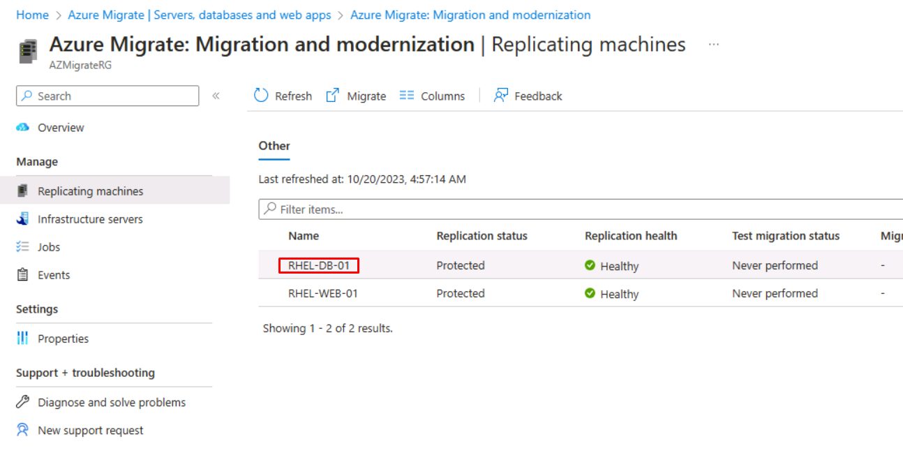
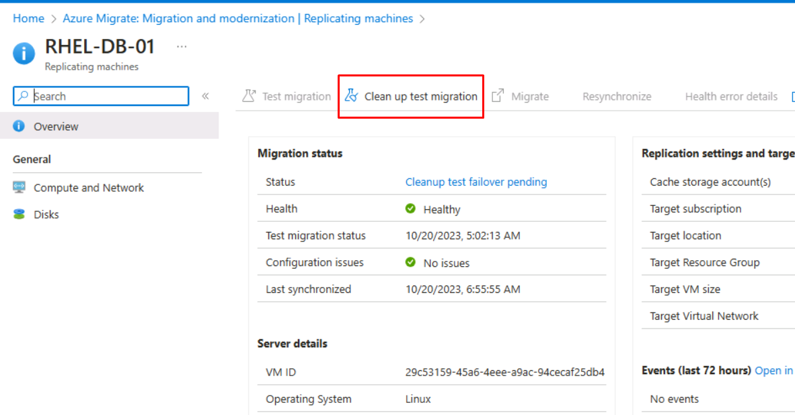
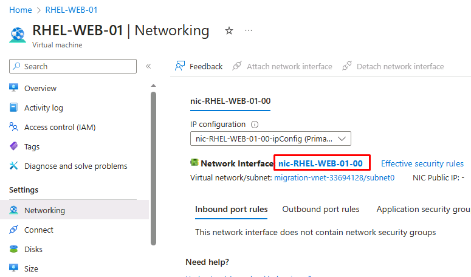
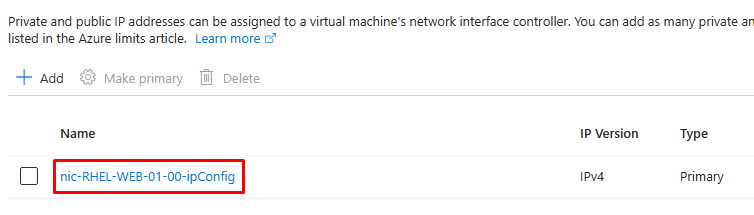

# Laboratorio 2 - Migracion de Linux VMs a Azure utilizando Azure Migrate

**Objetivo**

En este laboratorio migraremos la carga de trabajo de Linux VM desde
nuestras instalaciones utilizando la herramienta Azure Migrate - Server
Migration. Prepararemos los recursos de Azure necesarios y replicaremos
las VMs antes de la migración.

**Ejercicio 1: Migración de cargas de trabajo**

**Tarea 1: Prepare la migración de las Hyper-V VMs**

1.  En el blade **Servers, databases and web apps**, desplácese por la
    página hasta la sección **Migration Tools**, en **Migration and
    modernization**, seleccione **Discover**.

    

2.  En la hoja **Discover**, en el menú desplegable **Where do you want
    to migrate to?** seleccione la opción **Azure VM**, en el menú **Are
    your Machines virtualized?** seleccione **Yes, with Hyper-V**.

3.  En el menú **Target region**, seleccione **West US 2**.

    

    > **Nota**: Asegúrese de que la región de destino es la **misma** que la
    > ubicación/región indicada anteriormente en el laboratorio 1 para el
    > grupo de recursos **AZMigrateRG**.

4.  Seleccione la casilla de verificación **Confirm that the target
    region for migration is eastus** y, a continuación, seleccione
    **Create resources**.

5.  Espere a que los recursos Migrar proyecto y Bóveda terminen de
    implementarsen.

6.  En la hoja **Discover**, en **Prepare Hyper-V host servers**,
    seleccione la palabra **Download**, *tenga en cuenta que* *no es el
    botón* **Download** *que aparece a continuación.*

    

    > Se descargará el instalador que instalará el proveedor de replicación en el servidor Hyper-V.

7.  En la hoja **Discover**, en **1. Prepare Hyper-V host servers**,
    seleccione el botón **Download**.

    

    > Se descargará la clave de registro que se utilizará para registrar el
    > host Hyper-V con el proyecto.

8.  Vaya a la carpeta **Downloads** y seleccione el archivo
    **AzureSiteRecoveryProvider** para iniciar el instalador.

9.  En la ventana de configuración de Azure Site Recovery Provider
    (Hyper-V server), en la pestaña **Microsoft Update**, seleccione
    **On (recommended)** y, a continuación, seleccione **Next**.

10. En la pestaña **Installation**, acepte la ubicación de instalación
    predeterminada y, a continuación, seleccione **Install**.

11. Una vez finalizada la instalación, seleccione **Register**.

    > Si recibe un mensaje indicando que el servidor ya está registrado,
    > seleccione **Reregister**

12. En el asistente de Microsoft Azure Site Recovery, en la pestaña
    **Vault Settings**, a la derecha del cuadro **Key file**, seleccione
    **Browse**.

    

13. Vaya a la carpeta **Downloads**, seleccione el archivo
    **az-migrate-project** y, a continuación, seleccione **Open**.

    

    > Los valores de Key file, suscripción, nombre de bóveda y nombre del
    > sitio de Hyper-V se completan cuando se agrega el Key file.

14. Seleccione **Next**.

15. En la pestaña **Proxy Settings** , acepte la configuración
    predeterminada y seleccione **Next**.

    > El registro puede tardar hasta 5 minutos en completarse.

16. Una vez completado el registro, seleccione **Finish**.

17. De nuevo en el navegador, en la hoja **Discover**, bajo **2.
    Finalize registration**, seleccione la palabra **Finalize
    registration**.

    

    > Es posible que tenga que **actualizar la página** y volver a
    > seleccionar las opciones desde el principio de esta tarea para activar
    > el botón Finalize registration.

18. Una vez completado el registro, verá el siguiente mensaje.

    

    > El descubrimiento de las VMs puede tardar hasta 15 minutos en
    > completarse, y es posible que tenga que actualizar la página para ver
    > el mensaje. Pase a la siguiente tarea aunque no se haya completado la
    > tarea anterior.

### Tarea 2: Configure los recursos de Azure

Ahora que ha creado un proyecto Azure Migrate, necesita implementar el
entorno Azure de destino.

**Crear una Virtual network**

1.  En el portal Azure, en el cuadro **Search**, ingrese Virtual
    Networks y, a continuación, seleccione **Virtual Networks**.

2.  En la pestaña **Virtual Networks**, seleccione **Create**.

3.  Utilice la siguiente configuración para crear una **Virtual
    Network**.

    - Resource group- **AZMigrateRG**

    - Virtual network name - `migration-vnet-XXXXXX` \[sustituya
      XXXXXX por un número aleatorio\].

    - Region **West US 2**

    >  **Nota**: asegúrese de que la región es la **misma** que la
    > ubicación/región indicada anteriormente en el laboratorio 1 para el
    > grupo de recursos **AZMigrateRG**.

**Cree una cuenta de almacenamiento**

1.  En el portal Azure, en el cuadro **Search**, ingrese Storage y, a
    continuación, seleccione **Storage accounts**.

2.  En la pestaña **Storage accounts**, seleccione **Create**.

3.  Utilice la siguiente configuración para crear una cuenta de
    almacenamiento. Deje el resto de ajustes con sus valores
    predeterminados.

    - Resource group - AZMigrateRG

    - Storage account name - `saXXXXXX` \[sustituya XXXXXX por un
      número aleatorio\].

    - Region - **West US 2**

    >  **Nota**: Asegúrese de que la región es la **misma** que la
    > ubicación/región indicada anteriormente en el laboratorio 1 para el
    > grupo de recursos **AZMigrateRG**.

- Performance - **Standard**

- Redundancy - **Locally-redundant storage (LRS)**

4.  En la pestaña **Networking** de la página **Create a storage
    account**, establezca la siguiente configuración y deje el resto de
    configuraciones con sus valores predeterminados:

    - Network Access: **habilite el acceso público desde las virtual
      networks y direcciones IP seleccionadas**.

    - Virtual network - `migration-vnet-XXXXXX`

    - Subnets - **Por defecto (10.0.0.0/24)**

    

5.  En la pestaña **Data protection**, desmarque **Enable soft delete
    for blobs**. Deje el resto de ajustes en sus valores por defecto.

6.  Seleccione **Review** y, a continuación, **Create**.

7.  Una vez creada la cuenta de almacenamiento, haga clic en **Go to
    Resource**

8.  Expanda Gestión de datos y seleccione **Data protection**, luego
    desmarque **Enable soft delete for blobs** y haga clic en el botón
    **Save**.

    

**Cree una dirección IP pública**

1.  En el portal Azure, en el cuadro **Search**, ingrese IP pública y, a
    continuación, seleccione **Public IP addresses**.

2.  En la hoja **Public IP address**, seleccione **Create**.

3.  Utilice la siguiente configuración para crear una IP pública.

    - Resource group - **AZMigrateRG**

    - Region - **West US 2**

    >  **Nota**: asegúrese de que la región es la **misma** que la
    > ubicación/región indicada anteriormente en el laboratorio 1 para el
    > grupo de recursos **AZMigrateRG**.

    - Name - `ipXXXXXX` \[sustituya XXXXXX por un número aleatorio\].

    - IP Version - **IPv4**

    - SKU - **Basic**

    - IP address assignment - **Static**

    - Idle timeout (minutes) - **4**

    - DNS name label - `rhel-web-XXXXXX` \[sustituya XXXXXX por un
    número aleatorio\].

4.  Seleccione **Review + create** y, a continuación, **Create.**

### Tarea 3: Configure la replicación de Hyper-V VMs

1.  En el navegador Edge abra una nueva pestaña y navegue hasta la URL -
    `https://portal.azure.com/?feature.customportal=false&feature.canmodifystamps=true&microsoft_azure_migrate=migratecanary#view/Microsoft_Azure_Migrate/AmhResourceMenuBlade/~/getStarted`

2.  Haga clic en el botón **Discover, assess and migrate**.

    

3.  En la sección **Migration and modernization**, seleccione
    **Replicate**.

    

4.  Es posible que tenga que actualizar la página del navegador que
    muestra la página **Azure Migrate Servers, databases and web apps**.

5.  En la página **Specify intent**, en la opción **What do you want to
    migrate?** elija **Servers or virtual machines (VM)**, en la opción
    **Where do you want to migrate to?** elija **Azure VM**

6.  En el desplegable **Are your machines virtualized?** seleccione
    **Yes, with Hyper-V** y haga clic en el botón **Continuar**.

7.  En la pestaña **Virtual machines** de la página Replicar, utilice la
    siguiente configuración para completar los criterios de replicación.

    - Importar la configuración de migración desde Azure Migrate
      assessment: **Yes, apply migration settings from an Azure Migrate
      assessment**

    - Select group - **RHEL-Servers**

    - Select assessment - **as-43240741**

    - Virtual machines **RHEL-DB-01** y **RHEL-WEB-01**

8.  En la pestaña **Target settings** de la página Replicar, utilice la
    siguiente configuración para especificar los detalles del destino.

    - Resource group - **AZMigrateRG**

    - Cache storage account - **saXXXXXX**

    - Virtual Network - **migration-vnet-XXXXXX**

    - Subnet - **Por defecto**

9.  En la pestaña **Compute** de la página Replicar, utilice la
    siguiente configuración en ambas VMs:

    - Azure VM Size - **Standard_D2s_v3**

    - OS Type - **Linux**

10. Deje los ajustes del resto de pestañas en sus valores por defecto y
    seleccione **Replicate**.

11. Vuelva a la página **Azure Migrate Servers, databases and web
    apps**, seleccione **Refresh** y, a continuación, en la sección
    **Migration and modernization**, seleccione **Overview**.

    

12. En la página Migración y modernización, en la sección
    **Replications**, examine la columna **Status** en la lista de los
    equipos de réplica.

    

Espere hasta que el estado cambie a **Protected**. Esto puede tardar 15
minutos más.

Tendrá que actualizar la **Migration and modernization Replicating
machines** para actualizar la información de estado.

### Tarea 4: Realice migraciones de prueba

1.  En el portal Azure, en la página **Migration and modernization |
    Replications**, seleccione la **RHEL-DB-01** virtual machine.

    

2.  En la página **RHEL-DB-01**, seleccione **Test migration**.

    

3.  Seleccione la virtual network **migration-vnet-XXXXXX** y, a
    continuación, seleccione **Test migration**.

4.  Vuelva a la página **Migration and modernization Replicating
    machines** y seleccione la **RHEL-WEB-01** virtual machine.

5.  En la página **RHEL-WEB-01**, inicie una **Test
    migration** utilizando la virtual network **migration-vnet-XXXXXX**.

6.  Vuelva a la página **Migration and modernization Replicating
    machines**. El **Replication status** debe ser **Initiating test
    failover.**

    

    Espere a que finalice **Test failover**. Puede tardar entre 5 y 7
    minutos.

7.  Vuelva a la página **Migration and modernization Replications**,
    seleccione **Refresh** y, a continuación, compruebe que ambas
    virtual machines aparecen en la lista con el estado **Cleanup test
    failover pending**.

**Valide las migraciones de prueba**

8.  En el portal Azure, en el cuadro **Search**, ingrese Virtual
    machines y, a continuación, seleccione **Virtual machines**.

9.  Observe las entradas que representan las Virtual machines recién
    replicadas.

    > **Nota** - Inicialmente, las Virtual machines tendrán nombres consistentes
    en un prefijo **asr-temp** y un sufijo generado aleatoriamente, pero
    serán renombradas automáticamente a **RHEL-DB-01-test** y
    **RHEL-WEB-01-test**.

10. En la página **Virtual machines**, seleccione la Virtual machine
    **RHEL-WEB-01-test**.

    

11. En la página **RHEL-WEB-01-test**, en **Settings** seleccione
    **Networking**.

12. En la hoja **Networking**, seleccione la network
    interface **nic-RHEL-WEB-01-00-test**

    

13. En la página **nic-RHEL-WEB-01-00-test**, en **Settings** seleccione
    **IP configurations**.

14. Seleccione **nic-RHEL-WEB-01-00-test-ipConfig** para editar la
    configuración IP.

    

15. En la hoja de **Edit IP configuration**, marque la casilla
    **Associate public IP address** y, a continuación, seleccione
    **ip43240741** para la **Public IP address**.

16. Seleccione **Save** y espere a que se complete la asociación.

17. Abra una nueva pestaña de Edge y vaya al **DNS name** que asignó a
    la IP pública:

    `rhel-web-XXXXXX.westus2.cloudapp.azure.com`

18. Verifique que se carga el sitio web de Drupal alojado en
    RHEL-WEB-01-test.

19. Si el sitio web no se abre, desde la **Networking settings** de la
    Virtual Machine, cree un **Network Security Group** y habilite el
    **port 80** como se muestra en la siguiente imagen.

    

    

**Limpieza de migraciones de prueba**

19. Vuelva a la página **Migration and modernization | Replications** y
    seleccione **RHEL-DB-01**.

20. Seleccione la acción **Clean up test migration.**

    

21. Deje en blanco el campo **Notes** y marque la casilla **Testing is
    complete. Elimine la virtual machine de prueba** y, a continuación,
    seleccione **Cleanup Test**.

22. Vuelva a la página **Migration and modernization | Replications** y
    seleccione **RHEL-WEB-01**.

23. Seleccione la acción **Clean up test migration**, especificando
    **Testing is complete. Elimine la virtual machine de prueba**.

24. Vuelva a la página **Migration and modernization | Replications**.

25. Espere a que el **Replication status** sea **Protected** antes de
    continuar.

Es posible que tenga que hacer clic en **Refresh** después de uno o dos
minutos para ver esta actualización.

### Tarea 5: Realice migraciones

1.  Seleccione **RHEL-DB-01** y active la acción **Migrate**.

    

2.  En la página **Migrate**, asegúrese de que la opción **Shutdown
    machines before migration to minimize data loss?** esté establecida
    en **Yes** y seleccione **Migrate**.

3.  Vuelva a la página **Migration and modernization | Replications** y
    seleccione **RHEL-WEB-01**.

4.  Seleccione **Migrate** e inicie la migración, especificando de nuevo
    **Yes** en la página **Migrate**.

5.  Vuelva a la página **Migration and modernization | Replications** y
    seleccione **Refresh** para supervisar el estado de la migración.

    

6.  Deje Edge abierto para el próximo ejercicio. Las migraciones
    seguirán procesándose.

## Ejercicio 2: Tareas posteriores a la migración

### Tarea 1: Complete las tareas posteriores a la migración

En este ejercicio asignará la IP pública que creó anteriormente a
RHEL-WEB-01 VM recién migrada.

1.  En la página **Migration and modernization | Replications**,
    compruebe que la columna **Status** muestra **Planned failover
    finished** para ambas virtual machines.

    > Es posible que tenga que seleccionar **Refresh** para ver esta
    actualización.

2.  En el portal Azure, en el cuadro **Search**, ingrese Virtual
    machines y, a continuación, seleccione **Virtual machines**.

3.  En la página **Virtual machines**, seleccione la virtual machine
    **RHEL-WEB-01**.

4.  En la página **RHEL-WEB-01**, en **Settings** seleccione
    **Networking**.

5.  En la hoja **Networking**, seleccione la network
    interface **nic-RHEL-WEB-01-00**

    

6.  En la página **nic-RHEL-WEB-01-00**, en **Settings** seleccione **IP
    configurations**.

7.  Seleccione **nic-RHEL-WEB-01-00-ipConfig** para editar la
    configuración IP.

    

8.  En la hoja de **Edit IP configuration**, marque la casilla
    **Associate public IP address** y, a continuación, seleccione
    **ip43240741** para la **Public IP address**.

9.  Seleccione **Save** y espere a que se complete la asociación.

10. Abra una nueva pestaña de Edge y vaya al **DNS name** que asignó a
    la IP pública:

    `rhel-web-XXXXXX.westus2.cloudapp.azure.com`

11. Si el sitio web no se abre, desde la **Networking settings** de la
    virtual machine, cree un **Network Security Group** y active el
    **Port 80.**

12. Verifique que se cargue el sitio web de Drupal alojado en
    RHEL-WEB-01.

13. Abra **Hyper-V Manager** y observe que ambas VM están **Off**. Estas
    VM se han migrado correctamente.

    
