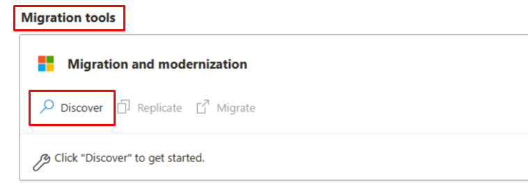
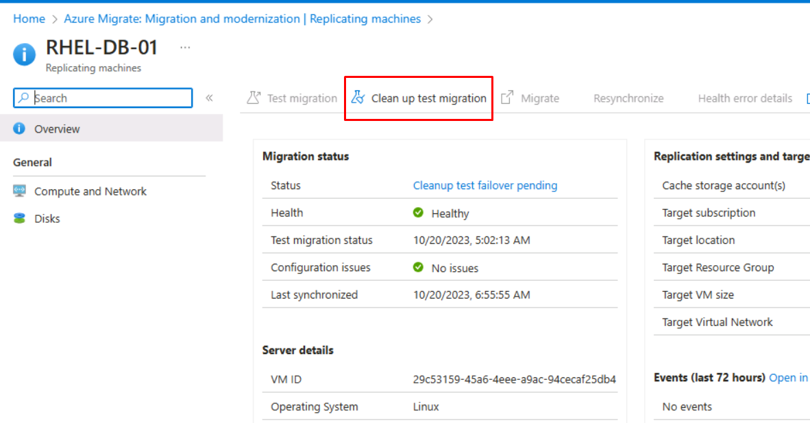
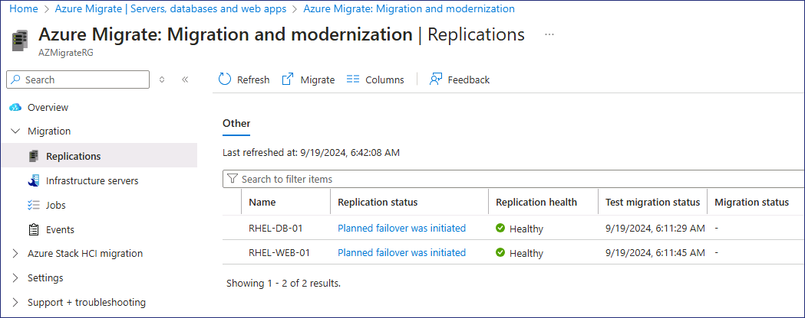

# ラボ2 - Azure Migrateを使用したLinux VMのAzureへの移行

**目的**

このラボでは、Azure Migrate - Server
Migrationツールを使用して、オンプレミスからLinux
VMワークロードを移行します。必要なAzureリソースを準備し、移行前にVMをレプリケートします。

**演習1：ワークロードの移行**

**タスク 1：Hyper-V VMsの移行準備**

1.  **サーバー、データベース、およびWeb**アプリケーションブレードで、ページを**Migration
    tools**セクションに移動し、**Migration and
    modernizationの下で**、**\[Discover\]**を選択します。

    

2.  **Discover**ブレードで、ドロップダウンの**Where do you want to
    migrate to?** で**Azure VM**オプションを選択し、**Are your Machines
    virtualized?** メニューで**Yes, with Hyper-Vを**選択する。

3.  **Target region**メニューで、「**West US 2**」を選択する。

     

    > <font color=red>**注意** -
 ターゲットリージョンが、ラボ1の**AZMigrateRG**リソースグループのLocation/Regionと**同じで**あることを確認してください。</font>

4.  **Confirm that the target region for migration is
    eastus** チェックボックスを選択し、**Create
    resourcesを**選択します。

5.  Migrate Project and Vault resourcesが完了するまで待ちます。

6.  **Discover**ブレードで、**Prepare Hyper-V host**
    serversの下で、そばのDownloadボタンではなく、Downloadという単語を選択します。

     

    > <font color=blue>Hyper-Vサーバーにレプリケーション・プロバイダーをインストールするインストーラーがダウンロードされます。</font>

7.  **Discover** ブレードの **1. Prepare Hyper-V host
    serversの下**で、\[**Download\]**ボタンを選択します。

     

    > <font color=blue>プロジェクトに Hyper-V
ホストを登録するために使用される登録キーがダウンロードされます。</font>

8.  ダウンロードフォルダに移動し、**AzureSiteRecoveryProvider**
    ファイルを選択してインストーラを起動します。

9.  Azure Site Recovery Provider セットアップ（Hyper-V
    サーバー）ウィンドウで、**Microsoft Update**
    タブで、**On（推奨**）を選択し、**Next を**選択します。

10. **「Installation」** タブで、デフォルトのインストール場所を選択し、\[**Install\]**を選択します。

11. インストールが完了したら、**Registerを**選択します。


    > <font color=green> サーバーがすでに登録されているというメッセージが表示された場合は、**Reregisterを**選択します。</font>

12. Microsoft Azure Site Recovery ウィザードの**［Vault
    Settings］**タブで、**［Key
    file**］ボックスの右側にある［**Browse**］を選択します。

     

13. ダウンロードフォルダに移動し、**az-migrate-project**ファイルを選択し、**\[Open\]**を選択します。

     

    > キーファイル、サブスクリプション、Vault 名、Hyper-V
サイト名の値は、キーファイルの追加時に入力されます。

14. **「Next」を**選択する。

15. Proxy
    Settings」**タブで、デフォルト設定を受け入れ、**Next**を選択します。


    > <font color=blue> 登録には5分ほどかかります。</font>

16. 登録が完了したら、**Finishを**選択します。

17. ブラウザに戻り、ディスカバー・ブレードの「**2.Finalize
    registration（登録を確定する**）\]で\[**Finalize
    registration（登録を確定する）\]**を選択します。

     

    > <font color=blue>最終登録ボタンを有効にするには、**ページを更新**し、このタスクの最初にあるオプションを再度選択する必要があるかもしれません。</font>

18. 登録が完了すると、以下のメッセージが表示されます。

     

    > <font color=blue> 仮想マシンの検出が完了するまで最大15分かかる場合があり、メッセージを表示するにはページを更新する必要があります。完了しなくても次のタスクに移行します。</font>

**タスク2：Azureリソースのセットアップ**

> Azure Migrate プロジェクトを作成したので、次にターゲットの Azure
> 環境を実装する必要があります。

**仮想ネットワークの作成**

1.  Azure Portal の **Search** ボックスで Virtual Networks
    と入力し、**Virtual networks を**選択します。

2.  **Virtual networks**ブレードで、**Createを**選択します。

3.  以下の設定を使用して、仮想ネットワークを作成します。

    - リソースグループ- **AZMigrateRG**

    - 仮想ネットワーク名 - ```migration-vnet-XXXXXX``` \[substitute
      XXXXXX with random number\]。

    - リージョン・**West US 2**

    > <font color=red> **注意** -
**AZMigrateRG**リソースグループのLocation/Regionが、ラボ1で説明したLocation/Regionと**同じ**であることを確認してください。</font>

**ストレージアカウントの作成**

1.  Azure Portal の **Search** ボックスで Storage と入力し、**Storage
    accounts** を選択します。

2.  **Storage accounts**ブレードで、**Createを**選択します。

3.  以下の設定を使用して、ストレージ・アカウントを作成する。その他の設定はデフォルト値のままにしてください。

    - リソースグループ - AZMigrateRG

    - ストレージ・アカウント名 - ```saXXXXXX```
      \[XXXXXXはランダムな数字で置き換えてください。］

    - 地域 - **米国西部 2**

    > <font color=red> **注意** -
**AZMigrateRG**リソースグループのLocation/Regionが、ラボ1で説明したLocation/Regionと**同じ**であることを確認してください。</font>

    - パフォーマンス - **標準**

    - 冗長性 - **Locally-redundant storage (LRS)**

4.  **「Create a storage
    account** **」**ページの**「Networking」**タブで、以下の設定を行い、その他の設定はすべてデフォルト値のままにする：　

    - ネットワークアクセス - **Enable public access from selected
      virtual networks and IP addresses**

    - 仮想ネットワーク - **```migration-vnet-XXXXXX```**

    - サブネット - **デフォルト（10.0.0.0/24）**

     

5.  **「Data protection** **\]**タブで、\[**Enable soft delete for
    blobs\]**のチェックを外す。その他の設定はすべてデフォルト値のままにします。

6.  **Reviewを**選択し、**Createを**選択する。

7.  ストレージアカウントが作成されたら、**Go to
    Resourceを**クリックする。

8.  Data managementを展開し、**Data protectionを**選択し、**Enable soft
    delete for blobsの**チェックを外し、**Save**ボタンをクリックする。

     

**パブリックIPアドレスの作成**

1.  Azure ポータルの **\[Search\]** ボックスで \[Public IP\]
    と入力し、\[**Public IP addresses**\] を選択します。

2.  **Public IP address** ブレードで、［**Create**］を選択します。

3.  以下の設定を使用してパブリックIPを作成する。

    - リソースグループ - **AZMigrateRG**

    - 地域 - **West US 2**

    > <font color=red> **注意** -
**AZMigrateRG**リソースグループのLocation/Regionが、ラボ1で説明したLocation/Regionと**同じ**であることを確認してください。</font>

    - 名前 - ```ipXXXXXX``` \[substitute XXXXXX with random number］

    - IPバージョン - **IPv4**

    - SKU – **Basic**

    - IPアドレス割り当て - **Static**

    - アイドルタイムアウト（分） - **4**

    - DNS名ラベル - ```rhel-web-XXXXXX``` \[substitute XXXXXX with random
    number］

4.  **Review + createを**選択し、次に**createを**選択する。

**タスク3：Hyper-V VMsのレプリケーションの構成**

1.  Edgeブラウザで新しいタブを開き、URL -
    ```https://portal.azure.com/?feature.customportal=false&feature.canmodifystamps=true&microsoft_azure_migrate=migratecanary#view/Microsoft_Azure_Migrate/AmhResourceMenuBlade/~/getStarted```
    に移動する。

2.  **Discover, assess and migrate** ボタンをクリックします。

    

3.  **Migration and
    modernization**セクションで**Replicateを**選択します。

    

4.  **Azure Migrate Servers, databases and web apps**
    ページを表示しているブラウザページを更新する必要があるかもしれません。

5.  **「Specify intent」**ページで、「**What do you want to
    migate?**」で「**Servers or virtual
    machines（VM）**」を選択し、**「Where do you want to migrate
    to?**」で「**Azure VM**」を選択します。

6.  ドロップダウンの「**Are your machines virtualized?）**」で「**Yes,
    with Hyper-V**」を選択し、「**Continue」**ボタンをクリックします。

7.  Replicate］ページの**［Virtual
    machines］**タブで、以下の設定を使用してレプリケーション条件を完成させます。

    - Azure Migrate アセスメントから移行設定をインポート - **Yes, apply
      migration settings from an Azure Migrate assessment**

    - グループを選択 - **RHEL-Servers**

    - 評価を選択 - **as-43240741**

    - 仮想マシン **RHEL-DB-01** および **RHEL-WEB-01**

8.  レプリケート・ページの**ターゲット設定**タブで、以下の設定を使用してターゲットの詳細を指定します。

    - リソースグループ - **AZMigrateRG**

    - キャッシュ・ストレージ・アカウント - **saXXXXXX**

    - 仮想ネットワーク - **migration-vnet-XXXXXXX**

    - サブネット - **デフォルト**

9.  Replicateページの**Compute**タブで、両方のVMで以下の設定を使用します：

    - AzureのVMサイズ - **Standard_D2s_v3**

    - OSタイプ - **Linux**

10. 残りのタブの設定はデフォルトのままにして、**Replicateを**選択する。

11. **Azure Migrate Servers, databases and web apps**
    ページに戻り、**Refresh** を選択し、**Migration and modernization**
    セクションで **Overview** を選択します。

    

12. Migration and
    modernizationページの**\[Replications\]**セクションで、レプリケートしているマシンのリストの**\[Status\]**列を調べます。

    

ステータスが**Protectedに**変わるまで待つ。さらに15分ほどかかる場合があります。

ステータス情報を更新するには、**Migration and modernization Replicating
machines** **を**リフレッシュする必要があります。

**タスク 4: テスト移行の実行**

1.  Azure Portal の **Migration and modernization |
    Replications**］**ページで、**RHEL-DB-01**
    仮想マシンを選択します。

    

2.  **RHEL-DB-01** ページで、**Test migration** を選択します。

    

3.  **migration-vnet-XXXXXX**仮想ネットワークを選択し、**Test
    migrationを**選択します。

4.  **Migration and modernization Replicating machines**
    ページに戻り、**RHEL-WEB-01** 仮想マシンを選択します。

5.  **RHEL-WEB-01**ページで、**migration-vnet-XXXXXX**仮想ネットワークを使用して**Test
    migrationを**開始します。

6.  **Migration and modernization Replicating
    machines**ページに戻る。**レプリケーションの**ステータスが
    **Initiating test failover** になっているはずです。

    

    > **テストのフェイルオーバーが**完了するまで待ちます。5～7分程度かかる場合があります。

7.  **Migration and modernization
    Replications**ページに戻り、**\[Refresh\]**を選択し、両方の仮想マシンが**Cleanup
    test failover pending**ステータスで表示されていることを確認します。

**テスト移行の検証**

8.  Azure Portal の **Search** ボックスで Virtual machines
    と入力し、**Virtual machines** を選択します。

9.  新しくレプリケートされた仮想マシンを表すエントリに注意してください。

    > <font color=blue> 注意 - 初期状態では、仮想マシンの名前は **asr-temp**
プレフィックスとランダムに生成されるサフィックスから構成されますが、自動的に
**RHEL-DB-01-test** と **RHEL-WEB-01-test** にリネームされます。</font>

10. **Virtual machines** ページで、**RHEL-WEB-01-test** VMを選択します。

    

11. **RHEL-WEB-01-testの**ページで、**Settingsの**下にある**Networkingを**選択します。

12. **Networking**ブレードで、ネットワークインターフェイス**nic-RHEL-WEB-01-00-testを**選択する。

    

13. **nic-RHEL-WEB-01-00-test**ページで、**Settingsの**下にある**IP
    configurationsを**選択します。

14. **nic-RHEL-WEB-01-00-test-ipConfigを**選択してIPコンフィギュレーションを編集する。

    

15. **Edit IP configuration** ブレードで、**Associate public IP
    address**ボックスをチェックし、**パブリックIPアドレスにip43240741を**選択します。

16. **Saveを**選択し、関連付けが完了するまで待つ。

17. 新しいEdgeタブを開き、パブリックIPに割り当てた**DNS**名にアクセスします：

    ```rhel-web-XXXXXX.westus2.cloudapp.azure.com```。

18. RHEL-WEB-01-testでホストされているDrupalウェブサイトがロードされることを確認します。

19. ウェブサイトが開かない場合は、仮想マシンの**Networking
    settings** から**Network Security
    Group** **を**作成し、下図のように**ポート80を**有効にしてください。

    

    

**テスト移行のクリーンアップ**

19. **Migration and modernization |
    Replications** ページに戻り、**「RHEL-DB-01**」を選択します。

20. **Clean up test migration** アクションを選択します。

    

21. **Notes\]** フィールドを空白のままにし、\[**Testing is complete**\]
    チェックボックスを選択**します。テスト仮想マシンを削除**し、**\[Cleanup
    Test\]** を選択します。

22. **Migration and modernization |
    Replications** ページに戻り、**RHEL-WEB-01を**選択します。

23. **テストが完了した**ことを指定して、**Clean up test
    migration** アクションを選択**します。test virtual
    machineを削除**します。

24. **Migration and modernization | Replications** ページに戻る。

25. **Replication status** **がProtectedに**なるまで待ってから続行する。

    > <font color=blue> この更新を見るには、1、2分後に**Refreshを**選択する必要があるかもしれません。</font>

**タスク5：マイグレーションの実行**

1.  **RHEL-DB-01を**選択し、**Migrate**アクションをトリガーします。

    

2.  **Migrate**ページで、\[**Shutdown machines before migration to
    minimize data
    loss?\]**オプションが\[**Yes\]**に設定されていることを確認し、**\[Migrate\]**を選択します。

3.  **Migration and modernization |
    Replications** ページに戻り、**RHEL-WEB-01を**選択します。

4.  **Migrateを**選択して移行を開始し、**\[Migrate\]**ページで再度\[**Yes\]を**指定する。

5.  **Migration and modernization |
    Replications** ページに戻り、**\[Refresh\]**を選択して移行のステータスを監視します。

    

6.  次の練習のためにEdgeを開いたままにしておきます。マイグレーションは引き続き
    処理されます。

**演習2：移行後のタスク**

**タスク 1：移行後のタスクを完了する**

この演習では、先に作成したパブリックIPを新しく移行したRHEL-WEB-01
VMに割り当てます。

1.  **Migration and modernization |
    Replications** ページで、**\[Status\]**列に両方の仮想マシンの**\[Planned
    failover finished** **\]**と表示されていることを確認します。

    > <font color=blue> このアップデートを見るには、**Refresh**を選択する必要があるかもしれません。</font>

2.  Azure Portal の **Search** ボックスで 、Virtual machines
    と入力し、**Virtual machines** を選択します。

3.  **Virtual machines** ページで、**RHEL-WEB-01** VMを選択します。　

4.  **RHEL-WEB-01の**ページで、**\[Settings\]の**下にある**\[Networking\]**を選択します。

5.  **Networking**ブレードで、ネットワークインターフェイス**nic-RHEL-WEB-01-00を**選択する。

    

6.  **nic-RHEL-WEB-01-00**ページの「**Settings**」で「**IP
    configurations**」を選択します。

7.  IP設定を編集するには、**nic-RHEL-WEB-01-00-ipConfigを**選択します。

    

8.  **Edit IP configuration** ブレードで、**Associate public IP
    address**ボックスをチェックし、**Public IP
    addressにip43240741を**選択します。　

9.  **保存を**選択し、関連付けが完了するまで待つ。　

10. 新しいEdgeタブを開き、パブリックIP：

    ```rhel-web-XXXXXX.westus2.cloudapp.azure.com```に割り当てた**DNS name**にアクセスします。

11. ウェブサイトが開かない場合は、仮想マシンの**Networking
    settings** **からNetwork Security
    Group** **を**作成し、**ポート80を**有効にしてください。

12. RHEL-WEB-01でホストされているDrupalウェブサイトがロードされることを確認します。

13. **Hyper-V Manager を**開き、両方の VMs が **Off**
    になっていることに注意してください。これらのマシンは正常に移行されました。

    
