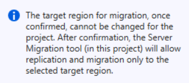
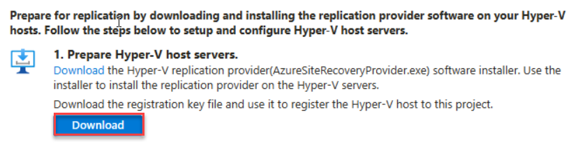
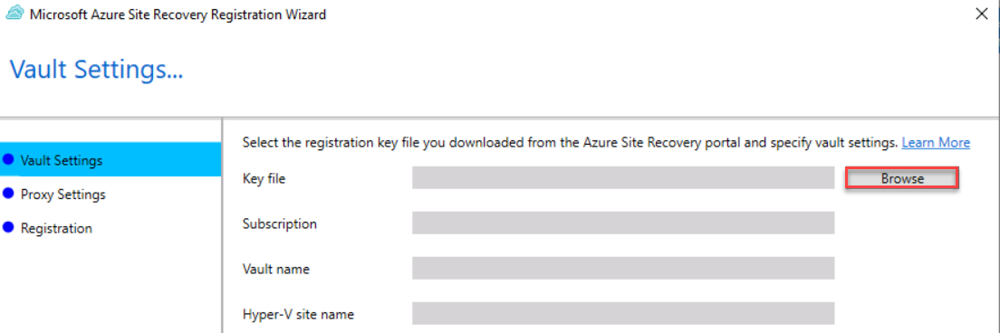
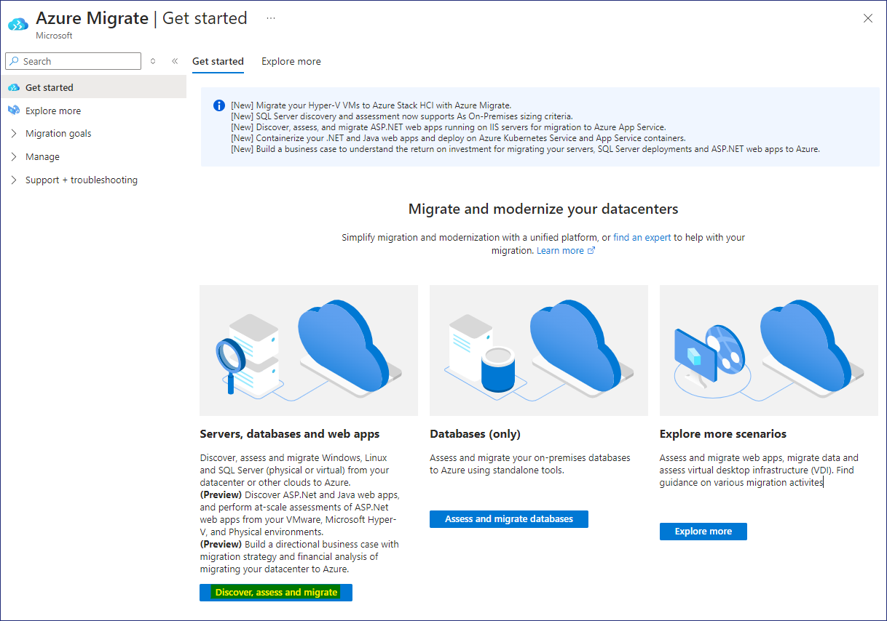
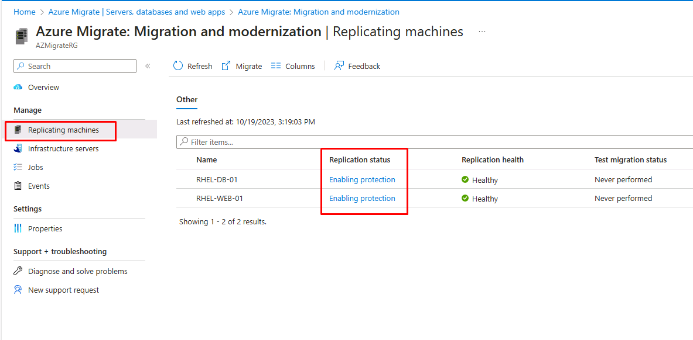
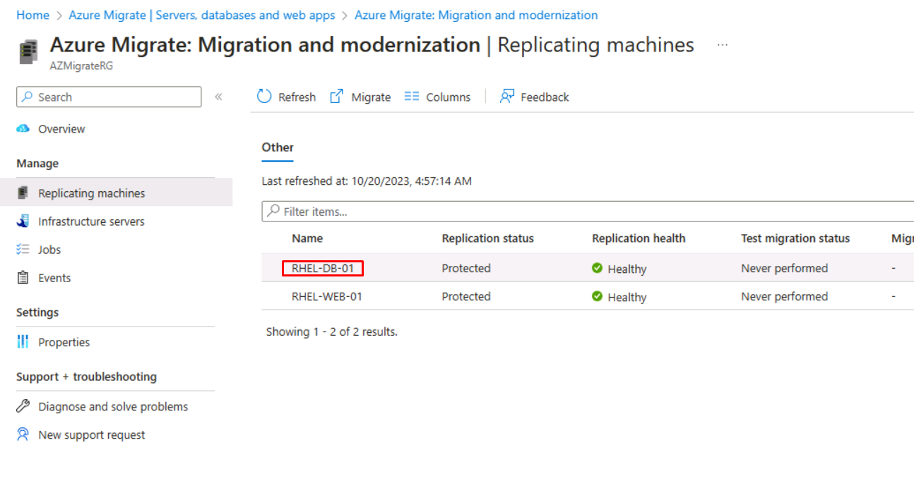
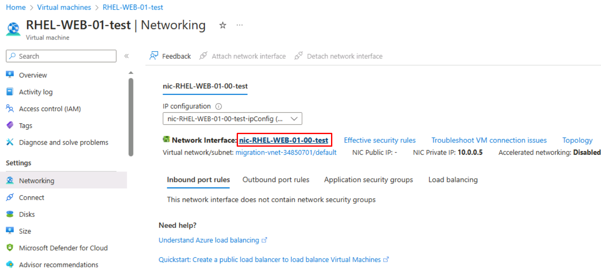
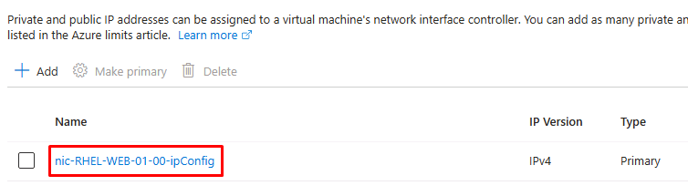
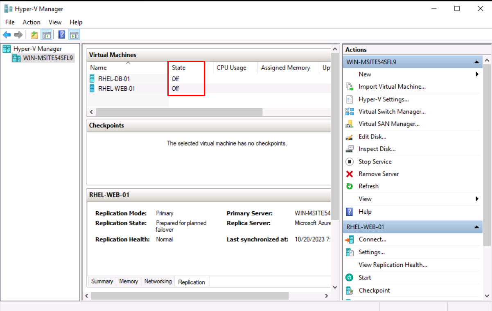
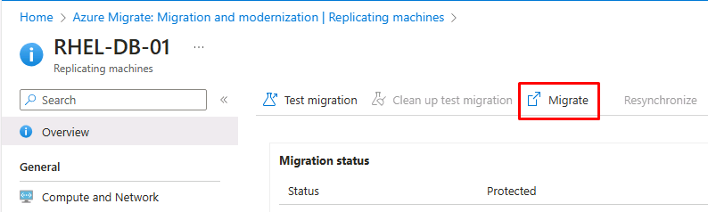

# Lab 2 - Migrating Linux VMs to Azure using Azure Migrate

## Objective

In this Lab we will Migrate the Linux VM workload from our On-premise using the Azure Migrate – Server Migration tool. We will prepare the required Azure Resources and then replicate the VMs prior to migration.

## Exercise 1: Migrate workloads

## Task 1: Prepare for migration of Hyper-V VMs

1.  On the **Servers, databases and web apps** blade, move through the
    page to the **Migration Tools** section, under **Migration and
    modernization**, select **Discover**.

    

2.  On the **Discover** blade, for the drop-down **Where do you want to migrate to?** select **Azure VM** option, on the **Are your Machines virtualized?** menu, select **Yes, with Hyper-V**.

3.  On the **Target region** menu, select **West US 2**. 

    

    > **Note** - Ensure that the Target region is **same** as the Location / Region noted earlier in Lab 1 for the **AZMigrateRG** resource group.

4.  Select the **Confirm that the target region for migration is the same as the region for the AZMigrateRG** checkbox, then select **Create resources**.

5.  Wait for the Migrate Project and Vault resources to finish
    deploying.

6.  On the **Discover** blade, under **Prepare Hyper-V host servers**,
    Click on **Download**, *not the **Download** button after
    it.*

    

    > The installer that will install the replication provider on the Hyper-V server will be downloaded.

7.  On the **Discover** blade, under **1. Prepare Hyper-V host
    servers**, select the **Download** button.

    

    > The registration key that will be used to register the Hyper-V host with the project will be downloaded.

8.  Go to the **Downloads** folder then select
    the **AzureSiteRecoveryProvider** file to launch the installer.

9.  In the Azure Site Recovery Provider setup (Hyper-V server) window, on the **Microsoft Update** tab, select **On (recommended)**, then select **Next**.

10. On the **Installation** tab, accept the default Installation Location, then select **Install**.

11. Once the installation is complete, select **Register**.

    > If you receive a message about the server already being registered, select **Reregister**.

12. In the Microsoft Azure Site Recovery Wizard, on the **Vault
    Settings** tab, to the right of the **Key file** box,
    select **Browse**.

    

13. Go to the **Downloads** folder, select
    the **az-migrate-project** file, then select **Open**.

    

    > The Key file, Subscription, Vault name, and Hyper-V site name values are populated when the key file is added.

14. Select **Next**.

15. On the **Proxy Settings** tab, accept the default setting, then
    select **Next**.

    > The registration can take up to 5 minutes to complete.

16. Once the registration is complete, select **Finish**.

17. Back in the browser, on the **Discover** blade, under **2. Finalize registration**, select word **Finalize registration**.

    

    > You may need to **refresh the page** and re-select the options from the beginning of this task to enable the Finalize registration button.

18. Once the registration completes, you will see the following message.

    

> It might take up to 15 minutes for the discovery of virtual machines to complete, and you may need to refresh the page to see the message. Confine to the next task even if it is not complete.

## Task 2: Setup Azure resources

Now that you have created an Azure Migrate project, you need implement
the target Azure environment.

**Create a Virtual network**

1.  In the Azure portal, in the **Search** box, enter `Virtual Networks`,
    then select **Virtual networks**.

2.  On the **Virtual networks** blade, select **Create**.

3.  Use the following settings to create a virtual network.

    - Resource group - **AZMigrateRG**

    - Virtual network name - `migration-vnet-@lab.LabInstance.Id`
    - Region **West US 2**

    >  **Note** - Ensure that the Region is **same** as the Location / Region noted earlier in Lab 1 for the **AZMigrateRG** resource group.

**Create a Storage account**

1.  In the Azure portal, in the **Search** box, enter `Storage`, then
    select **Storage accounts**.

2.  On the **Storage accounts** blade, select **Create**.

3.  Use the following settings to create a storage account. Leave all other settings as their default values.

    - Resource group - **AZMigrateRG**

    - Storage account name - `sa@lab.LabInstance.Id`

    - Region - **West US 2**

    >  **Note** - Ensure that the Region is **same** as the Location / Region noted earlier in Lab 1 for the **AZMigrateRG** resource group.

    - Primary service - **Azure Blob storage or Azure Data Lake Storage Gen 2**

    - Performance - **Standard**

    - Redundancy - **Locally-redundant storage (LRS)**

4.  On the **Networking** tab of the **Create a storage account** page,
    set the following settings, and leave all other settings as their
    default values:

    - Network Access - **Enable public access from selected virtual networks and IP addresses**

    - Virtual network - **migration-vnet-@lab.LabInstance.Id**

    - Subnets - **default (10.0.0.0/24)**

    

5.  On the **Data protection** tab, uncheck **Enable soft delete for
    blobs**. Leave all other settings as their default values.

6.  Select **Review**, then select **Create**.

7.  Once the Storage account is created, click on **Go to Resource**

8.  Expand Data management and select **Data protection**, then uncheck
    **Enable soft delete for blobs** and click on the **Save** button.

    > 

**Create a Public IP address**

1.  In the Azure portal, in the **Search** box, enter `Public IP`, then
    select **Public IP addresses**.

2.  On the **Public IP address** blade, select **Create**.

3.  Use the following settings to create a public IP.

    - Resource group - **AZMigrateRG**

    - Region - **West US 2**

        >  **Note** - Ensure that the Region is **same** as the Location / Region noted earlier in Lab 1 for the **AZMigrateRG** resource group.

    - Name - `ip@lab.LabInstance.Id`

    - IP Version - **IPv4**

    - SKU - **Basic**

    - IP address assignment - **Static**

    - Idle timeout (minutes) - **4**

    - DNS name label - `rhel-web-@lab.LabInstance.Id` 

4.  Select **Review + create**, then **create**

## Task 3: Configure replication of Hyper-V VMs

1.  In the Edge browser open a new tab and navigate to the URL -
    `https://portal.azure.com/?feature.customportal=false&feature.canmodifystamps=true&microsoft_azure_migrate=migratecanary#view/Microsoft_Azure_Migrate/AmhResourceMenuBlade/~/getStarted`

2.  Click on **Discover, assess and migrate** button.

    

3.  In the **Migration and modernization** section,
    select **Replicate**.

    

4.  You may need to refresh the browser page displaying the **Azure
    Migrate Servers, databases and web apps** page.

5.  On the **Specify intent** page, on the **What do you want to migrate?** choose **Servers or virtual machines (VM)**, on the **Where do you want to migrate to?** choose **Azure VM**

6. For the drop-down **Are your machines virtualized?** select **Yes, with Hyper-V** and then click on the **Continue** button.

7.  On the **Virtual machines** tab of the Replicate page, use the following settings to complete the replication criteria.

    - Import migration settings from an Azure Migrate assessment - **Yes, apply migration settings from an Azure Migrate assessment**

    - Select group - **RHEL-Servers**

    - Select assessment - **as-43240741**

    - Virtual machines **RHEL-DB-01** and **RHEL-WEB-01**

8.  On the **Target settings** tab of the Replicate page, use the following settings to specify the target details.

    - Resource group - **AZMigrateRG**

    - Cache storage account - **sa@lab.LabInstance.Id**

    - Virtual Network - **migration-vnet-@lab.LabInstance.Id**

    - Subnet - **Default**

9.  On the **Compute** tab of the Replicate page, use the following settings on both VMs:

    - Azure VM Size - **Standard_D2s_v3**

    - OS Type - **Linux**

10. Leave the settings in the remaining tabs at their defaults and
    select **Replicate**.

11. Return to the **Azure Migrate Servers, databases and web
    apps** page, select **Refresh** and then, in the **Migration and
    modernization** section, select **Overview**.

    

12. On the Migration and modernization page, in the **Replications** section, examine the **Status** column in the list of the
    replicating machines.

    
    
> Wait until the status changes to **Protected**. This might take an additional 15 minutes.

You will need to refresh the **Migration and modernization Replicating
machines** to update the status information.

## Task 4: Perform test migrations

1.  In the Azure portal, on the **Migration and modernization | 
    Replications** page, select the **RHEL-DB-01** virtual
    machine.

    

2.  On the **RHEL-DB-01** page, select **Test migration**.

    

3.  Select the **migration-vnet-@lab.LabInstance.Id** virtual network and then
    select **Test migration**.

4.  Go back to the **Migration and modernization Replicating
    machines** page, then select the **RHEL-WEB-01** virtual machine.

5.  On the **RHEL-WEB-01** page, initiate a **Test migration** using
    the **migration-vnet-@lab.LabInstance.Id** virtual network.

6.  Go back to the **Migration and modernization Replicating
    machines** page. The **Replication status** should be **Initiating
    test failover**

    

    > Wait for the **Test failover** to complete. This may take around 5-7
    minutes.

7.  Go back to the **Migration and modernization Replications** page, select **Refresh**, and then verify that the both virtual machines are listed with the **Cleanup test failover pending** status.

**Validate test migrations**

8.  In the Azure portal, in the **Search** box, enter `Virtual machines`,
    then select **Virtual machines**.

9.  Note the entries representing the newly replicated virtual machines.

    > Note - Initially, the virtual machines will have names consisting of an **asr-temp** prefix and randomly generated suffix, but will be renamed automatically to **RHEL-DB-01-test** and **RHEL-WEB-01-test**.

10. On the **Virtual machines** page, select
    the **RHEL-WEB-01-test** VM.

    

11. On the **RHEL-WEB-01-test** page,
    under **Settings** select **Networking**.

12. On the **Networking** blade, select the network
    interface **nic-RHEL-WEB-01-00-test**

    

13. On the **nic-RHEL-WEB-01-00-test** page,
    under **Settings** select **IP configurations**.

14. Select **nic-RHEL-WEB-01-00-test-ipConfig** to edit the IP
    configuration.

    

15. In the **Edit IP configuration** blade, check the box
    for **Associate public IP address**, then select **ip43240741** for
    the **Public IP address**.

16. Select **Save** and wait for the association to complete.

17. Open a new Edge tab and go to the **DNS name** you assigned to the
    public IP:

    `rhel-web-@lab.LabInstance.Id.westus2.cloudapp.azure.com`

18. Verify that the Drupal website hosted on RHEL-WEB-01-test loads.

19. If the website does not open, then from the **Networking settings** of the Virtual Machine, create a **Network Security Group** and enable **Port 80** as shown in below image.

    

    

**Cleanup test migrations**

19. Go back to the **Migration and modernization | Replications** page and select **RHEL-DB-01**.

20. Select the **Clean up test migration** action.

    

21. Leave the **Notes** field blank and select the checkbox
    for **Testing is complete. Delete test virtual machine**, then
    select **Cleanup Test**

22. Go back to the **Migration and modernization | Replications** page and select **RHEL-WEB-01**.

23. Select the **Clean up test migration** action, specifying **Testing
    is complete. Delete test virtual machine**.

24. Return to the **Migration and modernization | Replications** page.

25. Wait for the **Replication status** to be **Protected** before
    continuing.

    > You may need to select **Refresh** after a minute or two to see this update.

## Task 5: Perform migrations

1.  Select **RHEL-DB-01** and trigger the **Migrate** action.

    

2.  On the **Migrate** page, ensure that the **Shutdown machines before
    migration to minimize data loss?** option is set to **Yes**, and
    select **Migrate**.

3.  Go back to the **Migration and modernization | Replications** page and select **RHEL-WEB-01**.

4.  Select **Migrate** and start the migration, again
    specifying **yes** in the **Migrate** page.

5.  Go back to the **Migration and modernization | Replications** page and select **Refresh** to monitor the status of migration.

    

6.  Leave Edge open for the next exercise. The migrations will continue
    processing.

# Exercise 2: Post-migration tasks

## Task 1: Complete post migration tasks

In this exercise you will assign the public IP you created earlier to
the newly migrated RHEL-WEB-01 VM.

1.  On the **Migration and modernization | Replications** page,
    verify that the **Status** column displays **Planned failover
    finished** for both virtual machines.

    > You may need to select **Refresh** to see this update.

2.  In the Azure portal, in the **Search** box, enter Virtual machines,
    then select **Virtual machines**.

3.  On the **Virtual machines** page, select the **RHEL-WEB-01** VM.

4.  On the **RHEL-WEB-01** page,
    under **Settings** select **Networking**.

5.  On the **Networking** blade, select the network
    interface **nic-RHEL-WEB-01-00**

    

6.  On the **nic-RHEL-WEB-01-00** page, under **Settings** select **IP
    configurations**.

7.  Select **nic-RHEL-WEB-01-00-ipConfig** to edit the IP configuration.

    

8.  In the **Edit IP configuration** blade, check the box
    for **Associate public IP address**, then select **ip43240741** for
    the **Public IP address**.

9.  Select **Save** and wait for the association to complete.

10. Open a new Edge tab and go to the **DNS name** you assigned to the public IP:     `rhel-web-@lab.LabInstance.Id.westus2.cloudapp.azure.com`

11. If the website does not open, then from the **Networking settings** of the Virtual Machine, create a **Network Security Group** and enable **Port 80** 

12. Verify that the Drupal website hosted on RHEL-WEB-01 loads.

13. Open **Hyper-V Manager** and note that both VMs are **Off**. These
    machines have been successfully migrated.

    
