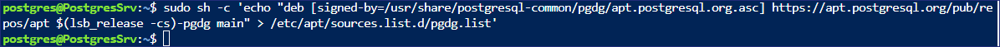
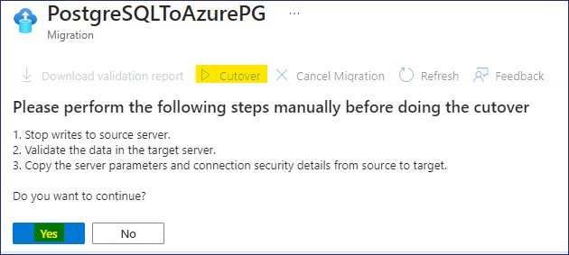

# Lab 3 - PostgreSQL nach Azure migrieren.

### Zielsetzung

Im diesem Lab werden wir eine virtuelle Maschine bereitstellen, um die
**PostgreSQL- Datenbank** zu hosten und die erforderliche **PostgreSQL
infrastructure** zu erstellen. Anschließend werden wir die PostgreSQL
Database mithilfe des **Azure Database for Postgres Flexible Server
(Migration)** migrieren**.** 

### Aufgabe 1 - Bereitstellung der virtuellen Maschine zum Hosten der PostgreSQL-Datenbank für die On-Premises-Umgebung.
Wir werden **Ubuntu 22.0.4.4 LTS** VM einsetzen, auf der wir
**PostgreSQL Server 16** installieren und dann die Beispieldatenbank
erstellen, die für die Migration verwendet wird.

1.  Öffnen Sie über das Azure Portal `https://portal.azure.com` die
    Azure Cloud Shell

    

2.  Klicken Sie auf die Schaltfläche **PowerShell**.

    

3.  Wählen Sie im Fenster **Getting started** die Optionsschaltfläche
    für **Mount storage account** und dann das **Azure Pass –
    Sponsorship** subscription aus und klicken Sie auf die Schaltfläche
    **Apply** .

    

4.  Wählen Sie im Fenster Mount storage account das Optionsfeld **We
    will create storage account for you** und klicken Sie dann auf
    **Next**.

    

5.  Warten auf den Abschluss des Deployments

    

6.  Geben Sie im Cloud Shell PowerShell -Fenster die folgenden Befehle
    ein, um die Variablen zu konfigurieren und die VM zu erstellen, die
    für die Installation des PostgreSQL-Servers verwendet werden soll.

    `$cred = Get-Credential`

7.  Wenn Sie aufgefordert werden, Ihre Anmeldedaten einzugeben, geben
    Sie Folgendes ein

    User - `postgres`

    Password - `P@55w.rd1234`

    

8.  Geben Sie den folgenden Befehl ein, um die Ressourcengruppe zu
    erstellen

    `New-AzResourceGroup -ResourceGroupName "PostgresRG" -Location "WestUS"`

    

9.  Geben Sie den folgenden Befehl ein, um die Windows Server 2019
    Datacenter VM bereitzustellen

    ` New-AzVm \`

    -ResourceGroupName "PostgresRG" \`

    -Name "PostgresSrv" \`

    -Location "WestUS" \`

    -VirtualNetworkName "PGVnet" \`

    -SubnetName "PGSubnet" \`

    -SecurityGroupName "PostgresNSG" \`

    -Securitytype "Standard" \`

    -PublicIpAddressName "PostgresSrvIP" \`

    -ImageName
    "Canonical:0001-com-ubuntu-server-jammy:22_04-lts-gen2:latest" \`

    -Credential $cred \`

    -Size "Standard_b2ms"`

    

10. Sobald das Deployment abgeschlossen ist, wird die folgende Meldung
    angezeigt

    

11. Führen Sie den folgenden Befehl aus, um eine Verbindung mit der
    Ubuntu-VM herzustellen. Ersetzen Sie den Befehl durch den
    **FullyQualifiedDomainName** aus der Ausgabe des vorherigen Befehls

    

    `ssh postgres@FullyQualifiedDomainName`

    

12. Wenn Sie aufgefordert werden, fortzufahren, geben Sie **"Yes"** und
    dann das während des Deployments angegebene Passwort ein -
    `P@55w.rd1234`

13. Es sollte sich erfolgreich mit dem Ubuntu Server verbinden

    

14. Jetzt installieren wir **PostgreSQL ver. 16** auf der Ubuntu VM,
    werden wir die automatische Repository-Konfiguration einstellen,
    indem wir den folgenden Befehl ausführen

    `sudo apt install -y postgresql-common`

    `sudo /usr/share/postgresql-common/pgdg/apt.postgresql.org.sh `

    !](./media-DE/image14.png)

    

15. Drücken Sie die Eingabetaste auf der Tastatur, um fortzufahren.

    

    

16. Wir **importieren den Repository Signing Key**, indem wir die
    folgenden Befehle ausführen.

    `sudo apt install curl ca-certificates`

    `sudo install -d /usr/share/postgresql-common/pgdg`

    `sudo curl -o /usr/share/postgresql-common/pgdg/apt.postgresql.org.asc
    --fail https://www.postgresql.org/media/keys/ACCC4CF8.asc`

    

17. Wir führen den folgenden Befehl aus, um **die repository
    configuration file zu erstellen**

    `sudo apt update`

    `sudo apt install gnupg2 wget`

    `sudo sh -c 'echo "deb http://apt.postgresql.org/pub/repos/apt
    $(lsb_release -cs)-pgdg main" \ /etc/apt/sources.list.d/pgdg.list'`

    `curl -fsSL https://www.postgresql.org/media/keys/ACCC4CF8.asc | sudo
    gpg --dearmor -o /etc/apt/trusted.gpg.d/postgresql.gpg`

    

18. Wir werden den folgenden Befehl ausführen, um **die package lists zu
    aktualisieren**

    `sudo apt update`

    

19. Wir werden den folgenden Befehl ausführen, um **die neueste Version
    von PostgreSQL zu installieren**

    `sudo apt install postgresql-16 postgresql-contrib-16`

    

    > **Hinweis - Die Installation sollte in 1-2 Minuten abgeschlossen sein.**

    

    

20. Sobald die Installation abgeschlossen ist, geben Sie den folgenden
    Befehl ein, um das PSQL-Dienstprogramm zu starten

    `Psql`

    

21. Wir werden das Passwort für das **postgres**-Konto in psql
    festlegen

    `\passwort postgres`

22. Geben Sie das Passwort als `postgres` ein. Geben Sie es erneut als

    `postgres`

    

23. Jetzt werden wir die Netzwerk- und andere Berechtigungen für alle
    PostgreSQL Server setzen, auf die aus der Ferne zugegriffen werden
    soll

24. Führen Sie den folgenden Befehl aus, um auf die Datei
    **postgresql.conf** zuzugreifen

    `\q`

    `sudo nano /etc/postgresql/16/main/postgresql.conf`

25. Sobald die Datei geöffnet ist, scrollen Sie nach unten und
    aktualisieren Sie die Einstellungen wie folgt

    > **Entfernen Sie unter Connection Settings das \# und ändern Sie
    listen_addresses = '\*'.**

    

    > **Unter WRITE-AHEAD LOG entfernen Sie das \# und ändern wal_level =
    logical**

    

26. Sobald die obige Änderung erfolgt ist, drücken Sie **Ctrl + X**

    

27. Drücken Sie zur Bestätigung die Taste **Y** und die Eingabetaste.

28. Führen Sie den folgenden Befehl aus, um auf die Datei
    **pg_hba.conf** zuzugreifen

    `sudo nano /etc/postgresql/16/main/pg_hba.conf`

29. Sobald die Datei geöffnet ist, scrollen Sie nach unten und fügen Sie
    die folgenden Zeilen am Ende der Datei hinzu

    `host all all 0.0.0.0/0 md5`

    `host all all ::/0 md5`

    

30. Sobald die obige Änderung erfolgt ist, drücken Sie **Ctrl + X**

    

31. Drücken Sie zur Bestätigung die Taste **Y** und die Eingabetaste.

32. Führen Sie den folgenden Befehl aus, um den PostgreSQL-Dienst neu zu
    starten

    `sudo service postgresql restart`

    

33. Suchen Sie im Azure Portal und wählen Sie !!Resource groups!!.

    

34. Wählen Sie in der Liste der Resource groups **PostgresRG** und dann
    die VM - **PostgresSrv**

35. Wählen Sie auf der Seite **PostgresSrv** die **Networking
    setting** und klicken Sie dann auf **+ Create port rule** und wählen
    Sie **Inbound port Rule**

    

36. Wählen Sie auf der Seite **Add inbound security rule** unter service
    aus der Dropdown-Liste **PostgreSQL** aus und klicken Sie dann auf
    die Schaltfläche **Add**.

    

37. Sie sollten eine Benachrichtigung erhalten, wie in der folgenden
    Abbildung gezeigt.

    

38. Nun ist der PostgreSQL-Server für den Fernzugriff bereit.

### Aufgabe 2 - Erstellen Sie eine PostgreSQL-Datenbank für die On-premises Umgebung.

1.  Nun werden wir eine Beispieldatenbank in den PostgreSQL-Server
    importieren, die wir für die Migration verwenden werden

2.  Es gibt 15 Tabellen in der DVD Rental database

    

3.  Öffnen Sie über das Azure Portal die Azure Cloud Shell

    

4.  Vergewissern Sie sich, dass die Cloud Shell mit Bash gestartet
    wurde, und führen Sie dann den folgenden Befehl aus, um sich mit der
    **PostgresSrv** VM zu verbinden

    `ssh postgres@ServerDNSName`

    

5.  Wenn Sie aufgefordert werden, fortzufahren, geben Sie **"Yes"** und
    dann das Passwort ein - ` P@55w.rd1234`

6.  Es sollte sich erfolgreich mit dem Ubuntu Server verbinden

    

7.  Führen Sie an der Eingabeaufforderung **postgres@PostgresSrv** den
    folgenden Befehl aus, um einen **folder** zu erstellen, in den die
    Datei kopiert wird, die für die Wiederherstellung der Datenbank
    verwendet werden soll.

    `mkdir dvdrentalbkp`

    

8.  Klicken Sie auf der Lab VM mit der rechten Maustaste auf das Start
    menu und wählen Sie Windows Terminal (admin)

    

9.  Führen Sie im Windows PowerShell -Fenster den Befehl zum Kopieren
    der PostgreSQL-Datenbanksicherung in den Ordner **dvdrentalbkp** auf
    dem **PostgresSrv** aus.

    > **Hinweis** - Ersetzen Sie den Befehl vor der Ausführung durch den
    **FQDN Ihrer Ububtu Server VM**, bevor Sie den Befehl ausführen. siehe

    `scp "C:\Labfiles\dvdrental.tar"postgres@FQDNofUbubtuServerVM:"dvdrentalbkp"`

    Wenn Sie aufgefordert werden, fortzufahren, geben Sie **"Yes"** und dann
das Passwort ein - `P@55w.rd1234`

    

10. Wechseln Sie zurück auf die Registerkarte der Eingabeaufforderung
    **postgres@PostgresSrv** und führen Sie den folgenden Befehl aus, um
    PSQL zu starten

    `psql`

    

11. Führen Sie an der **psql**-Eingabeaufforderung den folgenden Befehl
    aus, um eine Datenbank zu erstellen

    `CREATE DATABASE dvdrental;`

    

    `\q`

    

12. Zurück an der Eingabeaufforderung **postgres@PostgresSrv** geben Sie
    den folgenden Befehl ein, um die Sicherung in die neu erstellte
    Datenbank zurückzuspielen.

    `cd dvdrentalbkp`

    `pg_restore -U postgres -d dvdrental "dvdrental.tar"`

    

    > **Hinweis**: Wenn eine Fehler- oder Warnmeldung erscheint, können Sie
    diese getrost ignorieren, und die leere Datenbank wird mit 15 Tabellen
    aktualisiert.

13. Wir können die Datenbankdetails überprüfen, indem wir die folgenden
    Befehle ausführen

    `psql

    \c dvdrental`

    

    `\dt`

    

### Aufgabe 3 - Erstellen einer Azure Database for PostgreSQL flexible Server

1.  Öffnen Sie den Edge-Browser und navigieren Sie zum Azure Portal
    `https://portal.azure.com`

2.  Suchen Sie nach `postgres` und wählen Sie **Azure Database for
    PostgreSQL flexible Servers**

    

3.  Klicken Sie auf **+ Create**

    

4.  Geben Sie auf der Seite **New Azure Database for PostgreSQL Flexible
    Server** auf der Registerkarte **Basics** die folgenden Details an

    - Resource group - Klicken Sie auf " Create new " und geben Sie
      einen Namen ein - `RG4AzPGDb`

    - Server name - `ad4pfssrvXXXXX ` ersetzen Sie XXXXX durch eine
      Zufallszahl

    - Region - **West US**

    - PostgreSQL version – **16**

    - Workload type – **Production**

    

    - High availability - **Disabled**

    - Authentication method – **PostgreSQL Authentication only**

    - Admin username – `postgres`

    - Password – `P@55w.rd1234`

    - Confirm password – `P@55w.rd1234`

    - Klicken Sie auf **Next: Networking \**

    

5.  Aktivieren Sie auf der Registerkarte **Networking** das
    Kontrollkästchen **Allow public access from any Azure services
    within Azure to this server** und klicken Sie auf **+ Add Client IP
    address** fügen Sie auch die **Public IP address** des
    **PostgresSrv** hinzu und klicken Sie dann auf die Schaltfläche
    **Review + create.**

    

    

6.  Überprüfen Sie die Angaben und klicken Sie auf die Schaltfläche
    **Create** .

    

7.  Das Bereitstellung wird beginnen.

    

    > **Hinweis**: Das Bereitstellung dauert etwa 10 Minuten.

8.  Sobald das Bereitstellung abgeschlossen ist, klicken Sie auf die
    Schaltfläche **Go to resource**.

    

### Aufgabe 4 - Migrieren Sie die PostgreSQL-database zu Azure Database for PostgreSQL flexible server (Migration)

1.  Die **Overview** Seite des **flexiblen Azure Database for PostgreSQL
    flexible server** sollte sich öffnen

    

2.  Überprüfen Sie sich die overview Seite an und prüfen Sie die
    verschiedenen Registerkarten

    

3.  Wählen Sie unter "**Settings"** die Option **"Databases"**. Es
    sollten 3 databases aufgelistet sein.

    

4.  Klicken Sie auf **Migration** und dann auf die Schaltfläche **+
    Create**.

    

5.  Geben Sie auf der Seite **Migrate PostgreSQL to Azure Database for
    PostgreSQL Flexible Server** auf der Registerkarte **Setup** die
    folgenden Informationen an und klicken Sie dann auf **Next: Select
    Runtime Server**

    - Migration name - `PostgreSQLToAzurePG`

    - Source server – **On-premise Server**

    - Migration option – **Validate and Migrate**

    - Migration mode – **Online**

    

6.  Klicken Sie auf der Registerkarte **Select Runtime Server** auf
    **Next: Connect to source**

    

7.  Geben Sie auf der **Connect to source tab** die folgenden Details
    ein und klicken Sie auf **Next : Select migration target**

    - Server name – **Public IP address / DNS name of PostgresSrv VM**

    - Port – `5432`

    - Server admin login name - `postgres`

    - Password – `postgres`

    - SSL mode – **Prefer**

    - Test Connection – Klicken Sie auf **Connect to source**

    > **Warten Sie, bis die Testverbindung erfolgreich ist.**

    

8.  Geben Sie auf der Registerkarte **Select migration target** die
    folgenden Details an

    - Password - `P@55w.rd1234`

    - Test Connection - Klicken Sie auf **Connect to source**

    > **Warten Sie, bis die Testverbindung erfolgreich ist.**

    - Klicken Sie auf **Next : Select database(s) for migration**

    

9.  Wählen Sie auf der Registerkarte **Select database(s) for
    migration**, die Database **dvdrental** und klicken Sie dann auf
    **Next: Summary**

    

10. Überprüfen Sie auf der Registerkarte **Summary** die angezeigten
    Informationen und klicken Sie auf die Schaltfläche **Start
    Validation and Migration**.

    

11. Auf der Seite Migration, klicken Sie auf den Link
    the **PostgreSQLToAzurePG** 

    

12. Klicken Sie auf der Seite **PostgreSQLToAzurePG** auf die
    Schaltfläche refresh, um die Aktualisierungen zu sehen.

    

13. Klicken Sie auf den Database name **dvdrental**

    

14. Auf der Registerkarte **Validation** sollten Sie die Details der
    Validierungsaufgaben sehen können.

    

15. Auf der Registerkarte **Migration** wird der Migrationsstatus in der
    Warteschlange angezeigt.

    

16. Klicken Sie auf der Seite **PostgreSQLToAzurePG** erneut auf die
    Schaltfläche refresh und stellen Sie fest, dass die
    Migrationsaufgaben ebenfalls abgeschlossen sind und nun die
    Schaltfläche **Warten auf Benutzeraktion** erscheint, klicken Sie
    auf die Schaltfläche **Cutover**.

    

17. Wenn Sie aufgefordert werden, **Please perform the following steps
    manually before doing the cutover**, klicken Sie auf die
    Schaltfläche **Yes**
    
    

    

18. Klicken Sie auf der Seite **PostgreSQLToAzurePG** erneut auf die
    Schaltfläche refresh. Der Status "Cutover in progress" sollte unter
    **Migration details** erscheinen.

    

19. Sobald der Cutover **abgeschlossen** ist, schließen Sie das
    **PostgreSQLToAzurePG** -Blade.

    

20. Zurück auf der **Migration** Seite können wir sehen, dass die
    Migration der PostgreSQL-Datenbank **erfolgreich war**.

    

21. Wählen Sie unter Settings **Databases**, wählen Sie **dvdrental**
    und klicken Sie auf die Schaltfläche **Connect**

    

22. Wenn sich die Cloud Shell öffnet, wird sie nach dem Passwort fragen.
    Geben Sie das Passwort als `P@55w.rd1234` ein.

    

23. Sobald die Verbindung zur database erfolgreich hergestellt wurde,
    wird sie als **devrental=\** aufgeführt**.**

24. Führen Sie den folgenden Befehl aus, um die Tabellen in der
    Zieldatenbank aufzulisten

    `\dt`

    

    > **Hinweis**: Diese Tabellen sind die gleichen wie in der Source
    database.

    

    > **Somit haben wir die On-premises PostgreSQL database to Azure Database
    for PostgreSQL Flexible Server** **migriert**.

## Zusammenfassung

Im diesem Lab haben wir eine virtuelle Maschine bereitgestellt, um die
PostgreSQL-database zu hosten, und dann haben wir die
PostgreSQL-database mit dem **Azure Database for Postgres Flexible
Server (Migration)** migriert.

