# 실습 3 - PostgreSQL을 Azure로 마이그레이션

**목표**

이 실습에서는 **PostgreSQL database**를 호스팅할 가상 머신을 배포하고
필요한 **PostgreSQL Infrastructure**를 구축한 후, **Azure Database for
Postgres Flexible Server (Migration)** 를 사용하여PostgreSQL Database를
마이그레이션할 것입니다. 


**작업 1 - 온프레미스 환경에서 PostgreSQL Database를 호스팅할 가상
머신을 배포**

**Ubuntu 22.0.4.4 LTS** VM을 배포한 후, **PostgreSQL Server 16**을
설치하고 Migration에 사용할 샘플 데이터베이스를 생성할 것입니다.

1.  Azure Portal ```https://portal.azure.com``` 에서 Azure Cloud Shell을
    여세요.

    

2.  **PowerShell** 버튼을 클릭하세요.

    

3.  **Getting started** 창에서 **Mount storage account** 라디오 버튼을
    선택한 후, **Azure Pass - Sponsorship** 구독을 선택하고 **Apply**
    버튼을 클릭하세요.

    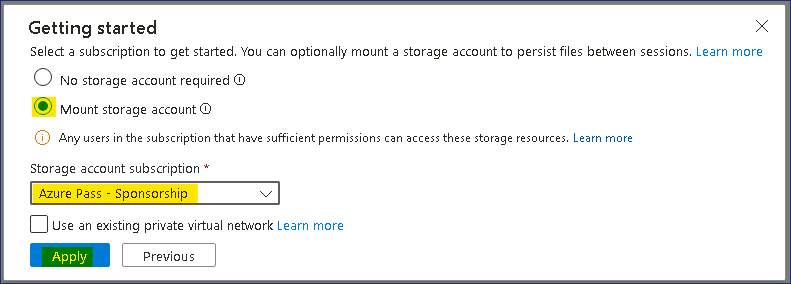

4.  Mount storage account창에서 **We will create storage account for
    you**라디오 버튼을 선택한 후, **Next**를 클릭하세요.

    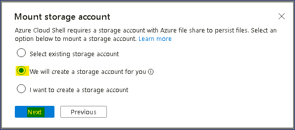

5.  배포가 완료될 때까지 대기해 주세요.

    

6.  Cloud Shell PowerShell 창에서 아래 명령을 입력하여 변수를 설정하고
    PostgreSQL 서버 설치에 사용할 VM을 생성하세요.

    ```$cred = Get-Credential```

7.  자격 증명을 입력하라는 메시지가 표시되면 다음을 입력하세요.

    User - ```postgres```

    Password - ```P@55w.rd1234```

    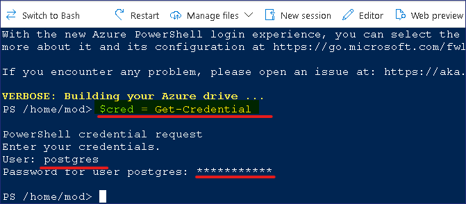

8.  아래 명령을 입력하여 리소스 그룹을 생성하세요.

    ```New-AzResourceGroup -ResourceGroupName "PostgresRG" -Location "WestUS"```

    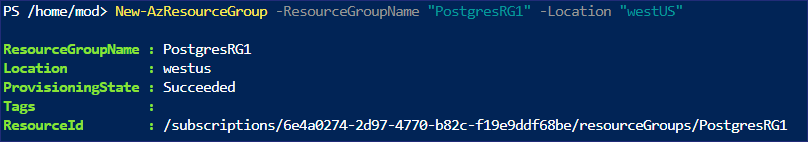

9.  아래 명령을 입력하여 Windows Server 2019 Datacenter VM을 배포하세요.

    #
        New-AzVm `
            -ResourceGroupName "PostgresRG" `
            -Name "PostgresSrv" `
            -Location "WestUS" `
            -VirtualNetworkName "PGVnet" `
            -SubnetName "PGSubnet" `
            -SecurityGroupName "PostgresNSG" `
            -Securitytype "Standard" `
            -PublicIpAddressName "PostgresSrvIP" `
            -ImageName "Canonical:0001-com-ubuntu-server-jammy:22_04-lts-gen2:latest" `
            -Credential $cred `
            -Size "Standard_b2ms"

    

10. 배포가 완료되면 아래와 같이 표시됩니다.

    

11. 아래 명령을 실행하여 Ubuntu VM에 연결하세요. 이전 명령의 output에서
    나온 **FullyQualifiedDomainName**으로 command을 대체하세요.

    

    ```ssh postgres@FullyQualifiedDomainName```

    

12. Continue하라는 메시지가 표시되면 **yes**를 입력하고, 배포 과정 중에
    제공된 비밀번호를 입력하세요 - ```P@55w.rd1234```.

13. Ubuntu 서버에 성공적으로 연결됩니다.

    

14. 이제 Ubuntu VM에 **PostgreSQL ver. 16**을 설치하고, 아래 명령을
    실행하여 자동화된 repository 구성을 설정할 것입니다.


    ```sudo apt install -y postgresql-common```

    ```sudo /usr/share/postgresql-common/pgdg/apt.postgresql.org.sh```

    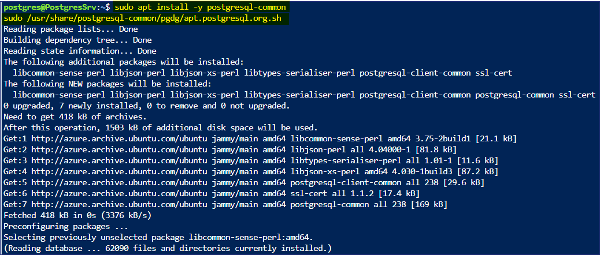

    

15. 계속 지행하기 위해Enter키를 누르세요.

    

    

16. 아래 명령을 실행하여 **import the repository signing key**를 진행할
    것입니다.


    ```sudo apt install curl ca-certificates```

    ```sudo install -d /usr/share/postgresql-common/pgdg```

    ```sudo curl -o /usr/share/postgresql-common/pgdg/apt.postgresql.org.asc --fail https://www.postgresql.org/media/keys/ACCC4CF8.asc```

    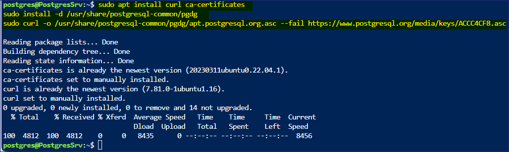

17. 아래 명령을 실행하여 **create the repository configuration file**을
    진행할 것입니다**.**

    ```sudo apt update```

    ```sudo apt install gnupg2 wget```

    ```sudo sh -c 'echo "deb http://apt.postgresql.org/pub/repos/apt $(lsb_release -cs)-pgdg main" > /etc/apt/sources.list.d/pgdg.list'```

    ```curl -fsSL https://www.postgresql.org/media/keys/ACCC4CF8.asc | sudo gpg --dearmor -o /etc/apt/trusted.gpg.d/postgresql.gpg```

    

18. 아래 명령을 실행하여 **update the package lists**를 진행할 것입니다.

    ```sudo apt update```

    

19. 아래 명령을 실행하여 **install the latest version of PostgreSQL**를
    진행할 것입니다.

    ```sudo apt install postgresql-16 postgresql-contrib-16```


    

    > **참고 - 설치는 1~2분 안에 완료됩니다.**

    

    

20. 설치가 완료되면 아래 명령을 입력하여 PSQL utility를 시작하세요.

    ```Psql```

    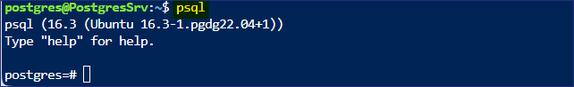

21. psql에서 **postgres** 계정의 비밀번호를 설정할 것입니다.

    ```\password postgres```

22. 비밀번호를 ```postgres``` 로 입력하고, 다시 한번
```postgres``` 로 입력하세요.

    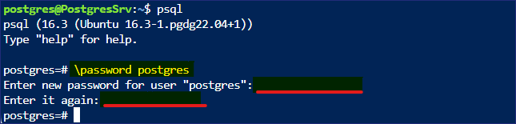

23. 이제PostgreSQL에 원격으로 액세스할 수 있도록 네트워크 및 기타 권한을
    설정하겠습니다.

24. 아래 명령을 실행하여 **postgresql.conf** 파일에 액세스하세요.


    ```\q```

    ```sudo nano /etc/postgresql/16/main/postgresql.conf```

25. 파일이 열리면 아래로 스크롤하여 아래와 일치하도록 설정을
    업데이트하세요.

    > **Connection Settings** 에서 \#를 제거하고 **listen_addresses = '\*'** 변경하세요.

    

    > **WRITE-AHEAD LOG에서 \#를 제거하고 wal_level = logical 변경하세요.**

    

26. 변경이 완료되면 **Ctrl + X를** 누르세요.

    

27. **Y**를 입력한 후 enter를 눌러 확인하세요.

28. 아래 명령을 실행하여 **pg_hba.conf** 파일에 액세스하세요.

    ```sudo nano /etc/postgresql/16/main/pg_hba.conf```

29. 파일이 열리면 아래로 스크롤하여 파일 하단에 아래 줄을 추가합니다.

    ```
    host all all 0.0.0.0/0 md5
    host all all ::/0 md5
    ```

    

30. 변경이 완료되면 **Ctrl + X**를 누르세요.

    

31. **Y**를 입력한 후 enter를 눌러 확인하세요.

32. 아래 명령을 실행하여 PostgreSQL 서비스를 다시 시작하세요.

    ```sudo service postgresql restart```

    

33. Azure Portal에서 !!Resource groups!!을 검색하고 선택하세요.

    

34. Resource groups 목록에서 **PostgresRG**를 선택한 후, VM -
    **PostgresSrv**를 선택하세요.

35. **PostgresSrv** 페이지에서 **Networking setting**을 선택한 후, **+
    Create port rule**을 클릭하고 **Inbound port Rule**을 선택하세요.

    

36. **Add inbound security rule** 페이지의 드롭다운 메뉴에서
    service항목에 **PostgreSQL**를 선택한 후, **Add** 버튼을 클릭하세요.

    

37. 아래 이미지와 같은 알림이 표시됩니다.

    

38. 이제 PostgreSQL 서버에 원격 액세스 준비가 되었습니다.

**작업 2 - 온프레미스 환경용 PostgreSQL 데이터베이스 생성**

1.  이제Migration에 사용할 샘플 데이터베이스를 PostgreSQL 서버로
    가져옵니다.

2.  DVD Rental 데이터베이스에는 15개의 테이블이 있습니다.

    

3.  Azure Portal에서 Azure Cloud Shell을 여세요.

    

4.  Cloud Shell이 Bash로 실행되었는지 확인한 후, 아래 명령을 실행하여
    **PostgresSrv** VM에 연결하세요.

    ```ssh postgres@ServerDNSName```

    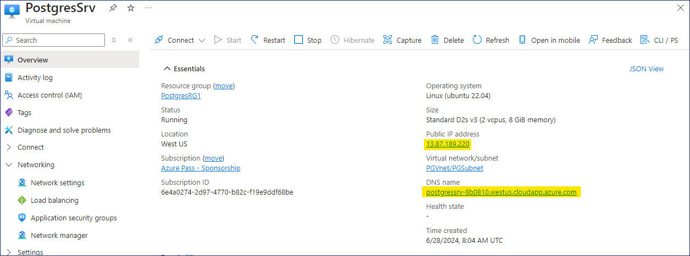

5.  Continue라는 메시지가 표시되면 **yes**라고 입력한 후, 비밀번호를
    입력하세요 - ```P@55w.rd1234```

6.  Ubuntu 서버에 성공적으로 연결이 됩니다.

    

7.  **postgres@PostgresSrv** 프롬프트에서 아래 명령을 실행하여
    데이터베이스를 복원하는 데 사용할 파일을 복사할 **folder**를
    만드세요.

    ```mkdir dvdrentalbkp```

    

8.  실습용 가상 머신에서 시작 메뉴를 마우스 오른쪽 버튼으로 클릭하고
    Windows Terminal (admin)을 선택하세요.

    

9.  Windows PowerShell 창에서 다음 명령을 실행하여 **PostgreSQL**
    데이터베이스 백업을 **PostgresSrv**의 **dvdrentalbkp** 폴더에
    복사하세요.

    <font color=orangered>
    
    **참고** - 명령을 실행하기 전에 **FQDN of your Ububtu Server VM**으로
    명령을 대체하세요. **Task 1 - step 11**를 참조하세요.

    </font>
    
    ```scp "C:\Labfiles\dvdrental.tar"postgres@FQDNofUbubtuServerVM:"dvdrentalbkp"```

 
    Continue하라는 메시지가 표시되면 **yes**라고 입력한 후, 비밀번호를
    입력하세요 - ```P@55w.rd1234```

    

    
10. 프롬프트의 탭으로 다시 돌아가서 **postgres@PostgresSrv** 아래 명령을
    실행하여 PSQL을 시작하세요.

    ```psql```

    

11. **psql** 프롬프트에서 아래 명령을 실행하여 데이터베이스를
    생성하세요.

    ```CREATE DATABASE dvdrental;```

    

    ```\q```

    

12. 다시 **postgres@PostgresSrv** 프롬프트에서 아래 명령을 입력하여
    백업을 새로 생성한 데이터베이스로 복원하세요.

    ```cd dvdrentalbkp```

    ```pg_restore -U postgres -d dvdrental "dvdrental.tar"```

    

    > **참고** - 오류 또는 경고 메시지가 표시되더라도 무시해도 괜찮으며, 빈
    데이터베이스는 15개의 테이블로 업데이트됩니다.

13. 아래 명령을 실행하여 데이터베이스 세부 정보를 확인할 수 있습니다.

    ```psql```

    ```\c dvdrental```

    

    ```\dt```

    

**작업 3 - PostgreSQL flexible Server용 Azure Database생성**

1.  Edge 브라우저를 열고 Azure Portal ```https://portal.azure.com``` 로이동하세요.

2.  Postgres를 검색하고 **Azure Database for PostgreSQL flexible Servers** 를 선택하세요.

    

3.  **+ Create**에 클릭하세요.

    

4.  **Basics** 탭의 **New Azure Database for PostgreSQL Flexible
    Server**페이지에서 아래 세부 정보를 입력해 주세요.

    - Resource group – Click on Create new and provide name
      – ```RG4AzPGDb```

    - Server name - ```ad4pfssrvXXXXX``` . XXXXX임의의 숫자로 대체

    - Region – **West US**

    - PostgreSQL version – **16**

    - Workload type – **Production**

    

    * High availability - **Disabled**

    * Authentication method – **PostgreSQL Authentication only**

    * Admin username – ```postgres```

    * Password – ```P@55w.rd1234```

    * Confirm password – ```P@55w.rd1234```

    * Click on **Next: Networking >**

    

5.  **Networking** 탭에서 **Allow public access from any Azure services
    within Azure to this server** 체크박스를 선택하고, **+ Add Client IP
    address** 를 클릭하여 **PostgresSrv**의 **Public IP address**도
    추가한 후, **Review + create**  버튼을 클릭하세요.

    

    

6.  세부 정보를 검토하고 **Create** 버튼을 클릭하세요.

    

7.  배포가 시작됩니다.

    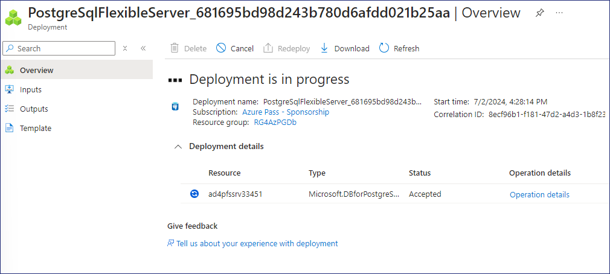

    > **참고** - 배포 완료까지 약 10분이 소요됩니다.

8.  배포가 완료되면 **Go to resource** 버튼을 클릭하세요.

    

**작업 4 - PostgreSQL Database를 Azure Database for PostgreSQL flexible
server (Migration)로 Migration 진행**

1.  **Azure Database for PostgreSQL flexible server**의 **Overview**
    페이지가 열립니다.

    

2.  Overview 페이지를 검토하고 다양한 탭을 확인하세요.

    

3.  **Settings**에서**Databases**를 선택하고, 세개의 데이터베이스를
    확인할 수 있습니다.

    

4.  **Migration** 을 클릭한 다음, **+ Create** 버튼을 선택하세요.

    

5.  **Setup** 탭의 **Migrate PostgreSQL to Azure Database for PostgreSQL
    Flexible Server** 페이지에서 아래 정보를 입력한 후, **Next: Select
    Runtime Server\>**을 클릭하세요.

    - Migration name - ```PostgreSQLToAzurePG```

    - Source server – **On-premise Server**

    - Migration option – **Validate and Migrate**

    - Migration mode – **Online**

    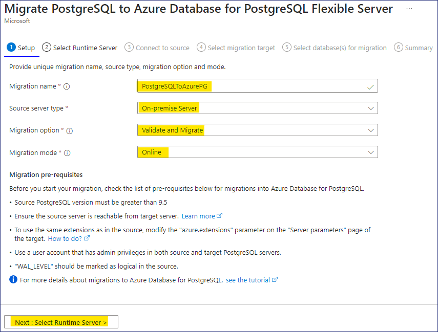

6.  **Select Runtime Server**탭에서 **Next: Connect to source\>**
    클릭하세요.

    

7.  **Connect to source tab**탭에서 아래 세부 정보를 입력하고, **Next :
    Select migration target\>** 클릭하세요.

    - Server name – **Public IP address / DNS name of PostgresSrv VM**

    - Port – ```5432```

    - Server admin login name - ```postgres```

    - Password – ```postgres```

    - SSL mode – **Prefer**

    - Test Connection – Click on **Connect to source**

    >  **테스트 연결이 성공적으로 이루어질 때까지 대기해 주세요.**

    

8.  **Select migration target** 탭에서 아래 세부 정보를 입력하세요.

    - Password - ```P@55w.rd1234```

    - Test Connection – **Connect to source** 클릭하세요

    > **테스트 연결이 성공적으로 이루어질 때까지 대기해 주세요.**

- **Next : Select database(s) for migration** 클릭하세요.

    

9.  **Select database(s) for migration** 탭에서 데이터베이스 -
    **dvdrental**을 선택한 후, **Next: Summary\>**를 클릭하세요.

    

10. **Summary** 탭에서 표시된 정보를 검토하고 **Start Validation and
    Migration** 버튼을 클릭하세요.

    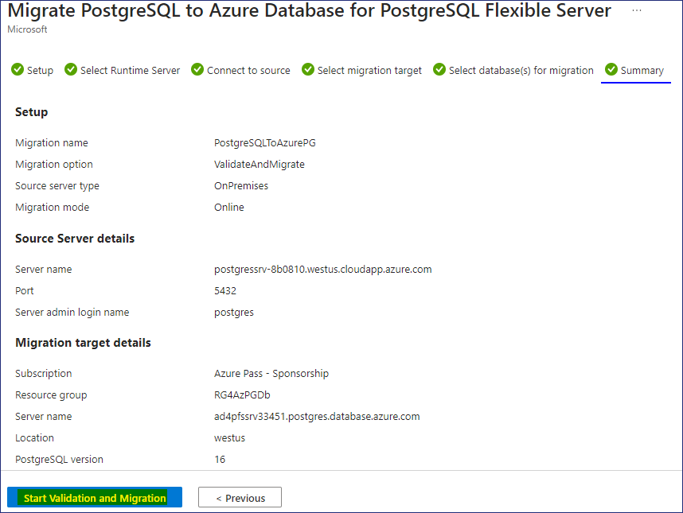

11. Migration페이지에서 **PostgreSQLToAzurePG** 링크를 클릭하세요.

    

12. **PostgreSQLToAzurePG** 페이지에서 새로 고침 버튼을 클릭하여
    업데이트를 확인하세요.

    

13. **Dvdrenta**라는 Database name을 클릭하세요.

    

14. **Validation** 탭에서 validation 작업 세부 정보를 확인할 수 있어야
    합니다.

    

15. **Migration** 탭에 대기 중인 migration상태가 표시됩니다.

    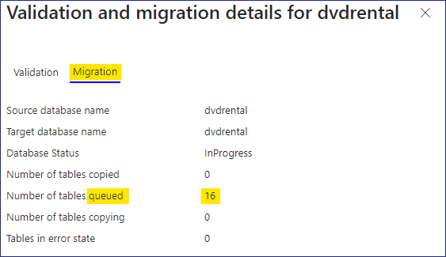

16. **PostgreSQLToAzurePG** 페이지에서 새로 고침 버튼을 다시 클릭하면
    migration 작업도 완료되었다는 것을 확인할 수 있습니다. 이제
    **Waiting for User Action**라는 메시지가 표시되며,
    **Cutover** 버튼을 클릭하세요.

    

17. **Please perform the following steps manually before doing the
    cutover** 메시지가 표시되면 **Yes** 버튼을 클릭하세요.    

    

18. **PostgreSQLToAzurePG** 페이지에서 새로 고침 버튼을 다시 클릭하면
    **Migration details**에 Cutover in progress상태가 표시됩니다.

    

19. Cutover가 **Completed**되면, **PostgreSQLToAzurePG** 블레이드를
    닫으세요.

    

20. **Migration**페이지로 돌아가면 PostgreSQL database Migration이
    **Succeeded**을 상태를 확인할 수 있습니다.

    

21. 설정에서 **Databases**를 선택하고 **dvdrental**을 선택한 다음,
    **Connect** 버튼을 클릭하세요.

    

22. Cloud Shell이 열리면 비밀번호를 입력하라는 메시지가 표시되고,
    ```P@55w.rd1234```로 비밀번호를 입력하세요.

    

23. 데이터베이스에 성공적으로 연결되면 **devrental=\>** 로 표시됩니다.

24. 아래 명령을 실행하여 Target 데이터베이스의 테이블 목록을 확인하세요.

    ```\dt```

    

    > **참고** - 이 테이블은 소스 데이터베이스의 테이블과 동일합니다.

    

**따라서 온-프레미스 PostgreSQL Database를 Azure Database for PostgreSQL
Flexible Server로 성공적으로 마이그레이션했습니다**.

**요약**

이번 실습에서는PostgreSQL Database를 호스팅하기 위해 가상 머신을 배포한
후, **Azure Database for Postgres Flexible Server (Migration)**를
사용하여 PostgreSQL database를 마이그레이션했습니다**.**


