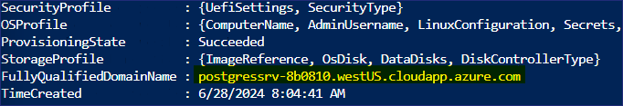
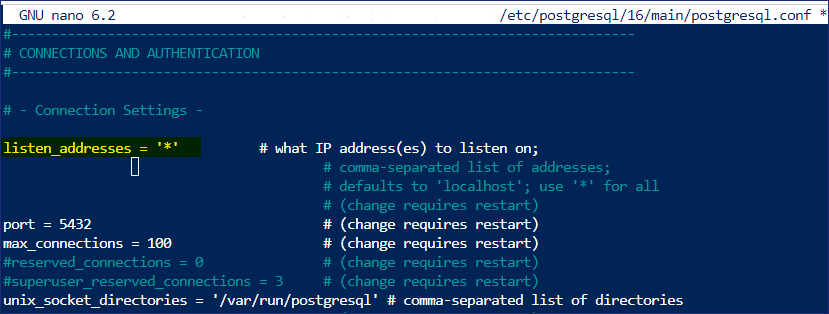
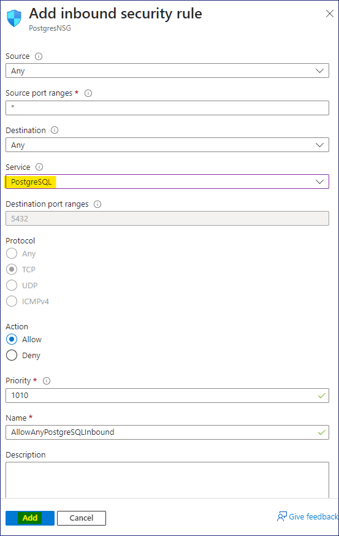
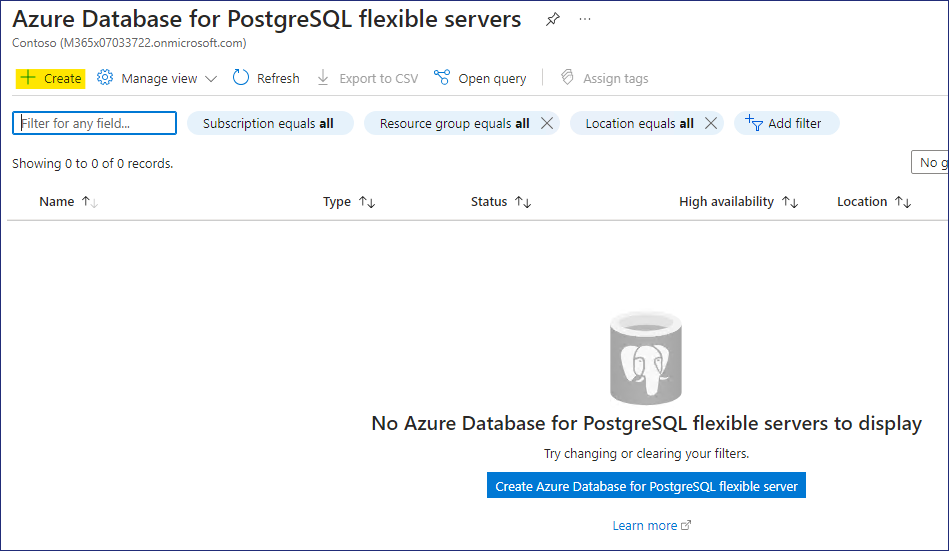
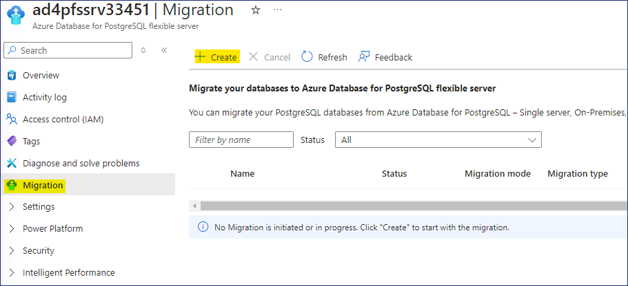
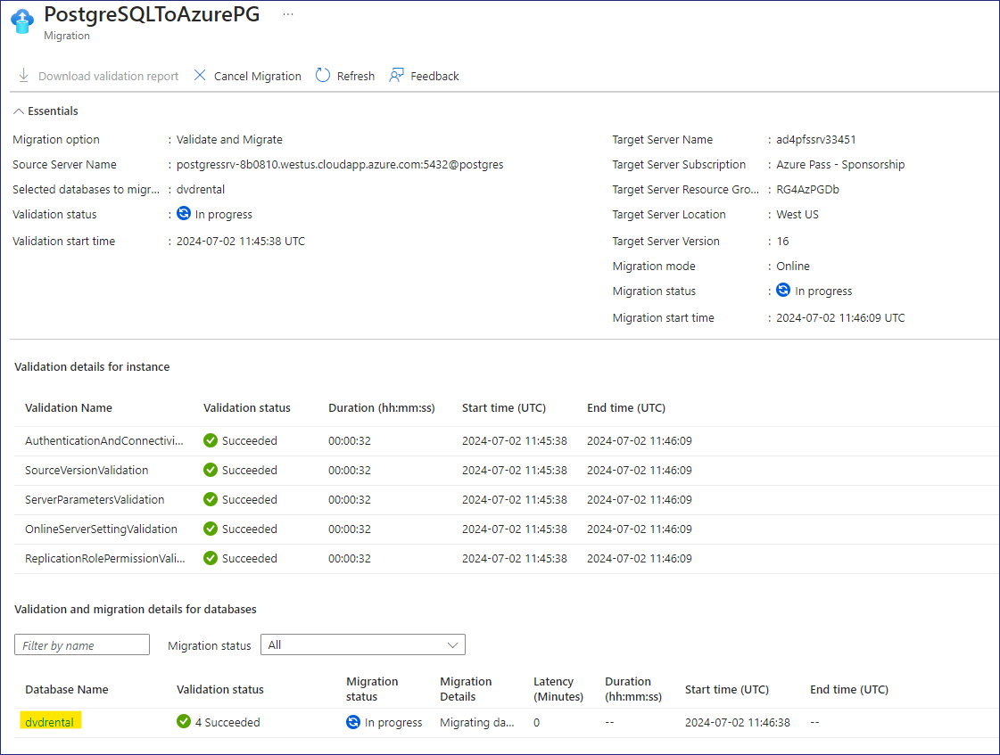
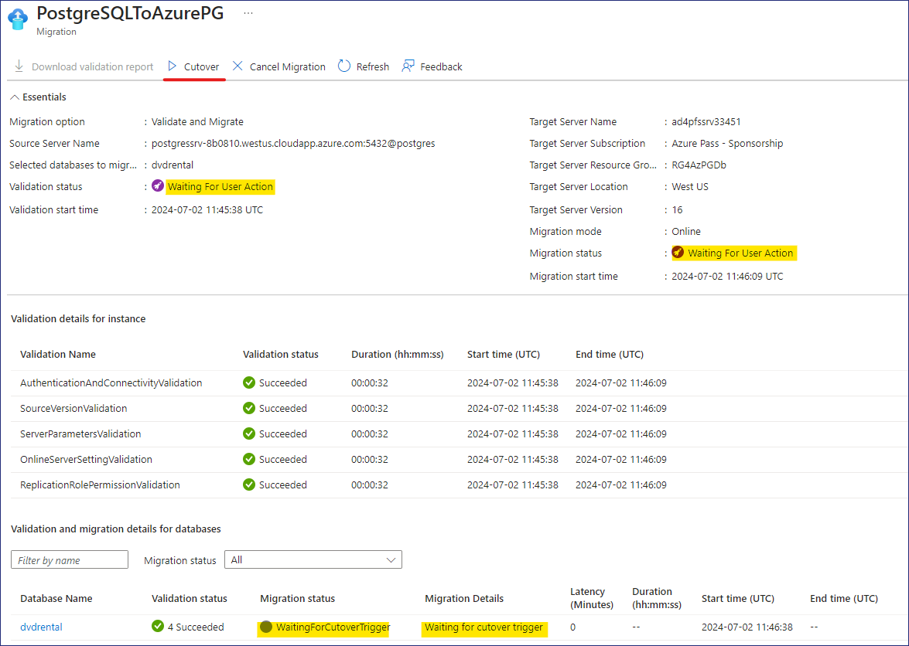

# 實驗室 3 - 將 PostgreSQL 遷移到 Azure。

**目標**

在實驗室中，我們將部署一個虛擬機器來託管 **PostgreSQL
資料庫**，並創建所需的 PostgreSQL **基礎設施**，然後使用 **Azure
Database for PostgreSQL 靈活伺服器（遷移）** 來遷移 PostgreSQL
**資料庫。**     

**任務 1 - 部署虛擬機器，為企業內部環境託管 PostgreSQL 資料庫。**

我們將部署 **Ubuntu 22.0.4.4 LTS** 虛擬機器，在上面安裝 **PostgreSQL
Server 16**，然後創建用於遷移的示例資料庫。

1.  從 Azure Portal `https://portal.azure.com` 打開 Azure 雲外殼

    

2.  點擊 **PowerShell** 按鈕。

    

3.  在 "**開始 "**視窗中，選擇 "**安裝存儲帳戶** "選項按鈕，然後選擇
    "**Azure 通行證-贊助 "**訂閱，然後按一下 "**應用** "按鈕。

    

4.  在 "安裝存儲帳戶 "視窗中，選擇 "**我們將為您創建存儲帳戶**
    "選項按鈕，然後按一下 "**下一步**"。

    

5.  等待部署完成

    

6.  在 Cloud Shell PowerShell 視窗中鍵入以下命令配置變數並創建用於安裝
    PostgreSQL 伺服器的虛擬機器。

    `$cred = Get-Credential`

7.  提示輸入證書時，請提供以下資訊

    用戶 - `postgres`

    密碼 - `P@55w.rd1234`

    

8.  輸入以下命令創建資源組

    `New-AzResourceGroup -ResourceGroupName "PostgresRG" -Location "WestUS"`

    

9.  輸入以下命令部署 Windows Server 2019 Datacenter 虛擬機器

    #
        New-AzVm `
            -ResourceGroupName "PostgresRG" `
            -Name "PostgresSrv" `
            -Location "WestUS" `
            -VirtualNetworkName "PGVnet" `
            -SubnetName "PGSubnet" `
            -SecurityGroupName "PostgresNSG" `
            -Securitytype "Standard" `
            -PublicIpAddressName "PostgresSrvIP" `
            -ImageName "Canonical:0001-com-ubuntu-server-jammy:22_04-lts-gen2:latest" `
            -Credential $cred `
            -Size "Standard_b2ms"

    

10. 部署完成後，將顯示如下內容

    

11. 運行以下命令連接 Ubuntu 虛擬機器，請使用上一條命令輸出結果中的
    "**FullyQualifiedDomainName "** 替代該命令

    

    > **注意** - 在记事本中，从上一个命令的输出中复制并粘贴 FullyQualifiedDomainName，因为这在稍后的任务中也会需要。

    

    

     `ssh postgres@FullyQualifiedDomainName`

    

12. 當提示繼續時，鍵入 "**是**"，然後輸入部署時提供的密碼 -
    `P@55w.rd1234`

13. 它應該能成功連接到 Ubuntu 伺服器

    

14. 現在，我們將在 Ubuntu 虛擬機器上安裝 **PostgreSQL ver.**在 Ubuntu
    虛擬機器上安裝 PostgreSQL **第 16**
    版後，我們將運行以下命令設置自動版本庫配置

    `sudo apt install -y postgresql-common`

    `sudo /usr/share/postgresql-common/pgdg/apt.postgresql.org.sh`

    

    

15. 按鍵盤上的 Enter 鍵繼續。

    

    

16. 我們將通過運行以下命令**導入版本庫簽名金鑰**。

    `sudo apt install curl ca-certificates`

    `sudo install -d /usr/share/postgresql-common/pgdg`

    `sudo curl -o /usr/share/postgresql-common/pgdg/apt.postgresql.org.asc --fail https://www.postgresql.org/media/keys/ACCC4CF8.asc`

    

17. 我們將運行以下命令**創建版本庫設定檔**

    `sudo apt update`

    `sudo apt install gnupg2 wget`

    `sudo sh -c 'echo "deb http://apt.postgresql.org/pub/repos/apt $(lsb_release -cs)-pgdg main" > /etc/apt/sources.list.d/pgdg.list'`

    `curl -fsSL https://www.postgresql.org/media/keys/ACCC4CF8.asc | sudo gpg --dearmor -o /etc/apt/trusted.gpg.d/postgresql.gpg`

    

18. 我們將運行以下命令**更新軟體包列表**

    `sudo apt update`

    

19. 我們將運行以下命令**安裝最新版本的 PostgreSQL**

    `sudo apt install postgresql-16 postgresql-contrib-16`

    

    > **注意 - 安裝應在 1-2 分鐘內完成**

    

    

20. 安裝完成後，鍵入以下命令啟動 PSQL 實用程式

    `Psql`

    

21. 我們將在 psql 中為 **postgres** 帳戶設置密碼

    `\password postgres`

22. 輸入密碼為 `postgres` 再輸入密碼為

     `postgres`

    

23. 現在，我們將為所有要遠端存取的 PostgreSQL 設置網路和其他許可權

24. 運行以下命令訪問 **postgresql.conf** 文件

    `\q`

    `sudo nano /etc/postgresql/16/main/postgresql.conf`

25. 打開檔後，向下滾動並更新設置，使其與以下內容一致

    **在 "連接設置 "下移除 \# 並更改 listen_addresses = '\*'**

    

    **在 WRITE-AHEAD LOG 下，刪除 \# 並更改 wal_level = logical**

    

26. 完成上述更改後，按下 **Ctrl  X**

    

27. 按 **Y** 鍵並回車確認。

28. 運行以下命令訪問 **pg_hba.conf** 文件

    `sudo nano /etc/postgresql/16/main/pg_hba.conf`

29. 打開檔後，向下滾動，在檔底部添加以下行文

    `host all all 0.0.0.0/0 md5`

    `host all all ::/0 md5`
    

    

30. 完成上述更改後，按下 **Ctrl  X**

    

31. 按 **Y** 鍵並回車確認。

32. 運行以下命令重啟 PostgreSQL 服務

    `sudo service postgresql restart`

    

33. 在 Azure Portal 上，搜索並選擇！！資源組！！

    

34. 從資源組列表中選擇 **PostgresRG**，然後選擇虛擬機器 -
    **PostgresSrv**

35. 在 **PostgresSrv** 頁面， **Networking setting** ，然後點擊 **
    Create port rule** 並選擇 **Inbound port Rule**     
    

36. 在  **Add inbound security rule** 頁面，在服務下拉式功能表中選擇
    **PostgreSQL**，然後按一下 **Add** 按鈕。

    

37. 您應該會收到下圖所示的通知。

    

38. 現在，可以遠端存取 PostgreSQL 伺服器了。

**任務 2 - 為內部部署環境創建 PostgreSQL 資料庫。**

1.  現在，我們將向 PostgreSQL 伺服器導入一個示例資料庫，並將其用於遷移

2.  DVD 租賃資料庫中有 15 個表

    

3.  從 Azure 門戶打開 Azure 雲外殼

    

4.  確保使用 Bash 啟動雲外殼，然後運行以下命令連接 **PostgresSrv**
    虛擬機器

    `ssh postgres@ServerDNSName`

    

5.  提示繼續時，輸入 "**是"**，然後輸入密碼 - `P@55w.rd1234`

6.  它應該能成功連接到 Ubuntu 伺服器

    

7.  在 **postgres@PostgresSrv**
    **提示符**下運行以下命令，創建一個**資料夾**來複製用於恢復資料庫的檔。

    `mkdir dvdrentalbkp`

    

8.  在實驗室虛擬機器上，按右鍵 "開始 "功能表並選擇 Windows
    終端（管理員）

    

9.  在 Windows PowerShell 視窗運行命令，將 **PostgreSQL**
    資料庫備份複製到 **PostgresSrv** 上的 **dvdrentalbkp** 資料夾。

    
    
    > **注意**：在運行命令前**，**請用 **Ububtu 伺服器虛擬機器的 FQDN of your Ububtu Server VM** 。

    

    `scp "C:\Labfiles\dvdrental.tar"postgres@FQDNofUbubtuServerVM:"dvdrentalbkp"`

    提示繼續時，輸入 "**是"**，然後輸入密碼 - `P@55w.rd1234`

    

10. 切換回選項卡上的提示 **postgres@PostgresSrv** 運行以下命令啟動 PSQL

    `psql`

    

11. 在 **psql** 提示符下運行以下命令創建資料庫

    `CREATE DATABASE dvdrental;`

    

    `\q`

    

12. 在 **postgres@PostgresSrv**
    提示下鍵入以下命令，將備份還原到新創建的資料庫中。

    `CD DVDrentalbkp`

    `pg_restore -U postgres -d dvdrental "dvdrental.tar "`

    

    > **注意**--如果出現任何錯誤或警告資訊，可以安全地忽略它們，並用 15 個表更新空白資料庫。

13. 我們可以通過運行以下命令來檢查資料庫的詳細資訊

    `psql`

    `\c dvdrental`

    

    `\dt`

    

**任務 3 - 為 PostgreSQL 靈活伺服器創建 Azure 資料庫**

1.  打開 Edge 流覽器，導航到 Azure Portal `https://portal.azure.com`

2.  搜索 `postgres` 並選擇 **Azure Database for PostgreSQL flexible
    Servers**

    

3.  點擊 **Create**

    

4.  在 **Basics**  選項卡上的 "**為 New Azure Database for PostgreSQL
    Flexible Server** 頁面，提供以下詳細資訊

    - 資源組 - 按一下創建新組並提供名稱 - `RG4AzPGDb`

    - 伺服器名稱 - `ad4pfssrvXXXXX` 用亂數代替 XXXXX

    - 地區 -  **West US**

    - PostgreSQL 版本 - **16**

    - 工作量類型 - **Production**

    

    - 高可用性 - **Disabled**

    - 驗證方法 - **PostgreSQL Authentication only**

    - 管理員用戶名 - `postgres`

    - 密碼 - `P@55w.rd1234`

    - 確認密碼 - `P@55w.rd1234`

    - 按一下 **Next: Networking \>**

    

5.  在 **Networking**  選項卡上，啟用 **Allow public access from any
    Azure services within Azure to this server** ，然後按一下 **Add
    Client IP address** ，同時添加 **PostgresSrv** 的 **Public IP
    address** ，然後按一下 "**Review  create（審查創建**）"按鈕。

    

    

6.  查看詳細資訊並按一下 **Create** 按鈕。

    

7.  部署將開始。

    

    > **注意** - Deployment 需要 10 分鐘左右才能完成

8.  部署完成後，按一下 **Go to resource** 按鈕。

    

**任務 4 - 將 PostgreSQL 資料庫遷移到 Azure Database for PostgreSQL
靈活伺服器（遷移）**

1.  應打開 **Azure Database for PostgreSQL 靈活伺服器的**
    **Overview** 頁面

    

2.  查看概覽頁面並查看各個選項卡

    

3.  在 **Settings** 下選擇 **Databases** ，應能看到列出的 3 個資料庫。

    

4.  點擊 **Migration** ，然後選擇 ** Create** 按鈕。

    

5.  在 "**設置** "選項卡上的 "**將 PostgreSQL 遷移到 Azure Database for
    PostgreSQL Flexible Server** "頁面，提供以下資訊，然後按一下 **Next:
    Select Runtime Server\>**

    - 遷移名稱 - `PostgreSQLToAzurePG`

    - 原始伺服器 - **On-premise Server**

    - 遷移選項 -  **Validate and Migrate**

    - 遷移模式 - **Online**

    

6.  在 **Select Runtime Server** 選項卡上按一下 **Next: Connect to
    source\>**

    

7.  在 **Connect to source tab 選項卡**上，提供以下詳細資訊，然後按一下
     **Next : Select migration target\>**

    - 伺服器名稱 -  **Public IP address / DNS name of PostgresSrv VM**

    - 埠 - `5432`

    - 伺服器管理員登錄名 - `postgres`

    - 密碼 - `postgres`

    - SSL 模式 - **Prefer**

    - 測試連接 - 點擊 **Connect to source**

    > **Wait for the test connection to be Successful**

    

8.  在 **Select migration target** 選項卡上，提供以下詳細資訊

    - 密碼 - `P@55w.rd1234`

    - 測試連接 - 點擊 **Connect to source**

    > **等待測試連接成功**

- 按一下 **Next : Select database(s) for migration**

    

9.  在 **Select database(s) for migration** 選項卡上，選擇資料庫 -
    **dvdrental**，然後按一下 **Next: Summary\>**

    

10. 在 **Summary** 頁面，查看顯示的資訊，然後按一下 **Start Validation
    and Migration** 按鈕。

    

11. 在遷移頁面，按一下 **PostgreSQLToAzurePG** 連結

    

12. 在 **PostgreSQLToAzurePG** 頁面上，按一下刷新按鈕查看更新。

    

13. 按一下資料庫名稱 **dvdrental**

    

14. 在 **Validation** 選項卡上，您應該可以看到驗證任務的詳細資訊。

    

15. 在 **Migration**  選項卡上，將顯示已排隊的遷移狀態。

    

16. 在 **PostgreSQLToAzurePG**
    頁面，再次按一下刷新按鈕，注意遷移任務也已完成，現在將 **Waiting for
    User Action**，按一下 **Cutover** 按鈕。

    

17. 當提示 **Please perform the following steps manually before doing
    the cutover** 時，點擊 " **Yes**  **"**按鈕    

    

18. 在 **PostgreSQLToAzurePG** 頁面上，再次按一下刷新按鈕， **Migration
    details** 下應顯示 "正在**遷移** "狀態。

    

19. **完成**切換後，關閉 **PostgreSQLToAzurePG** 刀片。

    

20. 回到 **Migration** 頁面，我們可以看到 PostgreSQL 資料庫的遷移已經
    **Succeeded** 。

    

21. 選擇設置下的 **Databases** ，選擇 **dvdrental** 並按一下
    **Connect**  按鈕

    

22. 雲外殼打開後會提示輸入密碼，輸入密碼為 `P@55w.rd1234`

    

23. 一旦成功連接到資料庫，它將被列為 **devrental=\>**

24. 運行以下命令列出目標資料庫中的表

    `\dt`

    

    > **注：** 這些表與來源資料庫中的表相同。

    

    > **因此，我們成功地將內部部署的 PostgreSQL 資料庫遷移到了 Azure Database for PostgreSQL Flexible Server**。

**Summary**

在實驗室中，我們部署了一個虛擬機器來託管 PostgreSQL 資料庫，然後使用
**Azure Database for Postgres Flexible Server（遷移）遷移**了 PostgreSQL
**資料庫。**

