# Laboratorio 3 - Migración de PostgreSQL a Azure.

**Objetivo**

En el laboratorio estaremos desplegando una Virtual machine para alojar
la **base de datos** **PostgreSQL** y crear la **infraestructura**
**PostgreSQL** requerida. Luego migraremos la base de datos PostgreSQL
utilizando **Azure Database for Postgres Flexible Server
(Migration)**     

<font color=red>

> **Nota**: Puede descargar los comandos utilizados en este laboratorio: [Comandos](<https://raw.githubusercontent.com/technofocus-pte/migrt2Innovregdepth/refs/heads/Spanish-ES/Lab%20Guides/Lab%203-%20Migrating%20PostgreSQL%20to%20Azure/Lab%203%20-%20Commands..txt>) </font>

### Tarea 1 - Implemente la VM para alojar la base de datos PostgreSQL en el entorno local.

Vamos a desplegar la VM **Ubuntu 22.0.4.4 LTS**, en el que vamos a
instalar **PostgreSQL Server 16** y luego crear la base de datos de
ejemplo que se utilizará para la migración.

1.  Desde el Azure Portal `https://portal.azure.com` abra **Azure Cloud
    Shell**

    

2.  Haga clic en el botón **PowerShell**.

    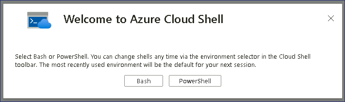

3.  En la ventana **Getting started**, elija el botón de opción **Mount
    storage account** y, a continuación, seleccione la suscripción
    **Azure Pass – Sponsorship** y haga clic en el botón **Apply**.

    

4.  En la ventana Mount storage account, seleccione el botón de opción
    **We will create storage account for you** y, a continuación, haga
    clic en **Next**.

    

5.  Espere a que finalice la implementación.

    

6.  En la ventana Cloud Shell PowerShell escriba los siguientes comandos
    para configurar las variables y crear la VM que se utilizará para
    instalar el servidor PostgreSQL.

    `$cred = Get-Credential`

7.  Cuando se le pida que ingrese sus credenciales, indique lo siguiente

    User - `postgres`

    Password - `P@55w.rd1234`

    

8.  Ingrese el siguiente comando para crear el grupo de recursos

    `New-AzResourceGroup -ResourceGroupName "PostgresRG" -Location "WestUS"`

    

9.  Ingrese el siguiente comando para desplegar la VM -Windows Server
    2019 Datacenter.

    
    ```
    New-AzVm `
        -ResourceGroupName "PostgresRG" `
        -Name "PostgresSrv" `
        -Location "WestUS" `
        -VirtualNetworkName "PGVnet" `
        -SubnetName "PGSubnet" `
        -SecurityGroupName "PostgresNSG" `
        -Securitytype "Standard" `
        -PublicIpAddressName "PostgresSrvIP" `
        -ImageName "Canonical:0001-com-ubuntu-server-jammy:22_04-lts-gen2:latest" `
        -Credential $cred `
        -Size "Standard_b2ms"
    ```
    
    

10. Una vez finalizada la implementación se mostrará lo siguiente

    

11. Ejecute el siguiente comando para conectarse a la VM Ubuntu,
    sustituya el comando utilizando el **FullyQualifiedDomainName** de
    la salida del comando anterior

    

    `ssh postgres@FullyQualifiedDomainName`

    

12. Cuando se le pida que continúe, escriba **Yes** y, a continuación,
    ingrese la contraseña proporcionada durante la implementación -
    `P@55w.rd1234`

13. Debería conectarse correctamente al servidor Ubuntu.

    

14. Ahora instale **PostgreSQL ver. 16** en la VM Ubuntu, estableceremos
    la configuración automatizada del repositorio ejecutando el
    siguiente comando


    `sudo apt install -y postgresql-common`

    `sudo /usr/share/postgresql-common/pgdg/apt.postgresql.org.sh`

    

    

15. Pulse la tecla Enter para continuar.

    

    

16. **Importe la clave de firma del repositorio** ejecutando los
    siguientes comandos:

    `sudo apt install curl ca-certificates`

    `sudo install -d /usr/share/postgresql-common/pgdg`

    `sudo curl -o /usr/share/postgresql-common/pgdg/apt.postgresql.org.asc --fail https://www.postgresql.org/media/keys/ACCC4CF8.asc`

    

17. Ejecute el siguiente comando para **crear el fichero de
    configuración del repositorio**


    `sudo apt update`

    `sudo apt install gnupg2 wget`

    `sudo sh -c 'echo "deb http://apt.postgresql.org/pub/repos/apt $(lsb_release -cs)-pgdg main" > /etc/apt/sources.list.d/pgdg.list'`

    `curl -fsSL https://www.postgresql.org/media/keys/ACCC4CF8.asc | sudo gpg --dearmor -o /etc/apt/trusted.gpg.d/postgresql.gpg`

    

18. Ejecute el siguiente comando para **actualizar las listas de
    paquetes**

    `sudo apt update`

    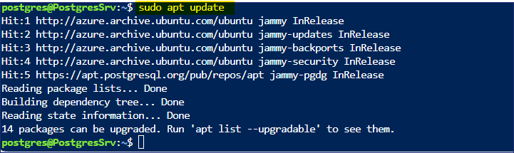

19. Ejecute el siguiente comando para **instalar la última versión de
    PostgreSQL**

    `sudo apt install postgresql-16 postgresql-contrib-16`

    

    > **Nota - La instalación debería completarse en 1-2 minutos**

    

    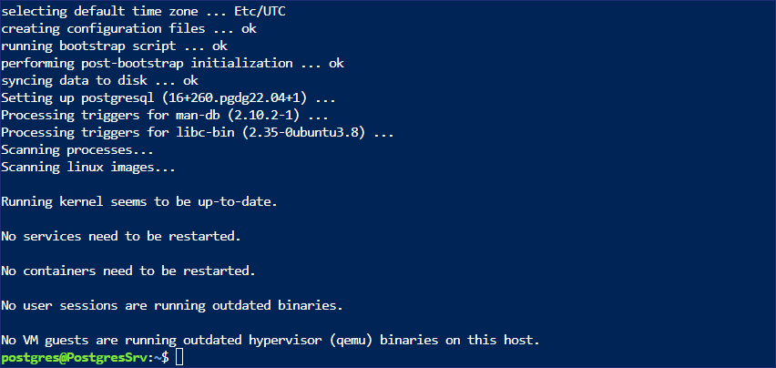

20. Una vez finalizada la instalación, escriba el siguiente comando para
    iniciar la utilidad PSQL

    `Psql`

    

21. Establezca la contraseña para la cuenta **postgres** en psql

    `\password postgres`

22. Ingrese la contraseña como `postgres` ingrésela de nuevo como

    `postgres`

    

23. Ahora, establezca la red y otros permisos a todos los PostgreSQL
    para acceder de forma remota

24. Ejecute el siguiente comando para acceder al archivo
    **postgresql.conf**

    `\q`

    `sudo nano /etc/postgresql/16/main/postgresql.conf`

25. Una vez abierto el archivo, desplácese hacia abajo y actualice la
    configuración para que coincida con la siguiente

    **En Connection Settings, elimine \# y cambie listen_addresses = '\*'.**

    

    **En WRITE-AHEAD LOG elimine el \# y cambie wal_level = logical**

    

26. Una vez realizado el cambio anterior presione **Ctrl + X**

    

27. Presione la letra **Y** para Yes y después presione Enter para
    confirmar.

28. Ejecute el siguiente comando para acceder al archivo **pg_hba.conf**

    `sudo nano /etc/postgresql/16/main/pg_hba.conf`

29. Una vez abierto el archivo, desplácese hacia abajo y añada las
    siguientes líneas en la parte inferior del archivo


    `host all all 0.0.0.0/0 md5`

    `host all all ::/0 md5`


    

30. Una vez realizado el cambio anterior presione **Ctrl + X**

    

31. Presione la letra **Y** para Yes, después presione Enter para
    confirmar.

32. Ejecute el siguiente comando para reiniciar el servidor PostgreSQL

    `sudo service postgresql restart`

    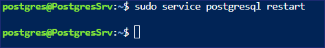

33. En el Azure Portal, busque y seleccione !!Resource groups!!

    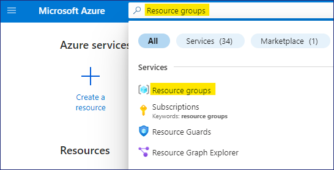

34. De la lista de Resource groups seleccione **PostgresRG** y luego
    seleccione la VM - **PostgresSrv**

35. En la página **PostgresSrv**, seleccione **Networking setting** y
    luego haga click en **+ Create port rule** y elija **Inbound port
    Rule**

    

36. En la página **Add inbound security rule**, en service desde el menú
    desplegable elija **PostgreSQL** y luego haga clic en el botón
    **Add**.

    

37. Debería recibir la notificación como se muestra en la siguiente
    imagen.

    

38. Ahora el servidor PostgreSQL está listo para ser accedido
    remotamente.

### Tarea 2 - Cree una base de datos PostgreSQL para el entorno local.

1.  Ahora importe una base de datos de ejemplo al servidor PostgreSQL
    que utilizaremos para la Migración

2.  Hay 15 tablas en la base de datos DVD Rental

    

3.  Desde el Azure Portal abra Azure Cloud Shell

    

4.  Asegúrese de que Cloud Shell se ha iniciado con Bash, a
    continuación, ejecute el siguiente comando para conectarse a la VM
    **PostgresSrv.**

    `ssh postgres@ServerDNSName`

    

5.  Cuando se le pida que continúe, escriba **Yes** e ingrese la
    contraseña -`P@55w.rd1234`

6.  Debería conectarse correctamente al servidor Ubuntu

    

7.  En el prompt **postgres@PostgresSrv** ejecute el siguiente comando
    para crear una **carpeta** para copiar el archivo que se utilizará
    para restaurar la base de datos.

    `mkdir dvdrentalbkp`

    

8.  En la VM del laboratorio, haga clic con el botón derecho del ratón
    en el menú Inicio y seleccione Windows Terminal (admin)

    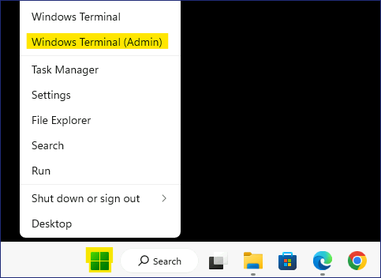

9.  En la ventana de Windows PowerShell ejecute el comando para copiar
    el backup de seguridad de la base de datos PostgreSQL a la carpeta
    **dvdrentalbkp** en el **PostgresSrv**.

    > **Nota** - Sustituya el comando por el **FQDN de su servidor Ubuntu VM**
    antes de ejecutarlo. Consulte **la Tarea 1 - paso 11.**

    `scp "C:\Labfiles\dvdrental.tar"postgres@FQDNofUbubtuServerVM:"dvdrentalbkp"`


    Cuando se le pida que continúe, escriba **Yes** e ingrese la
    contraseña - `P@55w.rd1234`

    

    <font color=blue>

    > **Nota** - Si el archivo **dvdrental.tar** no está presente, se puede
    descargar desde -
    `https://github.com/technofocus-pte/migrt2Innovregdepth/raw/main/Lab%20Guides/Labfiles/dvdrental.tar` 
    y luego, alojarlo en **C:\Labfiles**
    </font>

10. Vuelva a la pestaña en el prompt **postgres@PostgresSrv** y ejecute
    el siguiente comando para activar PSQL

    `psql`

    

11. En el prompt **psql,** ejecute el siguiente comando para crear una
    base de datos

    `CREATE DATABASE dvdrental;`

    

    `\q`

    

12. Regrese al prompt **postgres@PostgresSrv,** escriba el siguiente
    comando para restaurar la copia de seguridad en la base de datos
    recién creada.

    `cd dvdrentalbkp`

    `pg_restore -U postgres -d dvdrental "dvdrental.tar"`

    

    > **Nota** - Si aparece algún mensaje de error o advertencia, se puede
    ignorar con seguridad, y la base de datos en blanco se actualiza con 15
    Tablas.

13. Podemos comprobar los detalles de la base de datos ejecutando los
    siguientes comandos

    `psql`

    `\c dvdrental`

    

    `\dt`

    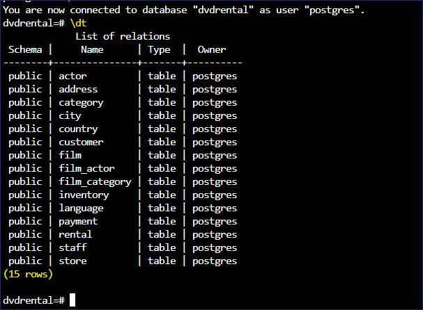

### Tarea 3 - Cree una Azure Database for PostgreSQL flexible Server

1.  Abra el navegador Edge y vaya al Azure Portal
    `https://portal.azure.com`

2.  Busque postgres y elija **Azure Database for PostgreSQL flexible
    Servers.**

    

3.  Haga clic en **+ Create**

    

4.  En la página **New Azure Database for PostgreSQL Flexible Server**,
    en la pestaña **Basics**, proporcione los siguientes detalles

    - Resource group - Haga clic en Crear nuevo e indique el nombre -
      `RG4AzPGDb`

    - Server name - `ad4pfssrvXXXXX` \[sustituya XXXXX por un número
      aleatorio\]

    - Region - **West US**

    - PostgreSQL version - **16**

    - Workload type – **Production**

    

    - High availability - **Disabled**

    - Authentication method - **PostgreSQL Authentication only**

    - Admin username - `postgres`

    - Password - `P@55w.rd1234`

    - Confirm password - `P@55w.rd1234`

    - Haga clic en **Next: Networking \>**

    

5.  En la pestaña **Networking**, active la casilla de verificación
    **Allow public access from any Azure services within Azure to this
    server** y haga clic en **+ Add Client IP address** también agregue
    la **Public IP address** del **PostgresSrv** y luego haga clic en el
    botón **Review + create**.

    

    

6.  Revise los detalles y haga clic en el botón **Create**.

    

7.  Comenzará la implementación.

    

    > **Nota** – La implementación tardará unos 10 minutos en completarse.

8.  Una vez finalizada la implementación, haga clic en el botón **Go to
    resource**.

    

### Tarea 4 - Migre la base de datos PostgreSQL al Azure Database for PostgreSQL flexible server (Migration)

1.  Debería abrirse la página **Overview** del **Azure Database for
    PostgreSQL flexible server** 

    

2.  Revise la página de resumen y verifique las distintas pestañas

    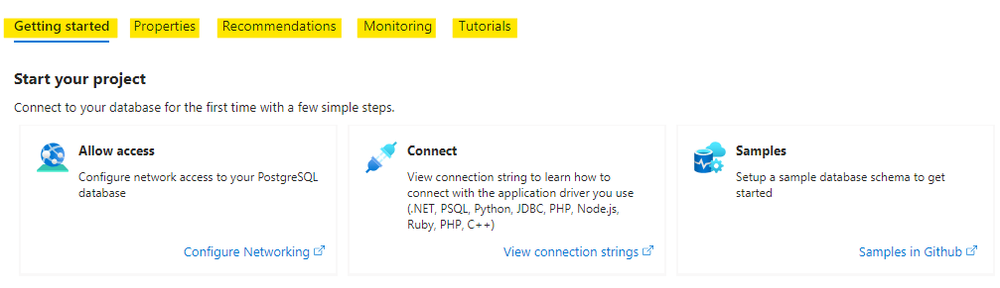

3.  En **Settings** seleccione **Databases**, debería poder ver 3 bases
    de datos listadas.

    

4.  Haga clic en **Migration** y, a continuación, seleccione el botón
    **+ Create**.

    

5.  En la página **Migrate PostgreSQL to Azure Database for PostgreSQL
    Flexible Server** en la pestaña **Setup**, proporcione la siguiente
    información y luego haga clic en **Next: Select Runtime Server\>**

    - Migration name - `PostgreSQLToAzurePG`

    - Source server – **On-premise Server**

    - Migration option – **Validate and Migrate**

    - Migration mode – **Online**

    

6.  En la pestaña **Select Runtime Server** haga clic en **Next: Connect
    to source\>**

    

7.  En la **pestaña Connect to source**, facilite los siguientes datos y
    haga clic en **Next: Select migration target\>**

    - Server name – **Public IP address / DNS name of PostgresSrv VM**

    - Port – `5432`

    - Server admin login name - `postgres`

    - Password – `postgres`

    - SSL mode – **Prefer**

    - Test Connection - Haga clic en **Connect to source**

    > **Espere a que la conexión de prueba sea exitosa**

    

8.  En la pestaña **Select migration target**, facilite los siguientes
    datos

    - Password - `P@55w.rd1234`

    - Test Connection - Haga clic en **Connect to source**

    > **Espere a que la conexión de prueba sea exitosa**

    - Haga clic en **Next: Select database(s) for migration**

    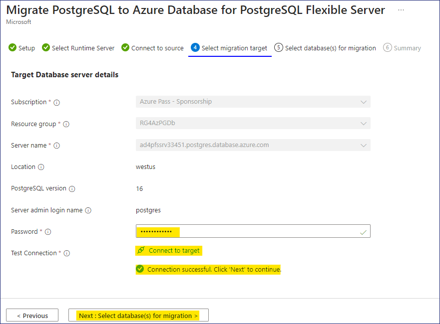

9.  En la pestaña **Select database(s) for migration**, seleccione la
    base de datos - **dvdrental** y, a continuación, haga clic en
    **Next: Summary\>**

    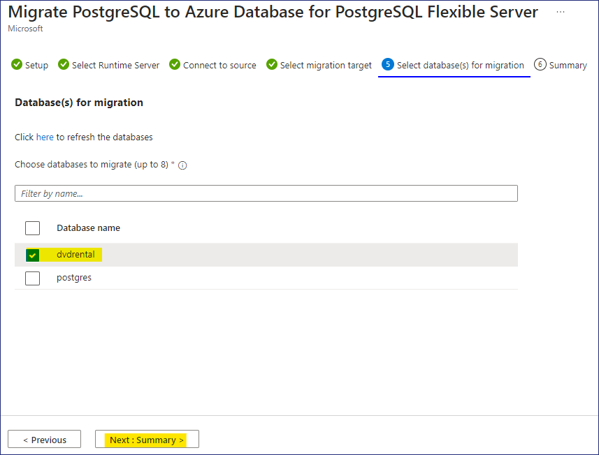

10. En la ventana **Summary**, revise la información mostrada y haga
    clic en el **Start Validation and Migration**.

    

11. En la página Migración, haga clic en el enlace
    **PostgreSQLToAzurePG**

    

12. En la página **PostgreSQLToAzurePG**, haga clic en el botón de
    actualización para ver las actualizaciones.

    

13. Haga clic en el nombre de la base de datos **dvdrental**.

    

14. En la pestaña **Validation** debería poder ver los detalles de las
    tareas de Validación.

    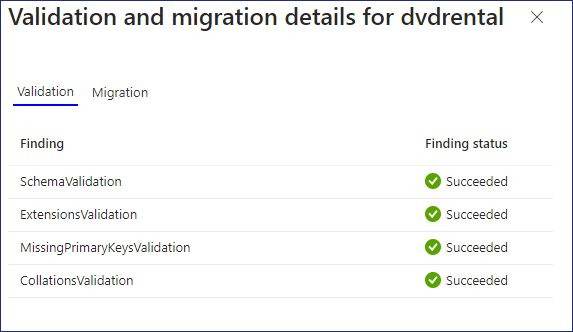

15. En la pestaña **Migration**, se mostrará el estado de la migración
    en cola.

    

16. En la página **PostgreSQLToAzurePG**, haga clic de nuevo en el botón
    refresh. Observe que las tareas de migración se han completado y
    ahora también **Waiting for User Action**, haga clic en el botón
    **Cutover**.

    

17. Cuando se le solicite **Por favor, realice los siguientes pasos
    manualmente antes de hacer el cutover**, haga clic en el botón
    **Yes**    

    

18. En la página **PostgreSQLToAzurePG**, haga clic de nuevo en el botón
    Refresh, el estado de Cutover in progress debería aparecer en
    **Migration details**.

    

19. Una vez **completado** el Cutover, cierre la hoja
    **PostgreSQLToAzurePG**.

    

20. Regrese a la página de **Migration**, puede ver que la Migración de
    la base de datos PostgreSQL se **ha realizado con éxito**.

    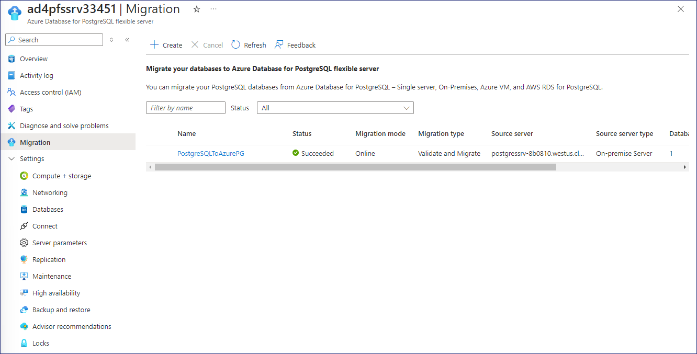

21. Seleccione **Databases** en Settings, seleccione **dvdrental** y
    haga clic en el botón **Connect.**

    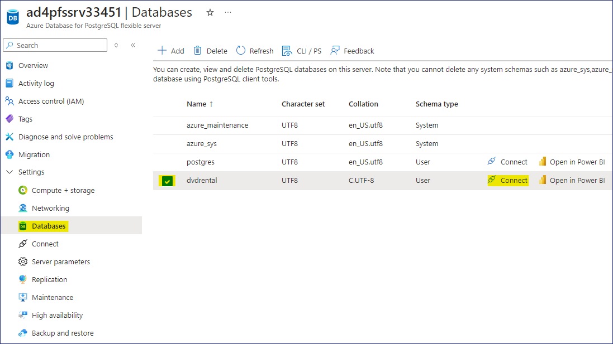

22. Cuando se abra Cloud Shell le pedirá la contraseña, ingrese la
    contraseña como `P@55w.rd1234`

    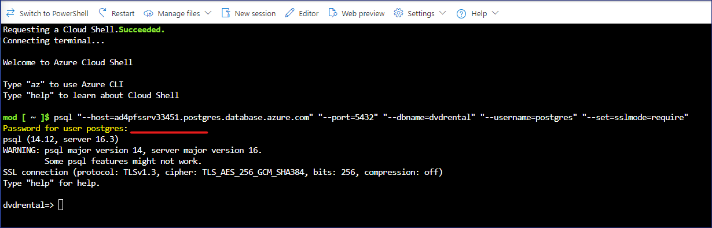

23. Una vez conectado con éxito a la base de datos, aparecerá como
    **devrental=\>**

24. Ejecute el siguiente comando para listar las tablas de la base de
    datos de destino

    `\dt`

    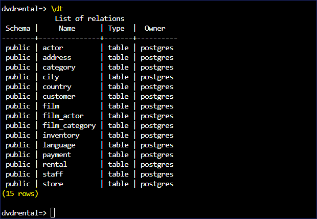

    > **Nota** - Estas tablas son las mismas que en la base de datos Fuente.

    

<font color=darkgreen>

> **Por lo tanto, hemos migrado con éxito la base de datos PostgreSQL
local a Azure Database for PostgreSQL Flexible Server**.

</font>

## Resumen

En el Laboratorio hemos desplegado una Virtual machine para alojar la
base de datos PostgreSQL y luego hemos migrado la Base de Datos
PostgreSQL utilizando **Azure Database for Postgres Flexible Server
(Migration).**


