# Lab 3 - Migrating PostgreSQL to Azure.

**Objective**

In the Lab we would be deploying a Virtual machine to host the
**PostgreSQL database** and create the required **PostgreSQL infrastructure**
and then we will migrate the PostgreSQL Database using the **Azure
Database for Postgres Flexible Server (Migration)** 

## Task 1 – Deploy the Virtual machine to host the PostgreSQL database for the On-premises environment.

We will deploy **Ubuntu 22.0.4.4 LTS** VM, on which we will install
**PostgreSQL Server 16** and then create the Sample Database that will be
used for Migration.

1.  From the Azure Portal `https://portal.azure.com` open the Azure Cloud Shell

    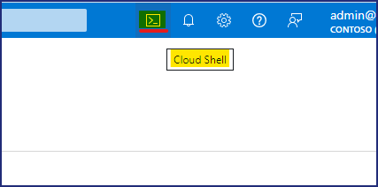

2.  Click on the **PowerShell** button.

    

3.  On the **Getting started** window, choose the radio button for
    **Mount storage account** and then select the **Azure Pass –
    Sponsorship** subscription and then click on the **Apply** button.

    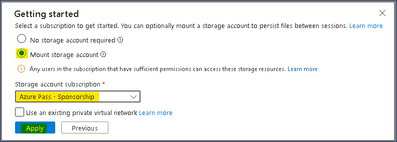

4.  On the Mount storage account window, choose the **We will create
    storage account for you** radio button and then click on **Next**.

    

5.  Wait for the deployment to complete

    

6.  In the Cloud Shell PowerShell window type the below commands to
    configure variables and create the VM that will be used for
    installing PostgreSQL server.

    `$cred = Get-Credential`

7.  When prompted to enter credentials provide the below

    User - `postgres`

    Password - `P@55w.rd1234`

    

8.  Enter the below command to create the Resource group

    `New-AzResourceGroup -ResourceGroupName "PostgresRG" -Location "WestUS"`

    

9.  Enter the below command to deploy the Windows Server 2019 Datacenter VM

    # Command to deploy
        New-AzVm `
            -ResourceGroupName "PostgresRG" `
            -Name "PostgresSrv" `
            -Location "WestUS" `
            -VirtualNetworkName "PGVnet" `
            -SubnetName "PGSubnet" `
            -SecurityGroupName "PostgresNSG" `
            -Securitytype "Standard" `
            -PublicIpAddressName "PostgresSrvIP" `
            -ImageName "Canonical:0001-com-ubuntu-server-jammy:22_04-lts-gen2:latest" `
            -Credential $cred `
            -Size "Standard_b2ms"
  
    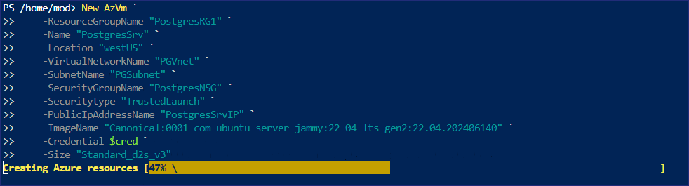

10. Once the deployment is completed it will show the below
    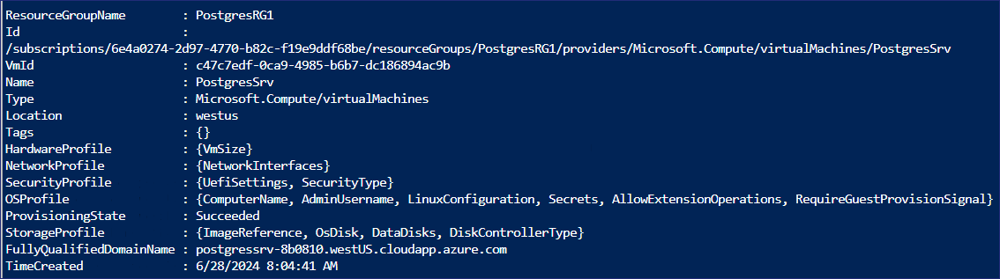

11. Run the below command to connect to the Ubuntu VM, substitute the
    command using the **FullyQualifiedDomainName** from the output of
    the previous command

    

    > Note - In the notepad, copy and paste the  **FullyQualifiedDomainName** from the output of the previous command     as this would be required later in the Tasks also.
    
    

    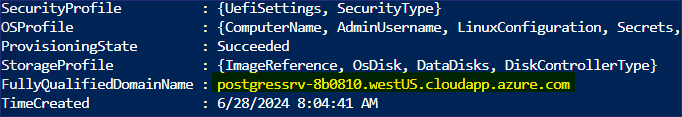

    `ssh postgres@FullyQualifiedDomainName`

    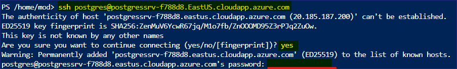

12. When prompted to continue type **yes** and then enter the password
    provided in during the deployment - `P@55w.rd1234`

13. It should successfully connect to the Ubuntu Server

    

14. Now we will install **PostgreSQL ver. 16** on the Ubuntu VM, we will
    set the automated repository configuration by running the below
    command

    `sudo apt install -y postgresql-common`

    `sudo /usr/share/postgresql-common/pgdg/apt.postgresql.org.sh`

    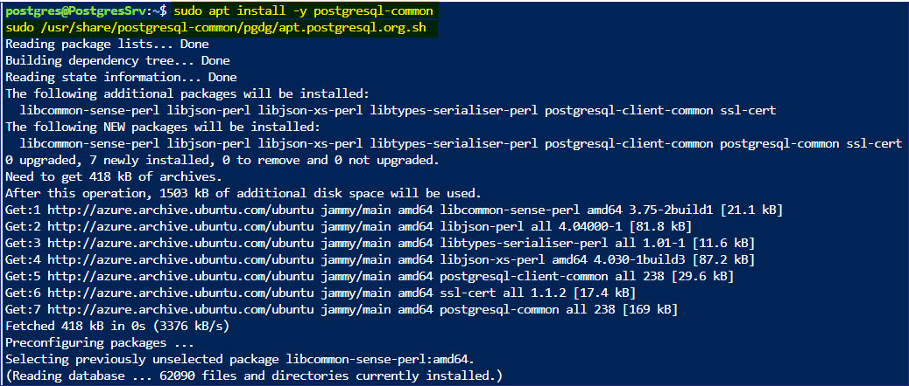

    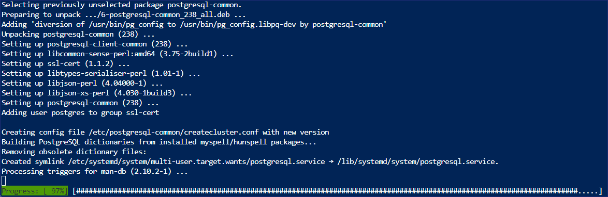

15. Press the Enter key on keyboard to continue.

    

    

16. We will **import the repository signing key** by running the below
    commands.

    `sudo apt install curl ca-certificates`

    `sudo install -d /usr/share/postgresql-common/pgdg`

    `sudo curl -o /usr/share/postgresql-common/pgdg/apt.postgresql.org.asc --fail https://www.postgresql.org/media/keys/ACCC4CF8.asc`

    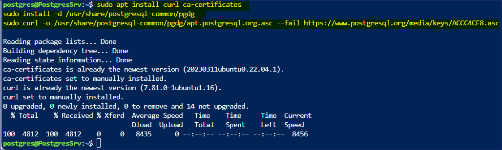

17. We will run the below command to **create the repository
    configuration file**

    `sudo apt update`

    `sudo apt install gnupg2 wget`

    `sudo sh -c 'echo "deb http://apt.postgresql.org/pub/repos/apt $(lsb_release -cs)-pgdg main" > /etc/apt/sources.list.d/pgdg.list'`

    `curl -fsSL https://www.postgresql.org/media/keys/ACCC4CF8.asc | sudo gpg --dearmor -o /etc/apt/trusted.gpg.d/postgresql.gpg`

    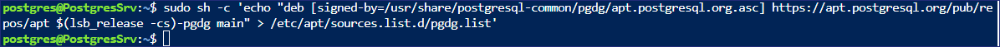

18. We will run the below command to **update the package lists**

    `sudo apt update`

    

19. We will run the below command to **install the latest version of
    PostgreSQL**

    `sudo apt install postgresql-16 postgresql-contrib-16`

    

    **Note – The installation should complete in 1-2 minutes**

    

    

20. Once the installation is completed, type the below command to launch
    the PSQL utility

    `psql`

    

21. We will set the password for the **postgres** account in psql

    `\password postgres`

22. Provide the password as `postgres` Enter it again as
    
    `postgres`

    

23. Now we will set the network and other permissions to all the PostgreSQL to be accessed remotely

24. Run the below command to access the **postgresql.conf** file

    `\q`

    `sudo nano /etc/postgresql/16/main/postgresql.conf`

25. Once the file is opened scroll down and update the setting to match
    the below

    **Under Connection Settings remove the # and change listen_addresses = '*'**

    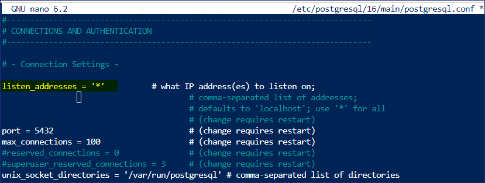

    **Under WRITE-AHEAD LOG remove the # and change wal_level = logical**

    

26. Once the above change is done press **Ctrl + X**

    

27. Press type **Y** and enter to confirm.

28. Run the below command to access the **pg_hba.conf** file

    `sudo nano /etc/postgresql/16/main/pg_hba.conf`

29. Once the file is opened scroll down add the below lines at the
    bottom of the file

    `
    host all all 0.0.0.0/0 md5
    host all all ::/0 md5
    `

    

30. Once the above change is done press **Ctrl + X**

    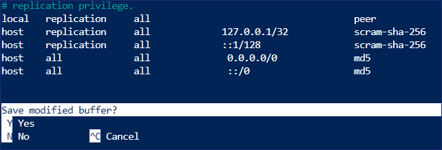

31. Press type **Y** and enter to confirm.

32. Run the below command to restart the PostgreSQL service

    `sudo service postgresql restart`

    

33. On the Azure Portal, search and select !!Resource groups!!

    

34. From the list of Resource groups select **PostgresRG** then select
    the VM - **PostgresSrv**

35. On the **PostgresSrv** page, select **Networking setting** and then
    click on **+ Create port rule** and choose **Inbound port Rule**

    

36. On the **Add inbound security rule** page, under service from the
    drop-down choose **PostgreSQL** and then click on the **Add**
    button.

    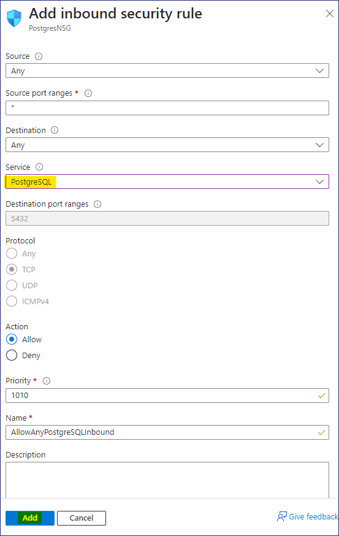

37. You should receive the notification as shown in below image.

    

38. Now the PostgreSQL server is ready to be accessed remotely.

## Task 2 – Create a PostgreSQL database for the On-premises environment.

1.  Now we will import a sample database into the PostgreSQL server
    which we will use for Migration

2.  There are 15 tables in the DVD Rental database

    

3.  From the Azure Portal open the Azure Cloud Shell

    

4.  Ensure the Cloud Shell has launched with Bash, then run the below
    command to connect to the **PostgresSrv** VM

    `ssh postgres@ServerDNSName`

    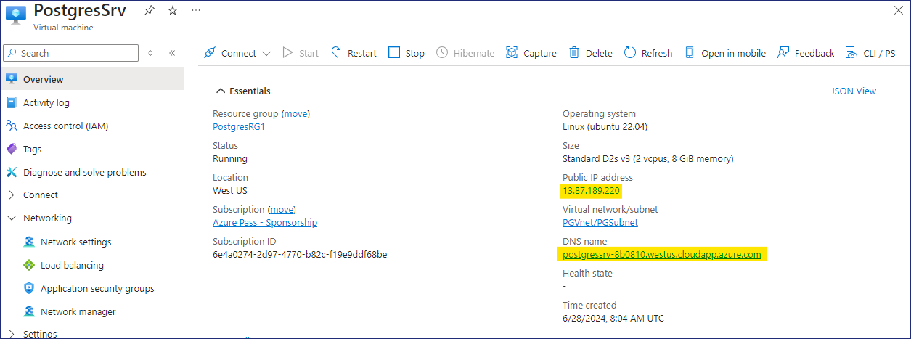

5.  When prompted to continue type **yes** and then enter the password -
    `P@55w.rd1234`

6.  It should successfully connect to the Ubuntu Server

    

5.  On the prompt **postgres@PostgresSrv** run the below command to
    create a **folder** to copy the file to be used for restoring the
    database.

    `mkdir dvdrentalbkp`

     

6.  On the Lab VM, right-click on the Start menu and select Windows
    Terminal (admin)

    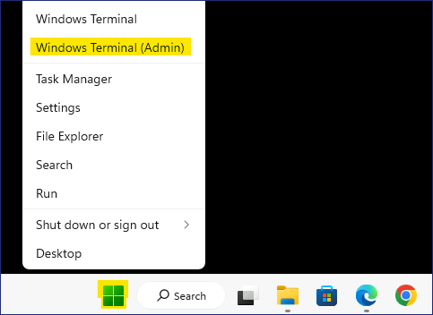

7.  In the Windows PowerShell window run the command to copy the PostgreSQL database backup to the folder **dvdrentalbkp** on the **PostgresSrv**.

    
    
    > **Note** - Substitute the command before running with the **FQDN of your Ububtu Server VM** before running the command. refer **Task 1 - step 11**
    

    `scp "C:\Labfiles\dvdrental.tar" postgres@FQDNofUbubtuServerVM:"dvdrentalbkp"`

    When prompted to continue type **yes** and then enter the password - `P@55w.rd1234`

    

    

    > **Note** - If the file **dvdrental.tar** is not present, it can be downloaded from - `https://github.com/technofocus-pte/migrt2Innovregdepth/raw/main/Lab%20Guides/Labfiles/dvdrental.tar` and then placed in **C:\Labfiles**
    

8.  Switch back to the tab on the prompt **postgres@PostgresSrv** run
    the below command to launch PSQL

    `psql`
    
    

9.  On the **psql** prompt run the below command to create a database

    `CREATE DATABASE dvdrental;`

    

    `\q`

    

10. Back on **postgres@PostgresSrv** prompt type the below command to
    restore the backup into the newly created database.

    `cd dvdrentalbkp`

    `pg_restore -U postgres -d dvdrental "dvdrental.tar"`

    

    **Note** – if any error or warning message appear, they can be safely ignored, and the blank database is updated with 15 Tables.

11. We can check the database details by running the below commands

    `psql`

    `\c dvdrental`

    

    `\dt`

    

## Task 3 – Create an Azure Database for PostgreSQL flexible Server

1.  Open the Edge browser navigate to the Azure Portal
    `https://portal.azure.com`

2.  Search for `postgres` and choose **Azure Database for
    PostgreSQL flexible Servers**

    

3.  Click on **+ Create**

    

4.  On the **New Azure Database for PostgreSQL Flexible Server** page on
    the **Basics** tab, provide the below details

    * Resource group – Click on Create new and provide name – `RG4AzPGDb`

    * Server name - `ad4pfssrv@lab.LabInstance.Id`

    * Region – **West US**

    * PostgreSQL version – **16**

    * Workload type – **Production**

        

    * High availability - **Disabled**

    * Authentication method – **PostgreSQL Authentication only**

    * Admin username – `postgres`

    * Password – `P@55w.rd1234`

    * Confirm password – `P@55w.rd1234`

    * Click on **Next: Networking >**

        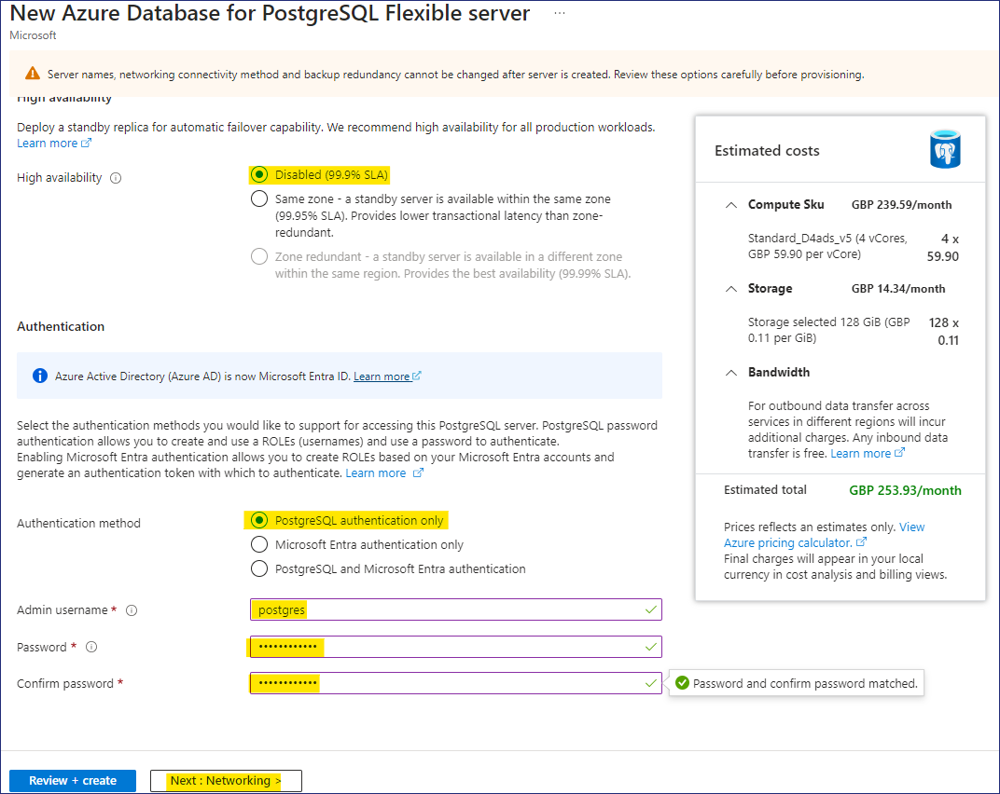

5.  On the **Networking** tab, enable the check box for **Allow public
    access from any Azure services within Azure to this server** and
    click on **+ Add Client IP address** also add the **Public IP
    address** of the **PostgresSrv** and then click on **Review +
    create** button.

    

    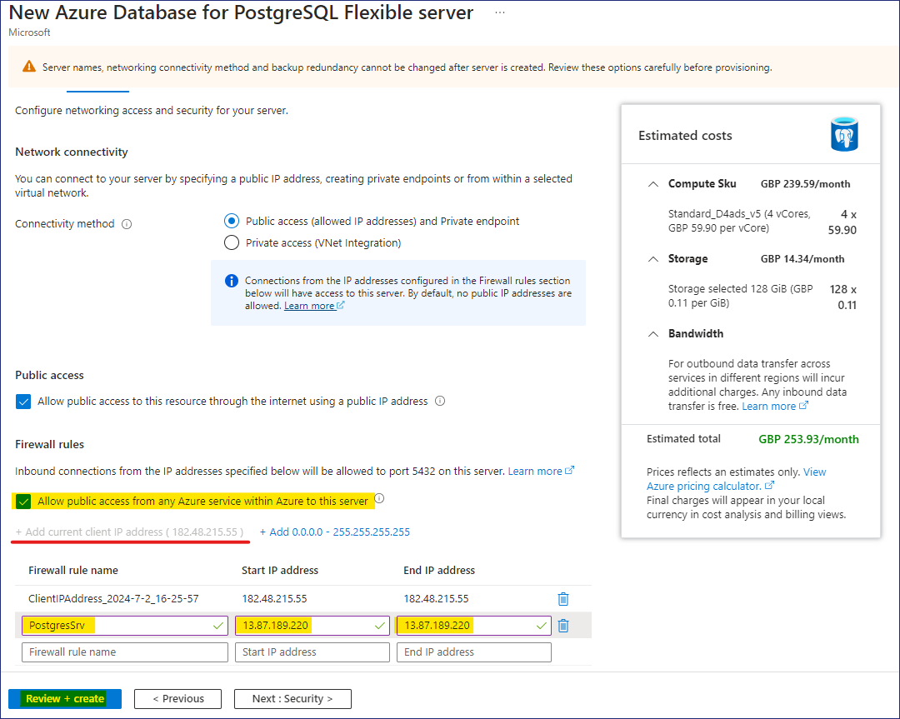

6.  Review the details and click on the **Create** button.

    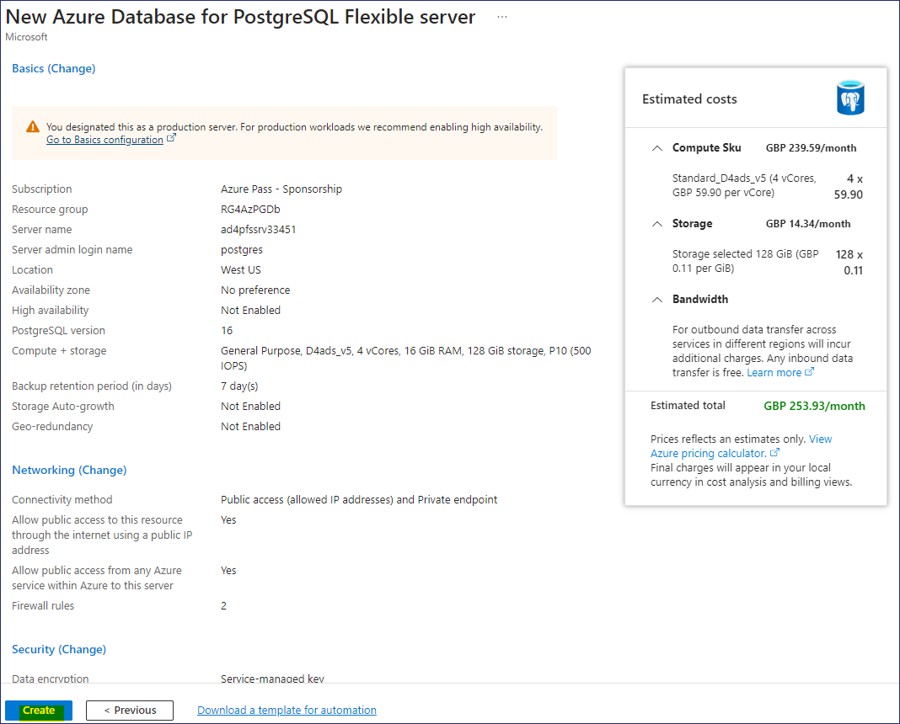

7.  The Deployment will begin.

    

    

    >**Note** - The deployment will take around 10 minutes to complete 

    

8.  Once the Deployment is completed click on **Go to resource** button.

    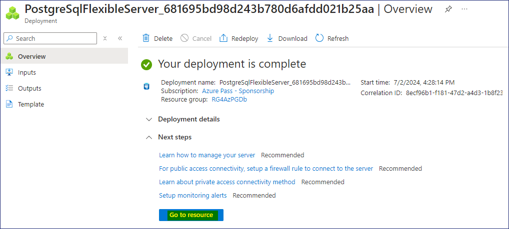

## Task 4 – Migrate the PostgreSQL database to Azure Database for PostgreSQL flexible server (Migration) 

1.  The **Overview** page of the **Azure Database for PostgreSQL flexible server** should open

    

2.  Review the overview page and check out the various tabs

    

3.  Under **Settings** select **Databases**, you should be able to see 3
    Databases listed.

    

4.  Click on **Migration** and then select **+ Create** button.

    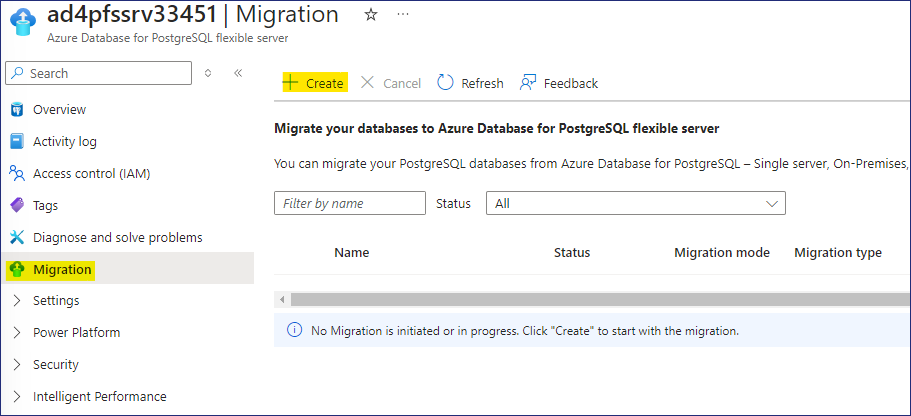

5.  On the **Migrate PostgreSQL to Azure Database for PostgreSQL
    Flexible Server** page on the **Setup** tab, provide the below
    information and then click on **Next: Select Runtime Server\>**

    *  Migration name - `PostgreSQLToAzurePG`

    *  Source server – **On-premise Server**

    *  Migration option – **Validate and Migrate**

    *  Migration mode – **Online**

        

6.  On the **Select Runtime Server** tab click on **Next: Connect to
    source\>**

    

7.  On the **Connect to source tab**, provide the below details and
    click on **Next : Select migration target\>**

    *  Server name – **Public IP address / DNS name of PostgresSrv VM**

    *  Port – `5432`

    *  Server admin login name - `postgres`

    *  Password - `postgres`

    *  SSL mode – **Prefer**

    *  Test Connection – Click on **Connect to source** 

    > **Wait for the test connection to be Successful**

    

8.  On the **Select migration target** tab, provide the below details

    *  Password - `P@55w.rd1234`

    *  Test Connection – Click on **Connect to source** 

    > **Wait for the test connection to be Successful**

    * Click on **Next : Select database(s) for migration**

    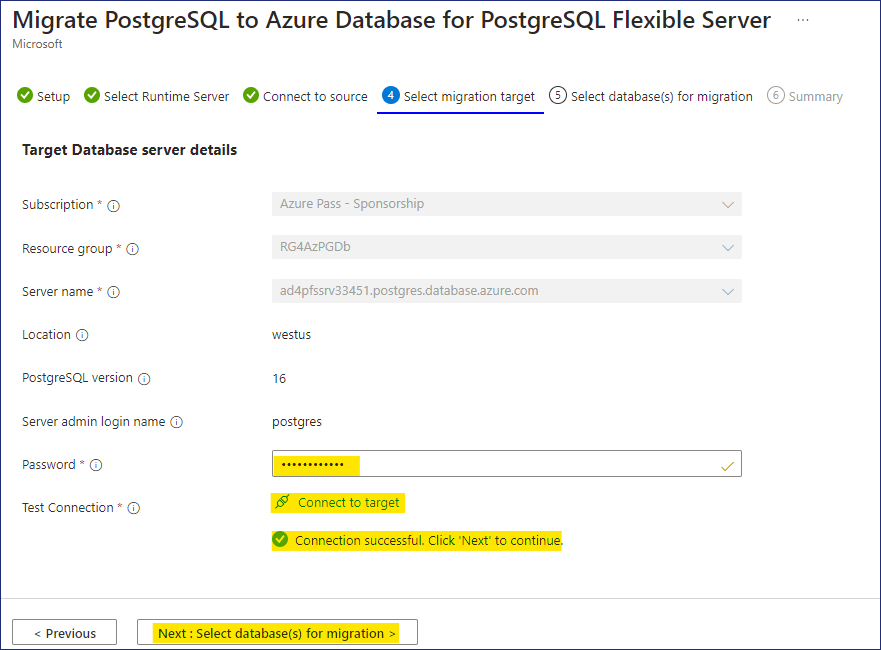

9.  On the **Select database(s) for migration** tab, select the Database
    – **dvdrental** and then click on **Next: Summary\>**

    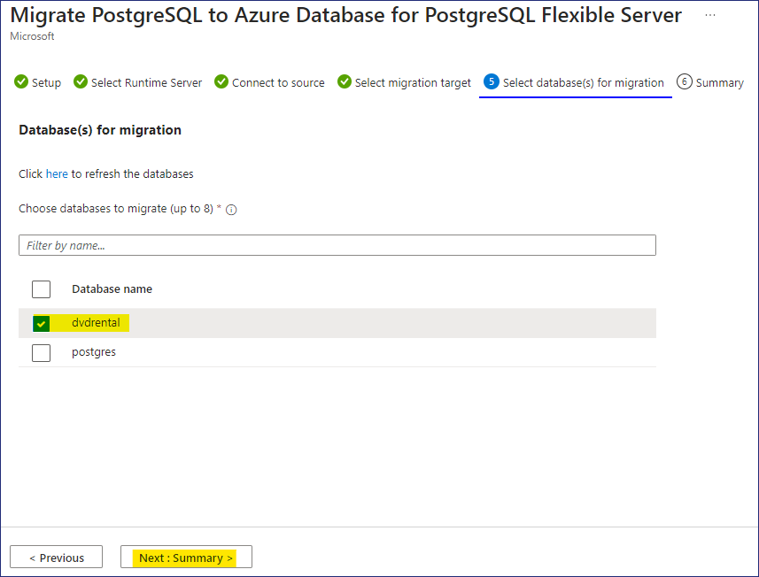

10. On the **Summary** tan, review the information shown and click on
    the **Start Validation and Migration** button.

    

11. On the Migration page, click on the **PostgreSQLToAzurePG** link

    

12. On the **PostgreSQLToAzurePG** page, click on the refresh button to
    see the updates.

    

13. Click on the Database name **dvdrental**

    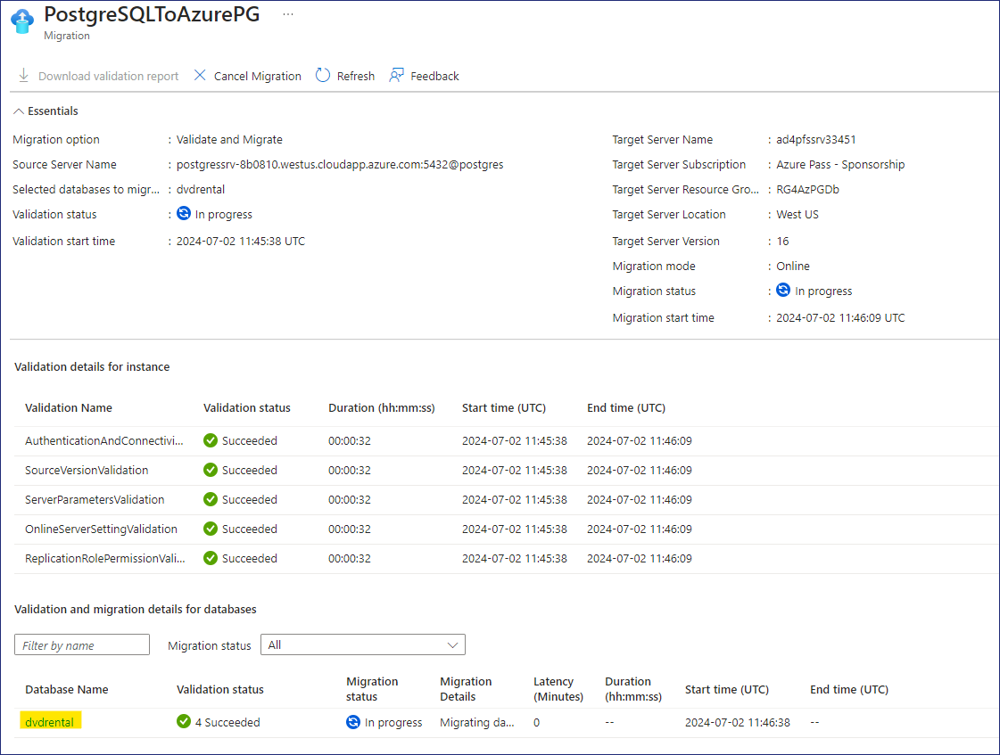

14. On the **Validation** tab you should be able to see the Validation
    tasks details.

    

    

    * > Note - If the **LanguageValidation - failed** error appear, you can try to re-initiate migration again, if you are still facing then error, then please refer to following steps to refer how the migration could have been completed. 
    
        >You can **proceed/skip to the next Lab**.

    

    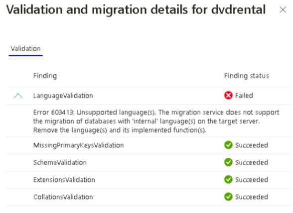

15. On the **Migration** tab, it will show the migration status queued.

    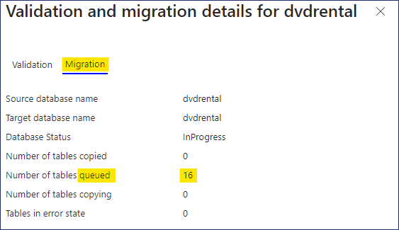

16. On the **PostgreSQLToAzurePG** page, click on the refresh button
    again and notice that Migration tasks are also completed and now it
    will **Waiting for User Action**, click on the **Cutover** button.

    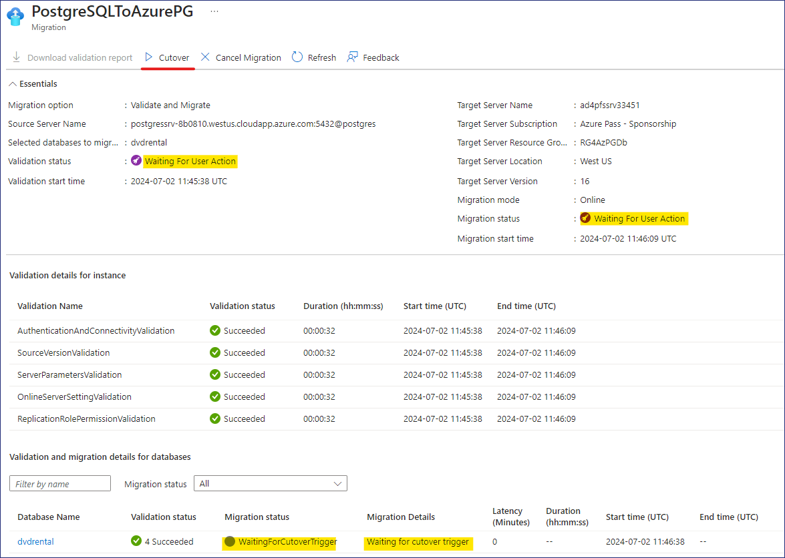

17. When prompted **Please perform the following steps manually before
    doing the cutover**, click on the **Yes** button

    

18. On the **PostgreSQLToAzurePG** page, click on the refresh button
    again, Cutover in progress status should appear under **Migration
    details**.

    

19. Once the Cutover is **Completed**, close the **PostgreSQLToAzurePG**
    blade.

    

20. Back on the **Migration** page, we can see that the Migration of the
    PostgreSQL database is **Succeeded**.

    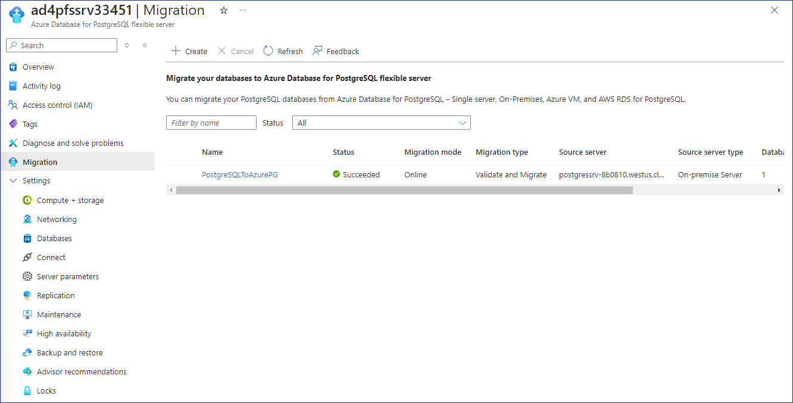

21. Select **Databases** under Settings, select the **dvdrental** and
    click on the **Connect** button

    

22. When the Cloud Shell opens it will prompt for Password, provide the
    password as `P@55w.rd1234`

    

23. Once it is successfully connected to the database, it will be listed
    as **devrental=\>**

24. Run the below command to list the tables in the Target Database

    `\dt`

    

    **Note** – These tables are the same as in the Source database.

    

>**Hence, we have successfully migrated the On-premises PostgreSQL database
to Azure Database for PostgreSQL Flexible Server**.

## Summary 

In the Lab we had deploying a Virtual machine to host the PostgreSQL
database and then we migrated the PostgreSQL Database using the **Azure
Database for Postgres Flexible Server (Migration).**

