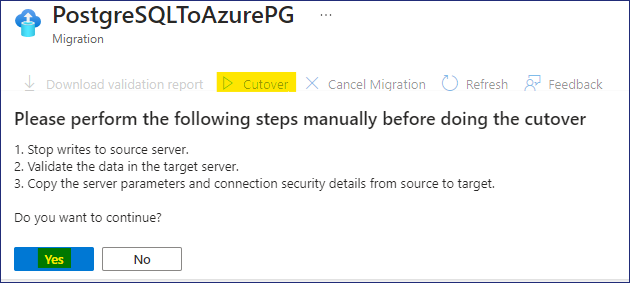

# ラボ 3 - PostgreSQL を Azure に移行します。

**目標**

ラボでは、**PostgreSQL データベース** をホストする仮想マシンを展開し、必要な **PostgreSQL インフラストラクチャ** を作成します。次に、**Azure Database for Postgres フレキシブル サーバー (移行)** を使用して PostgreSQL データベースを移行します。

## タスク 1 - オンプレミス環境の PostgreSQL データベースをホストする仮想マシンを展開します。

**Ubuntu 22.0.4.4 LTS** VM を展開し、そこに **PostgreSQL Server 16** をインストールして、移行に使用するサンプル データベースを作成します。

1. Azure ポータル ```https://portal.azure.com``` から Azure Cloud Shell を開きます


2. **PowerShell** ボタンをクリックします。


3. **開始** ウィンドウで、**ストレージ アカウントのマウント** のラジオ ボタンを選択し、**Azure Pass – スポンサーシップ** サブスクリプションを選択して、**適用** ボタンをクリックします。


4. ストレージ アカウントのマウント ウィンドウで、**ストレージ アカウントを自動的に作成します** のラジオ ボタンを選択し、**次へ** をクリックします。


5. デプロイが完了するまで待ちます


6. Cloud Shell PowerShell ウィンドウで以下のコマンドを入力して変数を設定し、PostgreSQL サーバーのインストールに使用する VM を作成します。

```$cred = Get-Credential```

7. 資格情報の入力を求められたら、以下を入力します

ユーザー - ```postgres```

パスワード - ```P@55w.rd1234```


8. 以下のコマンドを入力してリソース グループを作成します

```New-AzResourceGroup -ResourceGroupName "PostgresRG" -Location "WestUS"```


9. 以下のコマンドを入力して Windows Server 2019 Datacenter VM をデプロイします

```
New-AzVm `
-ResourceGroupName "PostgresRG" `
-Name "PostgresSrv" `
-Location "WestUS" `
-VirtualNetworkName "PGVnet" `
-SubnetName "PGSubnet" `
-SecurityGroupName "PostgresNSG" `
-Securitytype "Standard" `
-PublicIpAddressName "PostgresSrvIP" `
-ImageName "Canonical:0001-com-ubuntu-server-jammy:22_04-lts-gen2:latest" `
-Credential $cred `
-Size "Standard_b2ms"
```


10. デプロイが完了すると、以下が表示されます


11. 以下のコマンドを実行して Ubuntu VM に接続し、前のコマンドの出力の **FullyQualifiedDomainName** を使用してコマンドを置き換えます


```ssh postgres@FullyQualifiedDomainName```


12. 続行するように求められたら、**yes** と入力し、デプロイメント中に提供されたパスワード (``P@55w.rd1234```) を入力します。

13. Ubuntu サーバーに正常に接続できるはずです。


14. 次に、Ubuntu VM に **PostgreSQL バージョン 16** をインストールし、以下のコマンドを実行して自動リポジトリ構成を設定します。

```sudo apt install -y postgresql-common```

```sudo /usr/share/postgresql-common/pgdg/apt.postgresql.org.sh```


15. キーボードの Enter キーを押して続行します。


16. 以下のコマンドを実行して、**リポジトリ署名キーをインポート**します。

```sudo apt install curl ca-certificates```

```sudo install -d /usr/share/postgresql-common/pgdg```

```sudo curl -o /usr/share/postgresql-common/pgdg/apt.postgresql.org.asc --fail https://www.postgresql.org/media/keys/ACCC4CF8.asc```


17. 以下のコマンドを実行して、**リポジトリ構成ファイルを作成します**

```sudo apt update```

```sudo apt install gnupg2 wget```

```sudo sh -c 'echo "deb http://apt.postgresql.org/pub/repos/apt $(lsb_release -cs)-pgdg main" > /etc/apt/sources.list.d/pgdg.list'```

```curl -fsSL https://www.postgresql.org/media/keys/ACCC4CF8.asc | sudo gpg --dearmor -o /etc/apt/trusted.gpg.d/postgresql.gpg```


18. 以下のコマンドを実行して**パッケージ リストを更新します**

```sudo apt update```


19. 以下のコマンドを実行して**PostgreSQL の最新バージョンをインストールします**

```sudo apt install postgresql-16 postgresql-contrib-16```


**注 – インストールは 1 ～ 2 分で完了します**


20. インストールが完了したら、以下のコマンドを入力して PSQL を起動しますユーティリティ

```psql```


21. psql で **postgres** アカウントのパスワードを設定します

```\password postgres```

22. パスワードを ```postgres``` として入力します

```postgres```


23. 次に、リモートでアクセスするすべての PostgreSQL にネットワークおよびその他の権限を設定します

24. 以下のコマンドを実行して、**postgresql.conf** ファイルにアクセスします

```\q```

```sudo nano /etc/postgresql/16/main/postgresql.conf```

25. ファイルが開いたら、下にスクロールして、設定を以下の内容に更新します

**接続設定で # を削除し、listen_addresses = '*' に変更します**


**WRITE-AHEAD LOG で# wal_level = logical** に変更します


26. 上記の変更が完了したら、**Ctrl + X** を押します


27. **Y** と入力して Enter を押して確定します。

28. 以下のコマンドを実行して **pg_hba.conf** ファイルにアクセスします

```sudo nano /etc/postgresql/16/main/pg_hba.conf```

29. ファイルが開いたら下にスクロールして、ファイルの下部に以下の行を追加します

```
host all all 0.0.0.0/0 md5
host all all ::/0 md5
```


30. 上記の変更が完了したら、**Ctrl + X** を押します


31. **Y** と入力して Enter を押して確定します。

32. 以下のコマンドを実行して PostgreSQL サービスを再起動します

```sudo service postgresql restart```


33. Azure ポータルで、!!Resource groups!! を検索して選択します


34. リソース グループのリストから **PostgresRG** を選択し、VM - **PostgresSrv** を選択します

35. **PostgresSrv** ページで、**ネットワーク設定** を選択し、**+ ポート ルールの作成** をクリックして、**受信ポート ルール** を選択します


36. **受信セキュリティ ルールの追加** ページで、サービスのドロップダウンから **PostgreSQL** を選択し、**追加** ボタンをクリックします。


37. 以下の画像に示すように、通知が届きます。


38. これで、PostgreSQL サーバーにリモートからアクセスできるようになりました。

## タスク 2 – オンプレミス環境用の PostgreSQL データベースを作成します。

1. ここで、移行に使用するサンプル データベースを PostgreSQL サーバーにインポートします

2. DVD レンタル データベースには 15 個のテーブルがあります


3. Azure ポータルから Azure Cloud Shell を開きます


4. Cloud Shell が Bash で起動していることを確認し、以下のコマンドを実行して **PostgresSrv** VM に接続します

```ssh postgres@ServerDNSName```


5. 続行するように求められたら、**yes** と入力し、パスワードを入力します -
```P@55w.rd1234```

6. Ubuntu サーバーに正常に接続されます


5. プロンプト **postgres@PostgresSrv** で以下を実行します以下のコマンドを実行して、データベースの復元に使用するファイルをコピーするための**フォルダー**を作成します。

```mkdir dvdrentalbkp```


6. ラボ VM で、[スタート] メニューを右クリックし、[Windows ターミナル (管理者)] を選択します。


7. Windows PowerShell ウィンドウで、PostgreSQL データベースのバックアップを **PostgresSrv** のフォルダー **dvdrentalbkp** にコピーするコマンドを実行します。

<font color=orangered>

> **注** - コマンドを実行する前に、**Ububtu Server VM の FQDN** にコマンドを置き換えてください。 **タスク 1 - ステップ 11** を参照してください
</font>

```scp "C:\Labfiles\dvdrental.tar"postgres@FQDNofUbubtuServerVM:"dvdrentalbkp"```

続行するように求められたら、**yes** と入力し、パスワード - ```P@55w.rd1234``` を入力します


<font color=blue>

> **注** - ファイル **dvdrental.tar** が存在しない場合は、- ```https://github.com/technofocus-pte/migrt2Innovregdepth/raw/main/Lab%20Guides/Labfiles/dvdrental.tar``` からダウンロードして、**C:\Labfiles** に配置することができます
</font>

8. プロンプト **postgres@PostgresSrv** のタブに戻ります以下のコマンドを実行して PSQL を起動します

```psql```


9. **psql** プロンプトで以下のコマンドを実行してデータベースを作成します

```CREATE DATABASE dvdrental;```


```\q```


10. **postgres@PostgresSrv** プロンプトに戻り、以下のコマンドを入力して、新しく作成したデータベースにバックアップを復元します。

```cd dvdrentalbkp```

```pg_restore -U postgres -d dvdrental "dvdrental.tar"```


**注** – エラーまたは警告メッセージが表示された場合は無視しても問題ありません。空のデータベースが 15 個のテーブルで更新されます。

11. 以下のコマンドを実行して、データベースの詳細を確認できます

```psql```

```\c dvdrental```


```\dt```


## タスク 3 – Azure Database for PostgreSQL フレキシブル サーバーを作成する

1. Edge ブラウザーを開き、Azure Portal に移動します
```https://portal.azure.com```

2. ```postgres``` を検索し、**Azure Database for
PostgreSQL フレキシブル サーバー** を選択します


3. **+ 作成** をクリックします


4. **基本** タブの **新しい Azure Database for PostgreSQL フレキシブル サーバー** ページで、以下の詳細を入力します

* リソース グループ – [新規作成] をクリックし、名前を入力します – ```RG4AzPGDb```

* サーバー名 – ```ad4pfssrvXXXXX``` (XXXXX はランダムな数字に置き換えます)

* リージョン – **米国西部**

* PostgreSQL バージョン – **16**

* ワークロードの種類 – **運用**


* 高可用性 - **無効**

* 認証方法 - **PostgreSQL 認証のみ**

* 管理者ユーザー名 - ```postgres```

* パスワード - ```P@55w.rd1234```

* パスワードの確認 - ```P@55w.rd1234```

* [次へ: ネットワーク >] をクリックします。


5. [ネットワーク] タブで、[Azure 内の任意の Azure サービスからこのサーバーへのパブリック アクセスを許可する] チェック ボックスをオンにし、[+ クライアント IP アドレスの追加] をクリックして、**PostgresSrv** の **パブリック IP アドレス** も追加し、[確認 + 作成] ボタンをクリックします。


6. 詳細を確認し、[**作成**] ボタンをクリックします。


7. デプロイメントが開始されます。


<font color=darkgreen>

>**注** - デプロイメントが完了するまでに約 10 分かかります

</font>

8. デプロイメントが完了したら、[**リソースに移動**] ボタンをクリックします。


## タスク 4 – PostgreSQL データベースを Azure Database for PostgreSQL フレキシブル サーバーに移行する (移行)

1. **Azure Database for PostgreSQL フレキシブル サーバー** の [概要] ページが開きます


2. 概要ページを確認し、さまざまなタブを確認します


3. [設定] で [データベース] を選択すると、3 つのデータベースが一覧表示されます。


4. [移行] をクリックし、[+ 作成] ボタンを選択します。


5. [**セットアップ**] タブの [**PostgreSQL を Azure Database for PostgreSQL
フレキシブル サーバーに移行**] ページで、以下の情報を入力し、[**次へ: ランタイム サーバーの選択\>**] をクリックします。

* 移行名 - ```PostgreSQLToAzurePG```

* ソース サーバー - **オンプレミス サーバー**

* 移行オプション - **検証して移行**

* 移行モード - **オンライン**


6. [**ランタイム サーバーの選択**] タブで、[**次へ: ソースへの接続\>**] をクリックします。


7. **ソースに接続** タブで、以下の詳細を入力し、

**次へ: 移行ターゲットの選択\>** をクリックします

* サーバー名 – **PostgresSrv VM のパブリック IP アドレス / DNS 名**

* ポート – ```5432```

* サーバー管理者ログイン名 - ```postgres```

* パスワード - ```postgres```

* SSL モード – **優先**

* テスト接続 – **ソースに接続** をクリックします

> **テスト接続が成功するまで待ちます**


8. **移行ターゲットの選択** タブで、以下の詳細を入力します

* パスワード - ```P@55w.rd1234```

* テスト接続 – **ソースに接続** をクリックします

> **テスト接続が成功するまで待ちます**

* **次へ: 選択** をクリックします移行するデータベースを選択します**


9. [**移行するデータベースを選択**] タブで、データベース
– **dvdrental** を選択し、[次へ: 概要\>**] をクリックします


10. [**概要**] タブで、表示された情報を確認し、[**検証と移行の開始**] ボタンをクリックします。


11. [移行] ページで、[**PostgreSQLToAzurePG**] リンクをクリックします


12. [**PostgreSQLToAzurePG**] ページで、更新ボタンをクリックして更新を確認します。


13. データベース名 **dvdrental** をクリックします。


14. **検証** タブで、検証タスクの詳細を確認できます。


15. **移行** タブで、移行ステータスがキューに入れられていることが表示されます。


16. **PostgreSQLToAzurePG** ページで、もう一度更新ボタンをクリックし、移行タスクも完了し、**ユーザー アクションを待機中** になっていることを確認します。**カットオーバー** ボタンをクリックします。


17. **カットオーバーを行う前に、次の手順を手動で実行してください** というメッセージが表示されたら、**はい** ボタンをクリックします。


18. **PostgreSQLToAzurePG** ページで、もう一度更新ボタンをクリックします。**移行の詳細** の下に、カットオーバーが進行中のステータスが表示されます。


19. カットオーバーが **完了** したら、**PostgreSQLToAzurePG** ブレードを閉じます。


20. **移行** ページに戻ると、PostgreSQL データベースの移行が **成功** になっていることがわかります。


21. [設定] で [**データベース**] を選択し、[**dvdrental**] を選択して [**接続**] ボタンをクリックします


22. Cloud Shell が開くと、パスワードの入力を求められます。パスワードとして ```P@55w.rd1234``` を入力します


23. データベースに正常に接続されると、**devrental=\>** としてリストされます

24. 以下のコマンドを実行して、ターゲット データベースのテーブルをリストします

```\dt```


**注** – これらのテーブルはソース データベースのものと同じです。


<font color=darkgreen>

>**これで、オンプレミスの PostgreSQL データベースを Azure Database for PostgreSQL フレキシブル サーバーに正常に移行できました**。

</font>

## 概要

ラボでは、PostgreSQL データベースをホストする仮想マシンを展開し、次に **Azure Database for Postgres フレキシブル サーバー (移行)** を使用して PostgreSQL データベースを移行しました。


