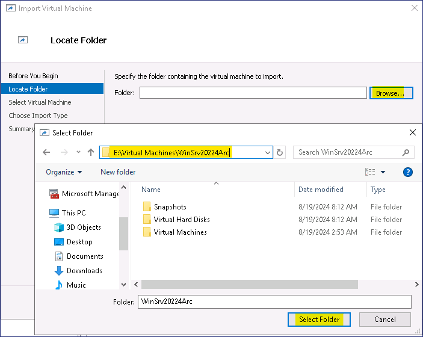
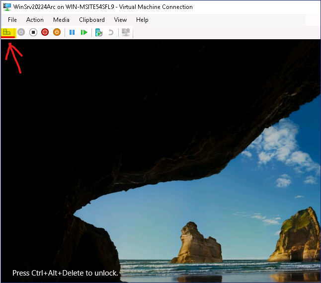
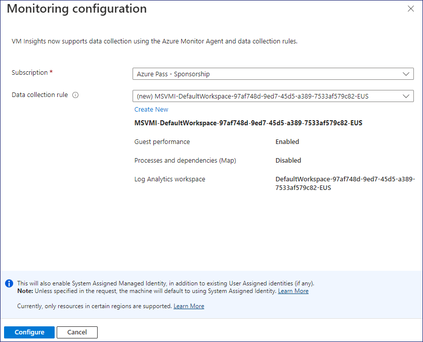
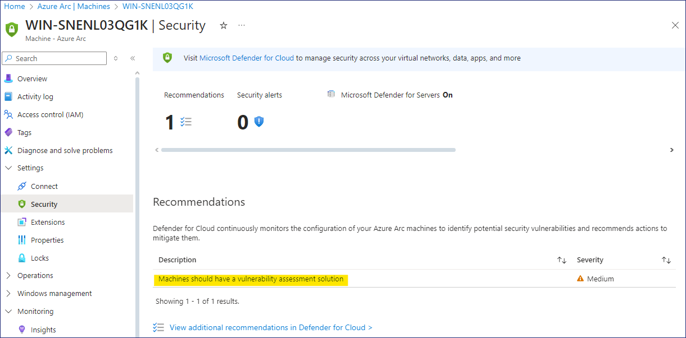

# Lab 4 – Adaptive Cloud

## Zielsetzung

In diesem Lab werden wir Ressourcen in verschiedenen Umgebungen mit
Azure Arc verwalten. Sie können Ihre Infrastruktur in allen Umgebungen
sichern, überwachen und verwalten, einschließlich on-premises, in
anderen öffentlichen Clouds und auf Edge-Geräten.

### Aufgabe 1 - Einrichten des On-premise-Rechners

1.  Öffnen Sie den Edge-Browser auf der Lab-VM und navigieren Sie zu dem
    Link zum Herunterladen der **AzCopy** -Datei - `
    https://aka.ms/downloadazcopy-v10-windows ` öffnen Sie die
    Zip-Datei und entpacken Sie sie in den Ordner `C:\AzCopy`

    

2.  Klicken Sie mit der rechten Maustaste auf Star-men und wählen Sie
    Windows PowerShell (Admin)

3.  Geben Sie die folgenden Befehle ein, um das **Windows Server 2022
    image** herunterzuladen

    `cmd`

    `cd\AzCopy`

    cd, drücken Sie dann die
    [Tabulatortaste](https://www.dict.cc/?s=Tabulatortaste), um den Namen
    des Ordners automatisch einzutragen, und drücken Sie dann die
    Eingabetaste.

    ` azcopy copy
    "https://migrinnovregnlarcdepstrg.blob.core.windows.net/images/WinSrv20224Arc.zip"
    "C:\Users\Administrator\Downloads"`

    > Mit dem obigen Befehl wird das **Windows Server** 2022-Image in den
    Ordner Downloads kopiert. Der Download-Prozess kann bis zu 7-10 Minuten
    dauern.

     

    

4.  Sobald der Download abgeschlossen ist, öffnen Sie den Ordner
    "Downloads" im File explorer, wählen Sie die Datei
    **WinSrv20224Arc.zip** aus und klicken Sie auf die Schaltfläche
    **Extract all**.

    

5.  Geben Sie den Ordner als ` E:\Virtual Machines ` an und klicken
    Sie dann auf die Schaltfläche **Extract**.

    

6.  Öffnen Sie den **Hyper-V-Manager** über die Task-Leiste, klicken Sie
    mit der rechten Maustaste auf den Servernamen und wählen Sie dann
    **Hyper-V Setting**

    

7.  Wählen Sie im Fenster **Settings** die Option **Enhanced Session
    Mode Policy**, aktivieren Sie das Kontrollkästchen **Allow enhanced
    session mode** und klicken Sie dann auf die Schaltfläche **OK**.

    

8.  Klicken Sie im **Hyper-V Manager** auf die Aktion **Import Virtual
    Machine**.

    

9.  Klicken Sie auf der Seite **Locate Folder** auf die Schaltfläche
    **Browse**, suchen Sie nach ` E:\Virtual Machines\WinSrv20224Arc
    ` und klicken Sie dann auf die Schaltfläche **Select Folder**.

    

10. Klicken Sie auf der Seite **" Locate Folder** **"** auf die
    Schaltfläche " **Next** **"**.

    

11. Klicken Sie auf der Seite **Select Virtual Machine** auf die
    Schaltfläche **Next**.

12. Lassen Sie auf der Seite **Choose Import type** die Standardoption
    stehen und klicken Sie auf die Schaltfläche **Next**.

    

13. Wählen Sie auf der Seite **Connect Network** aus der Dropdown-Liste
    **Connection** den **Microsoft Hyper-V Network Adapter** aus und
    klicken Sie dann auf die Schaltfläche **Next**.

    

14. Überprüfen Sie auf der Seite **Complete Import Wizard** die Details
    und klicken Sie dann auf die Schaltfläche **Finish**.

    

15. Klicken Sie mit der rechten Maustaste auf die **WinSrv20224Arc**-VM
    und wählen Sie dann die Option **Start**

    

16. Klicken Sie erneut mit der rechten Maustaste auf die
    **WinSrv20224Arc**-VM und wählen Sie dann die Option **Connect**

    

17. Drücken Sie die Tasten **Ctrl+Alt+Delete** im Fenster Virtual
    Machine Connection

    

18. Melden Sie sich mit den folgenden Anmeldedaten an

    *  Username- `Administrator`

    *  Password- `P@55w.rd1234`

    

19. Stellen Sie sicher, dass Sie sich erfolgreich angemeldet haben.

### Aufgabe 2 - Hinzufügen von Azure Arc-Ressourcen über ein Script

1.  Sobald Sie bei der **WinSrv20224Arc** -VM angemeldet sind, öffnen
    Sie den Edge-Browser, navigieren Sie zum **Azure Portal** `
    https://portal.azure.com /` und melden Sie sich mit den vom Lab
    bereitgestellten Anmeldedaten an.

2.  Geben Sie im Azure-Portal im Suchfeld `arc` ein und wählen Sie
    dann **Azure Arc**

    

3.  Klicken Sie unter **Manage resources across environments** auf die
    Schaltfläche **Add resources**.

    

4.  Klicken Sie auf der Seite **Add Azure Arc resources** auf die
    Schaltfläche **Add/Create** und wählen Sie **Add a machine.**

    

1.  Klicken Sie auf der Seite **Add servers with Azure Arc** auf die
    Schaltfläche **Generate script**  unter dem Punkt **Add a single
    server**.

    

2.  Geben Sie auf der Seite **Add a server with Azure Arc** die
    folgenden Details an.

    > **Bevor Sie eine Ressourcengruppe erstellen, wählen Sie die Region, um
    Fehler zu vermeiden**

    - Region - **West US**

    - Resource group - Klicken Sie auf **Create new**  `RG4ArcVM`

    - Operating System – **Windows**

    - Connect SQL Server – **Uncheck the box**

    - Klicken Sie auf **Download and run script button**

    

3.  Klicken Sie auf die Schaltfläche **Download** und dann auf die
    Schaltfläche **Copy**.

    

4.  Klicken Sie mit der rechten Maustaste auf die **Start button** und
    wählen Sie **Windows PowerShell (Admin)**

    

5.  Fügen Sie im **Windows PowerShell (Admin)** Fenster das kopierte
    Script aus der Zwischenablage ein

    

6.  Das Script sollte wie im folgenden Bild gezeigt gestartet werden

    

7.  Wenn Sie aufgefordert werden, sich anzumelden, melden Sie sich mit
    den angegebenen Anmeldedaten an

    

8.  Wechseln Sie nach erfolgreicher Authentifizierung zurück zum
    PowerShell-Fenster

    

9.  Es sollte die Meldung **Connect Machine to Azure** angezeigt werden,
    wie in der folgenden Abbildung dargestellt.

    

### Aufgabe 3 - Verwalten des Arc-Servers

1.  Wechseln Sie zurück zur Lab VM und öffnen Sie das Azure Portal `
    https://portal.azure.com `

2.  Geben Sie im Azure Portal im Suchfeld Bogen ein **arc** und wählen
    Sie dann **Azure Arc**

    

3.  Wählen Sie **Machines** unter Azure Arc resources.

    

4.  Sie sollten die Maschine **WinSrv20224Arc** als **Connected**
    anzeigen können.

    

5.  Klicken Sie auf **WinSrv20224Arc**, um die Details zu öffnen, und
    klicken Sie dann auf der Seite **Overview** auf **Updates**

    

6.  Wählen Sie in der Dropdown-Liste **Periodic assessment** die Option
    **Enable** und klicken Sie dann auf die Schaltfläche **Save**.

    

    

7.  Zurück auf der **Overview** Seite, klicken Sie auf **Monitoring
    insights**

    

8.  Klicken Sie auf der Seite **Insights** auf die Schaltfläche
    **Enable**.

    

9.  Klicken Sie auf der Seite **Monitoring configuration** auf die
    Schaltfläche **Configure**.

    

    > **Hinweis** - Die Bereitstellung der monitoring resource kann etwa 5-10
    Minuten dauern.

    

10. Zurück auf der **Overview** seite, klicken Sie auf Security

    

    > **Hinweis:** Wir hatten **Microsoft Defender for Cloud** bereits früher
    aktiviert. Die Empfehlungen für den Server sollten in etwa 30 Minuten zu
    sehen sein, da er erst kürzlich in Betrieb genommen wurde.

11. Sobald die Empfehlungen für den eingebundenen Server verfügbar sind,
    sollten sie wie in der folgenden Abbildung dargestellt erscheinen.

    

12. Zurück auf der **Overview** Seite, klicken Sie auf **Updates**

    

13. Klicken Sie bei Bedarf auf die Schaltfläche **Go to Updates using
    Azure Update Manager**.

14. Klicken Sie auf die Schaltfläche **Check for updates**.

    

15. Klicken Sie in der Meldung **Trigger assess now** auf die
    Schaltfläche **OK**.

    

    

16. Klicken Sie auf die Schaltfläche **Refresh**. Im Abschnitt **Total
    updates** wird angezeigt, dass **Assessment is in progress**.

    

17. Sobald die Bewertung abgeschlossen ist, klicken Sie erneut auf die
    Schaltfläche **Refresh**.

    

18. Die Details der erforderlichen Aktualisierungen sollten auf dem
    Server angezeigt werden.

    

19. Klicken Sie auf **One-time update**, um die Aktualisierungen auf dem
    Server zu starten.

    

20. Wählen Sie auf der Seite Install one-time updates auf der
    Registerkarte Machines die VM **WinSrv20224Arc** aus und klicken Sie
    dann auf die Schaltfläche **Next**.

    

21. Überprüfen Sie die Details der Aktualisierung und klicken Sie dann
    auf die Schaltfläche **Next**.

    

22. Klicken Sie auf der Registerkarte Properties auf die Schaltfläche
    **Next.**

    

23. Überprüfen Sie auf der Registerkarte Review + Install die Details
    und klicken Sie dann auf die Schaltfläche **Install**.

    

    

24. Klicken Sie auf die Benachrichtigung, um die Details der
    Aktualisierung zu sehen

    

    

25. Zurück auf der **Overview** Seite, klicken Sie auf **Monitoring
    insights**

    

26. Klicken Sie auf die Schaltfläche **Analyze data**.

    

27. Jetzt sollten die **Performance data**  des eingebundenen Servers
    angezeigt werden.

    

    

28. Damit haben wir den On-premise Windows server erfolgreich
    eingebunden und können den Server mit **Azure Arc** über das Azure
    Portal verwalten.
