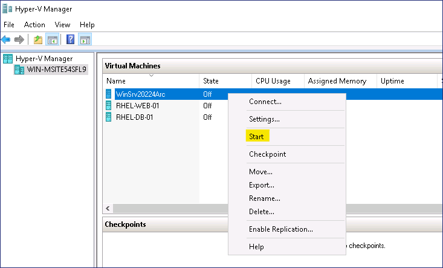
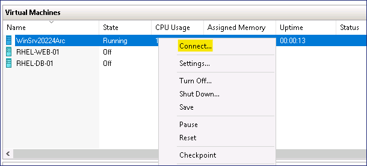
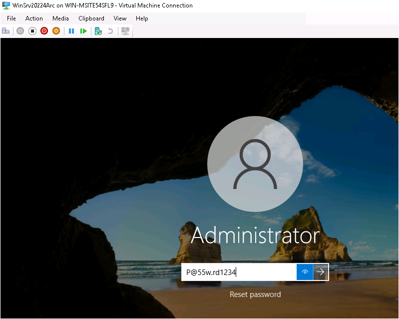
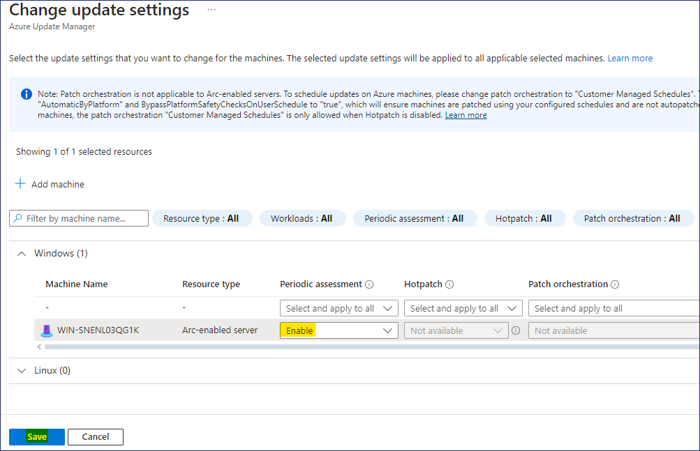
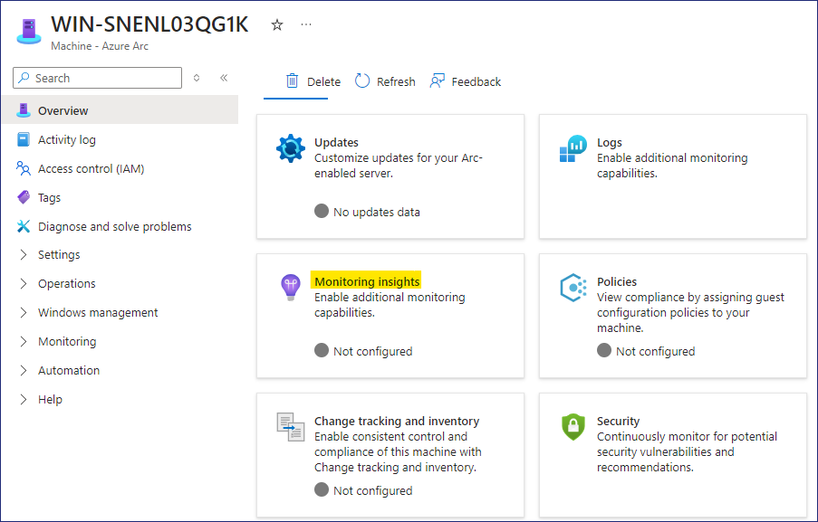
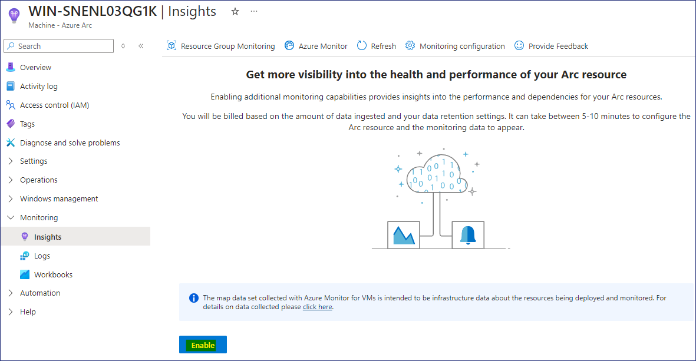
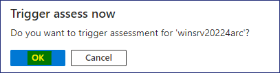
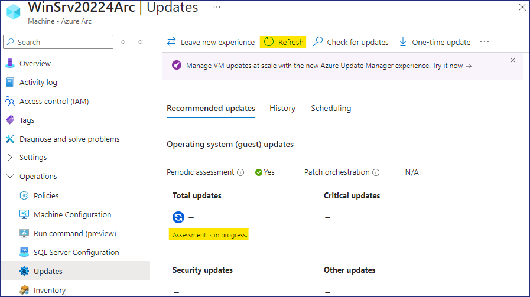
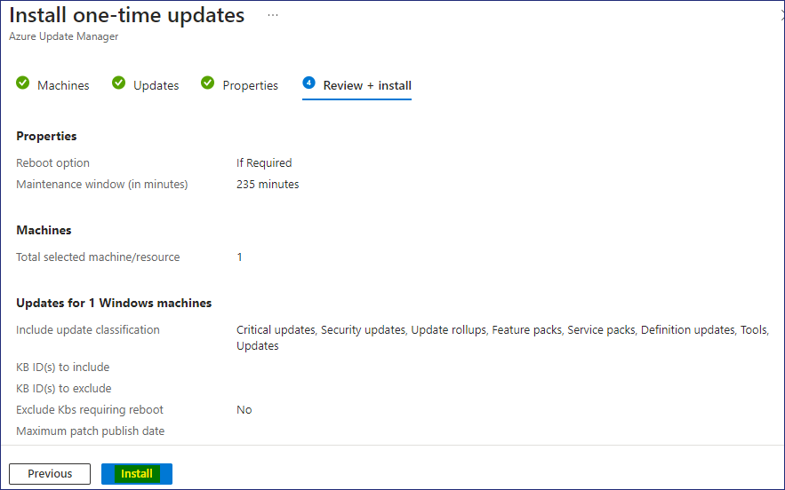
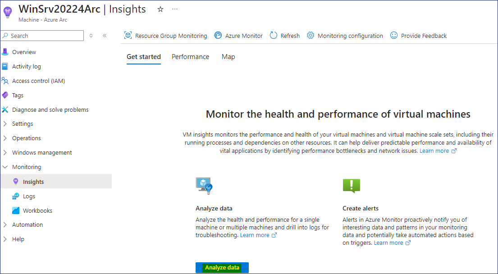

# 실습 4 – 적응형 클라우드

**목표**

이 실습에서는 Azure Arc를 활용하여 다양한 환경에서 리소스를 관리할
것입니다. 온-프레미스, 다른 퍼블릭 클라우드 및 에지 디바이스를 포함한
인프라를 안전하게 보호하고, 모니터링하며 효율적으로 관리할 수 있습니다.

**작업 1 - 온프레미스 머신 설정**

1.  Edge 브라우저를 Lab VM에서 열고, 링크를 통해 **AzCopy** 파일
    다운로드하세요 - ```https://aka.ms/downloadazcopy-v10-windows```.
    zip 파일을 열고, 다음 폴더에 압축을 푸세요 ```C:\AzCopy```.

    

2.  Star-men을 마우스 오른쪽 버튼으로 클릭하고 Windows
    PowerShell(관리자)을 선택하세요.

3.  아래 명령을 입력하여 **Windows Server 2022 image**를 다운로드하세요.


    ```cmd```

    ```cd\AzCopy```

    ```cd``` 를 입력한 다음, **Tab** 키를 클릭하면 폴더 이름이 자동으로 입력됩니다.
    Enter 키를 클릭하세요.

    ```azcopy copy "https://migrinnovregnlarcdepstrg.blob.core.windows.net/images/WinSrv20224Arc.zip" "C:\Users\Administrator\Downloads"```

    <font color=Darkgreen>

    > 위의 명령은 Downloads 폴더에 **Windows Server 2022** 이미지를
    복사합니다. 이미지를 다운로드하는 데 최대 7~10분이 소요될 수 있습니다.

    </font>

         
    
    

4.  다운로드가 완료되면 파일 탐색기에서 Downloads폴더를 열고
    **WinSrv20224Arc.zip** 파일을 선택한 다음, **Extract all** 버튼을
    클릭하세요.

    

5.  폴더를 ```E:\Virtual Machines```로 지정한 다음 **Extract** 버튼을
    클릭하세요.

    

6.  작업 표시줄에서 **Hyper-V Manager** 를 연고 서버 이름을 마우스
    오른쪽 버튼로 클릭한 다음, **Hyper-V Setting** 선택하세요.

    

7.  **Settings** 창에서 **Enhanced Session Mode Policy** 옵션을 선택한
    다음, **Allow enhanced session mode** 체크박스를 선택한 후, **OK**
    버튼을 클릭하세욘.

    

8.  **Hyper-V Manager** 에서 **Import Virtual Machine** 작업을
    클릭하세요.

    

9.  **Locate Folder** 페이지에서 **Browse** 버튼을 클릭하고
    ```E:\Virtual Machines\WinSrv20224Arc```를 찾은 다음 **Select
    Folder** 버튼을 클릭하세욘.

    

10. **Locate Folder** 페이지에서 **Next** 버튼을 클릭하세요.

    

11. **Select Virtual Machine** 페이지에서 **Next** 버튼을 클릭하세요.

12. **Choose Import type**  페이지에서 기본 옵션을 그대로 두고
    **Next** 버튼을 클릭하세요.

    

13. **Connect Network** 페이지의 **Connection** 드롭다운 메뉴에서
    **Microsoft Hyper-V Network Adapter**를 선택한 후, **Next** 버튼을
    클릭하세요.

    

14. **Complete Import Wizard**  페이지에서 세부 정보를 검토한 다음,
    **Finish** 버튼을 클릭하세요.

    

15. **WinSrv20224Arc** VM을 마우스 오른쪽 버튼으로 클릭한 다음,
    **Start** 옵션을 선택하세요.

    

16. 다시 **WinSrv20224Arc** VM을 마우스 오른쪽 버튼으로 클릭한 다음,
    **Connect** 옵션을 선택하세요.

    

17. 가상 머신 연결 창에서 **Ctrl+Alt+Delete** 버튼을 클릭하세요.

    

18. 아래와 같은 자격 증명으로 로그인하세요.

    *  Username - ```Administrator```

    *  Password - ```P@55w.rd1234```

    

19. 로그인에 성공했는지 확인하세요.

**작업 2 - 스크립트를 통해 Azure Arc 리소스 추가**

1.  **WinSrv20224Arc** VM에 로그인한 후 Edge 브라우저를 열고
    ```https://portal.azure.com/```로 이동한 후, 실습에서 제공한 자격
    증명을 사용하여 로그인하세요.

2.  Azure Portal의 검색창에 ```arc``` 를 입력한 후, Azure Arc를 선택하세요.

    

3.  **Manage resources across environments**에서 **Add**버튼을
    클릭하세요.

    

4.  **Add Azure Arc resources** 페이지에서 **Add/Create** 버튼을
    클릭하고 **Add a machine**을 선택하세요**.**

    

5.  **Add servers with Azure Arc** 페이지에서 **Add a single server**의
    **Generate script** 버튼을 클릭하세요.

    

6.  **Add a server with Azure Arc** 페이지에서 아래 세부 정보를
    입력하세요.

    > **리소스 그룹을 만들기 전에 오류를 방지하기 위해 Region을 선택하세요.**

    - Region - **West US**

    - Resource group – Click on **Create new** ```RG4ArcVM```

    - Operating System – **Windows**

    - Connect SQL Server – **Uncheck the box**

    - Click on the **Download and run script button**.

    

7.  **Download** 와**Copy** 버튼을 클릭하세요.

    

8.  **Start button**을 마우스 오른쪽 버튼으로 클릭하고 **Windows
    PowerShell (Admin)**를 선택하세요.

    

9.  **Windows PowerShell(Admin)** 창에 클립보드에서 복사한 스크립트를
    붙여넣으세요.

    

10. 아래 이미지와 같이 스크립트가 실행되어야 합니다.

    

11. 로그인하라는 메시지가 표시되면 제공된 자격 증명으로 로그인하세요.

    

12. 인증이 성공적으로 이루어지면 PowerShell 창으로 다시 돌아가세요.

    

13. 아래 이미지와 같이 **Connect Machine to Azure**라는 메시지가
    표시됩니다.

    

**작업 3 - Arc 서버 관리**

1.  Lab VM으로 다시 전환하고 Azure Portal
    ```https://portal.azure.com```을 엽니다.

2.  Azure Portal의 검색차에 arc를 입력하고, **Azure Arc**를 선택하세요.

    

3.  Azure Arc 리소스에서 **Machines**을 선택하세요**.**

    

4.  머신 **WinSrv20224Arc**이 **Connected**로 표시되는 것을 확인할 수
    있습니다.

    

5.  **WinSrv20224Arc**를 클릭하여 세부 정보를 열고,
    **Overview** 페이지에서 **Updates**클릭하세요.

    

6.  **Periodic assessment** 드롭다운 메뉴에서 **Enable**을 선택한 다음,
    **Save** 버튼을 클릭하세요.

    

    

7.  **Overview** 페이지로 돌아가서 **Monitoring insights**를 클릭하세요.

    

8.  **Insights** 페이지에서 **Enable** 버튼을 클릭하세요.

    

9.  **Monitoring configuration** 페이지에서 **Configure** 버튼을
    클릭하세요.

    

    > **참고** - 모니터링 리소스를 배포하는 데 약 5~10분이 소요될 수 있습니다.

    

10. **Overview** 페이지로 돌아가서 Security를 클릭하세요.

    

    > **참고 -** 이전에 **Microsoft Defender for Cloud**를 Enabled
    활성화했으므로, 서버가 최근에 온보딩되었기 때문에 약 30분 후에 권장
    사항을 확인할 수 있습니다.

11. 온보딩된 서버에 대한 권장 사항이 제공되면, 아래 이미지와 같이
    표시되어야 합니다.

    

12. **Overview** 페이지로 돌아가서 **Update**를 클릭하세요**.**

    

13. 필요한 경우 **Go to Updates using Azure Update Manager** 버튼을
    클릭하세요.

14. **Check for updates** 버튼을 클릭하세요.

    

15. **Trigger assess now** 메시지에서 **OK** 버튼을 클릭하세요.

    

    

16. **Refresh** 버튼을 클릭하면 **Total updates** 섹션에 **Assessment is
    in progress**라는 메시지가 표시됩니다.

    

17. Assessment가 완료되면 **Refresh** 버튼을 다시 클릭하세요.

    

18. 서버에서 필요한 업데이트에 대한 세부 정보를 확인할 수 있어야 합니다.

    

19. **One-time update**를 클릭하여 서버에서 업데이트를 시작하세요.

    

20. Install one-time updates페이지의 Machines 탭에서 **WinSrv20224Arc**
    VM을 선택한 후, **Next** 버튼을 클릭하세요.

    

21. 업데이트의 세부 정보를 검토한 후 **Next** 버튼을 클릭하세요.

    

22. Properties 탭에서 **Next** 버튼을 클릭하세요.

    

23. Review + install 탭에서 세부 정보를 검토한 다음, **Install** 버튼을
    클릭하세요.

    

    

24. 알림을 클릭하면 업데이트 세부 정보를 확인할 수 있습니다.

    

    

25. **Overview**페이지로 돌아가서 **Monitoring insights**를 클릭하세요.

    

26. **Analyze data**  버튼을 클릭하세요.

    

27. 이제 온보딩된 서버의 **Performance data**를 확인할 수 있을 것입니다.

    

    

28. 따라서 온-프레미스 Windows 서버를 성공적으로 온보딩되었으며, **Azure
    Arc**를 사용하여 Azure Portal에서 서버를 관리할 수 있습니다.
