# 實驗室 4 - 自我調整雲

## 客觀的

在本實驗室中，我們將使用 Azure Arc
管理跨環境的資源，你可以安全、監控和治理跨環境的基礎架構，包括內部部署、其他公有雲和邊緣設備。

## 任務 1 - 設置內部部署機器

1.  在實驗室虛擬機器上打開 Edge 流覽器，並導航到下載 **AzCopy**
    檔的連結 - `https://aka.ms/downloadazcopy-v10-windows`
    打開壓縮檔並解壓到資料夾 `C:\AzCopy` 中。

    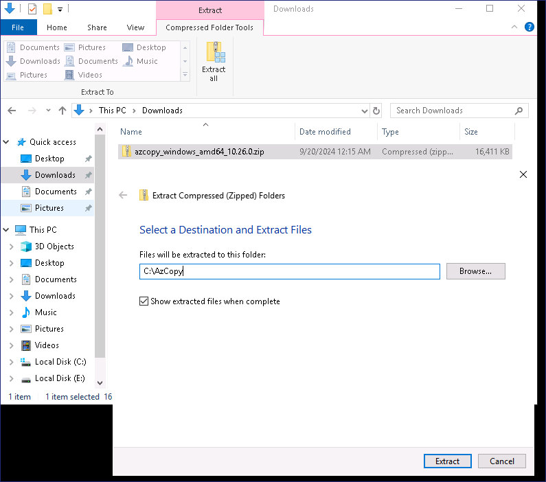

2.  按右鍵 Star-men，選擇 Windows PowerShell (Admin)

3.  鍵入以下命令下載 **Windows Server 2022 映射**

    `cmd`

    `cd\AzCopy`

    cd 然後按 **Tab** 鍵自動填充資料夾名稱，然後按 Enter 鍵。

    `azcopy copy "https://migrinnovregnlarcdepstrg.blob.core.windows.net/images/WinSrv20224Arc.zip" "C:\Users\Administrator\Downloads"`

    

    > 上述命令將把 **Windows Server 2022**
    映射複製到下載檔案夾中。下載鏡像可能需要 7-10 分鐘。

    

        

    

4.  下載完成後，在文件資源管理器中打開下載檔案夾，然後選擇
    **WinSrv20224Arc.zip** 檔，點擊 **Extract all** 按鈕。

    

5.  提供資料夾為 `E:\Virtual Machines`，然後按一下 **Extract** 
    按鈕。

    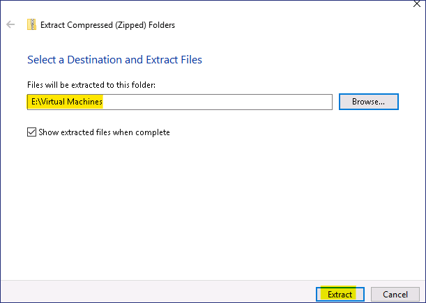

6.  從工作列打開 **Hyper-V Manager** ，然後按右鍵伺服器名稱，再選擇
    **Hyper-V Setting**

    

7.  在 **Settings**  視窗中，選擇  **Enhanced Session Mode Policy** 
    選項，然後啟用  **Allow enhanced session mode** 
    核取方塊，然後按一下 **OK**  按鈕。

    

8.  在 **Hyper-V Manager** 中點擊 **Import Virtual Machine** 操作。

    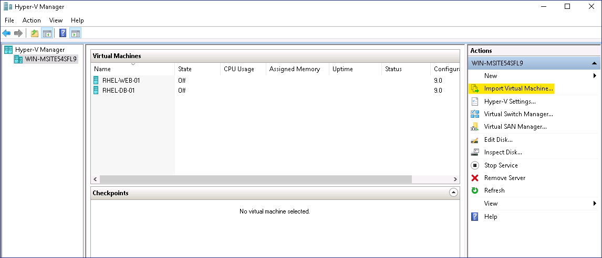

9.  在  **Locate Folder** 頁面，按一下 **Browse**  按鈕，流覽到
    `E:\Virtual Machines\WinSrv20224Arc` 並按一下 **Select Folder**
    按鈕。

    

10. 在 **Locate Folder** 頁面，按一下 **Next**  按鈕。

    

11. 在 **Select Virtual Machine** 頁面，按一下 **Next**  按鈕。

12. 在 **Choose Import type** 頁面，保留預設選項，然後按一下 **Next** 
    按鈕。

    

13. 在 "**連接網路** "頁面，從 "**連接** "**下拉式功能表**中選擇
    **Microsoft Hyper-V 網路介面卡**，然後按一下 **Next** 按鈕。

    

14. 在 C**omplete Import Wizard** 頁面上查看詳細資訊，然後按一下
    **Finish** "按鈕。

    

15. 按右鍵 **WinSrv20224Arc** 虛擬機器，然後選擇 "**開始 "** 選項

    

16. 再次按右鍵 **WinSrv20224Arc** 虛擬機器，然後選擇 **Connect** 選項

    

17. 在虛擬機器連接視窗中按下 **Ctrl+Alt+Delete** 按鈕

    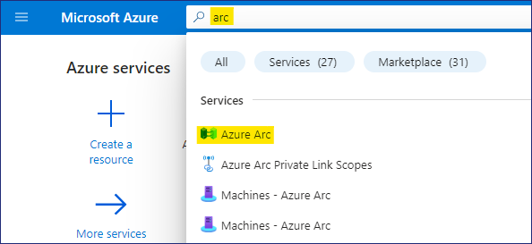

18. 使用以下憑據登錄

    1.  用戶名 - **Administrator**

    2.  密碼 - `P@55w.rd1234`

    

19. 確保您已成功登錄。

## 任務 2 - 通過腳本添加 Azure Arc 資源

1.  登錄 **WinSrv20224Arc** 虛擬機器後，打開 Edge 流覽器並導航到 **Azure
    Portal**
    `https://portal.azure.com/`，然後使用實驗室提供的憑據登錄。

2.  在 Azure Portal 的搜索中輸入 `arc` 形，然後選擇 Azure Arc

    

3.  在 **Manage resources across environments** 下按一下  **Add
    resources** 按鈕。

    

4.  在 **"添加 Azure Arc resources** 頁面，按一下 **Add/Create**
    按鈕並選擇 **Add a machine.**

    

5.  在 **Add servers with Azure Arc** 頁面，按一下  **Generate
    script**下的  **Add a single server** 按鈕。

    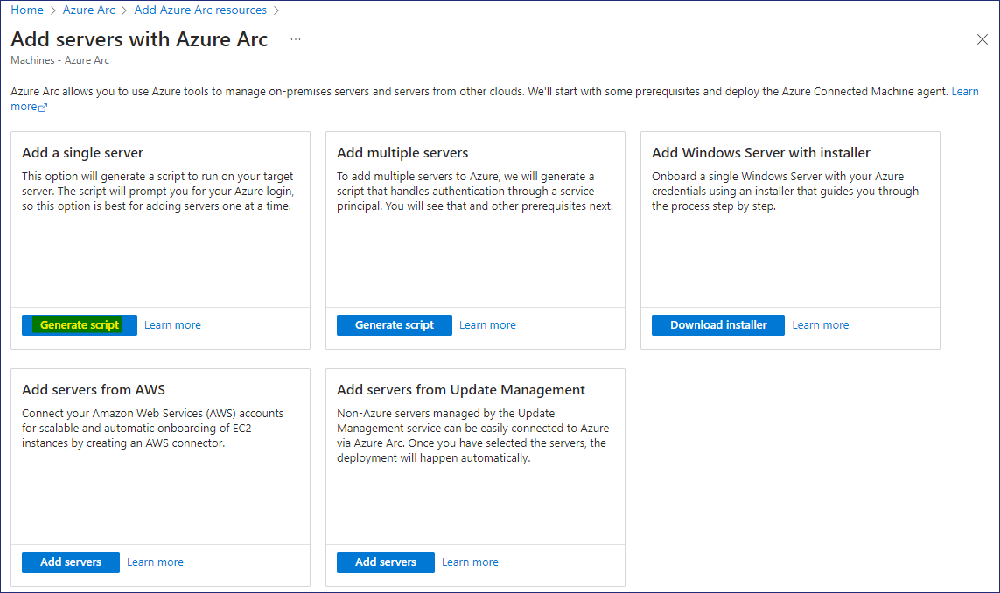

6.  在  **Add a server with Azure Arc** 頁面上，提供以下詳細資訊。

    

    > **建立資源群組前，先選擇 Region，避免出錯**

    

    - 地區 -   **West US**

    

    - 資源組 - 按一下 **Create new**  `RG4ArcVM`

    - 作業系統 - **Windows**

    - 連接 SQL Server - **Uncheck the box**

    - 點擊 **Download and run script button 按鈕**

    

7.  點擊 **Download** 按鈕，然後點擊 **Copy**  按鈕。

    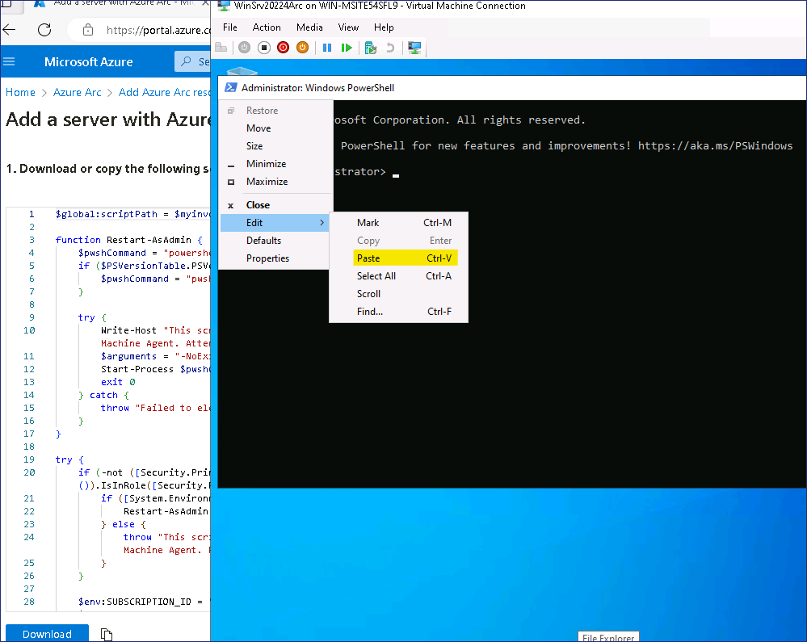

8.  按右鍵 "**開始 "按鈕**，選擇 **Windows PowerShell (Admin)**

    

9.  在 **Windows PowerShell（管理）** 視窗粘貼從剪貼板複製的腳本

    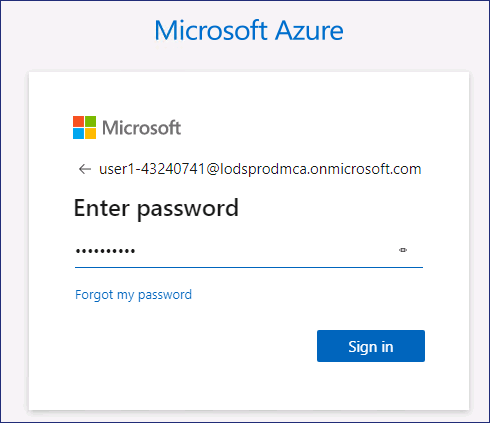

10. 腳本應如下圖所示啟動

    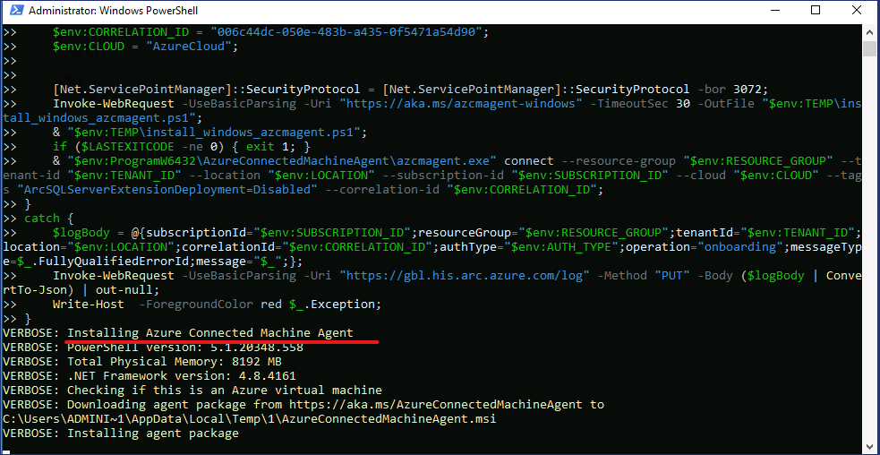

11. 出現登錄提示時，請使用提供的憑據登錄

    

12. 驗證成功後，切換回 PowerShell 視窗

    

13. 如下圖所示，應顯示 **Connect Machine to Azure** 消息。

    

## 任務 3 - 管理 Arc 伺服器

1.  切換回 **Lab VM** 並打開 Azure Portal `https://portal.azure.com`

2.  在 Azure Portal 的搜索中輸入 `arc` 形，然後選擇 **Azure Arc**

    

3.  選擇 **Azure Arc** 資源下的 **Machines** 

    

4.  您應該可以看到機器 **WinSrv20224Arc** 顯示為 **Connected**

    

5.  按一下 **WinSrv20224Arc** 打開詳細資訊，然後從
    **Overview** 頁面按一下 **Updates**。

    

6.  從  **Periodic assessment** 下拉式功能表中選擇
    **Enable** ，然後按一下 **Save**  按鈕。

    

    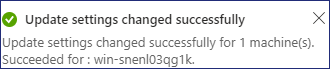

7.  返回 **Overview** 頁面，點擊  **Monitoring insights**

    

8.  在 **Insights** 頁面，點擊 **Enable**  按鈕。

    

9.  在 **Monitoring configuration** 頁面，按一下 **Configure** 按鈕。

    

    > **注意** - 部署監控資源可能需要 5-10 分鐘左右。

    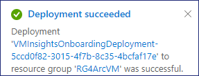

10. 返回 **Overview** 頁面，按一下 "安全

    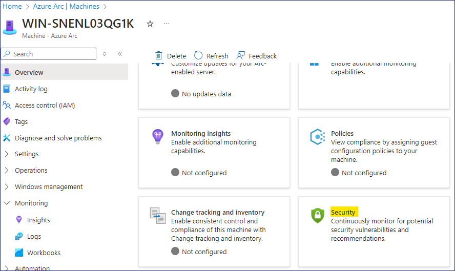

    > **注：** 我們早些時候啟用了 **Microsoft Defender for
    Cloud**，由於伺服器是最近才上載的，因此應該能在 30 分鐘左右看到建議。

11. 一旦板載伺服器的建議可用，就會顯示如下圖所示。

    

12. 回到 **Overview** 頁面，點擊 **Updates**

    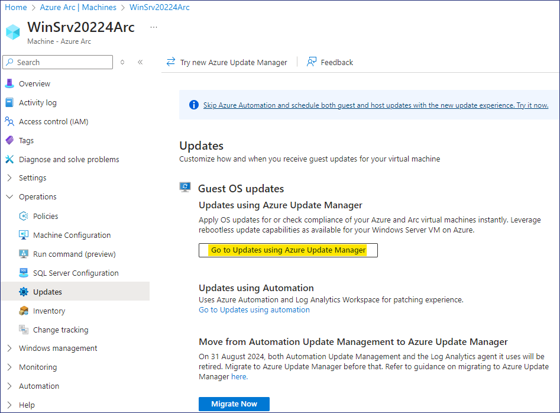

13. 如果需要，請按一下 **Go to Updates using Azure Update Manager**
    按鈕。

14. 按一下  **Check for updates**  按鈕。

    

15. 按一下  **Trigger assess now** 資訊上的 **OK**  按鈕。

    

    

16. 按一下 **Refresh**  按鈕， **Total updates** 部分將顯示 **Assessment
    is in progress**。

    

17. 評估完成後，再次按一下 "**刷新 Refresh** 。

    

18. 我們應該可以在伺服器上看到所需更新的詳細資訊。

    

19. **按一下**  **One-time update** 啟動伺服器上的更新

    

20. 在 "安裝一次性更新 "頁面的 "機器 "選項卡上選擇 **WinSrv20224Arc**
    虛擬機器，然後按一下 **Next**  按鈕。

    

21. 查看更新的詳細資訊，然後按一下 **Next**  按鈕。

    

22. 在 "屬性 "選項卡上，按一下 **Next**  按鈕

    

23. 在 "審查 + 安裝 "選項卡上，審查詳細資訊，然後按一下 **Install** 
    按鈕。

    

    

24. 點擊通知查看更新詳情

    

    

25. 返回 **Overview**  頁面，點擊 **Monitoring insights**

    

26. 點擊 **Analyze data** 按鈕

    

27. 現在我們應該可以看到板載伺服器的 **Performance data**了。

    

    

28. 這樣，我們就成功接入了內部部署 Windows Server，並可以使用 Azure
    **Arc** 從 Azure Portal 管理伺服器。
