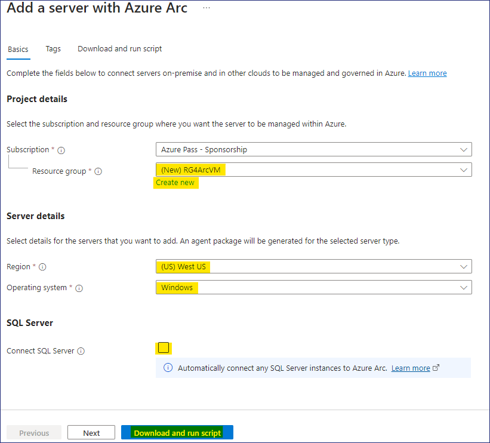
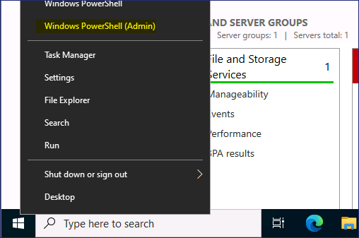
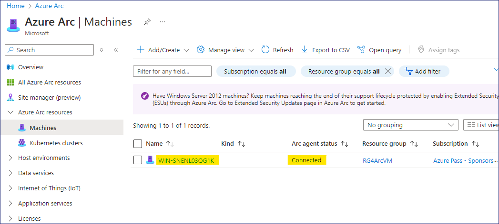
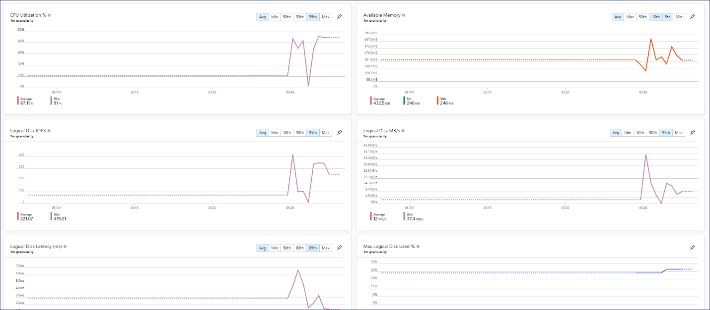

# Laboratorio 4 - Nube adaptativa

## Objetivo

En este laboratorio gestionaremos los recursos en todos los entornos con
Azure Arc, puede proteger, supervisar y controlar la infraestructura en
todos sus entornos, incluidos los locales, otras nubes públicas y
dispositivos edge.

### Tarea 1 - Configure la Máquina local

1.  Abra el navegador Edge en la VM del laboratorio y vaya al enlace
    para descargar el archivo **AzCopy** -
    `https://aka.ms/downloadazcopy-v10-windows` abra el archivo zip
    y extráigalo en la carpeta `C:\AzCopy`.

    

2.  Haga clic con el botón derecho en Star-men y seleccione Windows
    PowerShell (Admin)

3.  Escriba los siguientes comandos para descargar la **imagen de
    Windows Server 2022**

    `cmd`

    `cd\AzCopy`

    `cd` y, a continuación, presione el **tabulador** para diligenciar
    automáticamente el nombre de la carpeta, luego presione Enter.

    `azcopy copy "https://strg4vmimages2024.blob.core.windows.net/images/WinSrv20224Arc.zip" "C:\Users\Administrator\Downloads"`

    > El comando anterior copiará la imagen de **Windows Server 2022** en la
    carpeta Descargas. El proceso de descarga puede tardar entre 7 y 10
    minutos.

         

4.  Una vez finalizada la descarga, abra la carpeta Descargas en el
    Explorador de archivos y, a continuación, seleccione el archivo
    **WinSrv20224Arc.zip** y haga clic en el botón **Extract all**.

    

5.  Defina la carpeta como `E:\Virtual Machines` y, a continuación,
    haga clic en el botón **Extract**.

    

6.  Abra **Hyper-V Manager** desde la barra de tareas, haga clic con el
    botón derecho del ratón en el nombre del servidor y seleccione
    **Hyper-V Setting.**

    

7.  En la ventana **Settings**, elija la opción **Enhanced Session Mode
    Policy,** luego habilite la casilla **Allow enhanced session
    mode** y, a continuación, haga clic en el botón **Ok**.

    

8.  En el **Hyper-V Manager**, haga clic en la acción **Import Virtual
    Machine**.

    

9.  En la página **Locate Folder**, haga clic en el botón **Browse**,
    busque `E:\Virtual Machines\WinSrv20224Arc` y, a continuación,
    haga clic en el botón **Select Folder**.

    

10. En la página **Locate Folder**, haga clic en el botón **Next**.

    

11. En la página **Select Virtual Machine**, haga clic en el botón
    **Next**.

12. En la página **Choose Import type**, deje la opción por defecto y
    haga clic en el botón **Next**.

    

13. En la página **Connect Network**, en el menú desplegable
    **Connection** elija **Microsoft Hyper-V Network Adapter** y, a
    continuación, haga clic en el botón **Next**.

    

14. En la página **Complete Import Wizard** revise los detalles y luego
    haga clic en el botón **Finish**.

    

15. Haga clic con el botón derecho del ratón en la VM **WinSrv20224Arc**
    y elija la opción **Start.**

    

16. De nuevo, haga clic con el botón derecho del ratón en la MV
    **WinSrv20224Arc** y elija la opción **Connect.**

    

17. Presione las teclas **Ctrl+Alt+Delete**  de la ventana de conexión
    de la MV

    

18. Inicie sesión con las siguientes credenciales

    1.  Username – `Administrator`

    2.  Password – `P@55w.rd1234`

    

19. Asegúrese de que ha iniciado sesión correctamente.

### Tarea 2 - Añada el recurso Azure Arc a través de Script

1.  Una vez iniciada la sesión en la VM **WinSrv20224Arc**, abra el
    navegador Edge y vaya a **Azure Portal**
    `https://portal.azure.com/`, e inicie sesión utilizando las
    credenciales proporcionadas por el laboratorio.

2.  Mientras esté en el portal de Azure, escriba "arc" en la búsqueda y
    luego seleccione Azure Arc.

    

3.  En **Manage resources across environments**, haga clic en el botón
    **Add resources**.

    

4.  En la página **Add Azure Arc resources**, haga clic en el botón
    **Add/Create** y seleccione **Add a machine.**

    

5.  En la página **Add servers with Azure Arc**, haga clic en el botón
    **Generate script** debajo de **Add a single server**.

    

6.  En la página **Add a server with Azure Arc,** proporcione los
    siguientes datos.

    
    
    > **Antes de crear el grupo de recursos, elija la región para evitar
    errores**

    

    - Region - **West US**

    - Resource group – Haga clic en **Create new** `RG4ArcVM`

    - Operating System – **Windows**

    - Connect SQL Server – **Desmarque la casilla**

    - Haga clic en el **botón Download and run script**

    

7.  Haga clic en el botón **Download** y también en el botón **Copy.**

    

8.  Haga clic con el botón derecho en **Start button** y seleccione
    **Windows PowerShell (Admin)**

    

9.  En la ventana de **Windows PowerShell (Admin)** pegue el script
    copiado del portapapeles

    

10. El Script debe iniciarse como se muestra en la siguiente imagen

    

11. Cuando se le pida que inicie sesión, hágalo con las credenciales
    proporcionadas

    

12. Una vez que la autenticación se haya realizado correctamente, vuelva
    a la ventana de PowerShell

    

13. Debería aparecer el mensaje **Connect Machine to Azure**  como se
    muestra en la siguiente imagen.

    

### Tarea 3 - Gestione el servidor Arc

1.  Regrese a la VM del laboratorio y abra el Azure Portal
    `https://portal.azure.com`.

2.  Mientras esté en el portal de Azure, escriba `arc` en la barra de
    búsqueda y luego seleccione **Azure Arc**

    

3.  Seleccione **Machines** en los recursos de Azure Arc

    

4.  Usted podrá ver la máquina **WinSrv20224Arc** en estado
    **Connected**

    

5.  Haga clic en **WinSrv20224Arc** para abrir los detalles, luego desde
    la página **Overview**, haga clic en **Updates**

    

6.  En el menú desplegable **Periodic assessment**, seleccione
    **Enable** y, a continuación, haga clic en el botón **Save**.

    

    

7.  Nuevamente en la página **Overview**, haga clic en **Monitoring
    insights**

    

8.  En la página **Insights**, haga clic en el botón **Enable**.

    

9.  En la página de **Monitoring configuration**, haga clic en el botón
    **Configure**.

    

    > **Nota** - El despliegue del recurso de supervisión puede tardar entre 5
    y 10 minutos.

    

10. Nuevamente en la página **Overview**, haga clic en Security

    

    > **Nota:** Anteriormente había activado **Microsoft Defender for Cloud**,
    debería poder ver las recomendaciones en unos 30 minutos para el
    servidor, ya que se ha incorporado recientemente.

11. Una vez que las recomendaciones para el servidor embarcado estén
    disponibles, deberían aparecer como se muestra en la siguiente
    imagen.

    

12. Regrese nuevamente a la página **Overview** y haga clic en
    **Updates**

    

13. Si es necesario, haga clic en el botón **Go to Updates using Azure
    Update Manager**.

14. Haga clic en el botón **Check for updates**.

    

15. Presione el botón **OK** en el mensaje **Trigger assess now** .

    

    

16. Haga clic en el botón **Refresh**, la sección **Total
    updates** mostrará el mensaje **Assessment is in progress**.

    

17. Una vez finalizada la evaluación, haga clic de nuevo el botón
    **Refresh**.

    

18. Debería poder ver los detalles de las actualizaciones necesarias en
    el Servidor.

    

19. Haga clic en **One-time update** para iniciar las actualizaciones en
    el servidor**.**

    

20. En la página Install one-time updates, en la pestaña Machines,
    seleccione la VM **WinSrv20224Arc** y, a continuación, haga clic en
    el botón **Next**.

    

21. Revise los detalles de la actualización y haga clic en el botón
    **Next.**

    

22. En la pestaña Propiedades, haga clic en el botón **Next**

    

23. En la pestaña Review + Install, revise los detalles y haga clic en
    el botón **Install**.

    

    

24. Haga clic en updates para ver los detalles de la actualización.

    

    

25. Regrese nuevamente a la página **Overview**, haga clic en
    **Monitoring insights**

    

26. Haga clic en el botón **Analyze data** 

    

27. Ahora debería poder ver los **datos de rendimiento** del servidor
    integrado.

    

    

28. Por lo tanto, hemos incorporado correctamente el servidor Windows
    Server local y podemos gestionar el servidor desde Azure Portal
    utilizando **Azure Arc**.
