# Lab 4 – Adaptive Cloud

## Objective

In this lab we will manage resources across environments with Azure Arc,
you can secure, monitor, and govern infrastructure across your
environments, including on-premises, other public clouds, and edge
devices.

## Task 1 – Setup the On-premise machine 

1.  Open the Edge browser on the Lab VM and navigate to the link to download the **Windows Server 2022 image** - ```https://strg4vmimages2024.blob.core.windows.net/images/WinSrv20224Arc.zip```

2.  Once it is downloaded click on the **Open file** link

    

3.  Click on Extract all button.

    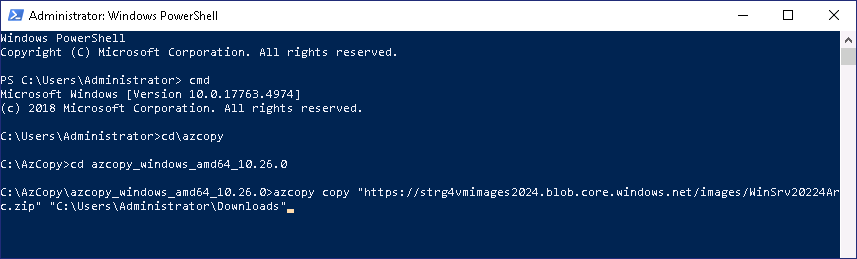

4.  Provide the folder as ```E:\Virtual Machines``` and then click
    on the **Extract** button.

    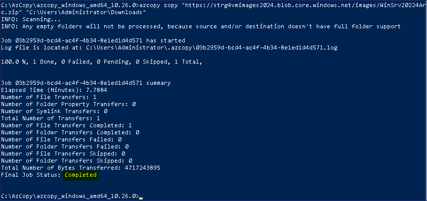

5.  Open the **Hyper-V Manager** from the Task bar and then right click
    on the Server name and then choose **Hyper-V Setting**

    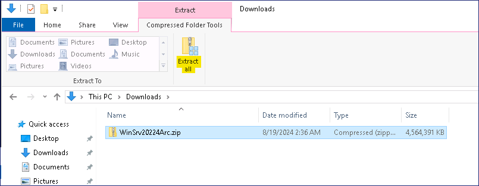

6.  On the **Settings** window, choose **Enhanced Session Mode Policy**
    option and then enable the check box for **Allow enhanced session
    mode** and then click on the **OK** button.

    

7.  In the **Hyper-V Manager** click on the **Import Virtual Machine**
    action.

    

8.  On the **Locate Folder** page, click on the **Browse** button,
    browse to ```E:\Virtual Machines\WinSrv20224Arc``` and then
    click on the **Select Folder** button.

    

9.  On the **Locate Folder** page, click on the **Next** button.

    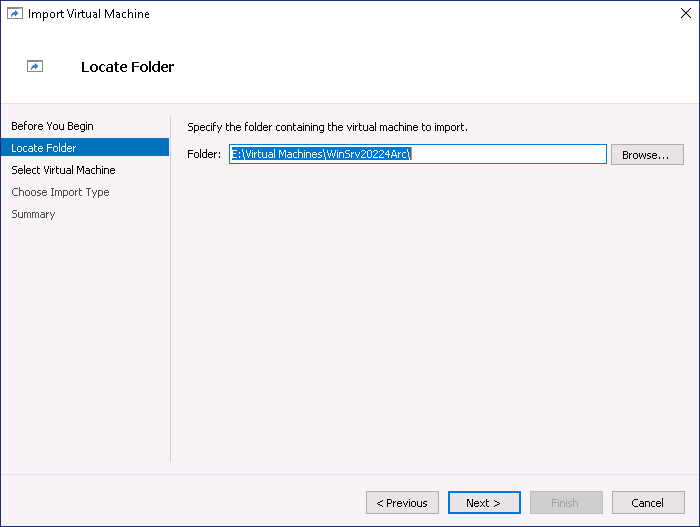

10. On the **Select Virtual Machine** page, click on the **Next**
    button.

11. On the **Choose Import type** page, leave the default option and
    then click on the **Next** button.

    

12. On the **Connect Network** page, from the **Connection** drop-down
    choose the **Microsoft Hyper-V Network Adapter** and then click on
    the **Next** button.

    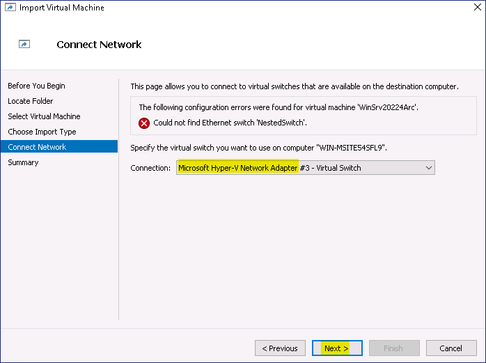

13. On the **Complete Import Wizard** page review the detail and then
    click on the **Finish** button.

    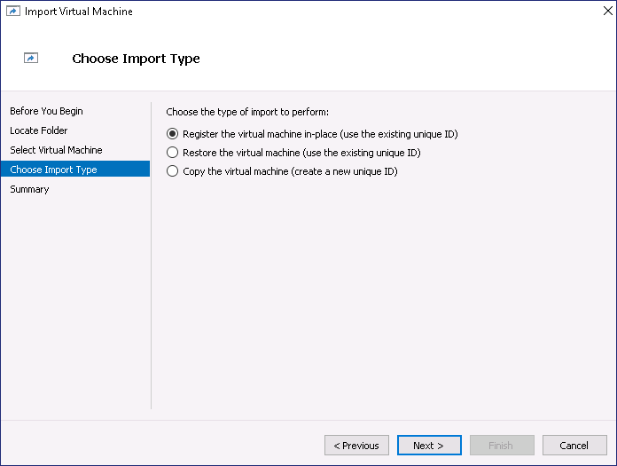

14. Right click on the **WinSrv20224Arc** VM and then choose the
    **Start** option

    

15. Again, right click on the **WinSrv20224Arc** VM and then choose the
    **Connect** option

    

16. Press the **Ctrl+Alt+Delete** button from the Virtual Machine
    Connection window

    

17. Login with the below credentials

    1.  Username – Administrator

    2.  Password – ```P@55w.rd1234```

    

18. Ensure that you have successfully logged in.

## Task 2 – Add Azure Arc resource via Script

1.  In a new Edge tab, go to ``` https://portal.azure.com/```, and
    sign in using the provided credentials.

2.  While in the Azure Portal in the search type ```arc``` and then select Azure Arc

    

3.  Under **Manage resources across environments** click on the **Add
    resources** button.

    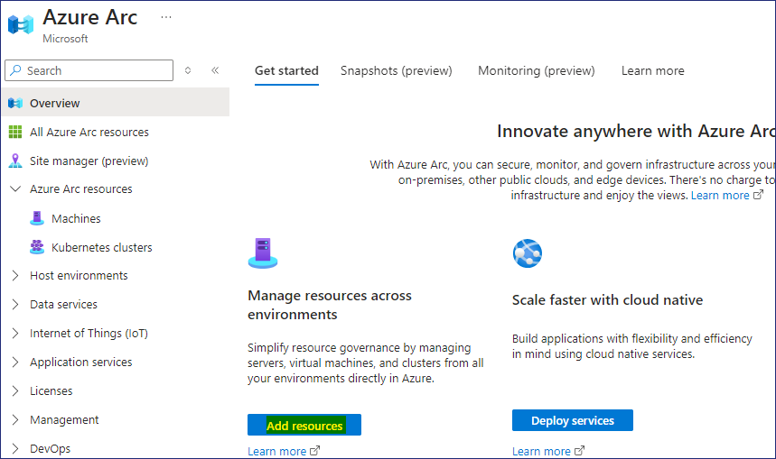

4.  On the **Add Azure Arc resources** page, click on **Add/Create**
    button and choose **Add a machine.**

    

5.  On the **Add servers with Azure Arc** page, click on **Generate
    script** button under the **Add a single server**.

    

6.  On the **Add a server with Azure Arc** page, provide the below
    details.

    *  Choose the Region first Region - **West US**

    *  Resource group – Click on **Create new**  ```RG4ArcVM```

    *  Operating System – **Windows**

    *  Connect SQL Server – **Uncheck the box**

    *  Click on the **Download and run script button**

        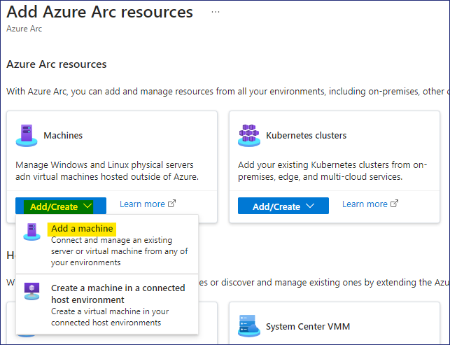

7.  Click on the Download button and also click on the Copy button.

    

8.  Switch back to the **WinSrv20224Arc** VM and right-click on the
    Start button and select **Windows PowerShell (Admin)**

    

9.  On the **Windows PowerShell (Admin)** Window paste the copied script
    from clipboard

    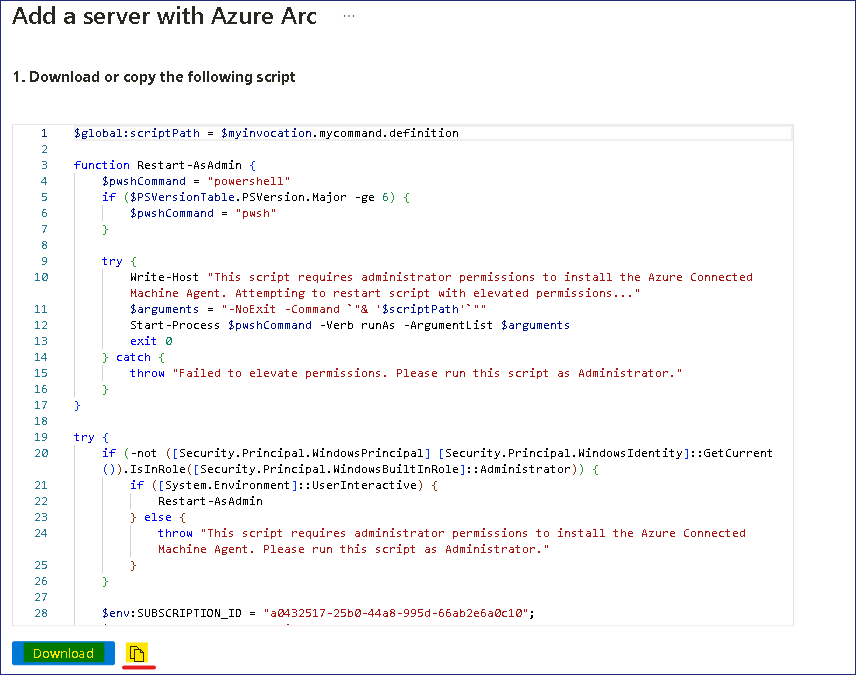

10. The Script should be launched as shown in below image

    

11. When prompted to login, login with the provided credentials

    

12. Once authentication is successful switch back to the PowerShell
    window

    

13. The Machine should be successfully connected to Azure

    

## Task 3 – Manage the Arc Server

1.  Switch back to the Azure Portal windows in the Edge browser.

2.  Click on the Azure Arc link

    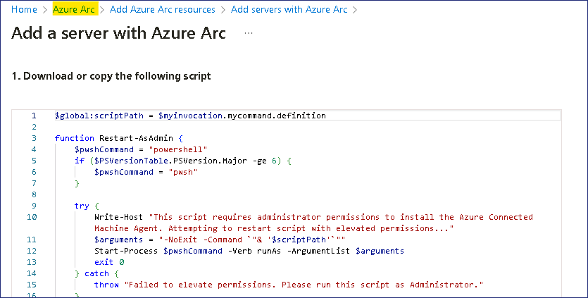

3.  Select **Machines** under Azure Arc resources

    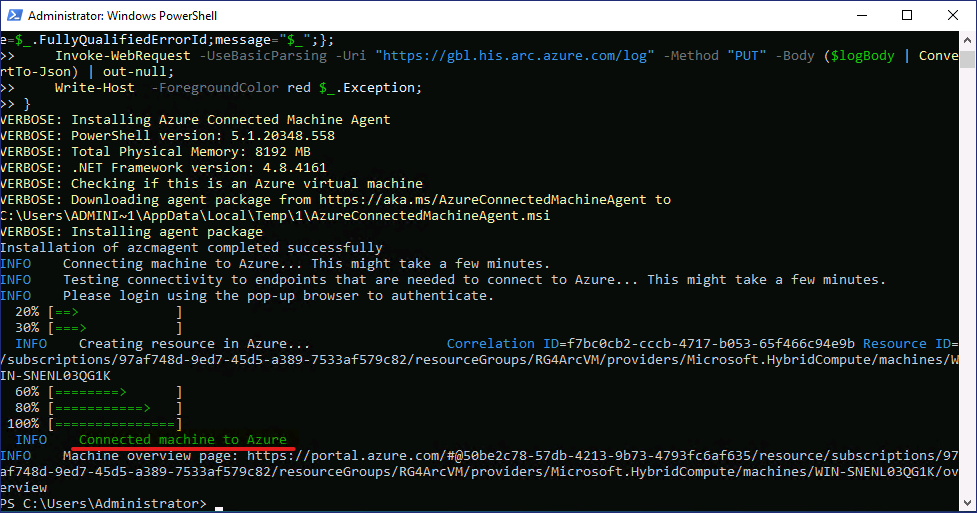

4.  You should be able to see the Server showing as **Connected**

    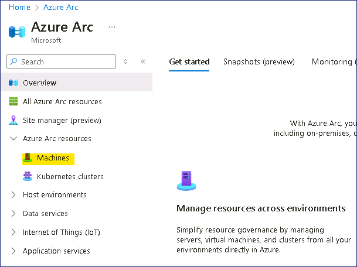

5.  Click on the Server name to open the details, the from the
    **Overview** page, click on **Updates**

    

6.  From the **Periodic assessment** drop-down choose **Enable** and
    then click on **Save** button.

    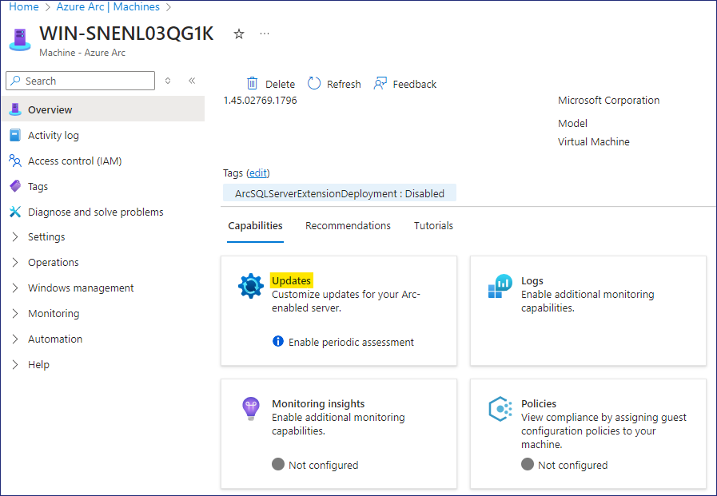

    

7.  Back on the **Overview** page, click on **Monitoring insights**

    

8.  On the Insights page, click on the **Enable** button.

    

9.  On the Monitoring configuration page, click on Configure button.

    

    >**Note** – The monitoring resource can take around 5-10 minutes to be deployed.


    

10. Back on the **Overview** page, click on Security

    

    >**Note**– As we had enabled **Microsoft Defender for Cloud** earlier, we should be able to see the recommendations for the Server.

11. We should be able to see the recommendations for the on-boarded
    server.

    

12. Back on the **Overview** page, click on **Updates**

    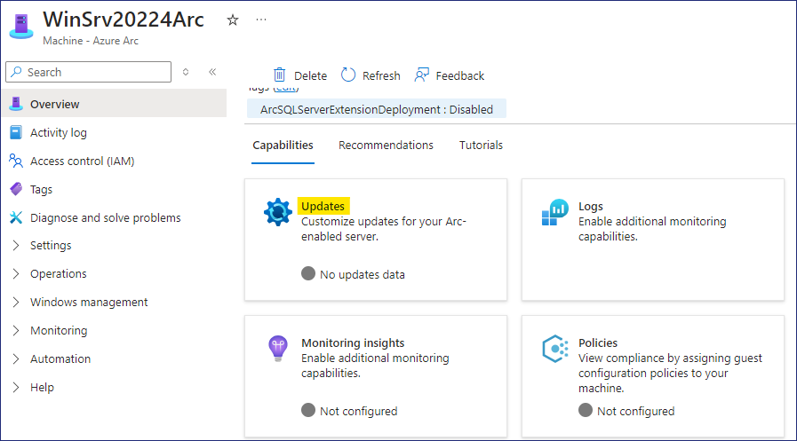

13. Click on **Go to Updates using Azure Update Manager** button.

    

14. Click on **Check for updates** button.

    

15. Click on **OK** button on the **Trigger assess now** message.

    

    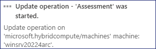

16. Click on the **Refresh** button, the **Total updates** section will
    show **Assessment is in progress**.

    

17. Once the Assessment is completed, click on the Refresh button again.

    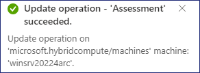

18. We should be able to see the details of the required updates on the
    Server.

    

19. Click on **One-time update** to start the updates on the Server

    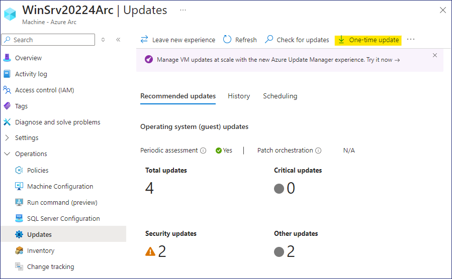

20. On the Install one-time updates page, Machines tab select the
    **WinSrv20224Arc** VM and then click on the **Next** button.

    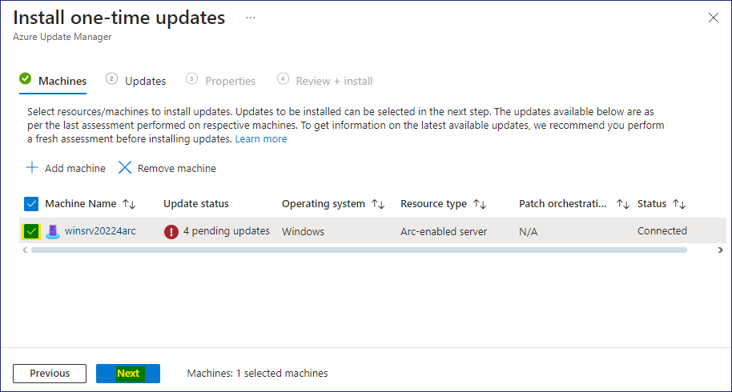

21. Review the details of the Update and then click on the **Next** button.

    

22. On the Properties tab, click on the **Next** button

    

23. On the Review + Install tab, review the details and then click on
    **Install** button.

    

    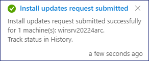

24. Click on the Notification to see the update details

    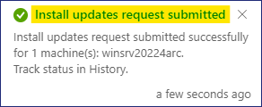

    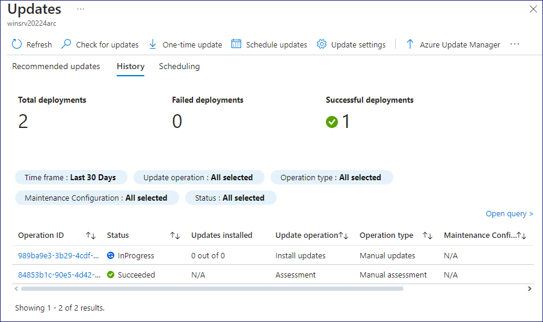

25. Back on the **Overview** page, click on **Monitoring insights**

    

26. Click on the **Analyze data** button

    

27. We should now be able to see the **Performance data** of the On-boarded
    server.

    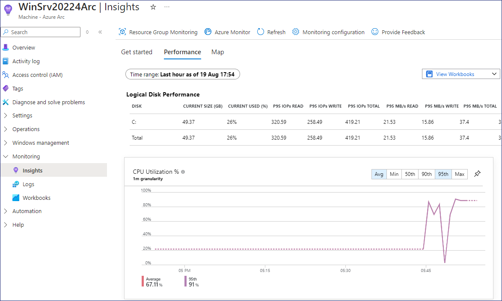

    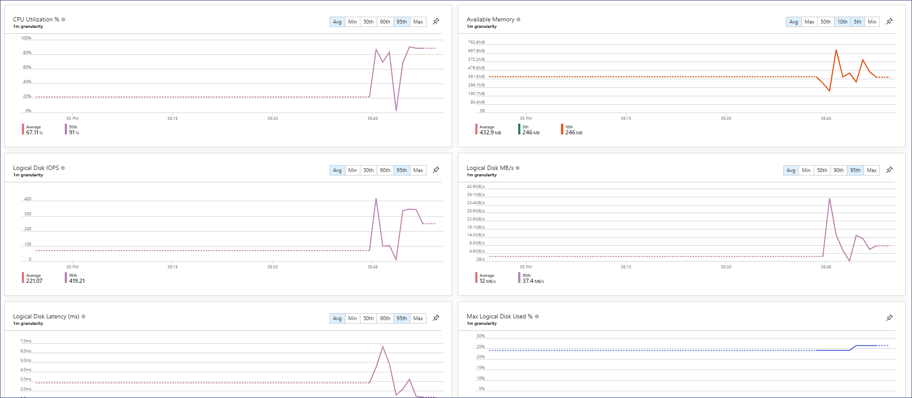

28. Hence, we have successfully on-boarded the On-premise Windows server
    and we can manage the Server from the Azure Portal Azure Arc.
