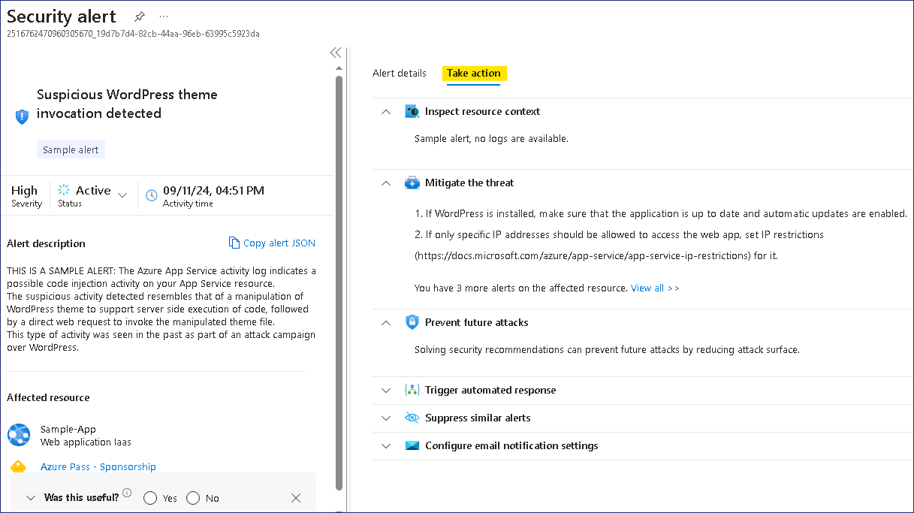
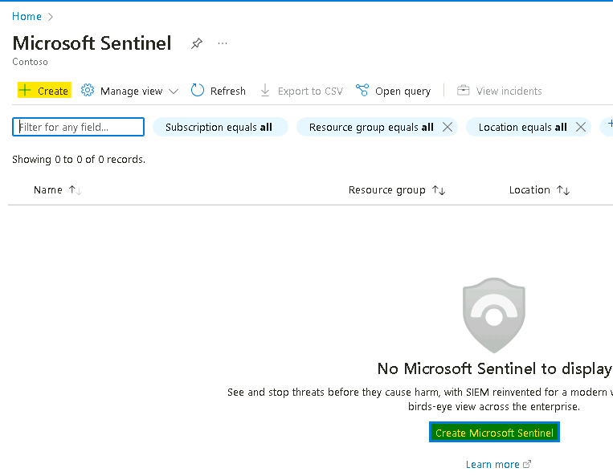
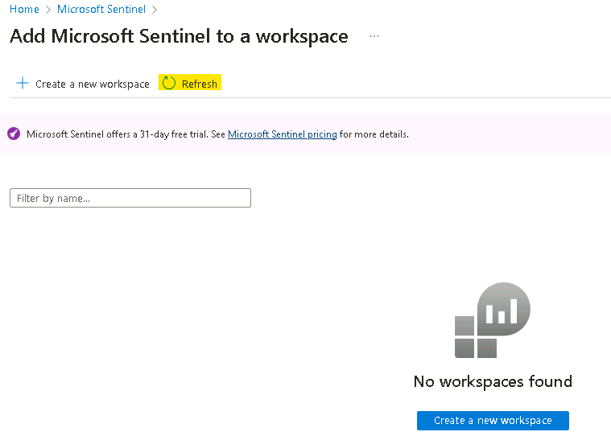
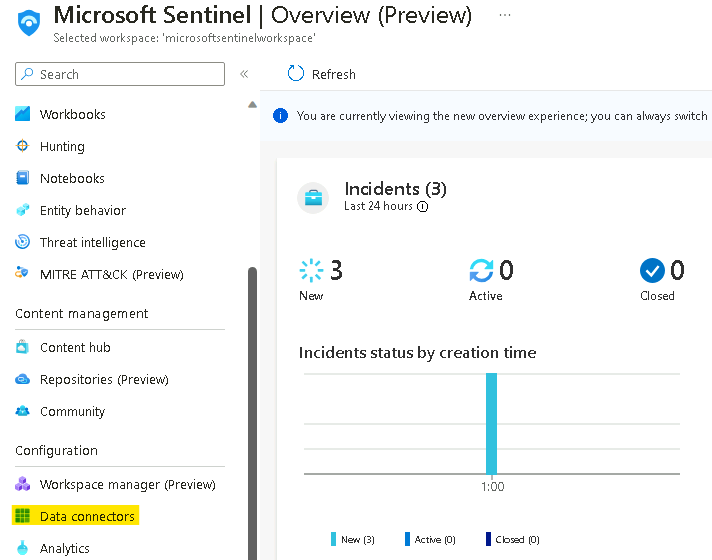
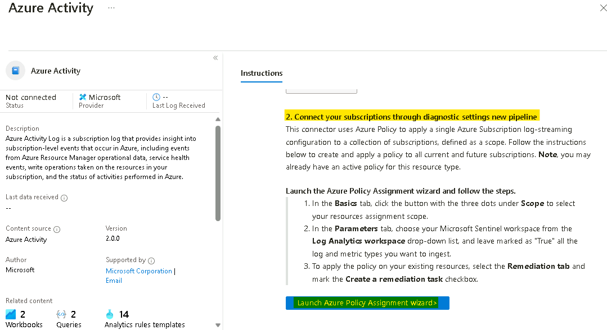
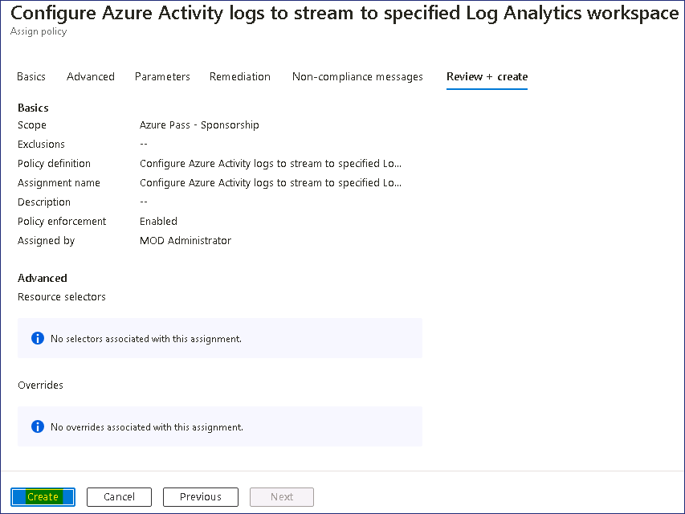
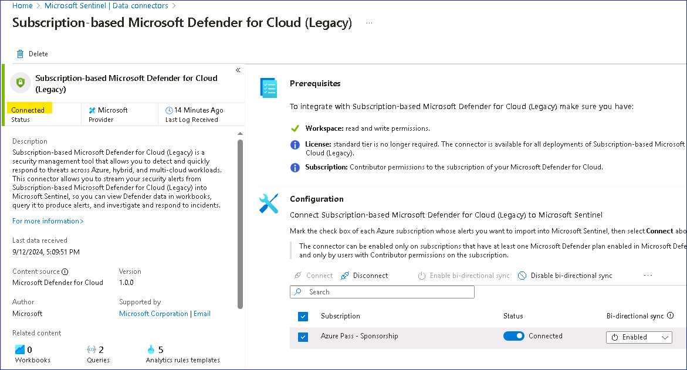
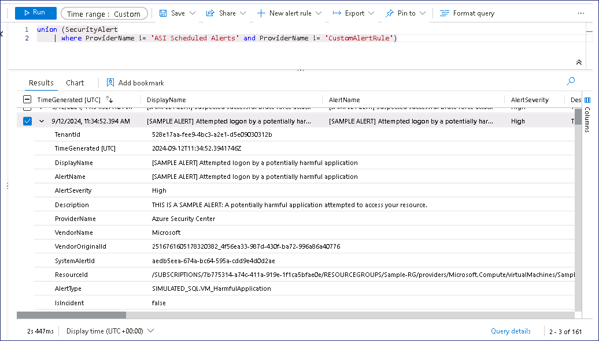

# Lab 5 - Defender for Cloud & Sentinel.

### Aufgabe 1: Aktivieren Sie JIT auf Ihren VMs von Microsoft Defender for Cloud

1.  Geben Sie im **Azure Portal** `https://portal.azure.com` in das
    Suchfeld `Microsoft Defender for Cloud` ein, und klicken Sie
    dann unter **Services** auf **Microsoft Defender for Cloud** .

    

2.  Navigieren Sie auf der linken Seite der **Microsoft Defender for
    Cloud | Overview** Seite zum Abschnitt **Cloud Security** und
    klicken Sie dann auf **Workload Protections**.

    

3.  Scrollen Sie auf der Seite **Microsoft Defender for Cloud | Workload
    protections**  nach unten und klicken Sie im Abschnitt **Advanced
    protection** auf **Just-in-time VM access**, wie in der folgenden
    Abbildung dargestellt.

    

4.  Navigieren Sie auf der Seite **Just-in-time VM access** zum
    Abschnitt **Virtual machines** und klicken Sie auf die Registerkarte
    **Non Configured**. Sie sehen die VMs - **PostgreSrv** ist unter der
    Registerkarte **Non** **Configured** aufgeführt.

    

5.  Wählen Sie eine der verfügbaren VMs aus und klicken Sie auf der
    rechten Seite auf die Schaltfläche **Enable JIT on 1 VM**.

    

6.  Klicken Sie auf der **JIT VM access configuration** Seite auf
    **Save**.

    

7.  Sie erhalten eine Benachrichtigung - **Just-in-time VM access
    configuration has started.**

    

8.  Klicken Sie auf die Registerkarte **Configured** unter dem Abschnitt
    **Virtual machines**. Sie werden sehen, dass die VMs **PostgreSrv**
    unter der Registerkarte **Configured** aufgeführt ist.

    

9.  Um sich nun mit dieser VM zu verbinden, wird der Zugang auf Anfrage
    gewährt.

    

### Aufgabe 2: Erzeugen und Untersuchen von Sicherheitswarnungen

1.  Wählen Sie in **Microsoft Defender for Cloud** im Abschnitt
    **General** die Option **Security alerts**

    

2.  Klicken Sie auf die Schaltfläche **Sample alerts**, um Warnmeldungen
    zu erzeugen.

    

3.  Klicken Sie auf die Schaltfläche **Create sample alerts**.

    

    

4.  Es werden Musterwarnungen generiert

    

5.  Klicken Sie auf die Schaltfläche **Refresh**, um die Musterwarnungen
    zu sehen.

    

6.  Sie können auf jede Meldung klicken, die Sie untersuchen möchten

7.  Untersuchen Sie im alert overview fenster die folgenden Details.

    +  **Severity, Status, and Activity time**

    + **Description**, die die genaue Aktivität, die entdeckt wurde,
        erklärt

    +  **Affected resources**

    +  **Kill Chain Intent** der Aktivität auf der MITRE ATT&CK Matrix.

8.  Für detailliertere Informationen, die Ihnen helfen können, die
    verdächtige Aktivität zu untersuchen, klicken Sie auf die
    Schaltfläche **View full details**.

    

9.  Überprüfen Sie die Informationen auf der Registerkarte **"Alert
    details"**.

    

10. Klicken Sie auf die Schaltfläche **Take action** und prüfen Sie die
    verfügbaren Optionen

    

## Übung 2 - Deployment von Sentinel

### Aufgabe 1: Microsoft Sentinel workspace

In dieser Übung sehen wir uns an, wie man einen Microsoft Sentinel
workspace erstellt.

1.  Navigieren Sie zu `https://portal.azure.com` und melden Sie sich
    mit den **MOD-Administrator**-Anmeldedaten an, die Sie mit den Lab
    ressourcen Ihrer Lab umgebung erhalten haben.

2.  Geben Sie in der oberen Suchleiste `Microsoft Sentinel` ein und
    klicken Sie auf **Microsoft Sentinel**.

    

3.  Klicken Sie auf dem Bildschirm **Microsoft Sentinel** oben links auf
    **Create**.

    

4.  Sie können **Microsoft Sentinel** zu einem bestehenden **Log
    Analytics** **workspace**  hinzufügen oder einen neuen workspace
    erstellen. Wir werden einen neuen workspace erstellen, klicken Sie
    also auf **Create a new workspace**.

    

5.  Füllen Sie auf der Seite **Create Log Analytics workspace** das
    Formular wie folgt aus:

    +  Subscription: **Azure Pass - Sponsorship**

    +  Resource Group: Klicken Sie auf **Create new** 
        `LAWResourceGroup`

    +  Workspace Name: `SentWrkspcXXXXXX` \[ersetzen Sie **XXXXXX**
        durch eine Zufallszahl\]

    +  Region: **West US**

    +  Klicken Sie auf **Review + create**.

    

6.  Klicken Sie nach Abschluss der Validierung auf **Create**. Die
    Erstellung dauert ein paar Sekunden.

    

7.  Sie werden wieder auf die Seite **Add Microsoft Sentinel** to a
    workspace weitergeleitet, klicken Sie auf die Schaltfläche
    **Refresh**.

    

8.  Wählen Sie Ihren soeben erstellten workspace aus und klicken Sie
    unten auf **Add.**

    

9.  Sie sollten eine Benachrichtigung erhalten, wie in der folgenden
    Abbildung gezeigt

    

10. Ihr Microsoft Sentinel workspace ist nun einsatzbereit. Klicken Sie
    auf die Schaltfläche **OK**, um fortzufahren.

    

### Aufgabe 2: Aktivieren Sie Data connectors.

Diese Übung zeigt Ihnen, wie Sie Data connectors aktivieren können.

1.  Navigieren Sie in der Browser-Registerkarte zu `
    https://portal.azure.com/#view/Microsoft_AAD_UsersAndTenants/UserManagementMenuBlade/~/AllUsers
    ` und wählen Sie das **Tenant Administrator account** aus

    

2.  Wählen Sie unter Manage die **Assigned roles** aus und klicken Sie
    dann auf **+ Add assignments.**

    

3.  Suchen und wählen Sie **Security Administrator** und klicken Sie
    dann auf die Schaltfläche **Add**.

    

    

4.  Suchen Sie im Azure Portal `https://portal.azure.com` nach Microsoft
    Sentinel und klicken Sie auf **Microsoft Sentinel**.

    

5.  Wählen Sie **SentWrkspcXXXXXX**.

    

6.  Wählen Sie nun im Abschnitt **Data Connectors** die Option
    **Configuration**.

    

7.  Sie sollten die Meldung erhalten, dass **Data Connector with
    "content source = gallery content" have been removed.** Wählen Sie
    in dieser Meldung den Link **Click here**

    

8.  Auf der **Out-of-the-box Content Centralization** klicken Sie auf
    **Continue**

    

9.  Klicken Sie auf die Schaltfläche **Complete centralization**

    

10. Sie sollten eine Benachrichtigung wie in der folgenden Abbildung
    erhalten

    

11. Klicken Sie oben auf den Link für **Microsoft Sentinel** oder
    navigieren Sie zurück zur Sentinel-Seite.

    

12. Klicken Sie auf die Schaltfläche **Refresh**, und Sie sollten die
    wenigen angezeigten Data connectors sehen können.

    

    > **Hinweis**: Manchmal kann es vorkommen, dass kein connector installiert
    wird, was auch in Ordnung ist, um mit den Labs fortzufahren.

13. Klicken Sie auf **Content Hub** unter **Content Management**

    

14. Suchen Sie auf der Content-Hub-Seite nach Azure Activity, wählen Sie
    dann den **Azure Activity** content aus und klicken Sie auf die
    Schaltfläche **Install** 

    

15. Suchen Sie auf der Content-Hub-Seite nach Microsoft Defender for
    Cloud, wählen Sie **Microsoft Defender for Cloud** aus und klicken
    Sie auf die Schaltfläche **Install**

    

### Aufgabe 3: Aktivieren des Azure Activity data connector

Diese Übung zeigt Ihnen, wie Sie den Azure Activity Data Connector
aktivieren. Dieser Connector bringt alle Audit-Ereignisse für Aktionen,
die in Ihrem Azure- subscription durchgeführt werden, in Ihren Microsoft
Sentinel- workspace.

1.  Klicken Sie auf der Seite **Microsoft Sentinel** im Abschnitt
    **Configuration** auf **Data Connectors**.

    

2.  Geben Sie im Bildschirm der data connectors, activity in die
    Suchleiste ein, wählen Sie den **Azure Activity** connector aus und
    klicken Sie auf **Open connector page**.

    

3.  Gehen Sie auf der **Azure Activity connector** -Seite zu Option
    Nummer **2. Connect your subscriptions through diagnostic settings
    new pipeline**. Diese Methode nutzt Azure Policy und bringt viele
    Verbesserungen im Vergleich zur alten Methode (weitere Details zu
    diesen Verbesserungen finden Sie hier). Klicken Sie auf den
    Assistenten **Launch Azure Policy Assignment**, der Sie zur Seite
    policy creation weiterleitet.

    

4.  Wählen Sie in der **Scope** **selection Azure Pass - Sponsoring**.
    Klicken Sie auf **Select**

    

5.  Gehen Sie auf die Registerkarte **Parameters**. Wählen Sie im
    **Primary Log Analytics workspace** den
    **MicrosoftSentinelWorkspace**.

    

6.  Aktivieren Sie auf der Registerkarte **Remediation** das
    Kontrollkästchen neben **Create a remediation task** und klicken Sie
    dann auf die Schaltfläche **Review + create** 

    

7.  Klicken Sie auf der Registerkarte **Review + create** auf die
    Schaltfläche **Create**.

    

8.  Im **Notification** bereich können Sie die Benachrichtigungen
    “**Role Assignments creation succeeded**”, “**Remediation task
    creation succeeded**” and “**Creating policy assignment succeeded**”
    sehen.

    

9.  Auf der Seite des **Azure Activity connector** können Sie den
    Verbindungsstatus sehen.

    

    > **Hinweis**: Es ist normal, wenn der Anschluss nicht sofort als
    **Connected**  und grün angezeigt wird. Es dauert etwa 30 Minuten, bis
    der Vorgang abgeschlossen ist.

10. Fahren Sie mit der nächsten Übung fort und melden Sie sich nach 30
    Minuten wieder.

### Aufgabe 4: Aktivieren Sie Microsoft Defender for Cloud data connector.

Diese Übung zeigt Ihnen, wie Sie den Microsoft Defender for Cloud- data
connector aktivieren. Mit diesem Konnektor können Sie Ihre
Sicherheitswarnungen von Microsoft Defender for Cloud in Microsoft
Sentinel streamen, so dass Sie Defender-Daten in Arbeitsmappen anzeigen,
sie abfragen, um Warnmeldungen zu erzeugen, und Vorfälle untersuchen und
darauf reagieren können.

1.  Klicken Sie auf der Seite **Microsoft Sentinel** im Abschnitt
    **Configuration** auf **Data Connectors**.

    

2.  Geben Sie auf dem Bildschirm **Data connectors** in der Suchleiste
    den Begriff Tenant ein, wählen Sie den Konnektor **Tenant-based
    Microsoft Defender for Cloud** **(Preview)** aus und klicken Sie auf
    **Open connector page**.

    

    > **Hinweis** - Wenn Sie die Fehlermeldung **Data Connector Not Found**
    erhalten, navigieren Sie zu **Content Hub** und installieren Sie den
    **Microsoft Defender for Cloud Connector** erneut.

    

    

3.  Klicken Sie auf der Seite **Tenant-based Microsoft Defender for
    Cloud** **(Preview)** connector im Abschnitt **Configuration** auf
    die Schaltfläche **Connect**.

    

4.  Sie sollten die Meldung " **Connected successfully"** erhalten**.**

    

5.  Warten Sie 1-2 Minuten und aktualisieren Sie dann die Seite. Der
    Status des connector sollte nun ebenfalls auf **Connected**
    aktualisiert werden**.**

    

6.  Geben Sie auf dem Bildschirm **Data connectors** den Begriff
    subscription in die Suchleiste ein, wählen Sie den
    **Subscription-based Microsoft Defender for
    Cloud** **(legacy)** connector aus und klicken Sie auf **Open
    connector page**.

    

7.  Wählen Sie auf der Seite des **Subscription-based Microsoft Defender
    for Cloud** **(legacy)** Connectors im Abschnitt
    **Configuration** das Abonnement **Azure Pass –
    Sponsorship** subscription aus und klicken Sie dann auf die
    Schaltfläche **Connect**.

    

8.  Sie sollten die Meldung "**Connected successfully"** erhalten.

    

9.  Der Status des connector sollte ebenfalls auf **Connected**
    aktualisiert werden**.**

    

## Übung 3- Integration

Da wir den Defend for Cloud-Connector installiert haben, sollten wir in
der Lage sein, den von Microsoft Defender for Cloud generierten Vorfall
zu sehen, der mit den Beispielwarnungen erzeugt wurde.

1.  Klicken Sie auf der **Microsoft Sentinel** Seite auf
    **Incidents** unter Threat management.

    

2.  Da wir gerade den **Microsoft Defender for Cloud**-Connector
    aktiviert haben, würde es etwa 20-30 Minuten dauern, bis die
    Vorfälle angezeigt werden.

3.  Klicken Sie unter **General** auf **Overview** und schalten Sie den
    Schalter **New overview** auf **Off**

    

4.  Sobald der Schalter ausgeschaltet ist, sollten wir in der Lage sein,
    die **Sample events** von Microsoft Defender for Cloud zu sehen.

    

5.  Klicken Sie auf **SecurityAlerts**

    

6.  Es sollte den Log Analytic workspace öffnen und alle Protokolle der
    von **Microsoft Defender for Cloud** generierten und
    synchronisierten **Alerts** auflisten.

    

7.  Klicken Sie auf eine beliebige **Alerts**, um sie zu erweitern und
    die Details dazu aufzulisten.

    

8.  Die erweiterten Details der alerts können Sie sehen.

    +  TimeGenerated \[UTC\]

    +  Displayname

    +  AlertName

    +  AlertSeverity

    +  Description, die die genaue Aktivität, die entdeckt wurde,
        erklärt

    +  ProviderName – Azure Security Center - der ältere Name für
        Microsoft Defender for Cloud

    +  RemeditalSteps

    +  Und weitere Zeilen mit zusätzlichen Informationen.

    
