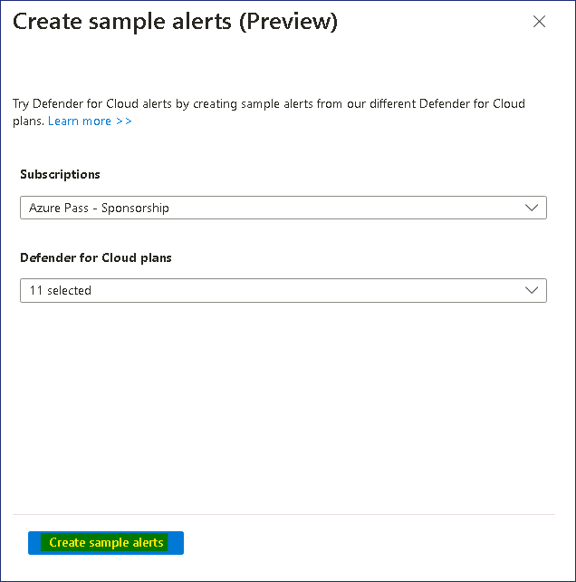
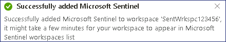
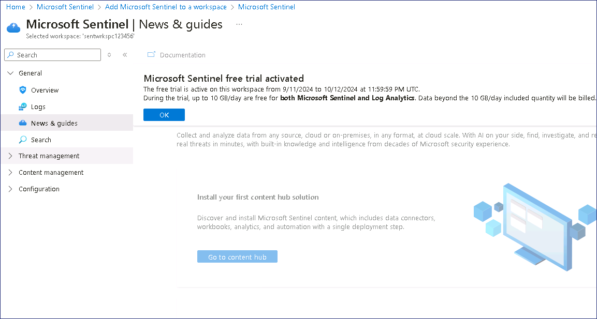
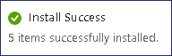
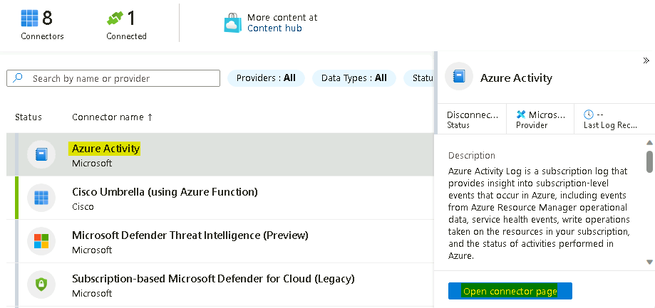
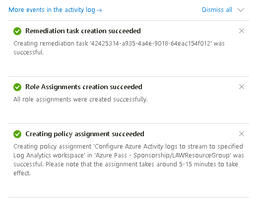
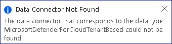
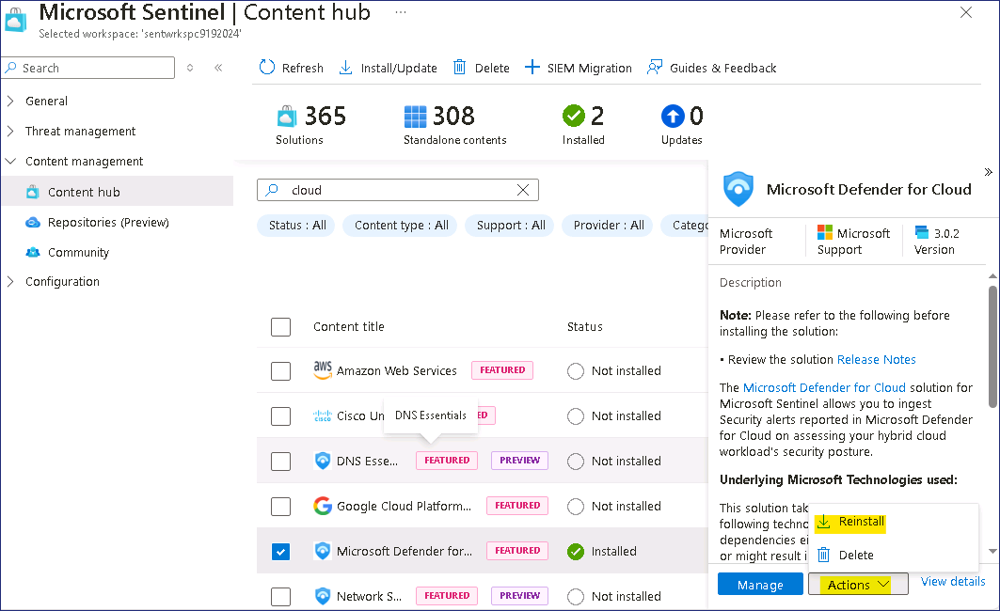
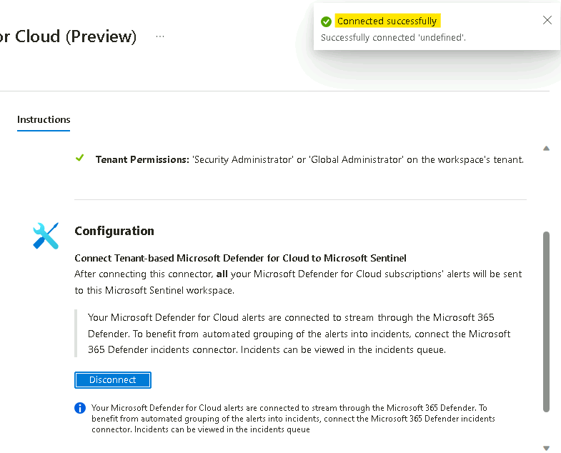
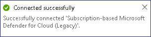

# 실습 5 - Cloud 및 Sentinel용 Defender

**작업 1: Microsoft Defender for Cloud에서 VM에 JIT 활성화**

1.  **Azure Portal** ```https://portal.azure.com```에서 검색창에
    ```Microsoft Defender for Cloud```를 입력한 다음, **Services**에서
    **Microsoft Defender for Cloud**를 클릭하세요.

    

2.  **Microsoft Defender for Cloud | Overview** 페이지의 왼쪽 창에서
    **Cloud Security** 섹션으로 이동한 다음, **Workload Protections**를
    클릭하세요.

    

3.  아래 이미지와 같이 **Microsoft Defender for Cloud | Workload
    Protections** 페이지에서 아래로 스크롤하여 **Advanced protection**
    섹션의 **Just-in-time VM access**를 클릭하세요.

    

4.  **Just-in-time VM access** 페이지에서 **Virtual machines** 섹션으로
    이동하여 **Not Configured** 탭을 클릭하세요. **Not Configured** 탭에
    VMs - **PostgreSrv**가 표시된 것을 확인할 수 있습니다.

    

5.  사용 가능한 VM 중 하나를 선택하고 오른쪽에 있는 **Enable JIT on 1
    VM** 버튼을 클릭하세요.

    

6.  **JIT VM access configuration** 페이지에서 **Save**을 클릭하세요.

    

7.  **Just-in-time VM access configuration has started** 알림이
    표시됩니다.

    

8.  **Virtual machines** 섹션의 **Configured** 탭을 클릭하면,
    **Configured** 탭 아래에 VMs **PostgreSrv**가 표시되어 있는 것을
    확인할 수 있습니다.

    

9.  이제 이 VM에 연결하기 위해서는 요청 시 액세스 권한이 부여됩니다.

    

**작업 2: 보안 알림 생성 및 조사**

1.  **General** 섹션의 **Microsoft Defender for Cloud**에서 **Security
    alerts**를 선택하세요.

    

2.  **Sample alerts** 버튼을 클릭하여 알림을 생성하세요.

    

3.  **Create sample alerts**  버튼을 클릭하세요.

    

    

4.  Sample alerts이 생성됩니다.

    

5.  **Refresh** 버튼을 클릭하면 Sample alerts을 확인할 수 있습니다.

    

6.  조사하려는 알림을 클릭할 수 있습니다.

7.  Alert Overview 창에서 다음 세부 정보를 확인하세요.

    1.  **Severity, Status, and Activity time**

    2.  감지된 정확한 활동을 설명하는**Description** 

    3.  **Affected resources**

    4.  MITRE ATT&CK matrix에서 **Kill chain intent** 의 활동 목적

8.  의심스러운 활동을 조사하는 데 도움이 되는 정보를 얻으려면, **View
    full details** 버튼을 클릭하세요.

    

9.  **Alert details**탭에서 정보를 검토하세요.

    

10. **Take action** 버튼을 클릭하고 사용 가능한 옵션을 검토하세요.

    

**연습 2 - Deploying Sentinel**

**작업 1: Microsoft Sentinel Workspace**

이 연습에서는 Microsoft Sentinel Workspace를 생성하는 방법을 살펴봅니다.

1.  ```https://portal.azure.com```로 이동하여 실습 환경의 실습 리소스와
    함께 제공된 **MOD Administrator** 자격 증명으로 로그인하세요.

2.  상단 검색창에 ```Microsoft Sentinel```을 입력하고 **Microsoft
    Sentinel**을 클릭하세요.

    

3.  **Microsoft Sentinel** 화면에서 왼쪽 상단의 **Create**를 클릭하세요.

    

4.  기존 **Log Analytics workspace**에 **Microsoft Sentinel**을
    추가하거나 새 workspace을 생성하도록 선택할 수 있습니다. 새
    **workspace**를 생성할 예정이며, **Create a new workspace**를
    클릭하세요.

    

5.  **Create Log Analytics workspace**페이지에서 다음과 같이 양식을
    작성하세요:

    1.  Subscription: **Azure Pass - Sponsorship**

    2.  Resource Group: click on **Create new** ```LAWResourceGroup```

    3.  Workspace Name: ```SentWrkspcXXXXXX``` \[**XXXXXX**를 임의의
        숫자로 대체\]

    4.  Region: **West US**

    5.  Click **Review + create**클릭하세요

    

6.  Validation이 완료되면 **Create**를 클릭하세요. 생성하는 데 몇 초
    소요됩니다.

    

7.  **Add Microsoft Sentinel to a workspace**페이지로 다시 전환되면,
    **refresh** 버튼을 클릭하세요.

    

8.  방금 생성한 workspace를 선택하고 하단의 **Add**를 클릭하세요.

    

9.  아래 이미지와 같은 알림이 표시됩니다.

    

10. 이제 Microsoft Sentinel workspace을 사용할 준비가 되었으니 **OK**
    버튼을 클릭하여 계속 진행하세요.

    

**작업 2: 데이터 커넥터 활성화.**

이 연습에서는 데이터 커넥터를 활성화하는 방법을 안내합니다.

1.  browser 탭에서
   ```https://portal.azure.com/#view/Microsoft_AAD_UsersAndTenants/UserManagementMenuBlade/~/AllUsers```로
    이동하여 **Tenant Administrator account**을 선택하세요.

    

2.  Manage에서 **Assigned roles**을 선택한 다음, **+ Add assignments**를
    클릭하세요.

    

3.  **Security Administrator**를 검색하여 선택한 다음, **Add** 버튼을
    클릭하세요.

    

    

4.  Azure Portal ```https://portal.azure.com``` 에서 ```Microsoft Sentinel``` 을
    검색하고, **Microsoft Sentinel**을 클릭하세요.

    

5.  **SentWrkspcXXXXXX**를 선택하세요.

    

6.  이제 **Configuration** 섹션에서 **Data Connectors**를 선택하세요.

    

7.  **" Data Connector with "content source = gallery content" have been
    removed**라는 메시지가 표시됩니다**.** 해당 메시지에서 **Click
    here** 링크를 선택하세요.

    

8.  **Out-of-the-box Content Centralization**페이지에서 **Continue**를
    클릭하세요.

    

9.  **Complete centralization** 버튼을 클릭하세요.

    

10. 아래 이미지와 같은 알림이 표시됩니다.

    

11. 상단에서 **Microsoft Sentinel** 링크를 클릭하거나 Sentinel 페이지로
    다시 이동하세요.

    

12. **Refresh** 버튼을 클릭하면 몇 개의 데이터 커넥터가 표시되는 것을
    확인할 수 있습니다.

    

    > **참고** - 간혹 커넥터가 설치되지 않았을 수 있으며, 이 경우에도 실습을
    계속 진행해도 괜찮습니다.

13. **Content management**에서 **Content hub**를 클릭하세요.

    

14. Content hub에서 Azure Activity를 검색한 다음, **Azure Activity**
    content를 선택하고 **Install** 버튼을 클릭하세요.

    

15. Content hub 페이지에서 **Microsoft Defender for Cloud** 를 검색한
    다음, **Microsoft Defender for Cloud** content를 선택하고
    **Install** 버튼을 클릭하세요.

    

**작업 3: Azure Activity data connector 활성화**

이 연습에서는 Azure Activity data connector를 활성화하는 방법을
안내합니다. 이 커넥터는 Azure 구독에서 발생한 모든 감사 기록을 Microsoft
Sentinel workspace로 가져옵니다.

1.  **Microsoft Sentinel** 페이지에서 **Configuration** 섹션에서 **Data
    Connector**를 클릭하세요.

    

2.  데이터 커넥터 화면에서 검색창에 Activity를 입력하고, **Azure
    activity** connector를 선택한 다음, **Open connector page**를
    클릭하세요.

    

3.  **Azure activity connector** 페이지에서 옵션 **2. Connect your
    subscriptions through diagnostic settings new pipeline**으로
    이동하세요. 이 방법은 Azure Policy를 활용하며 이전 방법에 비해
    많은 개선 사항을 제공합니다(개선 사항에 대한 자세한 내용은 여기에서
    확인할 수 있습니다). **Launch Azure Policy Assignment** 마법사를
    클릭하면 정책 만들기 페이지로 리디렉션됩니다.

    

4.  **Scope** 선택에서 **Azure Pass – Sponsorship**을 선택하세요.
    **Select**를 클릭하세요.

    

5.  **Parameters** 탭으로 이동하세요. **Primary Log Analytics
    workspace**에서 **MicrosoftSentinelWorkspace**를 선택하세요.

    

6.  **Remediation** 탭에서 **Create a remediation task** 옆의 체크박스를
    선택한 다음, **Review + create** 버튼을 클릭하세요**.**

    

7.  **Review + create** 탭에서 **Create** 버튼을 클릭하세요.

    

8.  **Notification** 창에서 ‘**Role Assignments creation succeeded**’,
    ‘**Remediation task creation succeeded**’ 및 ‘**Creating policy
    assignment succeeded’** 알림을 확인할 수 있습니다.

    

9.  **Azure Activity connector** 페이지에서 연결 상태를 확인할 수
    있습니다.

    

    > **참고**: 커넥터가 즉시 녹색으로 **Connected** 표시되지 않는 것은
    정상입니다. 프로세스가 완료되는 데 약 30 분 정도 소요될 수 있습니다.

10. 다음 연습으로 진행한 후, 30분 후에 다시 확인하세요.

**작업 4: Microsoft Defender for Cloud data connector 활성화.**

이 연습에서는 Microsoft Defender for Cloud data connector를 활성화하는
방법을 안내합니다. 이 커넥터를 사용하면 Microsoft Defender for Cloud의
보안 경고를 Microsoft Sentinel로 스트리밍할 수 있으므로 workbooks에서
Defender 데이터를 확인하고, 쿼리하여 경고를 생성하고, 인시던트를 조사 및
대응할 수 있습니다.

1.  **Microsoft Sentinel** 페이지에서 **Configuration** 섹션에서 **Data
    Connectors**를 클릭하세요.

    

2.  **Data connectors** 화면의 검색 창에 tenant를 입력하고,
    **Tenant-based Microsoft Defender for Cloud** **(Preview)** 커넥터를
    선택한 후, **Open connector page**를 클릭하세요.

    

    > **참고** – **Data Connector Not Found** 오류가 표시되면 **Content
    Hub**로 이동한 다음, **Microsoft Defender for Cloud connector**를 다시
    설치하세요.

    

    

3.  **Tenant-based Microsoft Defender for Cloud** **(Preview)**
    connector 페이지의 **Configuration** 섹션에서 **Connect** 버튼을
    클릭하세요.

    

4.  **Connected successfully**알림이 표시됩니다.

    

5.  1~2분 정도 대기한 후, 다음 페이지를 새로 고치면 커넥터의 상태도
    **Connected**로 업데이트됩니다**.**

    

6.  **Data connectors** 화면으로 돌아와서 검색창에 subscription을
    입력하고, **Subscription-based Microsoft Defender for
    Cloud** **(legacy)** connector를 선택한 다음, **Open connector
    page**를 클릭하세요.

    

7.  **Subscription-based Microsoft Defender for
    Cloud** **(legacy)** connector 페이지의 **Configuration** 섹션에서
    **Azure Pass - Sponsorship**구독을 선택한 다음, **Connect** 버튼을
    클릭하세요.

    

8.  **Connected successfully**알림이 표시됩니다.

    

9.  커넥터의 상태도 **Connected**로 업데이트되어야 합니다**.**

    

**연습 3- 통합**

Defend for Cloud 커넥터를 설치했으므로 샘플 알림을 사용하여 생성된
Microsoft Defender for Cloud의 인시던트를 확인할 수 있어야 합니다.

1.  **Microsoft Sentinel** 페이지에서 Threat Management에
    **Incidents**를 클릭하세요.

    

2.  **Microsoft Defender for Cloud** connector를 활성화했으므로
    인시던트가 표시되는 데 약 20~30분이 소요됩니다.

3.  **General**에서 **Overview**를 클릭한 다음, **New Overview**
    스위치를 **Off**로 전환하세요.

    

4.  스위치가 Off상태로 변경되면, Microsoft Defender for Cloud의 **Sample
    events**를 확인할 수 있습니다.

    

5.  **SecurityAlerts**를 클릭하세요.

    

6.  Log Analytic workspace이 열리고 **Microsoft Defender for Cloud**에서
    생성되고 동기화된 모든 **Alerts** 로그가 나열됩니다.

    

7.  아무**Alerts**을 클릭하여 상세 정보를 확장해 확인하세요.     

8.  Alerts 확장 세부정보에서 다음과 같이 확인할 수 있습니다.

    <font color=darkred>

    *  TimeGenerated \[UTC\]

    *  Displayname

    *  AlertName

    *  AlertSeverity

    *  감지된 정확한 활동을 설명하는 Description

    *  ProviderName - Azure Security Center - Microsoft Defender for
        Cloud의 이전 이름

    *  RemeditalSteps

    *  그리고 추가 정보가 있는 다른 행
    </font>

    
