# **Lab 5 - Defender for Cloud & Sentinel.**

## Task 1: Enable JIT on your VMs from Microsoft Defender for Cloud

1.  While in the **Azure Portal** ```https://portal.azure.com``` type ```Microsoft Defender for Cloud``` in the search
    box, then click on **Microsoft Defender for Cloud**
    under **Services**.
    
    


3.  On **Microsoft Defender for Cloud \| Overview** page left-sided
    pane, navigate to the **Cloud Security** section and then click on
    **Workload Protections**.

    

3.  On **Microsoft Defender for Cloud \| Workload protections** page,
    scroll down and click on **Just-in-time VM access** under the
    **Advanced protection** section as shown in the below image.

     

4.  On the **Just-in-time VM access** page, navigate to the **Virtual
    machines** section and click on **Non Configured** tab. You will see
    the VMs – **PostgreSrv** is listed under the **Non** **Configured**
    tab.

      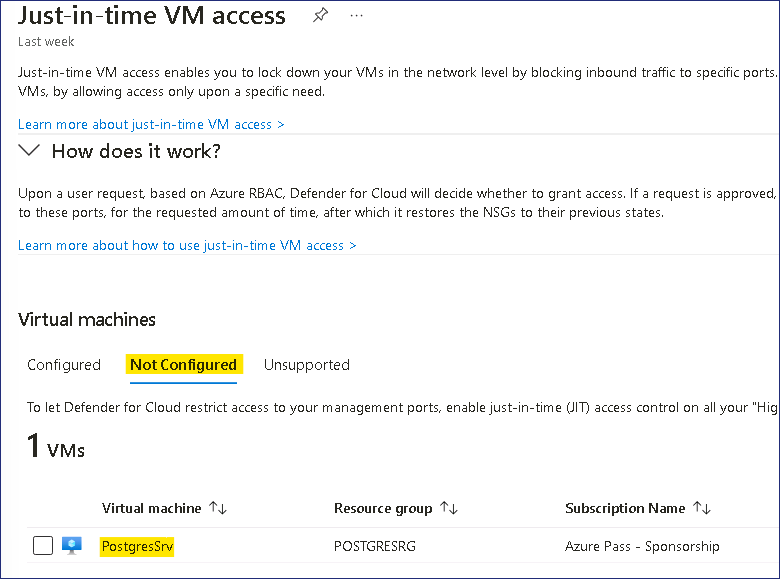
 

5.  Select the one of the available VM and click on **Enable JIT on 1 VM** button on the
    right side.

      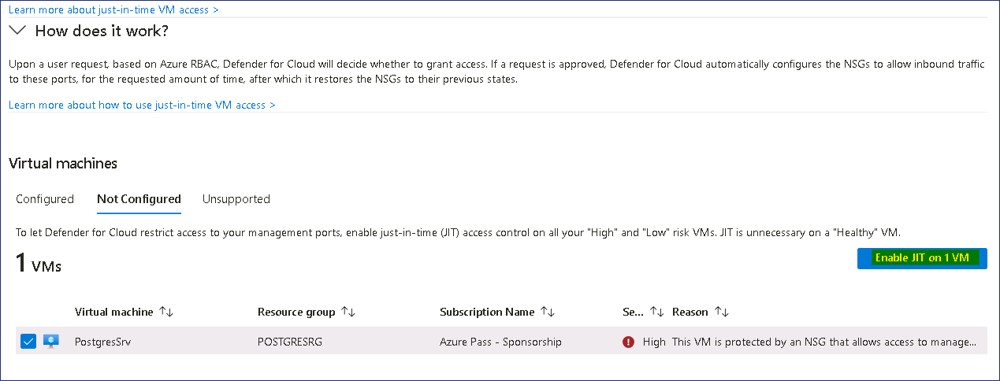
 

6.  On the **JIT VM access configuration** page, click on **Save**.

      
 

7.  You’ll receive a notification - **Just-in-time VM access
    configuration has started**.

      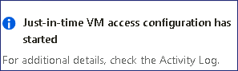
 

8.  Click on the **Configured** tab under the **Virtual machines**
    section, you will see that the VMs **PostgreSrv** is listed under
    the **Configured** tab.

      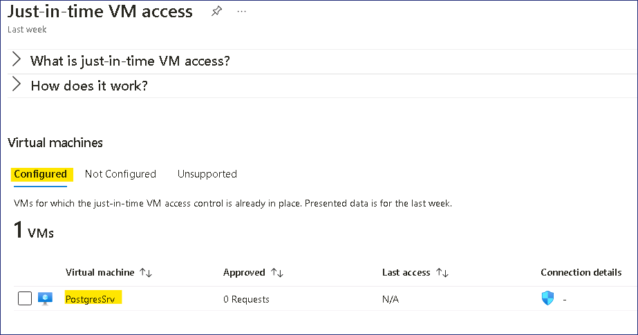
 

9.  Now in order to connect to this VM, the access is granted upon
    request.

      
 

## Task 2: Generating and Investigating Security alerts

1.  In **Microsoft Defender for Cloud** under **General** section select
    **Security alerts**

      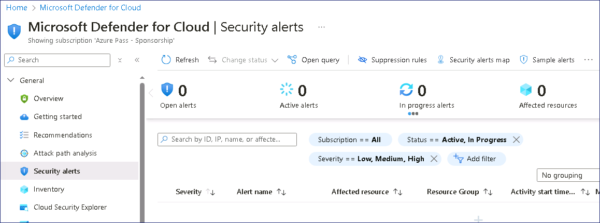

2.  Click on the **Sample alerts** button to generate alerts.

      
 

3.  Click on **Create sample alerts** button.

      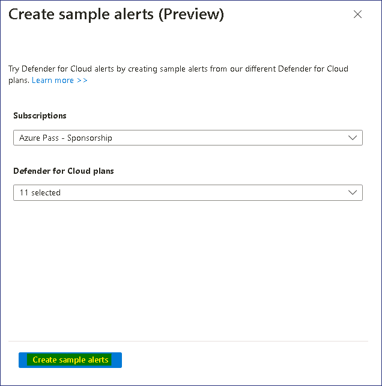
 

      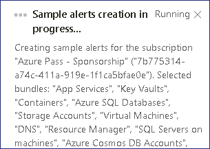


4.  Sample Alerts will be generated

      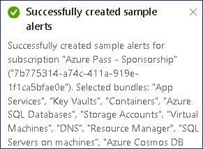
 

5.  Click on **Refresh** button, and you will be able to see the Sample
    alerts.

      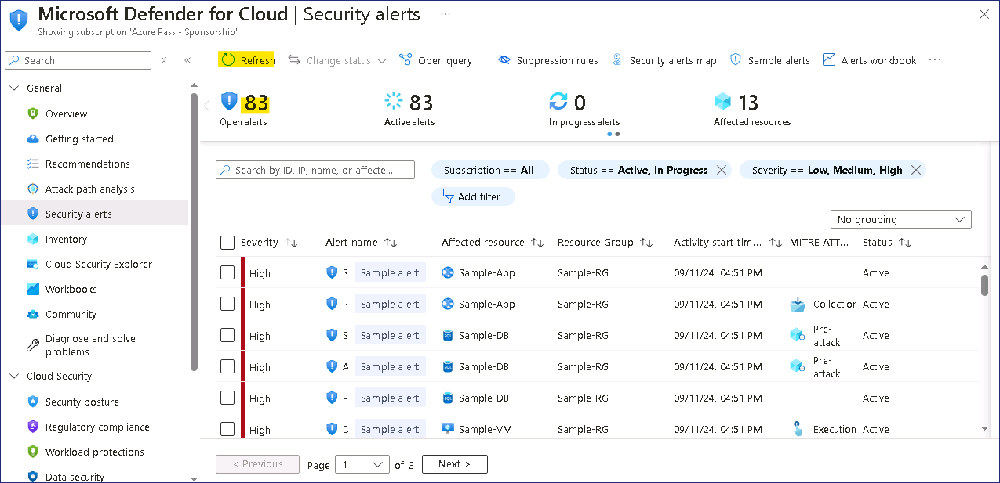
 

6.  You can click on any alert that you wish to investigate

7.  On the alert overview pane, investigate the following details.

    1.  **Severity, Status, and Activity time**

    2.  **Description** that explains the precise activity that was detected

    3.  **Affected resources**

    4.  **Kill chain intent** of the activity on the MITRE ATT&CK matrix.

8.  For more detailed information that can help you to investigate the
    suspicious activity, click on **View full details** button.

      
 

9.  Review the information under **Alert details** tab.

      

10. Click on the **Take action** button and review the available options

      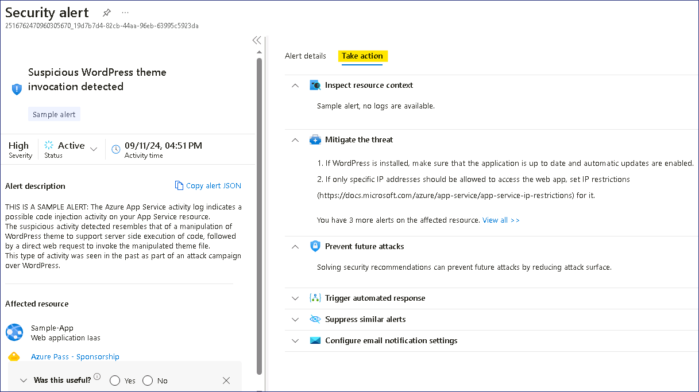
 

# Exercise 2 – Deploying Sentinel

## Task 1: The Microsoft Sentinel workspace

In this exercise we will see how to create a Microsoft Sentinel
workspace.

1.  Navigate to the ```https://portal.azure.com``` and log in with the
    **MOD Administrator** credentials provided with the Lab resources of your
    lab environment.

2.  In the top search bar, type ```Microsoft Sentinel``` and click on
    **Microsoft Sentinel**.

      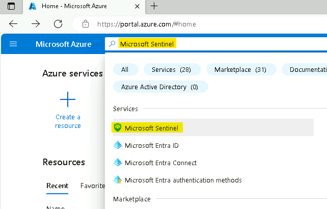
 

3.  In the **Microsoft Sentinel** screen, click **Create** at the top
    left.

      
 

4.  You can choose to add **Microsoft Sentinel** to an existing **Log
    Analytics** **workspace** or build a new one. We will create a new
    one, so click on **Create a new workspace**.

      
 

5.  In the **Create Log Analytics workspace** page, fill out the form as
    follows:

    1.  Subscription: **Azure Pass - Sponsorship**

    2.  Resource Group: click on **Create new** ``LAWResourceGroup``

    3.  Workspace Name: ```SentWrkspcXXXXXX``` [substitute **XXXXXX**
        with random number\]

    4.  Region: **West US**

    5.  Click **Review + create**.

            


6.  Click **Create** after the validation is completed. The creation takes a few seconds.

       
 

7.  You will be redirected back to the **Add Microsoft Sentinel** to a
    workspace page, click on the **Refresh** button.

       
 

8.  Select your workspace that you just created and click **Add** at the bottom.

      
 

9.  You should receive notification as shown in below image

      
 

10. Your Microsoft Sentinel workspace is now ready to use, click on the **OK** button to proceed.

      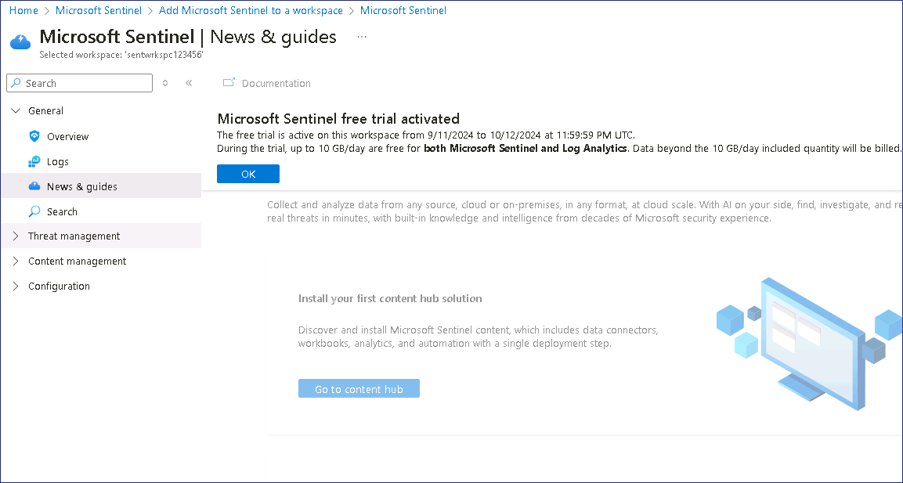 
 

## Task 2: Enable Data connectors.

This exercise shows you how to enable Data connectors.

1.  In the browser tab navigate to ```https://portal.azure.com/#view/Microsoft_AAD_UsersAndTenants/UserManagementMenuBlade/~/AllUsers```
    and select the **Tenant Administrator account**

        
 

2.  Select the **Assigned roles** under Manage and then click on **+ Add
    assignments.**

            


3.  Search and select **Security Administrator**, then click on the
    **Add** button.

            


       

4.  On the Azure Portal
    ```https://portal.azure.com``` and search
    for ```Microsoft Sentinel``` and click on **Microsoft Sentinel**.

      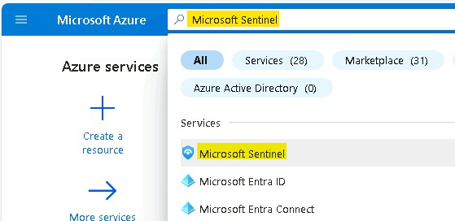 

5.  Select **SentWrkspcXXXXXX**.

        

6.  Now select **Data Connectors** under **Configuration** section.

      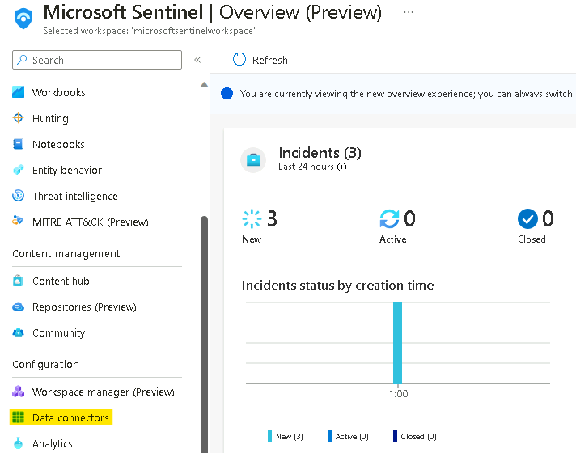   
 

7.  You should get the message **Data Connector with "content source =
    gallery content" have been removed.** In that message select the
    **Click here** link

            

8.  On the **Out-of-the-box Content Centralization** page click on
    **Continue**

            

9.  Click on the **Complete centralization** button

       

10. You should receive the notification as shown in below image

         


11. From the top click on the link for **Microsoft Sentinel** or
    navigate back to the Sentinel page.

      
    
13. Click on the **Refresh** button and you should be able to see the few connectors
    Data connectors showing.

       
 

      <font color=darkgreen>
      
      > **Note** - Sometime it may not install any connector, which is also fine to proceed ahead with the Labs.

      </font>

14. Click on **Content hub** under **Content management**

      
 

15. On the Content hub page search for ```Azure Activity``` and then
    select **Azure Activity** content and click on **Install** button

       
 

16. On the Content hub page search for ```Microsoft defender for cloud```
    and then select **Microsoft Defender for Cloud** content and click
    on **Install** button

       

## Task 3: Enable Azure Activity data connector

This exercise shows you how to enable the Azure Activity data connector.
This connector will bring all the audit events, for actions performed in
your Azure subscription, into your Microsoft Sentinel workspace.

1.  While still on the **Microsoft Sentinel** page click on **Data
    Connectors** under **Configuration** section.

       

2.  In the data connectors screen, type ```activity``` in the search bar,
    select the **Azure Activity** connector and click on **Open
    connector page**.

      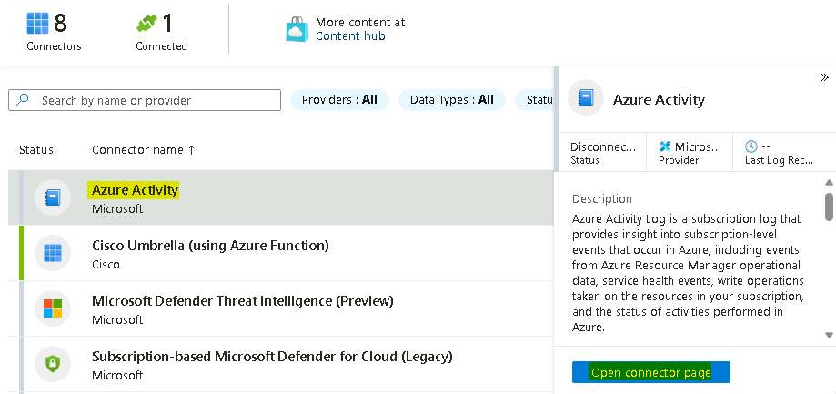  

3.  On the **Azure Activity connector** page, go to option number **2.
    Connect your subscriptions through diagnostic settings new
    pipeline**. This method leverages Azure Policy and it brings many
    improvements compared to the old method (more details about these
    improvements can be found here). Click on the **Launch Azure Policy
    Assignment** wizard, this will redirect you to the policy creation
    page.

        

4.  On the **Scope** selection select **Azure Pass – Sponsorship**. Click
    **Select**.

      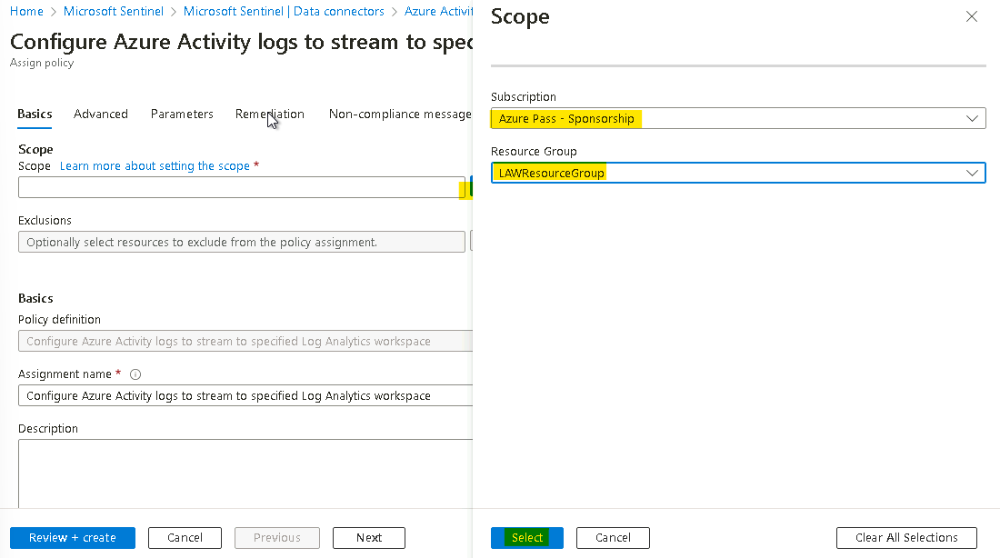

5.  Go to the **Parameters** tab. On the **Primary Log Analytics
    workspace** select the **MicrosoftSentinelWorkspace**.

      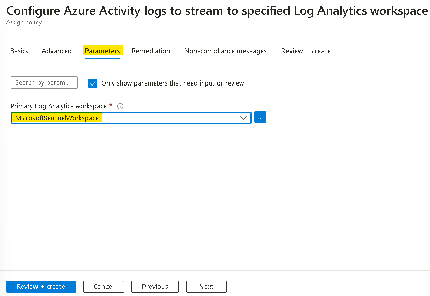 


6.  Under **Remediation** tab, select the check box besides **Create a
    remediation task** and then click on **Review + create** button

        

7.  On the **Review + create** tab, click on the **Create** button.

      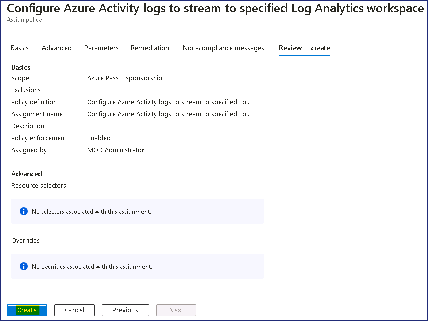

8.  In the **Notification** pane you will be able to see the ‘**Role
    Assignments creation succeeded**’, ‘**Remediation task creation
    succeeded**’ and ‘**Creating policy assignment succeeded**’
    notifications.

      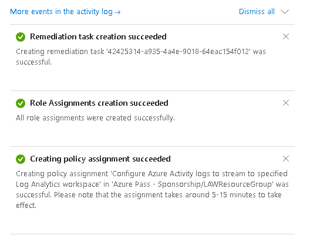  

9.  On the **Azure Activity connector** page you will be able to see the
    connection status.

        


      <font color=darkblue>


      > **Note**: It is normal if you don't immediately see
      the connector showing as **Connected** and in green, it takes around 30
      minutes for the process to complete.
      
      </font>

10. Continue to the next exercise then you can check back after 30 minutes.

## Task 4: Enable Microsoft Defender for Cloud data connector.

This exercise shows you how to enable the Microsoft Defender for Cloud
data connector. This connector allows you to stream your security alerts
from Microsoft Defender for Cloud into Microsoft Sentinel, so you can
view Defender data in workbooks, query it to produce alerts, and
investigate and respond to incidents.

1.  While still on the **Microsoft Sentinel** page click on **Data
    Connectors** under **Configuration** section.

          

2.  In the **Data connectors** screen, type ```tenant``` in the search
    bar, select the **Tenant-based Microsoft Defender for Cloud**
    **(Preview)** connector and click on **Open connector page**.

      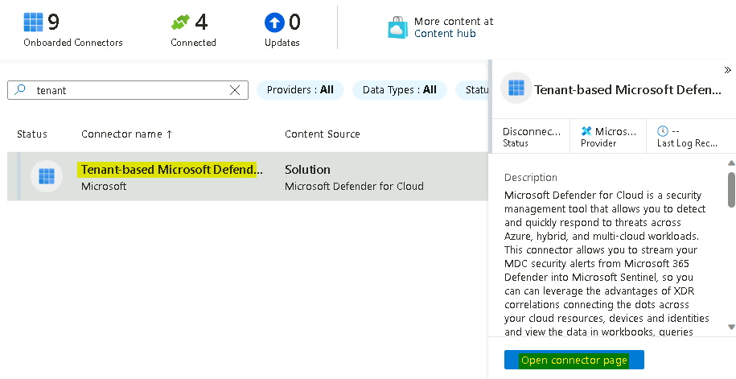 

      > **Note** - If you receive the error **Data Connector Not Found**, then navigate to **Content Hub** and then Reinstall the **Microsoft Defender for Cloud Connector** again. 

      

      

3.  On the **Tenant-based Microsoft Defender for Cloud** **(Preview)**
    connector page, under **Configuration** section click on the
    **Connect** button.

       

4.  You should receive the notification as **Connected successfully.**

       


5.  Wait for 1-2 minutes and then refresh the page, the Status of the
    connector should also be updated to **Connected.**

       


6.  Back on the **Data connectors** screen, type ```subscription``` in the
    search bar, select the **Subscription-based Microsoft Defender for
    Cloud** **(legacy)** connector and click on **Open connector page**.

        

7.  On the **Subscription-based Microsoft Defender for Cloud**
    **(legacy)** connector page, under **Configuration** section, select
    the **Azure Pass – Sponsorship** subscription and then click on the
    **Connect** button.

          

8.  You should receive the notification as **Connected successfully**.

        


9.  The Status of the connector should also be updated to **Connected.**

         

# Exercise 3- Integration

As we have installed the Defend for Cloud connector, we should be able
to see the Incident from Microsoft Defender for Cloud generated using
the Sample Alerts.

1.  While still on the **Microsoft Sentinel** page click
    on **Incidents** under Threat management.

        

2.  As we have just enabled the **Microsoft Defender for Cloud**
    connector, it would take about 20-30 minutes for the Incidents to appear.

3.  Click on **Overview** under **General** and then toggle the **New
    overview** switch to **Off**

         


4.  Once the switch is off, we should be able to see the **Sample
    events** from Microsoft Defender for Cloud.

      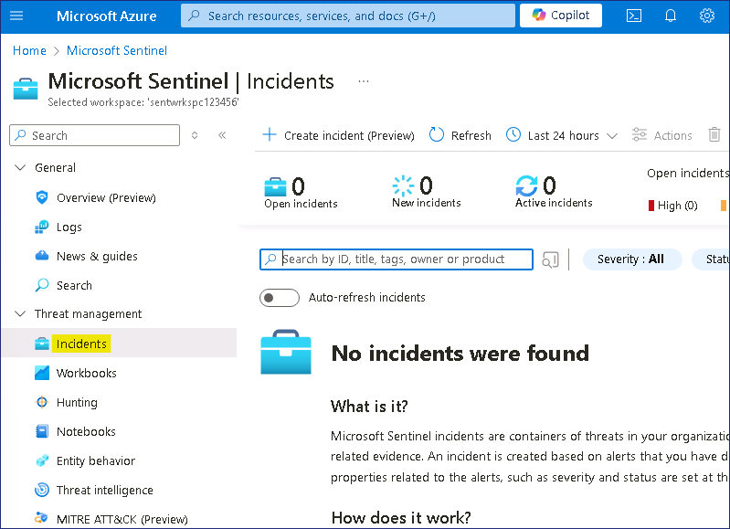   

5.  Click on **SecurityAlerts**

      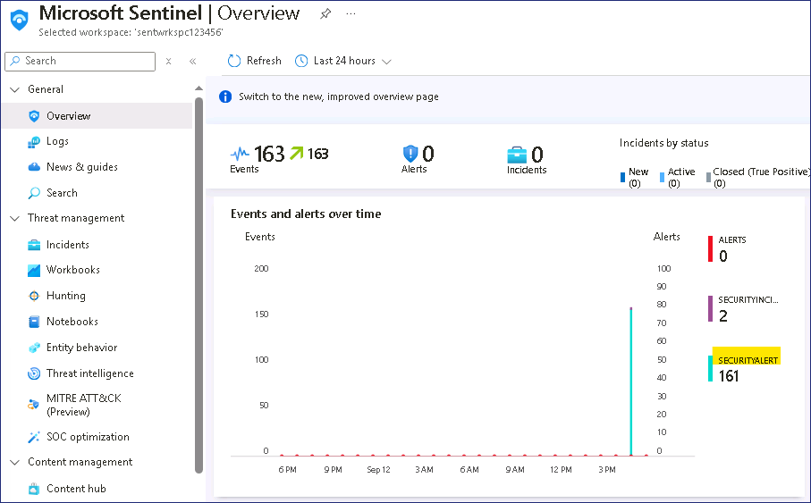     


6.  It should open the Log Analytic workspace and list all logs of
    **Alerts** generated and synchronized from **Microsoft Defender for
    Cloud**.

      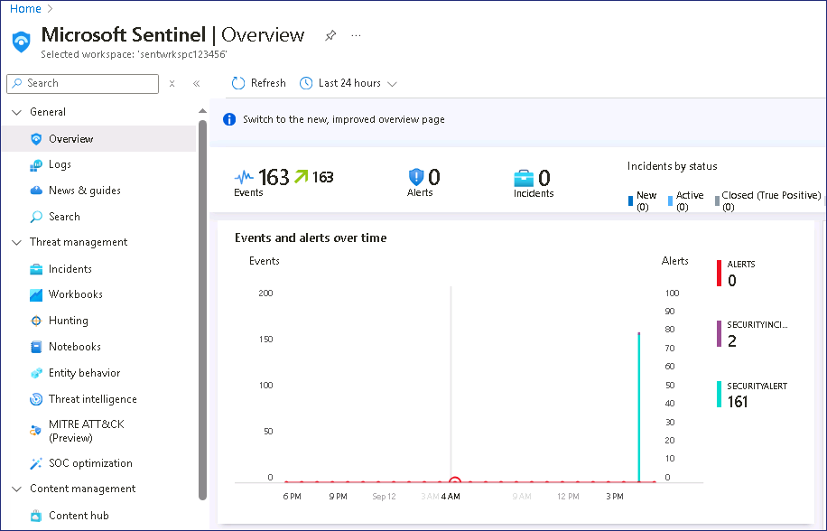    

7.  Click on any **Alerts** to expand and list the details for the same.

          

8.  On the alert expanded details you can see.
 
      <font color=darkred>

    1.  TimeGenerated [UTC]

    2.  Displayname

    3.  AlertName

    4.  AlertSeverity

    5.  Description that explains the precise activity that was detected

    6.  ProviderName – Azure Security Center – the older name for
        Microsoft Defender for Cloud

    7.  RemeditalSteps

    8.  And other rows with additional information.
      </font>

          
