# Laboratorio 5 - Defender for Cloud y Sentinel.

### Tarea 1: Habilite JIT en sus MVs desde Microsoft Defender for Cloud**

1.  En el **Azure Portal** `https://portal.azure.com` escriba
    `Microsoft Defender for Cloud` en el cuadro de búsqueda y, a
    continuación, haga clic en **Microsoft Defender for Cloud** en
    **Services**.

    

2.  En el panel izquierdo de la página **Microsoft Defender for Cloud |
    Overview**, vaya a la sección **Cloud Security** y haga clic en
    **Workload Protections**.

    

3.  En la página **Microsoft Defender for Cloud | Workload
    protections**, desplácese hacia abajo y haga clic en **Just-in-time
    VM access** bajo la sección **Advanced protection** como se muestra
    en la siguiente imagen.

    

4.  En la página de **Just-in-time VM access**, vaya a la sección
    **Virtual machines** y haga clic en la pestaña **Non Configured**.
    Verá las MVs - **PostgreSrv** que aparece en la pestaña
    **Non** **Configured**.

    

5.  Seleccione una de las VMs disponibles y haga clic en el botón
    **Enable JIT on 1 VM** de la derecha.

    

6.  En la página de **JIT VM access configuration**, haga clic en
    **Save**.

    

7.  Recibirá una notificación, con el siguiente mensaje: **Just-in-time
    VM access configuration has started**.

    

8.  Haga clic en la pestaña **Configured** bajo la sección **Virtual
    machines**, verá que la VMs **PostgreSrv** está listada bajo la
    pestaña **Configured**.

    

9.  Ahora, para conectarse a esta VM, el acceso se concede previa
    solicitud.

    

### Tarea 2: Genere e investigue alertas de seguridad

1.  En **Microsoft Defender for Cloud**, en la sección **General**,
    seleccione **Security alerts.**

    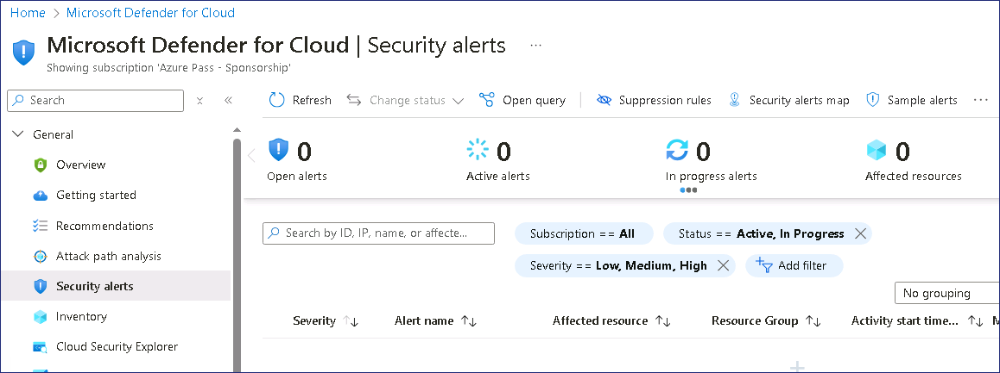

2.  Haga clic en el botón **Sample alerts** para generar alertas.

    

3.  Haga clic en el botón **Create sample alerts**.

    

    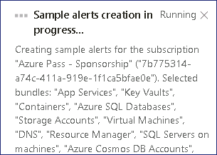

4.  Se generarán descripciones de muestra

    

5.  Haga clic en el botón **Refresh** y podrá ver las alertas de
    muestra.

    

6.  Puede hacer clic en cualquier alerta que desee investigar

7.  En el panel de resumen de alertas, investigue los siguientes
    detalles.

    1.  **Severity, Status, and Activity time**

    2.  **Description** que explica con precisión la actividad detectada

    3.  **Affected resources**

    4.  **Kill chain intent** de la actividad en la matriz ATT&CK de
        MITRE.

8.  Para obtener información más detallada que pueda ayudarle a
    investigar la actividad sospechosa, haga clic en el botón **View
    full details**.

    

9.  Revise la información en la pestaña **Alert details**.

    

10. Haga clic en el botón **Take action** y revise las opciones
    disponibles

    

## Ejercicio 2 - Implementación de Sentinel

### Tarea 1: Espacio de trabajo de Microsoft Sentinel

En este ejercicio veremos cómo crear un área de trabajo de Microsoft
Sentinel.

1.  Vaya a `https://portal.azure.com` e inicie sesión con las
    credenciales **MOD Administrator** proporcionadas con los recursos
    de laboratorio de su entorno de laboratorio.

2.  En la barra de búsqueda superior, escriba `Microsoft Sentinel` y
    haga clic en **Microsoft Sentinel**.

    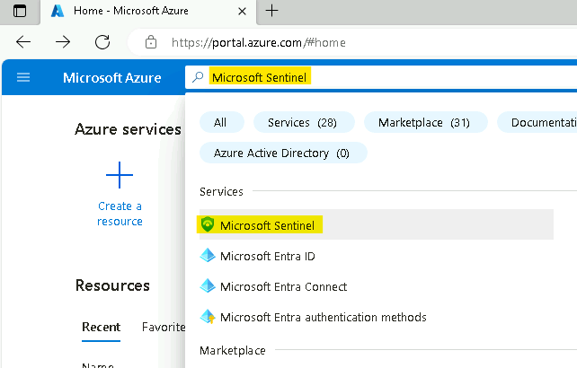

3.  En la pantalla de **Microsoft Sentinel**, haga clic en **Create** en
    la parte superior izquierda.

    

4.  Puede elegir entre añadir **Microsoft Sentinel** a un **Log
    Analytics** **workspace** existente o crear uno nuevo. Vamos a crear
    uno nuevo, así que haga clic en **Create a new workspace**.

    

5.  En la página **Create Log Analytics workspace**, diligencie el
    formulario como se indica a continuación:

    1.  Subscription: **Azure Pass - Sponsorship**

    2.  Resource Group: haga clic en **Create
        new** `LAWResourceGroup`.

    3.  Workspace Name: `SentWrkspcXXXXXX` \[sustituya **XXXXXX**
        por un número aleatorio\].

    4.  Region: **West US**

    5.  Haga clic en **Review + create**.

    

6.  Haga clic en **Create** una vez completada la validación. La
    creación tarda unos segundos.

    

7.  Se le redirigirá de nuevo a la página **Add Microsoft Sentinel** a
    un área de trabajo, haga clic en el botón **Refresh**.

    

8.  Selecciona el espacio de trabajo que acaba de crear y haga clic en
    **Add**, ubicada en la parte inferior.

    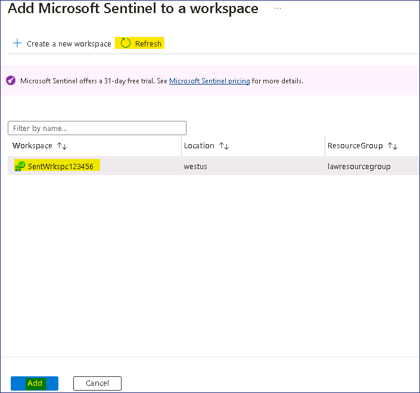

9.  Debería recibir una notificación como la que se muestra en la
    siguiente imagen

    

10. Su espacio de trabajo Microsoft Sentinel ya está listo para ser
    utilizado, haga clic en el botón **OK** para continuar.

    

### Tarea 2: Habilite los conectores de datos.

Este ejercicio muestra cómo activar los conectores de datos.

1.  En la pestaña del navegador, vaya a
    `https://portal.azure.com/#view/Microsoft_AAD_UsersAndTenants/UserManagementMenuBlade/~/AllUsers`
    y seleccione **Tenant Administrator account.**

    

2.  Seleccione las **Assigned roles** en Manage y, a continuación, haga
    clic en **+ Add assignments.**

    

3.  Busque y seleccione **Security Administrator** y, a continuación,
    haga clic en el botón **Add**.

    

    

4.  En el Azure Portal `https://portal.azure.com` busque `Microsoft
    Sentinel` y haga clic en **Microsoft Sentinel**.

    

5.  Seleccione **SentWrkspcXXXXXX**.

    

6.  Ahora seleccione **Data Connectors** en la sección
    **Configuration**.

    

7.  Debería aparecer el mensaje **Data Connector with "content source =
    gallery content" have been removed.** En ese mensaje seleccione el
    enlace **Click here** 

    

8.  En la página de **Out-of-the-box Content Centralization**, haga clic
    en **Continue.**

    

9.  Haga clic en el botón **Complete centralization** 

    

10. Debería recibir la notificación como se muestra en la siguiente
    imagen

    

11. En la parte superior, haga clic en el enlace de **Microsoft
    Sentinel** o vuelva a la página de Sentinel.

    

12. Haga clic en el botón **Refresh** y debería poder ver algunos
    conectores de datos visibles.

    

     

    > **Nota** - En ocasiones, es posible que no se instale ningún conector,
    lo cual también está bien para continuar con los laboratorios.

    

13. Haga clic en **Content hub,** debajo de **Content management**

    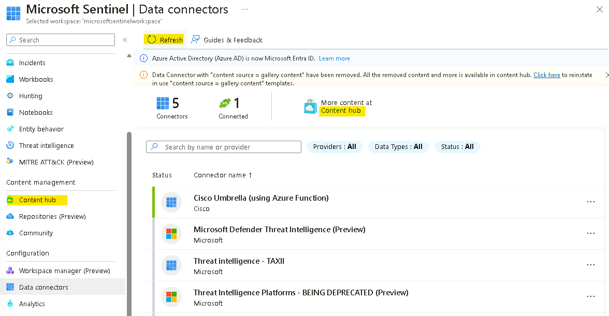

14. En la página Content hub, busque Azure Activity, luego seleccione el
    contenido **de Azure Activity** y haga clic en el botón **Install.**

    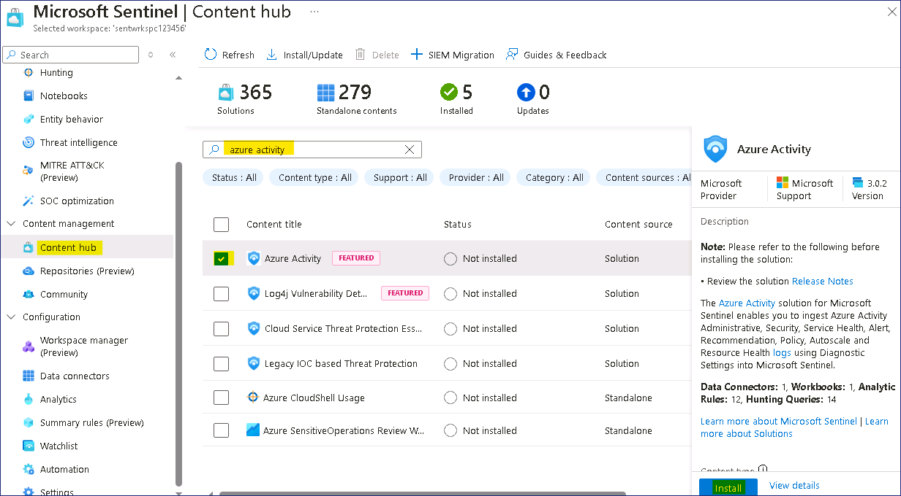

15. En la página Content hub, busque Microsoft Defender for Cloud, luego
    seleccione el contenido de **Microsoft Defender for Cloud** y haga
    clic en el botón **Instalar.**

    

### Tarea 3: Habilite el conector de datos Azure Activity

Este ejercicio muestra cómo habilitar el conector de datos Azure
Activity. Este conector traerá todos los eventos de auditoría, para las
acciones realizadas en Azure subscription, a su espacio de trabajo de
Microsoft Sentinel.

1.  En la página de **Microsoft Sentinel**, haga clic en **Data
    Connectors** en la sección **Configuration**.

    

2.  En la pantalla de conectores de datos, escriba activity en la barra
    de búsqueda, seleccione el conector **Azure Activity** y haga clic
    en **Open connector page**.

    

3.  En la página **Azure Activity connector**, vaya a la opción número
    **2. Connect your subscriptions through diagnostic settings new
    pipeline**. Este método aprovecha Azure Policy y ofrece muchas
    mejoras en comparación con el método anterior (se pueden encontrar
    más detalles sobre estas mejoras aquí). Haga clic en el asistente
    **Launch Azure Policy Assignment**, esto le redirigirá a la página
    de creación de políticas.

    

4.  En la selección **Scope** seleccione **Azure Pass – Sponsorship**.
    Haga clic en **Select**.

    

5.  Vaya a la pestaña **Parameters**. En el **Primary Log Analytics
    workspace**, seleccione **MicrosoftSentinelWorkspace**.

    

6.  En la pestaña **Remediation**, seleccione la casilla junto a
    **Create a remediation task** y, a continuación, haga clic en el
    botón **Review + create**

    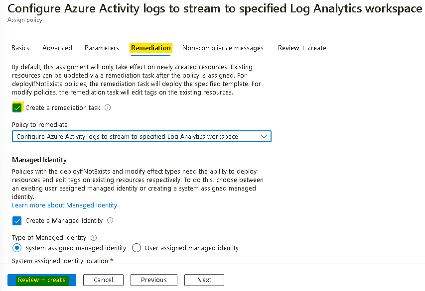

7.  En la pestaña **Review + create**, haga clic en el botón **Create**.

    

8.  En el panel de **Notification** podrá ver las notificaciones ‘**Role
    Assignments creation succeeded**’, ‘**Remediation task creation
    succeeded**’ y ‘**Creating policy assignment succeeded**’.

    

9.  En la página **Azure Activity connector** podrá ver el estado de la
    conexión.

    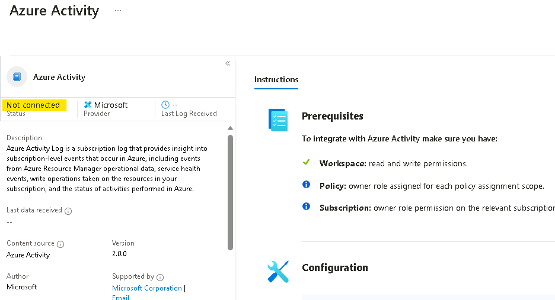

    > **Nota**: Es normal que el conector no aparezca inmediatamente como
    **Connected** y en color verde, el proceso tarda unos 30 minutos en
    completarse.

10. Continúe con el siguiente ejercicio y vuelva a verificar al cabo de
    30 minutos.

### Tarea 4: Habilite el conector de datos de Microsoft Defender for Cloud.

Este ejercicio muestra cómo habilitar el conector de datos de Microsoft
Defender for Cloud. Este conector le permite transmitir sus alertas de
seguridad de Microsoft Defender for Cloud a Microsoft Sentinel, para que
pueda ver los datos de Defender en libros de trabajo, consultarlos para
producir alertas e investigar y responder a incidentes.

1.  En la página de **Microsoft Sentinel**, haga clic en **Data
    Connectors** en la sección **Configuration**.

    

2.  En la pantalla **Data connectors**, escriba tenant en la barra de
    búsqueda, seleccione el conector **Tenant-based Microsoft Defender
    for Cloud** **(Preview)** y haga clic en **Open connector page**.

    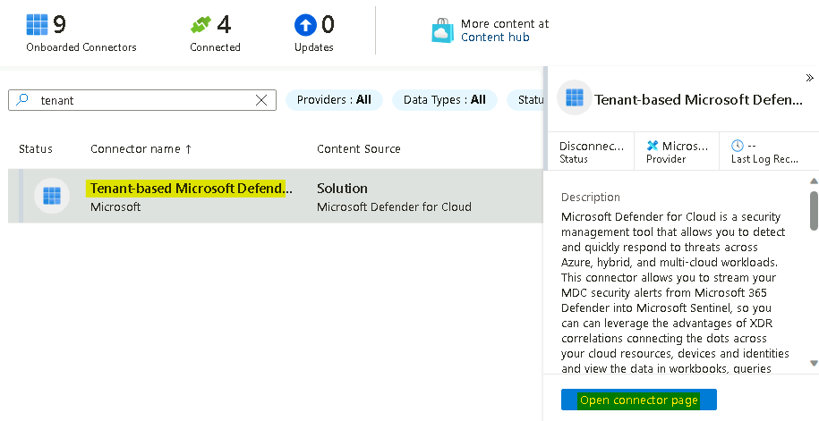

    > **Nota** - Si recibe el error **Data Connector Not Found**, vaya a
    **Content Hub** y vuelva a instalar **Microsoft Defender for Cloud
    Connector**.

    

    

3.  En la página del conector **Tenant-based Microsoft Defender for
    Cloud** **(Preview)**, en la sección **Configuration**, haga clic en
    el botón **Connect**.

    

4.  Debería recibir la notificación **Connected successfully.**

    

5.  Espere 1-2 minutos y luego actualice la página. El estado del
    conector también debería actualizarse a **Connected.**

    

6.  Regrese a la pantalla **Data connectors**, escriba subscription en
    la barra de búsqueda, seleccione el conector **Subscription-based
    Microsoft Defender for Cloud** **(legacy)**, luego haga clic en
    **Open connector page**.

    

7.  En la página del conector **Subscription-based Microsoft Defender
    for Cloud** **(legacy)**, en la sección **Configuration**,
    seleccione la suscripción **Azure Pass – Sponsorship** y, a
    continuación, haga clic en el botón **Connect**.

    

8.  Debería recibir la notificación **Connected successfully**.

    

9.  El estado del conector también debería actualizarse a **Connected.**

    

## Ejercicio 3- Integración

Como hemos instalado el conector Defend for Cloud, deberíamos poder ver
el Incidente de Microsoft Defender for Cloud generado, utilizando las
Alertas de ejemplo.

1.  En la página de **Microsoft Sentinel**, haga clic en **Incidents**
    en Threat management.

    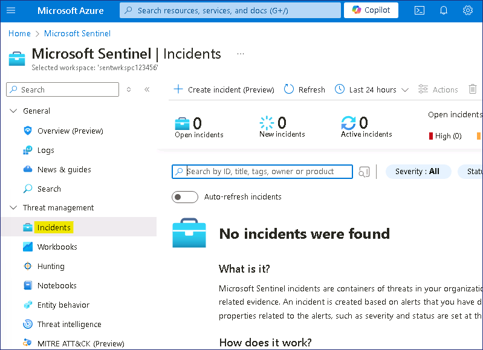

2.  Como acabamos de activar el conector de **Microsoft Defender for
    Cloud**, los incidentes tardarán entre 20 y 30 minutos en aparecer.

3.  Haga clic en **Overview** en **General** y, a continuación,
    **desactive** la opción **New overview.**

    

4.  Una vez desactivado el interruptor, deberíamos poder ver los
    **Sample events** de Microsoft Defender for Cloud.

    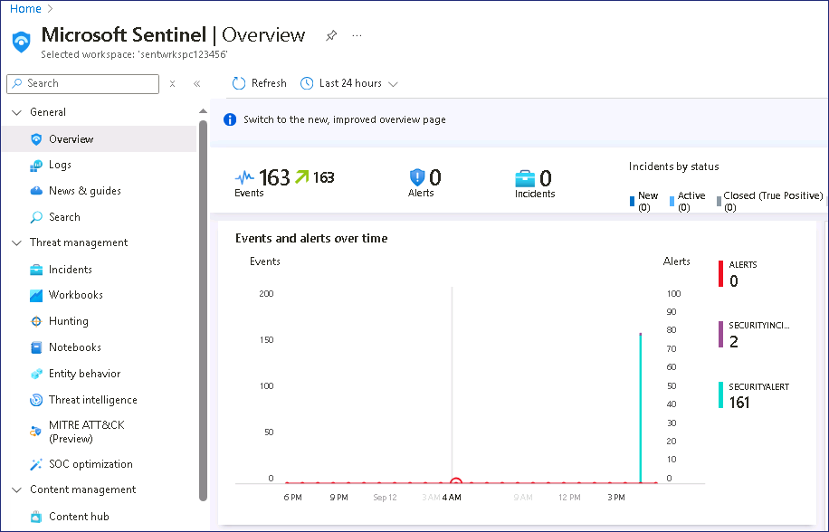

5.  Haga clic en **SecurityAlerts**

    

6.  Debería abrir el espacio de trabajo Log Analytic y listar todos los
    registros de **Alertas** generados y sincronizados desde **Microsoft
    Defender for Cloud**.

    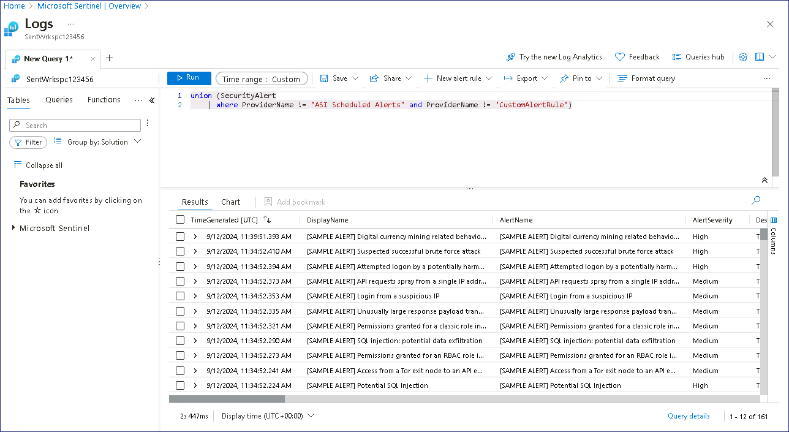

7.  Haga clic en cualquier **Alerta** para ampliar y listar los detalles
    de la misma.

    

8.  En los detalles ampliados de la alerta se puede ver.

    

    1.  TimeGenerated \[UTC\]

    2.  Displayname

    3.  AlertName

    4.  AlertSeverity

    5.  Description, que explica con precisión la actividad detectada

    6.  ProviderName, Azure Security Center, el nombre anterior de
        Microsoft Defender for Cloud.

    7.  RemeditalSteps

    8.  Y otras filas con información adicional.
    
    

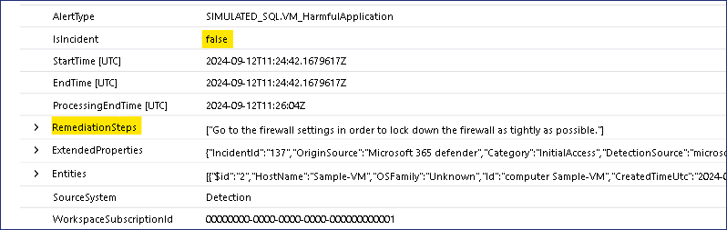
